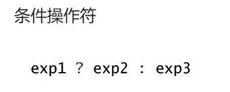

---

# 注释：文件开头使用YAML语法配置文章信息，之后是正常的Markdown语法
# Note: The beginning of the file uses YAML syntax to configure the blog meta data, followed by the normal Markdown syntax.

# 此处如果不配置标题，则提取Markdown中的一级标题，或使用文件名
# Title will be extracted from heading 1 of markdown or using file name if not configured here.
title: 初识C语言


# 此处如果不配置摘要，则从正文提取开头若干文字
# Abstract will be extracted from the begining of markdown content if not configured here.
abstract: 本文档主要记录与回顾了C语言的基础知识，其中内容较为简单，属于知识回顾的部分，后续将深入学习C语言的各个知识点


# URL用于固定链接、编辑文章功能，建议所有文章都配置
# URL is used for permalink and article editing, and it is recommended to be configured.
url: C-01


# 文章发布时间，使用的时区和系统设置一致，不设置则使用当前时间
# Article post time, time zone is the same as the system settings. Current time will be used if not configured here.
date: 2023-07-04 19:35:43


# 文章分类
category:
- C


# 文章标签
tags:
- C
---


# 01-初识C语言


什么是C语言？
——C语言是一门计算机语言，是人和计算机交流的语言。

其余的还有
C++/python/java/go，B语言等

C是高级语言，是人能直接看懂理解的语言，而机器码人一般无法直接看懂

# C语言的发展
国际标准：
ANSIC 89年的标准——C89标准——>C90

C99/C11 部分编译器依旧不支持

# 第一个C语言程序

```C
//包含一个stdio.h的头文件

#include <stdio.h>

//主函数
//main前面的int表示函数调用之后返回一个整型值，void是一种已经过时的写法，最好不要使用（单片机里面可以）
int main() 
{
  //在这里完成任务
  //输出一个Hello world
  //printf是一个库函数
  //库函数——C语言本身提供给我们使用的函数
  printf（“Hello world");

  return 0; //main函数的返回值
}
```

## 编写C语言的步骤

1. 新建项目
2. 新建源文件
3. 编写代码


# Visual Studio 运行程序时间太短的解决方案

更改子系统为控制台系统


# main函数

main是整个程序的入口

程序从main函数内的第一行开始执行

一个程序只能有一个main函数

即main函数有且仅有一个


# C语言的数据类型

1. char
2. short
3. int
4. long
5. long long
6. float
7. double

%d - 打印整型:4bytes 共32位
%ld - 打印整型：>=4字节
%lld - 打印整型：8bytes 共64位
%c - 打印字符
%f - 打印浮点数
%lf - 打印双精度浮点数
%.3f - 限制输出的小数位数为3位
%p - 以地址的形式打印
%x - 以16进制的形式打印
%o - 8进制打印


## C语言输出

```C
int main()
{
  //short int
  //int
  //long int
  char ch='A';  //声明一个字符类型的变量
  int age=23; //声明一个整型变量
  printf("%c\n",ch);  //打印字符格式的数据
  printf("%d\n",age); //打印age


  return 0;
}
```

## 不同数值类型所占的空间
```C
#include <stdio.h>

int main()
{
  //sizeof返回的是64位的无符号整型，因此占位符是%lld
  printf("char:%lld\n",sizeof(char)); //1
  printf("short:%lld\n",sizeof(short)); //2
  printf("int:%lld\n",sizeof(int)); //4
  printf("long:%lld\n",sizeof(long)); //4
  printf("long long:%lld\n",sizeof(long long)); //8
  printf("float:%lld\n",sizeof(float)); //4
  printf("double:%lld\n",sizeof(double)); //8
  return 0;
}
```
c语言规定，sizeof（long）>=sizeof(int)

# 计算机中的单位
计算机中的最小单位：bit

1. bit 计算机中的最小单位：bit
2. byte：1byte=8bit
3. kb：1kb=1024bytes
4. mb
5. tb
6. pb


# 进制转换

123 十进制数字:

$123=3\cdot10^0+2\cdot10^1+1\cdot10^2$

1010 二进制数字：
$1010=0·2^0+1·2^1+0·2^2+1·2^3$

# 变量

默认95.6这类的数字位double类型而不是float类型，想要变成float可以写成：95.6f

```C
#include <stdio.h>

int num1=1; //全局变量

int main()
{
	int age = 20; //局部变量
	float weight = 95.6;
	char ch = 'A';
	return 0;
}
```

## 全局变量与局部变量
当全局变量遇到局部变量的时候，局部变量优先
C语言语法规定，变量要定义在当前代码块的最前面

## 作用域（Scope）和生命周期

局部变量的作用域就是变量所在的局部范围
全局变量的作用域是整个工程

局部变量的生命周期从进入作用域开始，到走出作用域结束
全局变量的生命周期就是整个程序的生命周期

## scanf
当scanf函数报错时，使用#define _CRT_SECURE_NO_WARNINGS可以取消掉vs认为的不安全选项，或者直接取消项目的sdl检查

```C
#define _CRT_SECURE_NO_WARNINGS

#include <stdio.h>

int main()
{
	int a = 0;
	int b = 0;
	int sum = 0;
	scanf("%d%d", &a, &b);//可以使用scanf_s
	//b = a + b;
	sum = a + b;
	//printf("sum = %d", b);	这样也是可用的
	printf("%d", sum);
	return 0;
}
```
可以使用scanf_s,但这不是标准c语言提供的，是VS编译器提供的，使用之后代码不具备跨平台性/可移植性。

而#define _CRT_SECURE_NO_WARNINGS语句可以添加到路径“C:\Application\VisualStudio2022\Community\Common7\IDE\VC\VCProjectItems”的“newc++file”文件中，起到一新建c文件就能导入该语句的作用
## extern

声明一个外部变量
或者是一个外部函数


# 常量

## C语言里面常量的种类
1. 字面常量：直接写出来的值，
2. const修饰的常量
3. #define定义的标识符常量
4. 枚举常量


## 字面常量

```C
int main()
{
	int a = 1;
	3;//字面常量
	return 0;
}
```
## const修饰的常变量

```C
int main()
{
	const int a = 1;
	a=2；//会报错
	return 0;
}
```
const赋予a变量常属性，但其本身还是一个变量,不能用在需要常量的地方。

## define定义的标识符常量
```C
#define MAX=10

int main()
{
  int arr[MAX]={0};
}
```

## 枚举常量

枚举：一一列举
四季：春夏秋冬
三原色：红黄蓝
性别：男，女，保密
```C
#include <stdio.h>

enum Sex
{
	MALE=6,
	FEMALE,
	SECRET
};

int main()
{
	enum Sex s = MALE;
	printf("%d\n", s);
	printf("%d\n", FEMALE);
	printf("%d\n", SECRET);
	return 0;
}
```
枚举常量是有值的，默认从0开始，也可以从其他的量开始。枚举常量本身是不能改的，但是枚举创建出来的变量是可以改的。

# ASCII


# 字符串+转义字符+注释

“hello bit.\n"

这种由双引号引起来的一串字符被叫做字符串字面值，简称字符串，

注：字符串的结束标志是一个\0的转义字符，在计算字符串长度的时候，\0是结束的标志，不算做字符串的内容。

```C
#define _CRT_SECURE_NO_WARNINGS

#include <stdio.h>

int main()
{
	char arr1[] = "abc";
	//char arr2[] = { 'a','b','c' ,'\0'};//两种写法都可以
	char arr2[] = { 97,'b','c' ,0};//97是a的ASCII编码
	printf("%s\n", arr1);
	printf("%s\n", arr2);//当arr2没有字符串结束标志的时候，会输出乱码
	return 0;
}
```

## strlen
strlen 用于计算字符串的长度
```C
#define _CRT_SECURE_NO_WARNINGS

#include <stdio.h>

int main()
{
	char arr2[] = { 97,'b','c' };//97是a的ASCII编码
	printf("%d\n", strlen(arr2));//遇到’\0'后才结束
	return 0;
}
```


## 转义字符


```C
#define _CRT_SECURE_NO_WARNINGS

#include <stdio.h>

int main()
{
	printf("%c\n", '\132');
  //输出的是八进制数字132所代表的十进制数字对应的ASCII码字符
	return 0;
}
```

# 分支语句
```C
int main()
{
	int input = 0;
	printf("今天你学习了么？\n");
	printf("学了？没学？（1/0）:");
	scanf("%d", &input);
	if (input == 1)
	{
		printf("不错，继续努力\n");
	}
	else if(input == 0)
	{
		printf("快去学习\n");
	}
	else
	{
		printf("输入错误\n");
	}
}
```


# 循环语句
```C
int main()
{
	int index = 0;
	while (index <=10)
	{
		printf("index=%d\n", index);
		index++;
	}
	return 0;
}
```


# 函数

```C
#define _CRT_SECURE_NO_WARNINGS

#include <stdio.h>

int add(int x, int y)
{
	int z = 0;
	return z = x + y;
}

int main()
{
	int a = 0, b = 0;
	int sum = 0;
	printf("请输入两个相加数：\n");
	printf("请输入第一个数：\n");
	scanf("%d", &a);
	printf("请输入第二个数：\n");
	scanf("%d", &b);
	sum = add(a, b);
	printf("%d + %d = %d\n", a, b, sum);
	return 0;
}
```

# 数组

数组的下标是从0开始的，访问数组的时候可以用下标来访问数组的值。

当数组未完全初始化的时候，数组会被初始化为'\0'。


```C
#define _CRT_SECURE_NO_WARNINGS

#include <stdio.h>

int main()
{
	int arr[10] = {1,2,3,4,5,6,7,8,9,10};//数组的初始化
	char ch[20] = { 65 };//这样只初始化了第一个元素，
	printf("%c\n", ch[9]);//访问第10个元素的值，此时未进行初始化，输出的值为空'\0';
	return 0;
}
```


# 操作符

## 算数操作符

分别是加减乘除取余
\+ \- \* \/ \%

## 移位操作符
\>\>
\<\<
## 位操作符
\& \^ \|
按位与，按位异或，按位或
异或：两个相同则是0，两个不同则是1；
c语言里面的次幂计算需要用到pow函数，需要引入头文件math.h
```C
#define _CRT_SECURE_NO_WARNINGS

#include <stdio.h>
#include <math.h> //次幂计算需要用到的库函数

int main()
{
	int a = 2, b = 3;
	int c = 0;
	c = a ^ b;
	printf("a\^b = %d\n", c);
	c = pow(a, b);
	printf("pow\(a,b\)=%d\n", c);
	return 0;
}
```


## 赋值操作符
\=: 赋值
a\+\=b: a=a+b
\-\=
\*\=
\/\=
\&\=
\^\=
\|\=
\>\>=
\<\<\=


## 单目操作符


sizeof用于计算变量/类型的大小，单位是字节；

sizeof可以用于计算数组的大小
可以利用这个特性来计算元素的个数。

### 前置与后置操作符

### 前置操作符
先计算，再使用
### 后置操作符
先使用，再计算

## 关系操作符


## 逻辑操作符


## 条件操作符


条件1成立则执行条件2，否则执行条件3
## 逗号操作符


## 下标引用，函数调用，结构成员


# 原码，反码，补码
只要是整数，内存中存储的都是补码，

正数的原码，反码，补码三码相同

符号位是1的表示这是一个复数，符号位位0的表示这是一个正数。

复数在内存中存储的时候，是以补码的形式存储的

原码除符号位全部取反得到反码，反码+1得到补码，

反过来，补码-1得到反码，反码除符号位全部取反得到原码。

```C
#define _CRT_SECURE_NO_WARNINGS

#include <stdio.h>
int main()
{
	int a = 0;	//int类型4bytes，一共32位
	//a=0000000000
	int b = a;
	//b=0000000000
	b = ~a;
	//b=1111111111
	//此时b相当于是存储的一个复数的补码
	//补码：1111111111（补码-1=反码）
	//反码：1111111110（原码=反码（除符号位）取反）
	//原码：1000000001（此时变为-1，溢出了）
	printf("%d\n", b);
	return 0;
}
```

# C语言的关键字


## auto
局部变量面前使用的，可以省略，表示该变量自动创建，自动销毁

## register

```C
register int a=10;//建议把a放到寄存器里面去
```

## typedef

将一个类型重命名为其他的名字，是的后续程序的读写更加方便。

```C
typedef unsigned int u_int;//重定义，重命名
```


## static

static可以用来修饰局部变量，全局变量，以及函数

### static修饰局部变量的时候
局部变量的生命周期变长了，不会被重复创建，不会被销毁

### static修饰全局变量的时候
改变了变量的作用域，使得该变量只能在其所在的源文件中使用，而不能在别的源文件中使用，加了extern也不可以

### static修饰函数的时候
也是改变了函数的链接属性（普通函数具有外部链接属性，被static修饰后，变成了内部链接属性），可以理解为改变了函数的作用域

## define
可以用于定义标识符常量，也可以用于定义宏（带参数的）

```C
#define pi 3.14159//定义标识符常量
#define MAX(X,Y) (X>Y?X:Y)//定义宏
#define add(a,b) ((a)+(b))//定义宏

```
# 指针

指针是一种用于存储地址的变量，一般是int类型，需要用*来修饰

*的位置不那么固定
```C
int* a;
int *a;
int * a;
```
三种种写法都可以，但是建议用第二种，因为第一种可能会出现以下错误

```C
int* a,b;//只有个a是指针变量，而b是int类型的变量
```

指针的使用：

```C
#define _CRT_SECURE_NO_WARNINGS

#include <stdio.h>

int main()
{
	int a = 20;
	int* p = &a;
	double d = 3.14;
	double* pd = &d;

	*p = 50;//*是解引用操作符
	printf("p的值是：%p\n", p);
	printf("p的值是：%lld\n", p);//这里是以十进制的形式输出的地址，用%d表示的范围会不够
	//这里会警告是因为printf中的p是一个指针变量，需要的是%p，而这里强制转化为了%lld
	printf("a的值是：%d\n", *p);
	printf("指针p所占的空间大小为：%lldbytes\n", sizeof(p));

	printf("--------------\n");
	printf("%.2lf\n", d);
	printf("%.2lf\n", *pd);
	return 0;
}
```

指针的类型和指针的地址所存储的变量的类型有关
int\* p
char\* p
这两个都是指针，不过第一个指针指向的地址内存储的是整型变量，第二个指针指向的地址内存储的是字符变量

指针的大小和系统有关，32位系统中的指针大小为4bytes，64位系统中的指针大小为8bytes。

# 结构体

结构体可以存储多种不同类型的信息，并将其融合到一起。

结构体指针指向的是结构体第一个变量所在的地址。

读取结构体成员可以用符号“\.”

采用指针的形式读取结构体成员可以用符号“\-\>”

```C
#define _CRT_SECURE_NO_WARNINGS
#include <stdio.h>
struct Book
{
	char name[40];
	float price;
};
int main()
{
	struct Book b1 = { "C语言程序设计",12.99 };
	struct Book* pb = &b1;//结构体指针
	printf("-------------------------\n");
	printf("利用结构体打印和修改信息\n");
	printf("书名：%s\n", b1.name);
	printf("价格：%.2f\n", b1.price);
	printf("八五折后的价格为：%.2f\n", b1.price * 0.85);

	printf("-------------------------\n");
	printf("利用指针打印和修改信息\n");
	printf("书名：%s\n", (*pb).name);
	printf("价格：%.2f\n", (*pb).price);
	printf("八五折后的价格为：%.2f\n", (*pb).price * 0.85);

	printf("-------------------------\n");
	printf("利用指针->打印和修改信息\n");
	printf("书名：%s\n", pb->name);
	printf("价格：%.2f\n", pb->price);
	printf("八五折后的价格为：%.2f\n", pb->price * 0.85);
	return 0;
}
```

## strcpy

如果想修改结构体成员中的数组，或者字符串变量，则需要用到strcpy，使用这个函数需要引用strcpy.
strcpy-字符串拷贝函数；

```C
#include <stdio.h>
#include <string.h>

struct Book
{
	char name[40];
	float price;
};

int main()
{
	struct Book b1 = { "C语言程序设计",12.99 };
	struct Book* pb = &b1;//结构体指针

	strcpy(pb->name, "C++程序设计");
	printf("新书名：%s\n", (*pb).name);
	return 0;
}
```

PS：全局变量不初始化，默认为0


## ASCII码


### 通信字符


### 可显示字符


# 运算优先级


备注：

NULL：空指针
NUL/Null: '\0'
\0


