# 03-分支与循环

生活中的三种结构

1.  顺序结构
2.  分支结构
3.  循环结构

# C语言中的语句

C语言中，由分号隔开的每一段代码就是语句，空语句也是语句；

# 分支语句

分支语句：

*   if
*   switch

## if 语句

if语句下面需要执行多条语句的时候，需要将其包装为代码块，用大括号包起来。

```C
if (expression1)//此条件为真执行语句2
{
  expression2;
}
else if(expression3)//判断是否满足条件3
{
  expression4
}
else//及不满足条件1也不满足条件3，则执行语句5
  expression5
```

else一定是与最近的未匹配的if相匹配

c语言不能出现这样的条件判断语句：

```C
int age=1
if(18<=age<25)
{

}
```

此时会先判断18< age,得到结果x，再判断x< age的值y，再用if判断y是否为真。

if容易踩的坑：

1.  if里面用了=，而不是==，此时最好把常量放在前面

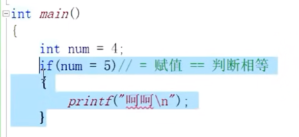

1.  if没有注意匹配else
2.  else匹配了错误的if

## switch 语句

switch语句常用于多分支的情况下，用if较难列举玩所有可能的情况下，采用switch会比较节省人力物力。

```C
switch(整型变量判断)
{
  case 整型常量表达式1：
    执行语句；
    break；//跳出语句
  case 整型常量表达式2：
    执行语句；
    break；//跳出语句
  case 整型常量表达式3：
    执行语句；
    break；//跳出语句
  default：//当前面的选项都不能匹配的时候，执行这一条语句
    执行默认语句
}
```

```C
#include <stdio.h>

int main()
{
	int day = 0;
	scanf("%d", &day);//scanf里面最好只加最少的参数。scanf没有输出功能。
	switch (day)
	{
	case 1:
	case 2:
	case 3:
	case 4:
	case 5:
		printf("今天是星期%d,是工作日\n", day);
		break;
	case 6:
	case 7:
		printf("今天是星期%d,是休息日\n", day);
		break;
	default:
		printf("输入错误\n");
		break;
	}
	return 0;
}
```

case决定入口，break决定出口

没有break则会继续往下执行；

当case中有一定重复性的东西，可以省略掉break。

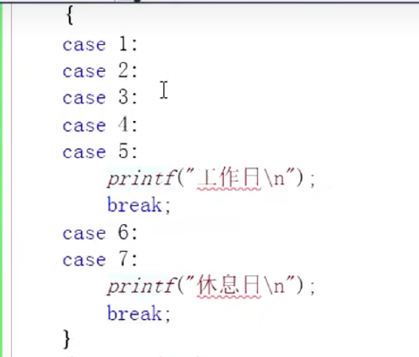

理论上最后一行不用加break，但是可维护性差，当以后增加代码的时候可能会出现逻辑错误；

switch只能判断整型表达式

default的位置并没有严格的限制但是建议放在最后。

一个switch中只能有一个default

# 循环语句

循环：即做重复的事情

三种循环：

1.  while
2.  do while
3.  for

## while语句

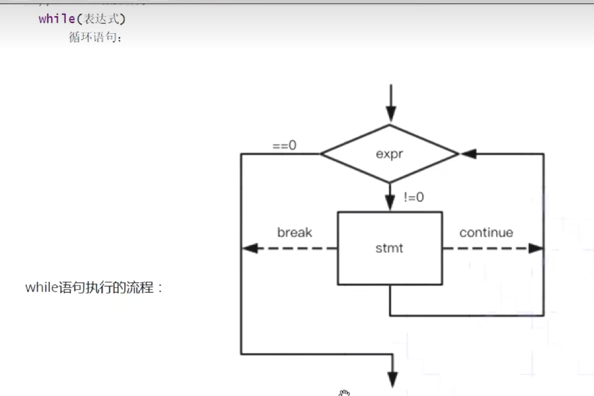

使用break可以跳出while循环

continue是终止本次循环中后面的代码，重新进入循环。

### getchar与putchar

getchar是从键盘获取字符，putchar是输出字符，功能与printf类似

```C
#include <stdio.h>

int main()
{
	int ch = 0;
	//EOF : end of file 文件结束标志
	//本质是-1
	//键盘输入：Ctrl+Z

	while ((ch = getchar()) != EOF)
	{
		putchar(ch);
	}
	return 0;
}
```

getchar是把获取到的字母存储到文件中，putchar是一次输出的。

电脑输入时，有一个输入缓冲区，如果不及时将输入缓冲区清空，则有可能会出现bug
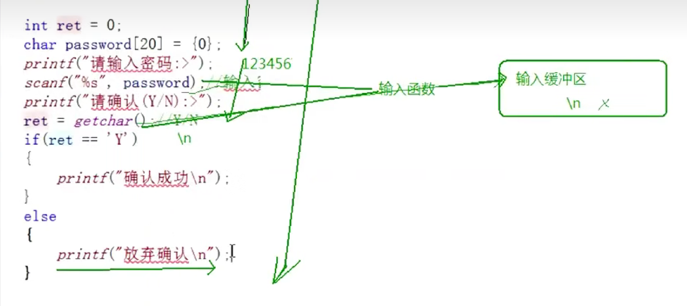

```C
#define _CRT_SECURE_NO_WARNINGS

#include <stdio.h>

int main()
{
	int ret = 0;
	char password[20] = { 0 };
	printf("请输入密码->:");
	scanf("%s", password);
	//输入缓冲区还剩一个'\n'，其ACSII编码为10
	//读取一下'\n'
	getchar();//清空输入缓冲区
	printf("请确认(Y/N)->:");
	ret = getchar();
	if (ret == 'Y')
		printf("确认成功！");
	else
		printf("放弃失败！");
	return 0;
}
```

当在以上程序运行时输入‘123456 abcd’时，也会出现错误，原因是scanf在遇到空格的时候就会停止，然后getchar只读取了空格的值，剩下的abcd依旧还在输入缓冲区。

```C
#include <stdio.h>

int main()
{
	int ret = 0;
	char password[20] = { 0 };
	printf("请输入密码->:");
	scanf("%s", password);
	//输入缓冲区还剩一个'\n'，其ACSII编码为10
	//清空输入缓冲区
	while ((ret = getchar()) != '\n')
	{
		;//空语句，不做任何事情
	}

	printf("请确认(Y/N)->:");
	ret = getchar();
	if (ret == 'Y')
		printf("确认成功！");
	else
		printf("放弃失败！");
	return 0;
}

```

以下代码可以起到过滤字符，保留数字的功能

利用这个特性，可以完成大小写字母的转换

```C
#define _CRT_SECURE_NO_WARNINGS

#include <stdio.h>

int main()
{
	int ch = 0;
	while ((ch = getchar()) != EOF)
	{
		if (ch < '0' || ch>'9')
			continue;
		putchar(ch);
	}
}
```

## for循环

for循环的格式：
for（表达式1;表达式2;表达式3）

表达式1：初始化部分，用于初始化循环变量；
表达式2：条件判断部分，用于判断循环是否终止；
表达式3：调整部分，用于循环条件的调整

优点：三个部分集成到了一起，而while循环的这三个部分是分开的，在改变的时候显得没有for循环这么方便。

```C
int main()
{
	for (int i = 0; i < 10; i++)
		printf("%d\n", i);
}
```

for循环的执行流程

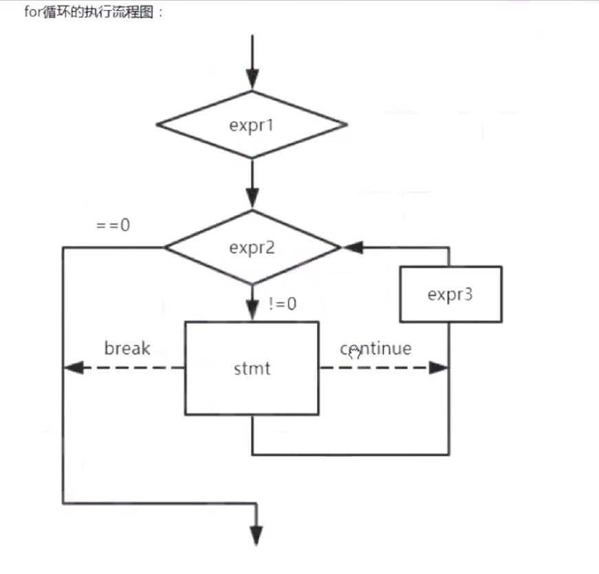

for循环中也有break和continue，作用域while循环中一样的

```C
#include <stdio.h>

int main()
{
	int i = 0;
	for (i = 0; i < 10; i++)
	{
		if (i == 8)
			break;
		if (i == 4)
			continue;
		printf("%d\n", i);
	}
	return 0;
}
```

此时输出的结果为0 1 2 3 5 6 7

注意事项：

1.  尽量避免在for循环体内修改循环变量，防止for循环失去控制
2.  采用”前闭后开"的写法

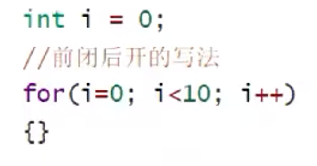

### for循环的一些变种

#### 变种1

1.  for循环的初始化，判断，调整，都可以省略，如果判断省略了，那就恒为真。
2.  要省略初始化的时候，需要在for之前初始化，否则会出现嵌套循环无法正确运行的情况

```C
#define _CRT_SECURE_NO_WARNINGS

#include <stdio.h>

int main()
{
	for (;;)
	{
		printf("死循环\n");
	}
  return 0；
}
```

此处循环嵌套无法正确运行
因为j在第一次i的循环之后没有被正确置0；

```C
int main()
{
	int i = 0;
	int j = 0;
	for (; i < 10; i++)
	{
		for (; j < 10; j++)
			printf("循环打印ing\n");
	}
	return 0;
}
```

#### 变种2

for循环可以有不止一个循环变量

```C
int main()
{
	int x, y;
	for (x = 0, y = 0; x < 2 && y < 5; x++, y++)
	{
		printf("x=%d,y=%d\n", x, y);
	}
	return 0;
}
```

此处for循环内部有两个循环变量，两个循环变量都可以起到控制作用。

### 一道for循环相关的笔试题

请问循环要循环多少次？

```C
int main()
{
	int i = 0, k = 0;
	for (i = 0, k = 0; k = 0; i++, k++)
		k++;
	return 0;
}
```

## do...while循环

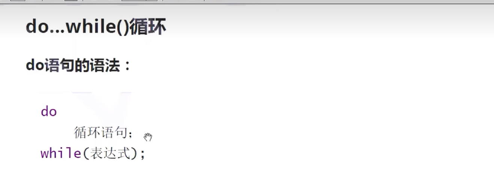

```C
int main()
{
	int i = 1;
	do
	{
		printf("%d ", i);
		i++;
	}
	while (i <= 10);
	return 0;
}
```

do...while循环中，break和continue的作用与之前相同

```C
int main()
{
	int i = 0;
	do
	{
		i++;
		if (i == 4)
			continue;
		if (i == 8)
			break;
		printf("%d ", i);
		
	}
	while (i <= 10);
	return 0;
}
```

# goto语句

c语言中提供了可以随意滥用的goto语句和标记跳转的标号
理论上goto语句是没有必要的，实践上没有goto语句也可以很容易的写出代码

goto语句的有点在于可以终止程序在某些深度嵌套的处理过程，可以一次跳出一个或多个循环，而break只能跳出本循环，去到上一次循环。

```C
int main()
{
	again://标号
	printf("Hello world\n");
	goto again;//跳回到标号again处
}
```

## goto语言的真正运用场景

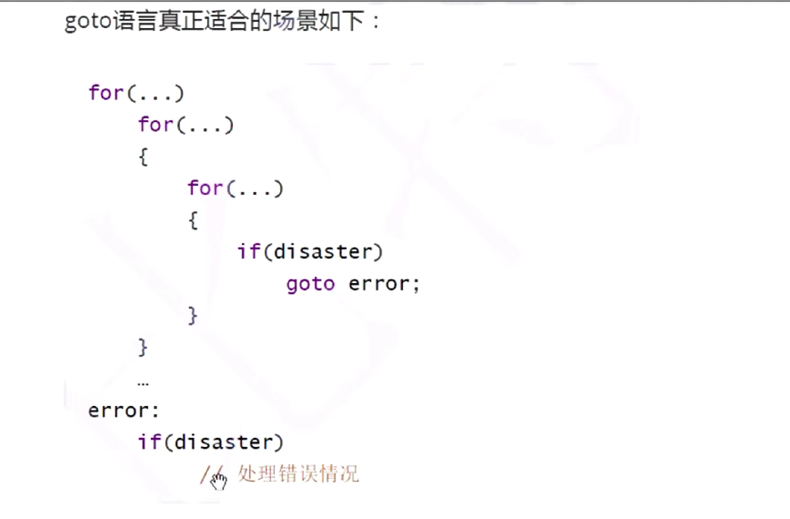

PS:
整蛊程序：

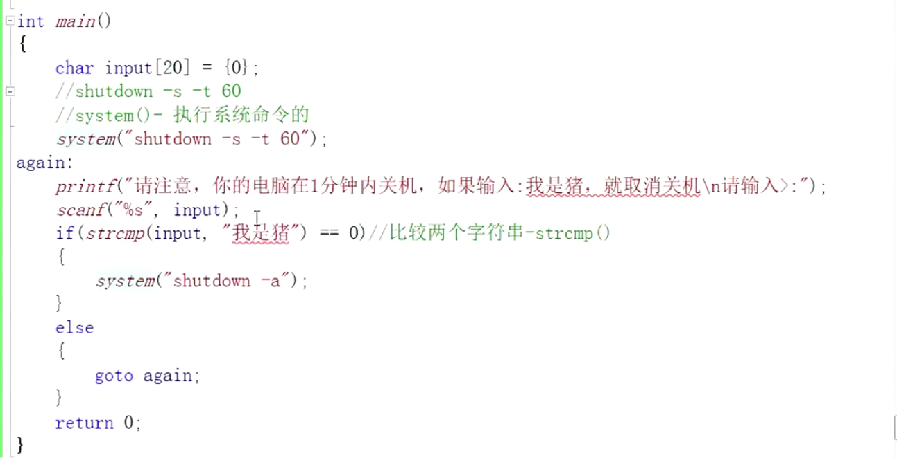

# 练习题

1.  计算n的阶乘

```C
int main()
{
	int n;
	long long result=1;
	int i = 0;
	printf("计算n的阶乘\n");
	printf("请输入n：");
	scanf("%d", &n);
	for (i = 1; i <= n; i++)
		result *= i;
	printf("n的阶乘是%lld\n", result);
}
```

n=5时，输出结果为120

1.  计算1到10的阶乘的和
    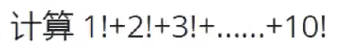

```C
int main()
{
	int i = 0;
	int j = 0;
	long long  sum = 0;
	
	for (i = 1; i <= 10; i++)
	{
		long long  pro = 1;
		for (j = 1; j <= i; j++)
		{
			pro *= j;
		}
		sum += pro;
	}
	printf("%lld", sum);
	return 0;
}
```

输出结果：4037913

效率更高的算法：
pro不再置0

```C
int main()
{
	int i = 0;
	int j = 0;
	long long  sum = 0;
	int max = 10;
	long long  pro = 1;
	
	for (i = 1; i <= max; i++)
	{
		pro *= i;
		sum += pro;
    //相比于上一个算法，速度更快，占用空间更小
	}
	printf("%lld", sum);
	return 0;
}
```

1.  查找
    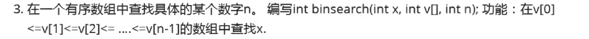

方法一：遍历查找

```C
int binserach(int x, int arr[], int n)
{
	int i = 0;
	for (i = 1; i <= n; i++)
	{
		if (arr[i-1] == x)
		{
			printf("%d是数组中的第%d个元素\n", x, i);
			break;
		}
	}
	if (i > n)
		printf("找不到\n");
}

int main()
{
	int n=20;
	int x = 0;
	int arr[20] = { 1,2,3,4,5,6,7,8,9,10,12,14,16,18,20,22,24,26,28,30 };
	printf("请输入一个值：");
	scanf("%d", &x);
	binserach(x, arr, n);
	return 0;
}
```

算法复杂度：n

方法二：二分法查找
算法复杂度：$log_2N$

```C
int binserach(int x, int arr[],int sz1)
{
	int left = 0;//数组下标，左值
	int right = sz1 - 1;//数组下标，右值,减1后会出现找不到最大值的情况；可以考虑不减1。
	int mid = (left + right) / 2; //数组下标，中值

	while (x!=arr[mid])
	{
		if (x < arr[mid])
		{
			right = mid;
			mid = (left + right) / 2;
		}
		else if (x > arr[mid])
		{
			left = mid;
			mid = (left + right) / 2;
		}
		else
			printf("err!!!\n");
	}
	if(x==arr[mid])
		return mid;
}

int main()
{
	int arrs[] = { 1,2,3,4,5,6,7,8,9,10 };//待查找的数组
	int n;//待查找的数，待用户输入；
	int ret;//返回的结果下标
	int sz = sizeof(arrs) / sizeof(arrs[0]);//计算数组的大小
	printf("请输入带查找的数值：");
	scanf("%d", &n);
	ret = binserach(n, arrs,sz);
	printf("%d是数组中的第%d位数", n, ret + 1);
	return 0;
}
```

以上代码没有考虑找不到的情况，依旧还有改进的空间。

1.  字符移动
    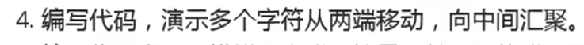

```C
int main()
{
	char arr[] = { "Welcome to here!!!" };
	int index = sizeof(arr) / sizeof(arr[0]);
	char arr2[19] = { '\0' };

	for (int i = 0; i < index; i++)
	{
		arr2[i] = '#';
	}

	for (int i = 0; i <= index / 2+1; i++)
	{
		for (int j = 0; j < index; j++)
		{
			printf("%c", arr2[j]);
		}
		printf("\n");
		arr2[i] = arr[i];
		arr2[index - i] = arr[index - i];
		}

	return 0;
}
```

改进：

```C
#include <stdio.h>
#include <string.h>
#include <windows.h>
#include <stdlib.h>
int main()
{
	char arr[] = "Welcome to here!!!" ;
	//int index = sizeof(arr) / sizeof(arr[0])-2;
	int index = strlen(arr) - 1;//用这个来计算字符串长度从而得出数组的大小
	char arr2[19] = { '\0' };

	for (int i = 0; i < index; i++)
	{
		arr2[i] = '#';
	}

	for (int i = 0; i <= index / 2+1; i++)
	{
		Sleep(1000);
		system("cls");
		for (int j = 0; j < index; j++)
		{
			printf("%c", arr2[j]);
		}
		arr2[i] = arr[i];
		arr2[index - i] = arr[index - i];
		}
	return 0;
}

```

再改进：
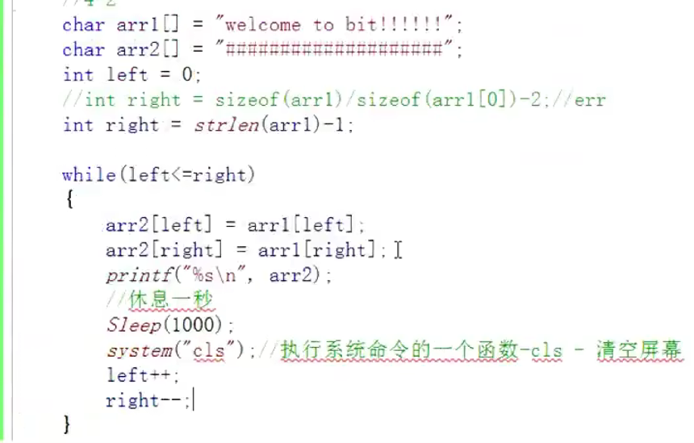

1.  模拟登录
    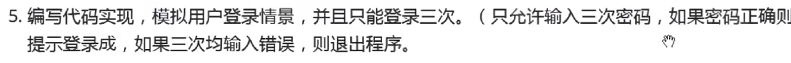

注意：==不能用于比较字符串是否相等，应该使用一个库函数：strcmp

该库函数需要调用头文件：string.h

```C
#include <stdio.h>
#include <string.h>

int main()
{
	int i = 0;
	char password[20] = { 0 };
	for (i = 0; i < 3; i++)
	{
		printf("请输入密码：>");
		scanf("%s", password);
		if (strcmp(password, "123456") == 0)
		{
			printf("登陆成功\n");
			break;
		}
		else
			printf("密码错误\n");
	}
	if (i == 3)
		printf("三次密码均错误！！！\n");
	return 0;
}
```

1.  求两个数的最大公约数

辗转相除法

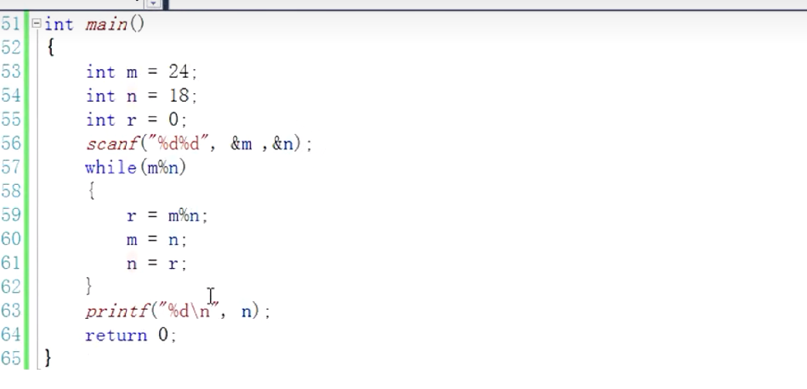

1.  猜数字游戏

时间戳：当前计算机时间-计算机的起始时间（1970.01.01 00:00:00)

此程序里面采用了时间戳来作为随机数种子，首先先要获取时间戳，需要用到time函数，该函数需要调用库函数time.h

然后需要用到随机数种子设置函数srand，该函数需要调用stdlib.h

最后利用rand函数来生成随机数

```C
#include <stdio.h>
#include <time.h>
#include <stdlib.h>


void game()
{
	int randnum = rand() % 100 + 1;
	int ret = 0;
	
	while(1)
	{
		printf("请输入您猜的数字：>");
		scanf("%d", &ret);
		if (ret < randnum)
			printf("猜小了\n");
		else if (ret > randnum)
			printf("猜大了\n");
		else
		{
			printf("猜测正确!!!\n");
			break;
		}
	}
}

int main()
{
	int input = 0;
	//拿时间戳来设置随机数种子
	//time_t time(time_t *timer); 获取系统时间，需要调用库函数time.h
	//void srand(unsigned int seeed);需要调用库函数stdlib.h
	srand ((unsigned int) time(NULL));

	do
	{
		printf("*************************************\n");
		printf("*******1.play       0.exit **********\n");
		printf("*************************************\n");
		scanf("%d", &input);
		if (1 == input)
			game();
		else if (0 == input)
			break;
		else
			printf("输入错误！\n");
	} while (input);
	printf("退出游戏！\n");
	return 0;
}
```

