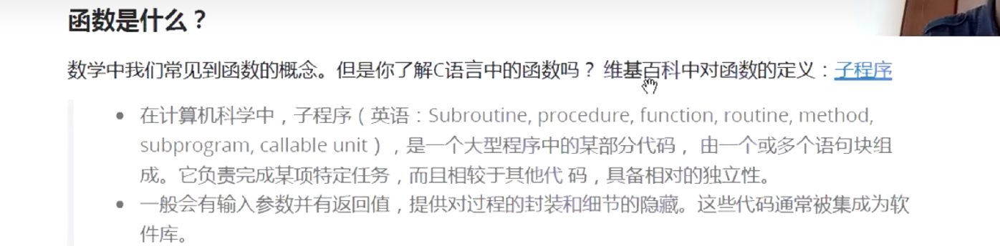
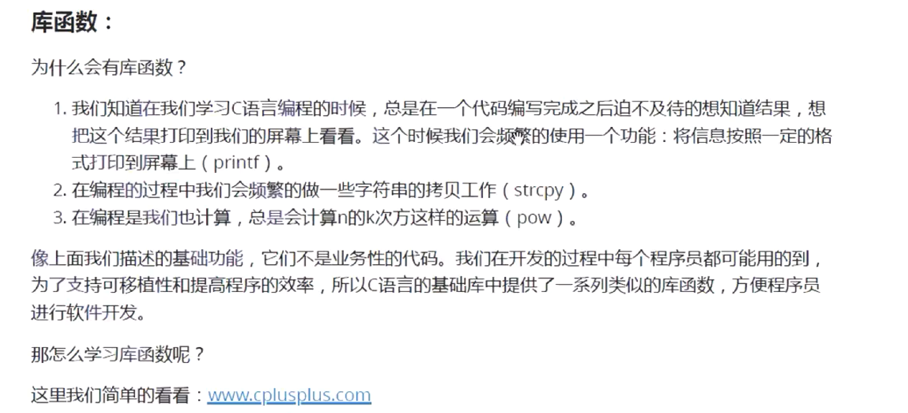
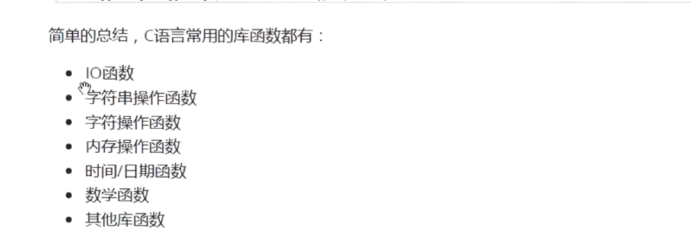
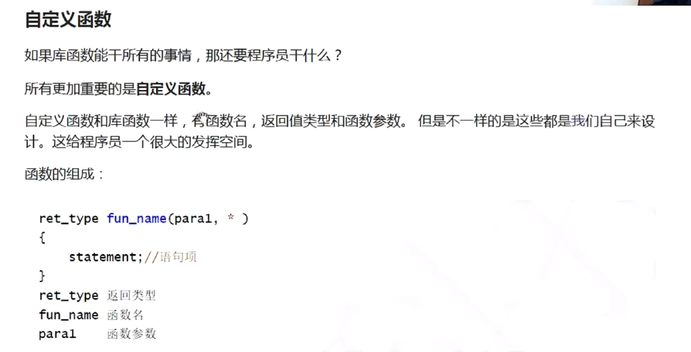
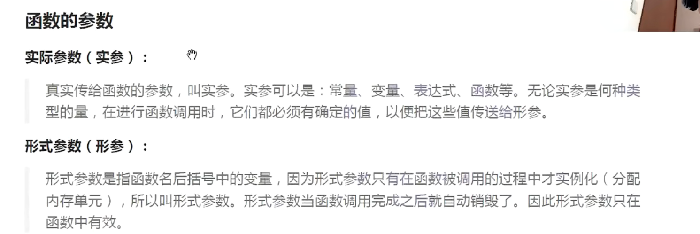
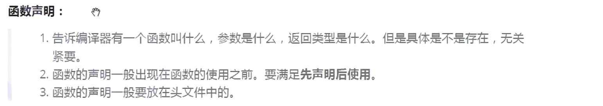
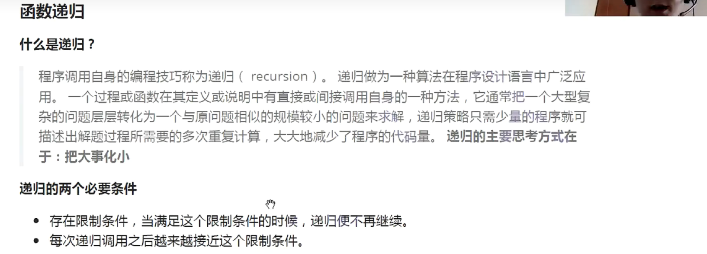
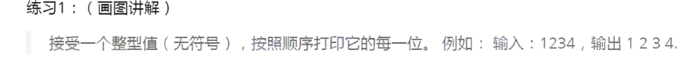
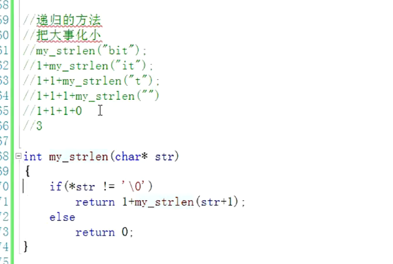
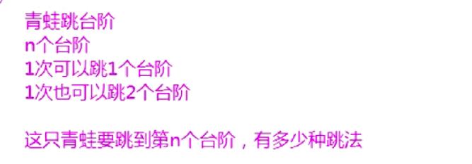

---

# 注释：文件开头使用YAML语法配置文章信息，之后是正常的Markdown语法
# Note: The beginning of the file uses YAML syntax to configure the blog meta data, followed by the normal Markdown syntax.

# 此处如果不配置标题，则提取Markdown中的一级标题，或使用文件名
# Title will be extracted from heading 1 of markdown or using file name if not configured here.
title: 03-函数与递归


# 此处如果不配置摘要，则从正文提取开头若干文字
# Abstract will be extracted from the begining of markdown content if not configured here.
abstract: 本文档主要回顾了C语言中函数与递归的使用方法


# URL用于固定链接、编辑文章功能，建议所有文章都配置
# URL is used for permalink and article editing, and it is recommended to be configured.
url: C-03


# 文章发布时间，使用的时区和系统设置一致，不设置则使用当前时间
# Article post time, time zone is the same as the system settings. Current time will be used if not configured here.
date: 2023-07-04 19:35:43


# 文章分类
category:
- C


# 文章标签
tags:
- C
---


# 03-函数与递归


# 函数

## 函数是什么？




函数用于完成某个特定的任务，具备一定的独立性

函数一般具有输入参数和返回值，提供对过程的封装和对过程的隐藏，这些代码通常被集成位软件库。

## 函数的分类

1. 库函数
2. 自定义函数

### 库函数

使用库函数必须要先调用相应的头文件





网站：www.cplusplus.com


常用的库函数




例子：
1. strcpy
```C
#include <stdio.h>
#include <string.h>

int main()
{
	char arr1[] = "hello";
	char arr2[20] = "###############";
	strcpy(arr2, arr1);
	//此时arr2=“hello\0########”,但是o后面有结束符号，所以输出的时候不会打印#
	printf("%s\n", arr2);
	return 0;
}
```

可能会出现溢出


2. memset

```C
void * memset ( void * ptr, int value, size_t num );
```


```C
#include <stdio.h>
#include <string.h>

int main ()
{
  char str[] = "almost every programmer should know memset!";
  memset (str,'-',6);
  puts (str);
  return 0;
}
```


### 自定义函数



#### 例子

交换变量的值：
```C
#include <stdio.h>

void swap(int* x, int* y)
{
	int temp = 0;
	temp = *x;
	*x = *y;
	*y = temp;

}

int main()
{
	int a = 10, b = 20;
	printf("a=%d b=%d\n", a, b);
	swap(&a, &b);
	printf("a=%d b=%d\n", a, b);
	return 0;
}
```

注意，如果传入的形参不是地址，那么该swap函数可能会申请新的函数地址，从而造成无法成功交换a，b的值的结果；

# 函数的参数

## 实参

## 形参



# 函数的调用

## 传值调用


## 传址调用


# 函数的嵌套调用和链式访问

## 嵌套调用

函数是可以有机组合的


## 链式访问

把一个函数的返回值作为另一个函数的参数

```C
int main()
{
	printf("%d", printf("%d", printf("%d", 43)));
	return 0;
}
```

printf函数的返回值是打印的字符数的数量； 

# 函数的声明和定义

## 函数的声明

注意注意：函数一定要先声明，后使用

使用多个头文件的时候，需要采用以下代码避免重复引用：

```C
#ifndef __XXX_H__
#define __XXX_H__
  
  //此处为业务代码

#endif

```





## 函数的定义


# 函数递归



一个简单的递归函数：
```C
int main()
{
	printf("Hello\n");
	main();
	return 0;
}
```

注意注意：递归函数很容易栈溢出：stack overflow

所以上面这个递归函数运行着运行着就会挂了；


## 内存


内存分为三类：栈区，堆区，静态区

栈区:局部变量，函数形参

堆区：动态开辟的内存:malloc,calloc

静态区：全局变量，static修饰的变量

## 递归

例子1：



```C
void printnum(int n)
{
	if (n > 9)
		printnum(n / 10);
	printf("%d ", n % 10);
}

int main()
{
	int n = 0;
	scanf("%d", &n);
	printnum(n);
	return 0;
}
```

例子2：
求字符串的长度：


方法一：计数器
方法二：递归
方法三：指针

数组传参的时候传递的不是整个数组，而是数组的首元素的地址



```C
int my_strlen(char* str)
{
	if (*str != '\0')
		return 1 + my_strlen(str + 1);
	else
		return 0;
}

int main()
{
	char arr[20] = "Hello";
	int n = 0;
	n = my_strlen(arr);
	printf("%d\n",n);
	return 0;
}
```
## 递归与迭代

当用递归求斐波那契数列的时候，容易溢出，此时用循环反而求解速度更快，占用空间更小。

函数递归的经典题目：
1：汉诺塔问题：
2：青蛙跳台阶问题：




