# 05-操作符

# 操作符分类

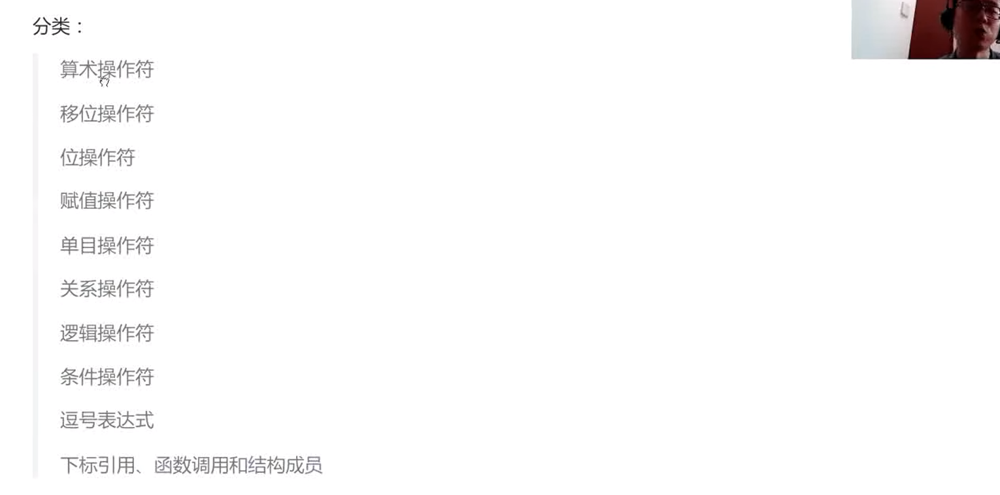

## 算数操作符

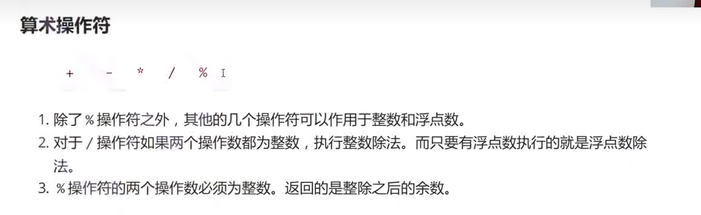

## 移位操作符

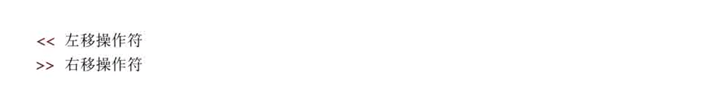

移位操作符移位规则：

左移操作符：
左边丢弃，右边补0

右移操作符：
逻辑移位：左边用0填充，右边丢弃
算术移位：左边用原该值符号位填充，右边丢弃
```C
int main()
{
	int a = -8;
	int b = 5;
	a >> 1;
	printf("%d\n", a >> 1);//算术移位
	printf("%d\n", b << 1);//全员左移

	return 0;
}
```
整数的二进制表示有：原码，反码，补码

存储到内存中的是补码

正数三码相同

原码除符号位依次取反得到反码，反码+1得到补码

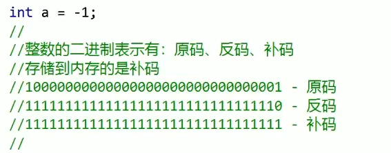


对于移位操作符，不要移动负数位，这是标准未定义的：

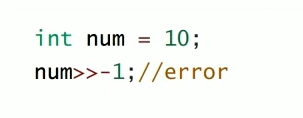


## 位操作符

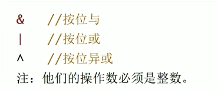

```C
int main()
{
	int a = 1;
	//0001
	int b = 2;
	//0010
	int c = a & b;
	//0000
	int d = a | b;
	//0011
	int e = a ^ b;
	//0011
	printf("%d\n", c);
	printf("%d\n", d);
	printf("%d\n", e);
	return 0;
}
```

例子：交换两个int类型的数a，b的值，不能使用第三个数：
```C
int main()
{
	int a = 5;
	int b = 3;

	printf("Before:a=%d,b=%d\n", a, b);
	//加减法，可能会溢出
	a = a + b;
	b = a - b;
	a = a - b;
	printf("After:a=%d,b=%d\n", a, b);
	//异或：
	a = a ^ b;
	b = a ^ b;
	a = a ^ b;

	printf("Last:a=%d,b=%d\n", a, b);
		return 0;
}
```


## 赋值操作符

\=

连续赋值：

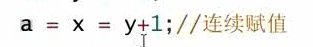
不建议连续赋值

复合赋值：

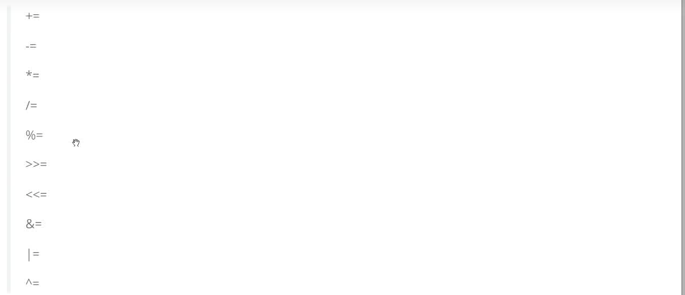


## 单目操作符

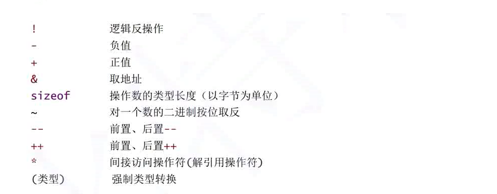

只有一个操作数

双目操作符：有两个操作数


sizeof：

```C
int main()
{
	short s = 0;
	int a = 10;
	printf("%d\n", sizeof(s = a + 5));
	printf("%d\n", s);
	return 0;
}
```
sizeof()这个函数里面的表达式是不会真是参与运算的

按位取反：

```C
int main()
{
	int a = 0;
	printf("%d\n", ~a);
	return 0;
}
```
输出结果为-1，按位取反会使所有的二进制位取反（包括符号位），
（需要考虑原码，补码，反码）

位操作的技巧：

```C
int main()
{
	int a = 11;
	a = a | (1 << 2);
	//位操作的使用技巧，将1011变成1111
	printf("%d\n", a);

	a = a & (~(1 << 2));
	printf("%d\n", a);
	//再将1111变成1011
	return 0;
}
```


## 关系操作符
 
 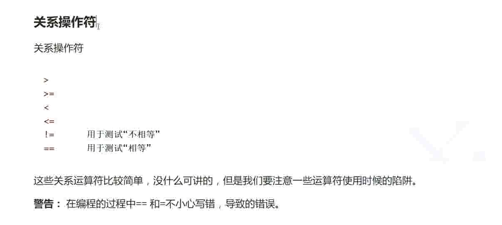


## 逻辑操作符


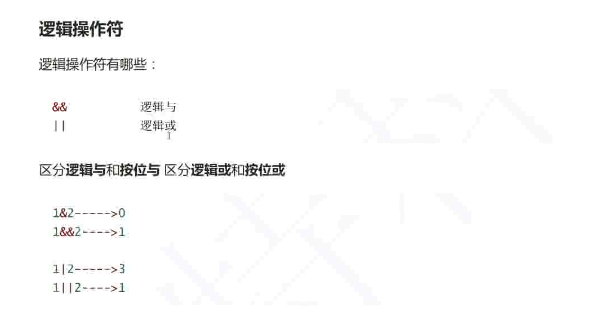

 

```C
int main()
{
	int i = 0, a = 0, b = 2, c = 3, d = 4;
    //a=1;
	i = a++ && ++b && d++;
    //i=a++||++b||d++;
	printf("%d %d %d %d\n", a, b, c, d);
	return 0;
	//程序输出的结果是什么？
}
```


逻辑与左边的条件为假之后，则逻辑与右边的语句 不再执行

逻辑或左边的条件为真之后，则逻辑或右边的语句 不再执行


## 条件操作符


```C
exp1? exp2 : exp3
```

如果exp1为真则返回exp2的值，否则返回exp3的值

例子：
```C
int main()
{
	int a = 1;
	int b = 2;
	printf("%d\n", (a > b) ? a : b);
	return 0;
}
```


## 逗号表达式

逗号表达式：用逗号分开多个表达式，从左到右依次执行，整个表达式的结果是最后一个表达式的结果

例子：
```C
int main()
{
	int a = 1;
	int b = 2;
	int c = (a > b, a = b + 10, a, b = a + 1);
	printf("%d\n", c);
	return 0;
}
```

输出的结果为13

逗号表达式的使用技巧：

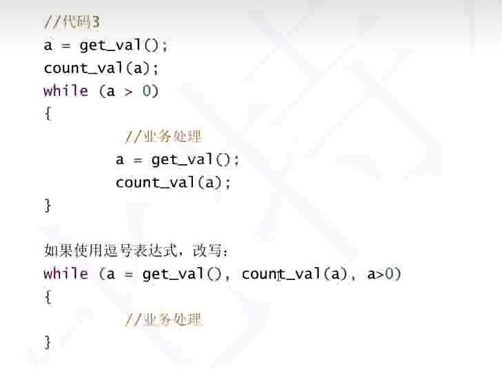


## 下标引用，函数调用，结构成员

### 下标引用\[\]

```C
int arr[10];
arr[9]=10;//两个操作数是arr和9
```

### 函数调用\(\)

```C
    function(a,b);//调用函数,操作数：function,a,b
```


### 结构成员\.

```C
#include <stdio.h>

struct Stu
{
	char name[20];
	int age;
	char id[20];
};

int main()
{
	int a = 10;
	struct Stu s1 = { "zhangsan",20,"20212230" };
	s1.age = a;
	struct Stu* ps = &s1;
	printf("%s\n", s1.name);
	printf("%d\n", s1.age);
	printf("%s\n", s1.id);

	printf("%s\n", (*ps).name);
	printf("%d\n", (*ps).age);
	printf("%s\n", (*ps).id);

	printf("%s\n", ps->name);
	printf("%d\n", ps->age);
	printf("%s\n", ps->id);

	return 0;
}
```

三种输出的结果是一样的

# 表达式求值


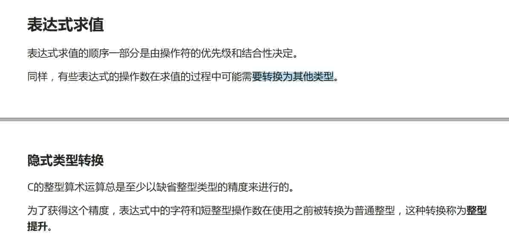


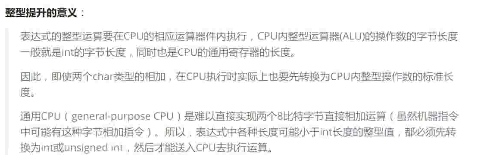

## 隐式类型转换

整型提升是按照变量的数据类型的符号位来提升的：
即如果符号位是0，则提升的高位全是0，如果符号位是1，则高位全是1

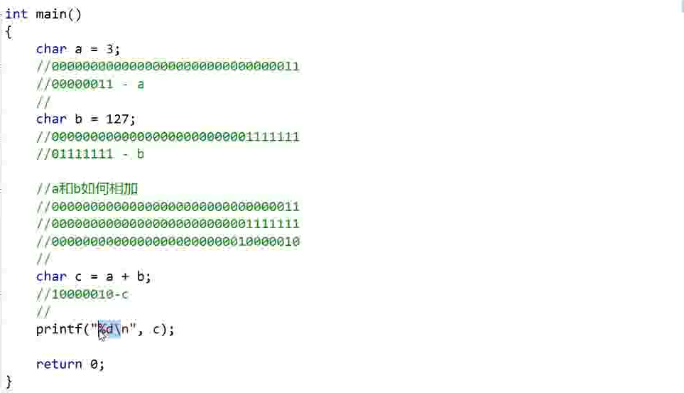


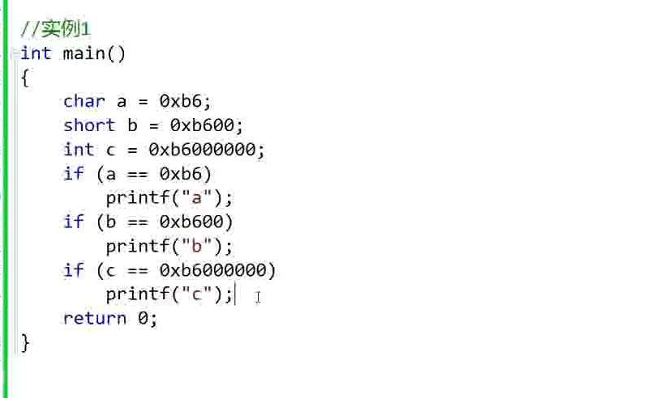

结果只会打印c

a和b都发生了整形提升
（高位是1）

所以只有c被打印了

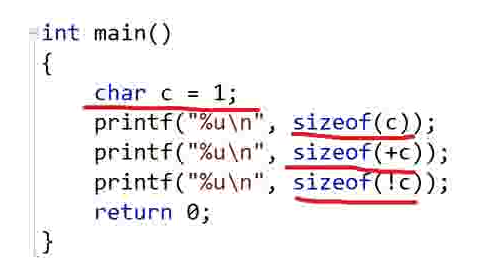

结果是：1，4，1

## 算术转换

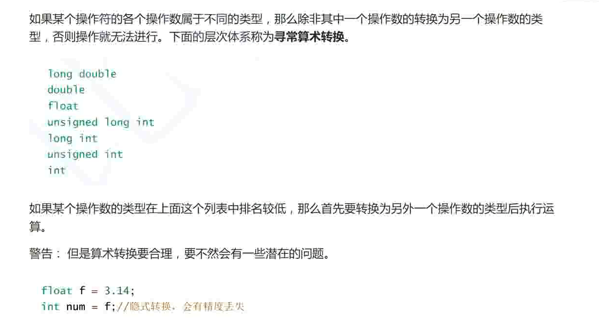


## 操作符的属性

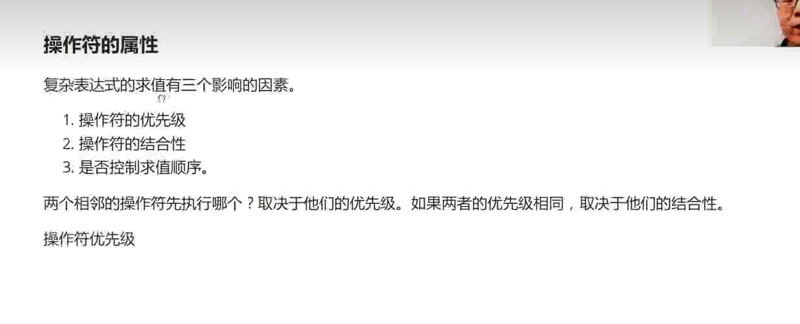

### 操作符的优先级

先乘除，后加减


### 操作符的结合性

### 是否控制求值顺序


