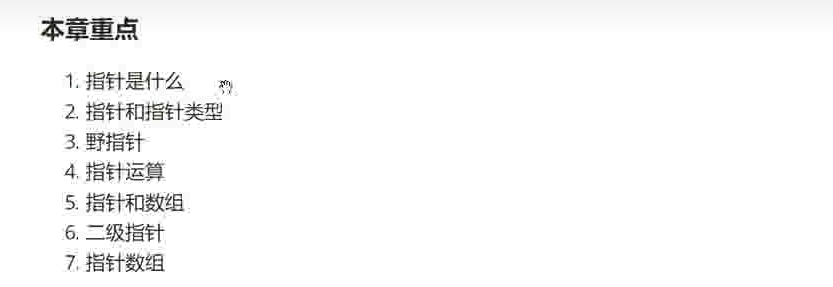
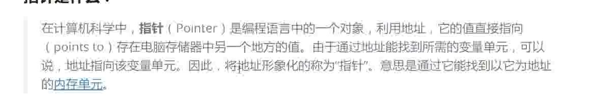
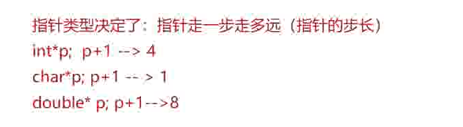
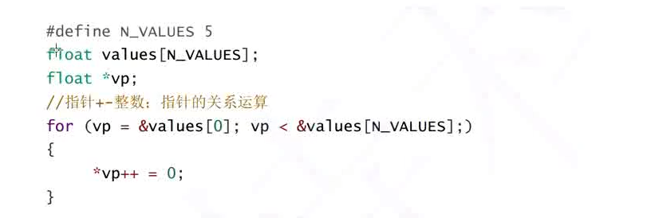
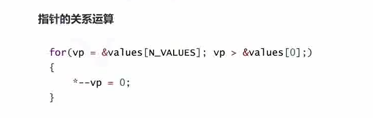
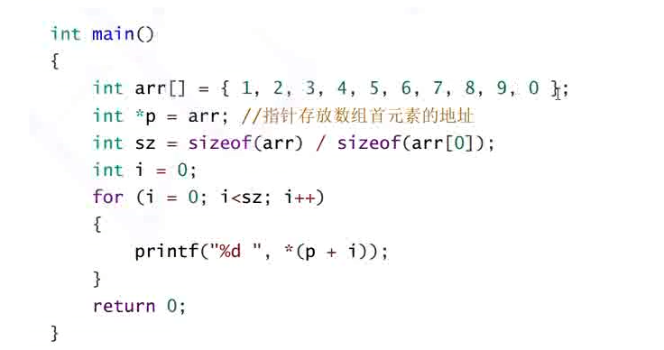
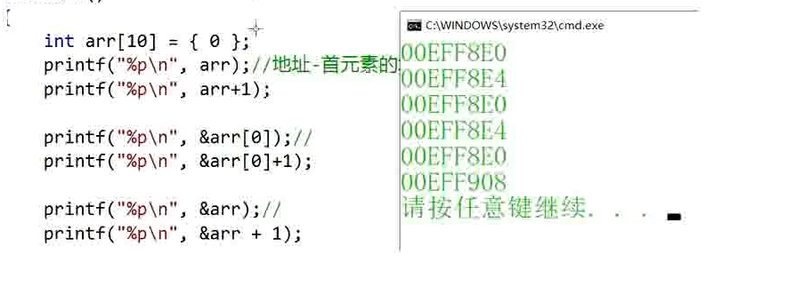
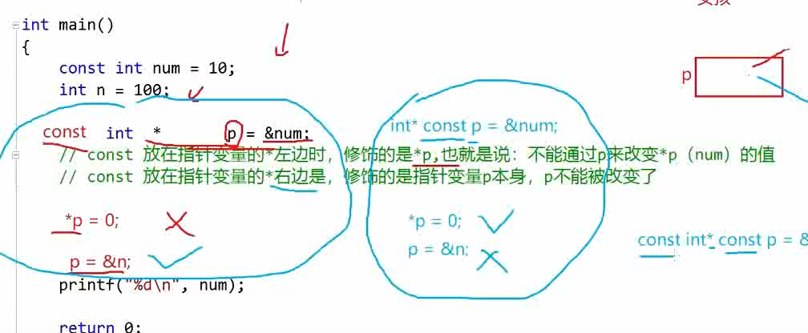

# 06-初始指针

本章重点：




# 指针是什么？




```C
int main()
{
	int a = 10;
	int* p = &a;
	return 0;
}
```

指针就是地址，指针是用来存放地址的变量

地址是唯一标识一块地址空间的

在32位机器上，指针是4字节的
在64位机器上，指针是8字节的


# 指针和指针类型

指针类型影响的是解引用操作时的操作字节数
决定了指针解引用操作的时候能访问的空间的大小

32位系统中，

int* p能访问4个字节
char* p能访问1个字节
double* p能访问8个字节

对指针加减正数的时候，得到地址的结果与指针的类型有关

即指针的类型决定了指针走一步能走多远（指针的步长）。



# 野指针

概念：野指针就是指向的位置不确定的指针（指向的地址是随机的，不确定的，或者没有明确限制的）。

## 成因：
1. 指针未初始化
```C
int main()
{
	int* p;
	*p = 20;
	return 0;
}
```


2. 指针越界访问

```C
int main()
{
	int arr[10] = { 0 };
	int* p = arr;
	int i = 0;
	for (i = 0; i <= 11; i++)
	{
		*(p++) = i;
	}
	return 0;
}
```

3. 指针指向的内存释放了

```C
int* test()
{
	int a = 10;
	return &a;
}

int main()
{
	int* p = test();
	*p = 20;
	return 0;
}
```


## 避免野指针

1. 指针及时初始化
2. 指针及时赋值为NULL；
3. 小心指针越界
4. 指针使用之前检查其有效性


# 指针运算

## 指针加减整数

```C
int main()
{
	int arr[10] = { 1,2,3,4,5,6,7,8,9,10 };
	int i = 0;
	int sz = sizeof(arr) / sizeof(int);
	int* p = arr;
	for (i = 0; i < sz; i++)
	{
		printf("%d\n", *p);
		p = p + 1;//p++;
	}
}
```

指针加减整数：



## 指针-指针
```C
int main()
{
	int arr[10] = { 1,2,3,4,5,6,7,8,9,10 };
	printf("%d\n", &arr[9] - &arr[0] + 1 );
	return 0;
}
```

指针减指针得到的是指针之间的元素的个数

```C
int my_strlen(char* str)
{
	char* start = str;
	char* end = str;

	while (*end != '\0')
	{
		end++;
	}
	return end - start;
}

int main()
{
	char arr[] = "hello world!";
	printf("%d\n", my_strlen(arr));
	return 0;
}

```

## 指针的关系运算

其实就是比较两个指针的大小，即其地址的大小：




# 指针与数组

数组名是首元素的地址（两个例外：sizeof（arr）和&arr）

我们可以把数组名放到一个指针中，使用指针来访问一个数组

```C
int main()
{
	int arr[10]= { 1,2,3,4,5,6,7,8,9,10 };
	printf("%p\n", arr);
	printf("%p\n", &arr[0]);

	return 0;
}
```

以上程序输出的结果相同




而对数组取地址的时候：



# 二级指针

指针也是变量，是变量就有地址，指针变量的地址是存放在二级指针中的 ,依次有三级，四级。。。。

下面的ppa就是二级指针：

```C
int main()
{
	int a = 10;
	int* pa = &a;
	int** ppa = &pa;

	return 0;
}
```

# 指针数组

指针数组与数组指针

指针数组：存放指针的数组
数组指针：一个数组的指针

```C
int main()
{
	int a = 0;
	int b = 1;
	int c = 2;
	int* arr[3] = { &a,&b,&c };
	for (int i = 0; i < 3; i++)
	{
		printf("%d\n", *(arr[i]));
	}
		return 0;
}
```

# const 指针




