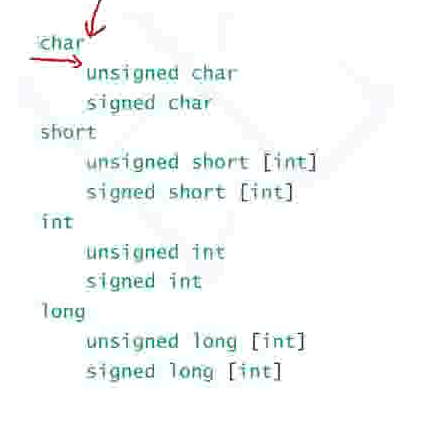
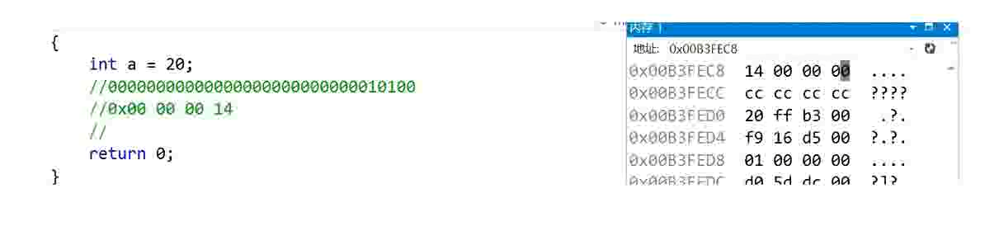
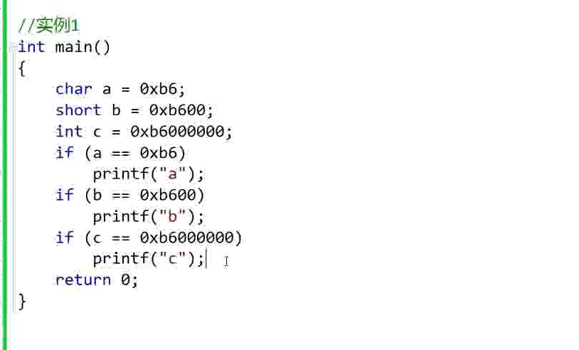
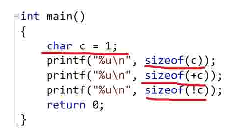
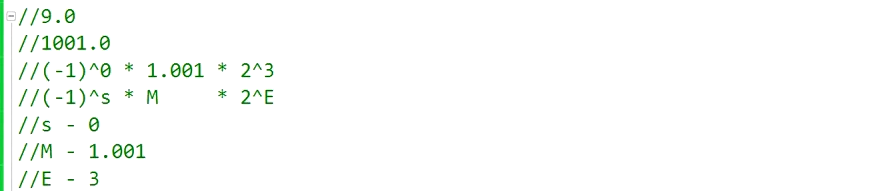

---

# 注释：文件开头使用YAML语法配置文章信息，之后是正常的Markdown语法
# Note: The beginning of the file uses YAML syntax to configure the blog meta data, followed by the normal Markdown syntax.

# 此处如果不配置标题，则提取Markdown中的一级标题，或使用文件名
# Title will be extracted from heading 1 of markdown or using file name if not configured here.
title:  09-数据的存储


# 此处如果不配置摘要，则从正文提取开头若干文字
# Abstract will be extracted from the begining of markdown content if not configured here.
abstract: 本节简要介绍了C语言中数据类型的详细介绍. 整型在内存中的存储：原码，反码，补码. 大小端字节序介绍及判断. 浮点型在内存中的存储解析.


# URL用于固定链接、编辑文章功能，建议所有文章都配置
# URL is used for permalink and article editing, and it is recommended to be configured.
url: C-09


# 文章发布时间，使用的时区和系统设置一致，不设置则使用当前时间
# Article post time, time zone is the same as the system settings. Current time will be used if not configured here.
date: 2023-07-04 20:00:09


# 文章分类
category:
- C


# 文章标签
tags:
- C


---

# 09-数据的存储

本章重点：
1. 数据类型的详细介绍
2. 整型在内存中的存储：原码，反码，补码
3. 大小端字节序介绍及判断
4. 浮点型在内存中的存储解析

# 数据类型的介绍

## C语言类型

### 内置类型

C语言的基本内置类型：


### 自定义类型

构造类型

## 类型的意义


```C
int main()
{
	int a = 10;
	float b = 10.0;

	return 0;
}
```


查看a和b的地址所存储的内容：
a：

b：


# 类型的基本归类

## 整型家族



取值范围存储在limits.h中

### char

signed char: -128~127
unsigned char: 0~255


## 浮点型家族

单精度浮点型：float
双精度：double
还有long double

取值范围存储在float.h中


## 构造类型


## 指针类型


## 空类型

void

常用于函数的返回，函数的参数，指针类型

这样程序也能运行，函数未指定参数时可传参可不传参


# 整型在内存中的存储

## 原码 反码 补码

计算机中的**有符号数**有三种表示方法（原码，反码，补码）

（无符号数的三码相同）

三种表示方法均有**符号位**和**数值位**两部分

符号位用0表示正数，用1表示负数

（正数三码相同）

数值位的表示方法则各不相同：

**原码**：直接将其翻译为二进制

**反码**：原码的符号位不变，数值位按位取反

**补码**：反码\+1得到补码

```C
int main()
{
	int a = 20;
	//00000000 00000000 00000000 00010100-原码
	//00000000 00000000 00000000 00010100-反码
	//00000000 00000000 00000000 00010100-补码
	//16进制：0x 00 00 00 14
	int b = -20;
	//10000000 00000000 00000000 00010100-原码
	//11111111 11111111 11111111 11101011-反码
	//11111111 11111111 11111111 11101100-补码
	//16进制：0x ff ff ff ec

	return 0;
}
```

对于整型而言，数据存在内存中的时候，其实存放的都是补码

原因：


补码存在的原因：
计算机中只有加法器
1-1可以转换为1+（-1)

# 大端 小端

## 什么是大端小端

大端（存储）模式：是指数据的低位存储在内存的高地址中，而数据的高位存储在内存的低地址中；
小端（存储）模式：是指数据的低位存储在内存的低地址中，而数据的高位存储在内存的高地址中；

下面这个就是小端：


（我们电脑里面的存储模式就是小端存储）

大端小端描述的是字节的存储顺序，不是位的顺序

因此又叫做大端字节序，小端字节序

## 为什么要有大端小端


PS: 笔试题

百度系统工程师：请简述大端小端的概念，并给出一个程序判断该机器是大端存储还是小端存储：
```C
int main()
{
	int a = 0x01;
	int* p = &a;
	char* pc = p;

	if ('\0' == *pc)
	{
		printf("大端存储\n");
	}
	else if ('\1' == *pc)
	{
		printf("小端存储\n");
	}
	else
		printf("err\n");
	return 0;
}
```

将该代码进行优化之后：

```C
int SysCheck(void)
{
	int a = 1;
	char* p = (char*)&a;
    //返回1，小端
	//返回0，大端
	return *p;
}

int main()
{
	//写一段代码判断当前机器的字节序是什么？
	//返回1，小端
	//返回0，大端
	if (SysCheck())
	{
		printf("当前机器是小端\n");
	}
	else
	{
		printf("当前机器是大端\n");
	}
	return 0;
}
```
再对代码进行浓缩：
```C
int SysCheck(void)
{
    int a=1;
    //返回1，小端
    //返回0，大端
    return *(char*)&a;
}
```

例题2：
```C
int main()
{
	char a = -1;
	signed char b = -1;
	unsigned char c = -1;
	//这个程序输出什么？
	printf("%d %d %d\n", a, b, c);

	return 0;
}
```
答案：-1 -1 255

解析：-1的补码是全1

# 整型提升与隐式类型转换

整型提升是按照变量的数据类型的符号位来提升的：
即如果符号位是0，则提升的高位全是0，如果符号位是1，则高位全是1




结果只会打印c

a和b都发生了整形提升
（高位是1）

所以只有c被打印了



结果是：1，4，1


例题3：
以下程序输出什么？
```C
int main()
{
	char a = -128;
	char b = 128;
	// char类型只能存储一个byte
	// signed char的范围是：-128~127
	// unsigned char的范围是：0~255
	// 原码：10000000 00000000 00000000 10000000
	// 反码：11111111 11111111 11111111 01111111
	// 补码：11111111 11111111 11111111 10000000
	// 强制转换为char类型后： 10000000
	printf("%c\n", a);//此时输出的是a保存的值对应的ascii码
	printf("%c\n", 128);//此时输出的是128对应的ascii字符
	//当转换成%u之后，会进行整型提升
	//整型提升是按照变量的数据类型的符号位来提升的
	//因此 下列打印的值其实是无符号的：11111111 11111111 11111111 10000000
	printf("%u\n", a);// %u是打印十进制无符号数字 %d是打印十进制有符号数字

	printf("%c\n", b);
	printf("%c\n", 128);
	printf("%u\n", b);

	return 0;
}
```


当内存中识别到有符号数的二进制位 1000 0000，直接定义为-128


例题4
下列程序输出什么？

```C
int main()
{
	int i = -20;
	//原码：10000000 00000000 00000000 00010100
	//反码：11111111 11111111 11111111 11101011
	//补码：11111111 11111111 11111111 11101100
	int j = 10;
	//正数三码相同：00000000 00000000 00000000 00001010
	printf("%d\n", i + j);
	//二者相加：
	//11111111 11111111 11111111 11101100
	//00000000 00000000 00000000 00001010

	//11111111 11111111 11111111 11110110(结果，是以补码形式存储的
	//反码：11111111 11111111 11111111 11110101（补码减1）
	//原码：10000000 00000000 00000000 00001010
	//转为有符号数：%d-> -10

	return 0;
}
```

例题5；

下列程序输出什么？

```C
#include <Windows.h>
int main()
{
	unsigned int i;
	for (i = 9; i >= 0; i--)
	{
		printf("%u\n", i);
		Sleep(500);
	}
	return 0;
}
```

以上代码会陷入死循环，原因是：

i不可能位负数，所以会一直无限制的循环


例6：

下列程序会输出什么？
```C
#include <stdio.h>

#include <string.h>

int main()
{
	char a[1000];
	int i;
	for (i = 0; i < 1000; i++)
	{
		a[i] = -1 - i;
	}
	printf("%d\n", strlen(a));
	return 0;
}
```

```C
#include <string.h>
int main()
{
	char a[1000];
	int i;
	for (i = 0; i < 1000; i++)
	{
		a[i] = -1 - i;
	}

	//-1的char
	//原码：10000000 00000000 00000000 00000001
	//反码：11111111 11111111 11111111 11111110
	//补码：11111111 11111111 11111111 11111111

	//-i的含义就是+（-i）
	// -1和0相加得到的结果还是-1；
	//-1和-1的补码相加:
	//11111111 11111111 11111111 11111111
	//11111111 11111111 11111111 11111111
	//11111111 11111111 11111111 11111110(进1）
	//这是-2的补码：
	//取后四位：11111110得到的是（-2）
	//一直循环到：11111111 11111111 11111111 00000000时结束
	printf("%d\n", strlen(a));
	//遇到'\0'则结尾
	return 0;
}
```


例题7：

下列程序输出什么？

```C
#include <stdio.h>
int main()
{
	unsigned char i = 0;
	for (i = 0; i <= 255; i++)
	{
		printf("hello, world!\n");
	}
	return 0;
}
```

以上程序会进入无限循环，原因时：

unsigned char的范围就时0~255，不会跳出循环条件


# 浮点型在内存中的存储

常见的浮点数：3.14159 1e10

浮点数家族包括有：

float, double, long double.

浮点数存储实例：
```C
int main()
{
	double d = 1E10;
	printf("%lf\n", d);

	return 0;
}
```

```C
int main()
{
	int n = 9;
	float* pfloat = (float*)&n;
	printf("%d\n", n);
	printf("%f\n", *pfloat);

	*pfloat = 9.0;
	printf("%d\n", n);
	printf("%f\n", *pfloat);
	
	return 0;

}
```
以上程序输出可以看出浮点型和整型的存储是有区别的

## 浮点数的存储标准

IEEE 754规定，任意一个浮点数V可以表示成以下形式：
+ $(-1)^S*M*2^E$
+ $(-1)^S$表示符号位，当S\=0时是正数，S\=1时，是正数
+ $M$表示有效数字,大于等于1，小于等于2
+ $2^E$表示指数位

例子：
十进制的5.0，写成二进制是101.0，相当于1.01X2^2，按照上面的标准，即是S=0, M=1.01, E=2;

十进制的-5.0，写成二进制是-101.0，相当于-1.01X2^2，按照上面的标准，即时S=1,M=1.01,E=2;




对于32位的浮点数，最高位是符号位S，接着的8位是指数E，剩下的23位是有效数字M。


## IEEE特别规定

### 存入


例子：
5.5存入内存中的时候：

```C
int main()
{
	float f = 5.5;
	//十进制：5.5
	//二进制：101.1
	//按标准表示：（-1）^0*1.011*2^2
	//S=0
	//M=1.011
	//E=2(加上中间数127得到的值是129）
	//在内存中的存储：0 10000001 01100000000000000000000
	//规范化处理：01000000 10110000 00000000 00000000
	//规范化处理：0100 0000 1011 0000 0000 0000 0000 0000
	//十六进制显示：0x 40 b0 00 00 (可以调试，在内存中查看，ps：x64是小端存储）
	return 0;
}
```

### 取出

三种情况：
1. E不全为0，也不全为1

这时，浮点数就采用下面的规则表示，即指数的计算值减去127(或1023)，得到真实值，再将有效数字M前加上第一位的1。比如:0.5(1/2)的二进制形式为0.1，由于规定正数部分必须为1，即将小数点右移1位则为1.0*2^-1)，其阶码为-1+127=126，表示为01111110，而尾数1.0去掉整数部分为0，补齐0到23位00000000000000000000000，则其二进制表示形式为:

0 01111110 00000000000000000000000


2. E全为0

这时，浮点数的指数E等于1-127( 或者1-1023)即为真实值，有效数字M不再加上第一位的1，而是还原为0.xxxxxx的小数。这样做是为了表示+0，以及接近于0的很小的数字。

案例：
```C
//0 00000000 01100000000000000000000
//还原：+0.011*2^-126
```


3. E全为1

这时，如果有效数字M全为0，表示正负无穷大(正负取决于符号位s);


 


