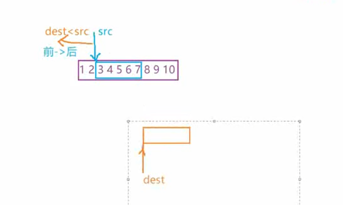
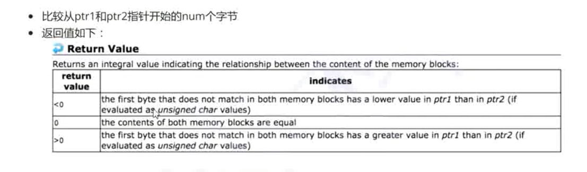
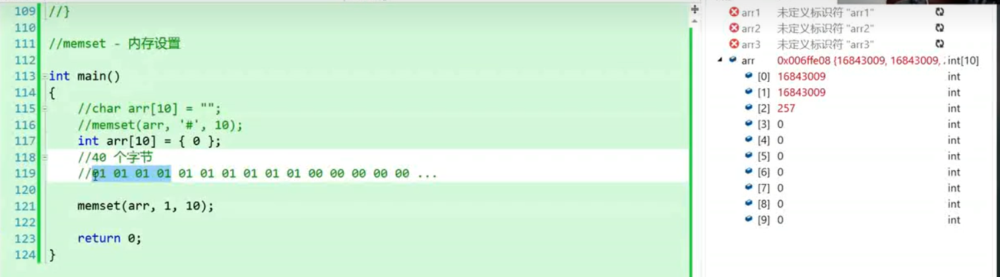

---

# 注释：文件开头使用YAML语法配置文章信息，之后是正常的Markdown语法
# Note: The beginning of the file uses YAML syntax to configure the blog meta data, followed by the normal Markdown syntax.

# 此处如果不配置标题，则提取Markdown中的一级标题，或使用文件名
# Title will be extracted from heading 1 of markdown or using file name if not configured here.
title:  12-四个内存函数


# 此处如果不配置摘要，则从正文提取开头若干文字
# Abstract will be extracted from the begining of markdown content if not configured here.
abstract: 本节介绍了C语言中的四个内存函数： memcpy, memmove, memcmp, memset.


# URL用于固定链接、编辑文章功能，建议所有文章都配置
# URL is used for permalink and article editing, and it is recommended to be configured.
url: C-12


# 文章发布时间，使用的时区和系统设置一致，不设置则使用当前时间
# Article post time, time zone is the same as the system settings. Current time will be used if not configured here.
date: 2023-07-04 20:00:12


# 文章分类
category:
- C


# 文章标签
tags:
- C
- 内存函数

---

# 12-四个内存函数

- memcpy
- memmove
- memcmp
- memset

# 为什么要用到内存操作函数
因为string.h中的str系列函数，操作对象都是字符串，以\0结尾的，对于数组，结构体等数据无能为力

例如：
```C
int main()
{
	int arr1[] = { 1,2,3,4,5 };
	int arr2[5] = { 0 };
	strcpy(arr2, arr1);
	return 0;
}
```
此时，是会报错的


# memcpy

能拷贝内存中所有格式的数据
```
void * 无类型指针
void * memcpy ( void * destination, const void * source, size_t num );
```

## 使用示例1：
```C
int main()
{
	int arr1[] = { 1,2,3,4,5 };
	int arr2[5] = { 0 };
	memcpy(arr2, arr1, sizeof(arr1));
	return 0;
}
```

## 使用示例2：

```C
struct stu
{
	char name[20];
	int age;
};

int main()
{
	struct stu arr1[] = { {"example1",18},{"example2",22} };
	struct stu arr2[3] = { 0 };
	memcpy(arr2, arr1, sizeof(arr1));

	return 0;
}
```

## 模拟实现

```C
void* my_memcpy(void* dest, const void* src, int count)
{
	void* ret = dest;
	assert(dest && src);
	while (count--)
	{
		*(char*)dest = *(char*)src;
		++(char*)dest;
		++(char*)src;
	}
	return ret;
}
```

同样的，memcpy拷贝的源数据和目的数据的内存空间不能有重叠。


## 内存空间重叠时的解决方案

c语言标准规定：
memcpy：只用来处理内存不重叠的内容的拷贝；但是在visual studio中也能处理内存重叠的内容；不能指望所有平台的memcpy都能处理内存重叠的内容
memmove：用来处理内存重叠的内容的拷贝；


### 问题

相同空间的区域可能会被覆盖  

```C
void* my_memcpy(void* dest, const void* src, int count)
{
	void* ret = dest;
	assert(dest && src);
	while (count--)
	{
		*(char*)dest = *(char*)src;
		++(char*)dest;
		++(char*)src;
	}
	return ret;
}

int  main()
{
	int arr[20] = { 1,2,3,4,5,6,7,8,9,10 };
	my_memcpy(arr + 2, arr, sizeof(int) * 5);

	for (int i = 0; i < 20; i++)
	{
		printf("%d ", arr[i]);
	}

	return 0;

}
```

此时就需要用到memmove这个函数来处理

# memmove 


```C
int  main()
{
	int arr[20] = { 1,2,3,4,5,6,7,8,9,10 };
	memmove(arr + 2, arr, sizeof(int) * 5);

	for (int i = 0; i < 20; i++)
	{
		printf("%d ", arr[i]);
	}

	return 0;

}
```

## memmove的模拟实现

当内存重叠的时候，有时候需要从前向后拷贝（源数据地址大于目标地址），有时候需要从后向前拷贝（源数据地址小于目标地址）



```C
void* my_memmove(void* dest, const void* src, int count)
{
	void* ret = dest;
	assert(dest && src);
	if (dest < src)
	{
		//从前到后
		while (count--)
		{
			*(char*)dest = *(char*)src;
			++(char*)dest;
			++(char*)src;
		}
	}
	else
	{
		//从后到前
		while (count--)
		{
			*((char*)dest + count) = *((char*)src + count);
		}
	}	
	return ret;
}

int  main()
{
	int arr[20] = { 1,2,3,4,5,6,7,8,9,10 };

	my_memmove(arr + 2, arr, sizeof(int) * 5);

	for (int i = 0; i < 20; i++)
	{
		printf("%d ", arr[i]);
	}
	return 0;
}
```

另外一种判断方法：
```C
if(dest<src||(char*)dest<(char*)src)
{
    //从前向后
}
else
{
    //从后向前
}
```


# memcmp
 


## 使用实例

```C
int main()
{
	int arr1[] = { 1,2,3,4,5,6,7,8 };
	//01 00 00 00 02 00 00 00 03 00 00 00 04 00 00 00 05 ...
	int arr2[] = { 1,2,3,4,6,5,7,8 };
	//01 00 00 00 02 00 00 00 03 00 00 00 04 00 00 00 06 ...
	int ret = memcmp(arr1, arr2,4*5);

	printf("%d\n", ret);

	return 0;
}
```
这个函数其实并不好用，是从低位开始比较的，因此对于多字节的数据的比较结果并不准确，大端小端的差异也会影响比较结果。


# memset

memset-内存设置：
将缓冲区设置为一个特定的字符

更改的是字节数，可能会错误用为更改多字节数据


 


