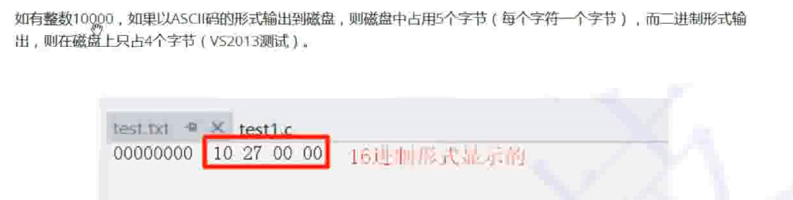
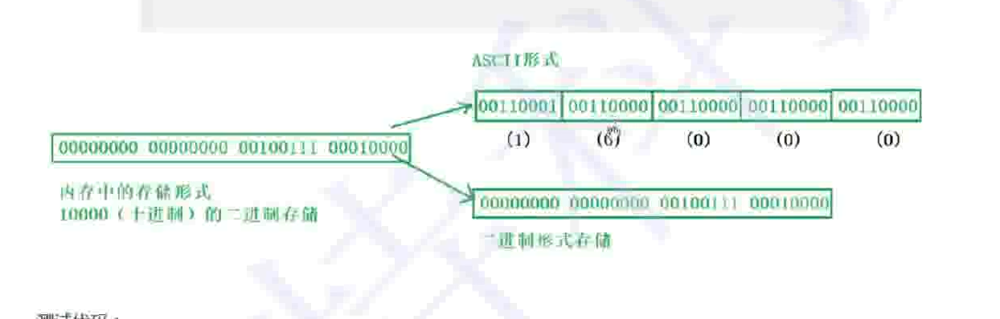
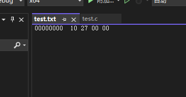
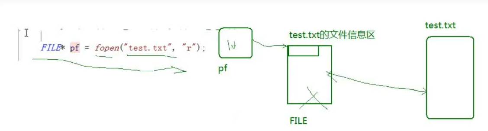
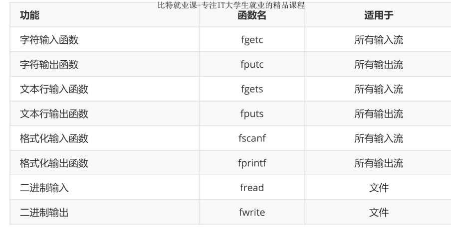
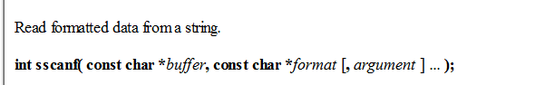

---

# 注释：文件开头使用YAML语法配置文章信息，之后是正常的Markdown语法
# Note: The beginning of the file uses YAML syntax to configure the blog meta data, followed by the normal Markdown syntax.

# 此处如果不配置标题，则提取Markdown中的一级标题，或使用文件名
# Title will be extracted from heading 1 of markdown or using file name if not configured here.
title:  18-文件操作


# 此处如果不配置摘要，则从正文提取开头若干文字
# Abstract will be extracted from the begining of markdown content if not configured here.
abstract: 本节对系统文件进行了讲解，主要内容有：什么是文件，文件名，文件类型，文件缓冲区，文件指针，文件的打开和关闭，文件的顺序读写，文件的随机读写以及文件的判定。

# URL用于固定链接、编辑文章功能，建议所有文章都配置
# URL is used for permalink and article editing, and it is recommended to be configured.
url: C-18


# 文章发布时间，使用的时区和系统设置一致，不设置则使用当前时间
# Article post time, time zone is the same as the system settings. Current time will be used if not configured here.
date: 2023-07-04 20:00:18


# 文章分类
category:
- C


# 文章标签
tags:
- C
- 文件操作

---

# 18-文件操作

本章重点：


# 什么是文件？

磁盘上的文件是文件。

但是在程序设计中，我们一般谈的文件有两种：程序文件、数据文件（从文件功能的角度来分类的）。

## 程序文件

包括源程序文件（后缀为.c）,目标文件（windows环境后缀为.obj）,可执行程序（windows环境后缀为.exe）。

## 数据文件

文件的内容不一定是程序，而是程序运行时读写的数据，比如程序运行需要从中读取数据的文件，或者输出内容的文件。

本章讨论的是数据文件。

在以前各章所处理数据的输入输出都是以终端为对象的，即从终端的键盘输入数据，运行结果显示到显示器上。

其实有时候我们会把信息输出到磁盘上，当需要的时候再从磁盘上把数据读取到内存中使用，这里处理的就是磁盘上文件

# 文件名

一个文件要有一个唯一的文件标识，以便用户识别和引用。

文件名包含3部分：文件路径+文件名主干+文件后缀

例如： c:\code\test.txt

为了方便起见，文件标识常被称为文件名。


# 文件类型

根据数据的组织形式，数据文件被叫做**文本文件**或者**二进制文件**

## 二进制文件

数据在内存中以二进制形式存储，如果不加转换的输出到外存，就是**二进制文件**

## 文本文件

如果要求在外存上以ASCII码的形式存储，则需要在存储前进行转换，以ASCII字符形式存储的文件就是文本文件（能直接看懂）

## 数据的存储

字符一律以ASCII码的形式存储，数值类型数据既可以用ASCII形式存储，也可以使用二进制进行存储






## 示例

```C
#include <stdio.h>

int main()
{
	int a = 10000;
	FILE* pf = fopen("test.txt", "wb");//w：写   b：以二进制的形式来写
	fwrite(&a, 4, 1, pf);//以二进制的形式写入文件中
	//表示数据来自a，
	//写的数据的类型是4个字节的;
	//写一个这种类型的数据;
	//写到pf指针所指的地方
	fclose(pf);
	pf = NULL;
	return 0;
}
```

此时用文本编辑器打开,看见的是乱码

而用vs的二进制编辑器打开，看见的才是10000的16进制代码




# 文件缓冲区

ANSIC标准采用**缓冲文件系统**来处理是护具文件，指的是系统自动在内存中为程序开辟一个**文件缓冲区**


缓冲区又分为输入缓冲区和输出缓冲区

缓冲区的大小根据C编译系统所决定。

# 文件指针

每个被使用的文件都在内存中开辟了一个相应的文件信息区，用来存放文件的相关信息（如文件的名字，文件状态及文件当前的位置等）。这些信息是保存在一个结构体变量中的。该结构体类型是有系统声明的，取名FILE.

## VS中的文件指针 

```C
struct _iobuf {
	char* _ptr;
	int  _cnt;
	char* _base;
	int  _flag;
	int  _file;
	int  _charbuf;
	int  _bufsiz;
	char* _tmpfname;
};
typedef struct _iobuf FILE;
```

不同的C编译器的FILE类型包含的内容不完全相同，但是大同小异。

每当打开一个文件的时候，系统会根据文件的情况自动创建一个FILE结构的变量，并填充其中的信息，使用者不必关心细节。

一般都是通过一个FILE的指针来维护这个FILE结构的变量，这样使用起来更加方便。

创建一个FILE*的指针变量:

```c
FILE* pf;
```

# 文件的打开和关闭

文件在读写之前应该先打开文件，在使用结束之后应该关闭文件；

在编写程序的时候，在打开文件的同时，都会返回一个FILE*的指针变量指向该文件，也相当于建立了指针和文件的关系。

## fopen

```C
//打开文件
FILE * fopen ( const char * filename, const char * mode );
```

```C
int main()
{
	//打开文件test.txt
	// 相对路径
	// . 表示当前路径
	// .. 表示上一级路径
	// ../.. 表示上上级路径
	//fopen("../test1.txt", "r");
	

	//绝对路径
	//fopen("F:\\05-能力提升\\16-C语言提升\\02-代码编写\\29-文件操作\\29-文件操作\\test.txt", "r");

	FILE* pf = fopen("test.txt", "r");

	if (pf == NULL)
	{
		//打开失败
		printf("%s\n", strerror(errno));
		return 0;
	}
	else
	{
		printf("打开成功\n");
	}
	//打开成功
	//读文件
	//关闭文件
	fclose(pf);
	pf = NULL;;

	return 0;
}
```

### 打开模式


### 打开文件时发生的事情

文件指针内部的信息建立与文件的联系

打开失败则返回NULL




## fclose

```C
//关闭文件
int fclose ( FILE * stream );
int _fcloseall( void );
```

返回值：
fclose：如果成功关闭返回0，关闭失败返回EOF（-1）
_fcloseall：返回成功关闭的数量，否则返回EOF(-1)


# 文件的顺序读写

## 读写的函数

1. fgetc fputc ：   操作完之后会自动移到下一位
2. fgets fputs
3. fscanf fprintf
4. fread fwrite




## putc putchar

```C
int putc( int c, FILE *stream );
int putchar( int c );
```
一个可以是任何流，一个是标准流，返回输出的字符

## fputc写入文件

```C
int fputc( int c, FILE *stream );

Each of these functions returns the character written. For fputc and _fputchar, a return value of EOF indicates an error
```

返回值：返回被写入文件的字符


```C
int main()
{
	//打开文件
	FILE* pfwrite = fopen("TEST1.txt", "w");
	if (pfwrite == NULL)
	{
		printf("%s\n", strerror(errno));
		return 0;
	}
	//写文件
	fputc('x', pfwrite);
	fputc('y', pfwrite);
	fputc('z', pfwrite);
	//关闭文件
	fclose(pfwrite);
	pfwrite = NULL;
	return 0;
}
```

## fgetc读取文件

使用格式
```C
int fgetc( FILE *stream );

fgetc and _fgetchar return the character read as an int or return EOF to indicate an error or end of file
```
返回值：返回读到的字符的ASCII值（整型）


```C
int main()
{
	//打开文件
	FILE* pfread = fopen("TEST1.txt", "r");
	if (pfread == NULL)
	{
		printf("%s\n", strerror(errno));
		return 0;
	}
	//读文件
	printf("%c ", fgetc(pfread));
	printf("%c ", fgetc(pfread));
	printf("%c ", fgetc(pfread));
	//关闭文件
	fclose(pfread);
	pfread = NULL;
	return 0;
}
```

## 标准输入输出流

从键盘输入 输出到屏幕

键盘和屏幕都是外部设备

键盘：标准输入设备
屏幕：标准输出设备

这两个都是程序默认打开的两个流设备

三个默认打开的流：

stdin   FLIE*
stdout  FLIE*
stderr  FLIE*


标准输入输出流不用打开
文件流需要打开和关闭

```C
int main()
{
	//标准输入流
	int ch = fgetc(stdin);
	//标准输出流
	fputc(ch, stdout);

	return 0;
}
```

## fgets文本行输入

适用于所有输入流

函数使用格式

```C
char *fgets( char *string, int n, FILE *stream );
```

string：Storage location for data 读出来的数据的存放位置
n: 最大读取数量
stream：从哪里读？
返回值：读取的字符串的起始位置，读取失败则返回空指针；


读取完成之后，函数依旧会自动往后移

```C
int main()
{
	char buf[1024] = { 0 };
	//打开文件
	FILE* pf = fopen("test.txt", "r");
	if (pf == NULL)
	{
		printf("%s\n", strerror(errno));

		return 0;
	}
	//读取文件
	fgets(buf,1024,pf);
	printf("%s",buf);//文件本身有一个换行
	fgets(buf, 1024, pf);
	printf("%s",buf);//

	//关闭文件
	fclose(pf);
	pf = NULL;
    return 0;
}
```

## puts标准字符串输出

将流文件输出到标准输出流中（屏幕上）

```C
int puts( const char *string );

Each of these returns a nonnegative value if successful. If puts fails it returns EOF
```
返回值：成功则返回一个非负的值

```C
int main()
{
	char buf[1024] = { 0 };
	//打开文件
	FILE* pf = fopen("test.txt", "r");
	if (pf == NULL)
	{
		printf("%s\n", strerror(errno));

		return 0;
	}
	//读取文件
	fgets(buf, 1024, pf);
	puts(buf);//将流文件输出到标准输入输出流中 puts会自动增加换行
	fgets(buf, 1024, pf);
	puts(buf);//将流文件输出到标准输入输出流中 puts会自动增加换行

	//关闭文件
	fclose(pf);
	pf = NULL;
	return 0;
}
```

## gets标准输入

```C
char *gets( char *buffer );

Each of these functions returns its argument if successful. A NULL pointer indicates an error or end-of-file condition
```
返回值：字符串指针

```C
int main()
{
	char buf[1024] = { 0 };
	gets(buf);
	puts(buf);

	return 0;
}
```


## fputs文本行输出

Write a string to a stream.

```C
int fputs( const char *string, FILE *stream );

Each of these functions returns a nonnegative value if it is successful. On an error, fputs returns EOF
```

返回值：成功了则是非负，失败了则是EOF


*Return Value:*
*Each of these functions returns a nonnegative value if it is successful. On an error, fputs returns EOF, and fputws returns WEOF.*

*string:Output string*

*stream:Pointer to FILE structure*


### 使用示例

```C
int main()
{
	char buf[1024] = { 0 };
	//打开文件
	FILE* pf = fopen("test.txt", "w");
	if (pf == NULL)
	{
		printf("%s\n", strerror(errno));

		return 0;
	}
	//写文件
	fputs("Hello\n", pf);
	fputs("Word!!", pf);

	//关闭文件
	fclose(pf);
	pf = NULL;
}
```

### 标准输入输出

```C
int main()
{
	char buf[1024] = { 0 };

	fgets(buf, 1024, stdin);
	fputs(buf, stdout);

	return 0;
}
```


## fprintf 格式化输出

### fprintf与printf

fprintf:
```C
int fprintf( FILE *stream, const char *format [, argument ]...);
```
返回值：fprintf returns the number of bytes written

printf:
```C
int printf( const char *format [, argument]... );
```

*Each of these functions returns the number of characters printed, or a negative value if an error occurs.*

两者的区别：前者可以从多种流输出，后者针对标准流

### fprintf的使用

```c
int main()
{
	s s1 = { 3,3.14f,"hello" };
	//打开文件
	FILE* pf = fopen("test.txt", "w");
	if (pf == NULL)
	{
		return 0;
	}
	//写文件
	fprintf(pf, "%d %.2f %-20s", s1.n, s1.f, s1.arr);//格式化输出文件
	printf("%d %.2f %-20s", s1.n, s1.f, s1.arr);//fprintf与printf的区别其实并不大
	//关闭文件
	fclose(pf);
	pf = NULL;
	return 0;
}
```
## fsacanf格式化输入

### fscanf与scanf


```C
int fscanf( FILE *stream, const char *format [, argument ]... );

int scanf( const char *format [,argument]... );
```

**fscanf**:
*Each of these functions returns the number of fields successfully converted and assigned; the return value does not include fields that were read but not assigned. A return value of 0 indicates that no fields were assigned. If an error occurs, or if the end of the file stream is reached before the first conversion, the return value is EOF for fscanf*

**scanf**:
*return the number of fields successfully converted and assigned*

同样，二者区别不大

### fscanf的使用

```C
typedef struct s
{
	int n;
	float f;
	char arr[20];
}s;

int main()
{
	s s = { 0 };
	//打开文件
	FILE* pf = fopen("test.txt", "r");
	if (pf == NULL)
	{
		return 0;
	}
	//读取文件
	fscanf(pf,"%d %f %s",&(s.n),&(s.f),s.arr);
	//scanf("%d %f %s", &(s.n), &(s.f), s.arr);
	printf("%d %.2f %-20s", s.n, s.f, s.arr);
	//关闭文件
	fclose(pf);
	pf = NULL;
	return 0;
}
```

##fscanf与fprintf的标准输入输出

```C
typedef struct s
{
	int n;
	float f;
	char arr[20];
}s;

int main()
{
	s s1 = { 0 };
	fscanf(stdin, "%d %f %s", &(s1.n), &(s1.f), s1.arr);
	fprintf(stdout, "%d %.2f %s", s1.n, s1.f, s1.arr);
	return 0;
}
```

## 函数对比

### scanf与printf

是针对标准输入流/标准输出流的格式化输入/输出语句

### fscanf与fprintf
是针对所有输入流/标准输出流的格式化输入/输出语句

### sscanf与sprintf
sscanf:从字符串中读取格式化的数据
sprintf:将格式化的数据输出为字符串


#### sscanf



```C
int sscanf( const char *buffer, const char *format [, argument ] ... );
```

**返回值：**
*returns the number of fields successfully converted and assigned*

**buffer**
*Stored data*

**format**
*Format-control string*

**argument**
*Optional arguments*


**把buf中数据读取到tmp:**

```C
typedef struct S
{
	int n;
	float f;
	char arr[20];
}ss;

int main()
{
	ss s = { 100,3.14f,"abcdef" };
	ss tmp = { 0 };
	char buf[1024] = { 0 };

	sprintf(buf,"%d %.2f %s", s.n, s.f, s.arr);
	printf("%s\n", buf);
	sscanf(buf,"%d %f %s", &(tmp.n), &(tmp.f), tmp.arr);
	printf("%d %.2f %s", tmp.n, tmp.f, tmp.arr);
	return 0;
}
```

#### sprintf

将格式化的数据转化为字符串，并存入char* buffer中


```c
int sprintf( char *buffer, const char *format [, argument] ... );
```


**返回值：**
*sprintf returns the number of bytes stored in buffer, not counting the terminating null character*

打印出来的数据其实是一个字符串

# fread和fwrite

以二进制的形式进行信息的读写

```C
size_t fread( void *buffer, size_t size, size_t count, FILE *stream );
```
**返回值：**
*fread returns the number of full items actually read, which may be less than count if an error occurs or if the end of the file is encountered before reaching count，Use the feof or ferror function to distinguish a read error from an end-of-file condition. If size or count is 0, fread returns 0 and the buffer contents are unchanged.*


```C
size_t fwrite( const void *buffer, size_t size, size_t count, FILE *stream );
```
**返回值：**
*fwrite returns the number of full items actually written, which may be less than count if an error occurs. Also, if an error occurs, the file-position indicator cannot be determined.*

## fread

```C
typedef struct S
{
	char namr[20];
	int age;
	double score;
}S;

int main()
{
	S tmp = { 0 };

	//打开文件
	FILE* pf = fopen("test.txt", "rb");
	if (pf == NULL)
	{
		return 0;
	}
	//二进制形式写文件
	fread(&tmp, sizeof(S), 1, pf);

	//关闭文件
	fclose(pf);
	pf = NULL;
	return 0;
}
```


## fwrite

```C
typedef struct S
{
	char namr[20];
	int age;
	double score;
}S;

int main()
{
	S s = { "xyz",18,100.0 };

	//打开文件
	FILE* pf = fopen("test.txt", "wb");
	if (pf == NULL)
	{
		return 0;
	}
	//二进制形式写文件
	fwrite(&s, sizeof(S), 1, pf);
	
	//关闭文件
	fclose(pf);
	pf = NULL;
	return 0;
}
```

# 通讯录-文件版

MySQL

文件：
1. 不安全
2. 数据量大了之后，很低效

学习一下C语言操作MySQL

# 文件的随机读写

## fseek

根据文件指针的位置和偏移量来定位文件指针。

```C
int fseek ( FILE * stream, long int offset, int origin );
```

**作用**：
*Moves the file pointer to a specified location.*
以origin为起点，将文件指针调整到偏移量为offset出的位置

偏移量：
SEEK_CUR：Current position of file pointer

SEEK_END：End of file

SEEK_SET：Beginning of file

```C
int main()
{
	//打开文件
	FILE* pf = fopen("test.txt", "r");
	if (pf == NULL)
	{
		printf("%s\n", strerror(errno));
		return 0;
	}
	//定位文件指针
	fseek(pf, 2, SEEK_CUR);//偏移到C
	//读取文件
	char ch = fgetc(pf);
	putc(ch,stdout);

	//定位文件指针
	fseek(pf, 2, SEEK_CUR);//偏移到F
	//读取文件
	ch = fgetc(pf);//读完F之后，自动偏移到G
	putc(ch, stdout);

	//定位文件指针
	fseek(pf, -2, SEEK_CUR);//偏移-2，偏移到E
	//读取文件
	ch = fgetc(pf);
	putc(ch, stdout);

	//关闭文件
	fclose(pf);
	return 0;
}
```

## ftell

```C
long ftell( FILE *stream );
```
返回文件指针相对于起始指针的偏移量
**返回值：**
*ftell returns the current file position.*
```C
int main()
{
	//打开文件
	FILE* pf = fopen("test.txt", "r");
	if (pf == NULL)
	{
		printf("%s\n", strerror(errno));
		return 0;
	}
	//定位文件指针
	fseek(pf, 2, SEEK_CUR);//偏移到C
	//读取文件
	char ch = fgetc(pf);
	putc(ch,stdout);

	//定位文件指针
	fseek(pf, 2, SEEK_CUR);//偏移到F
	//读取文件
	ch = fgetc(pf);//读完F之后，自动偏移到G
	putc(ch, stdout);

	//定位文件指针
	fseek(pf, -2, SEEK_CUR);//偏移-2，偏移到E
	//读取文件
	ch = fgetc(pf);//读取完成之后自动偏移到F（F的偏移量是5）
	putc(ch, stdout);

	printf("\n%ld\n", ftell(pf));

	//关闭文件
	fclose(pf);
	return 0;
}
```

## rewind
让文件指针的位置回到文件的起始位置

```C
void rewind( FILE *stream );
```

```C
int main()
{
	//打开文件
	FILE* pf = fopen("test.txt", "r");
	if (pf == NULL)
	{
		printf("%s\n", strerror(errno));
		return 0;
	}
	printf("%ld\n", ftell(pf));
	//定位文件指针
	fseek(pf, 2, SEEK_CUR);//偏移到C
	//读取文件
	char ch = fgetc(pf);
	putc(ch,stdout);

	//定位文件指针
	fseek(pf, 2, SEEK_CUR);//偏移到F
	//读取文件
	ch = fgetc(pf);//读完F之后，自动偏移到G
	putc(ch, stdout);

	//定位文件指针
	fseek(pf, -2, SEEK_CUR);//偏移-2，偏移到E
	//读取文件
	ch = fgetc(pf);//读取完成之后自动偏移到F（F的偏移量是5）
	putc(ch, stdout);

	printf("\n%ld\n", ftell(pf));

	rewind(pf);//定位到文件开头

	printf("%ld\n", ftell(pf));
	//读取文件
	ch = fgetc(pf);//读取完成之后自动偏移到F（F的偏移量是5）
	putc(ch, stdout);

	//关闭文件
	fclose(pf);
	return 0;
}
```


# 文件结束的判定

## 被错误使用的feof

在文件读取过程中，不能用feof函数的返回值直接用来判断文件的是否结束。

**而是应用于当文件读取结束的时候，判断是读取失败结束，还是遇到文件尾结束。**

1. 文本文件读取是否结束，判断返回值是否为EOF（fgetc），或者NULL（fgets ）
例如：
 - fgetc 判断是否为 EOF .
 - fgets 判断返回值是否为 NULL .
2. 二进制文件的读取结束判断，判断返回值是否小于实际要读的个数。
- fread判断返回值是否小于实际要读的个数。


```C
int feof( FILE *stream );
```
**Return Value**
*The feof function returns a nonzero value after the first read peration that attempts to read past the end of the file. It returns 0 if the current position is not end of file. There is no error return.*
如果文件结束了，则返回-1；（EOF）
如果返回的是0，说明文件读取发生了错误

使用示例：

```C
int main()
{
	//EOF
	//feof();//end of file:文件结束标志
	//其值是-1

	FILE* pf = fopen("test2.txt", "r");
	if (!pf)
	{
		perror("fopen:");//一种新的报错方式
		return 0;
	}

	int ch = fgetc(pf);

	printf("%d", ch);//如果输出-1，则代表文件结束了

	fclose(pf);
	pf = NULL;

	return 0;
}
```


# ferror
Tests for an error on a stream.

```C
int ferror( FILE *stream );
```
返回值：*If no error has occurred on stream, ferror returns 0. Otherwise, it returns a nonzero value.*


# perror

perror, _wperror
Print an error message.
```C
void perror( const char *string );
```


