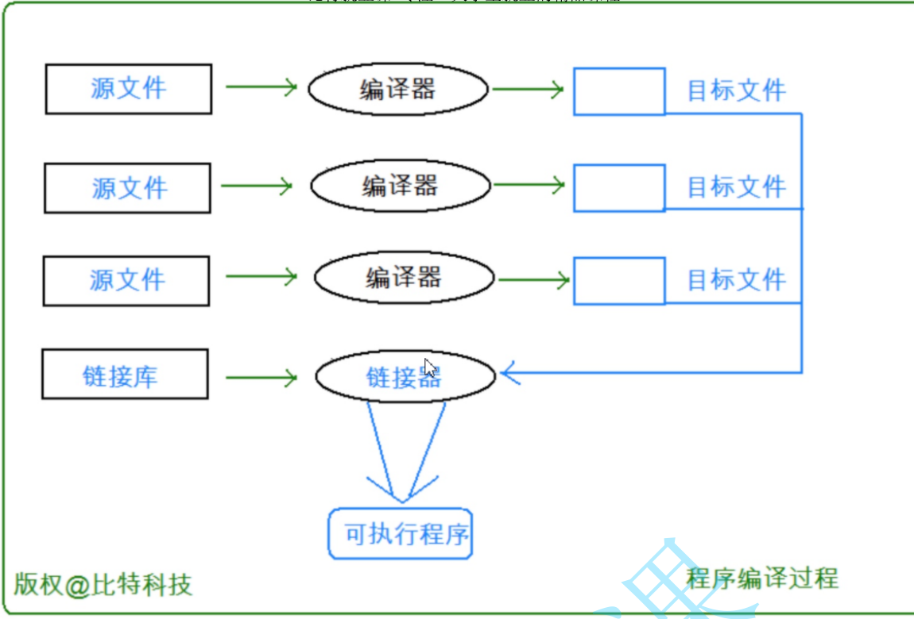
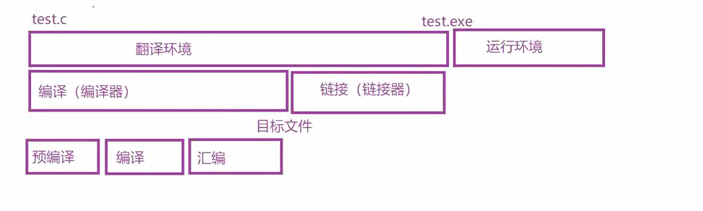
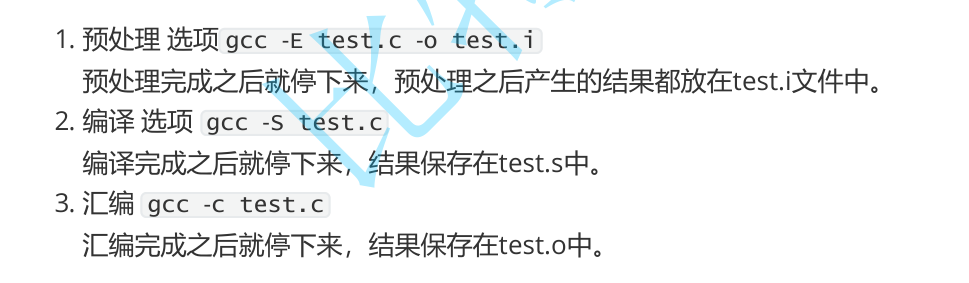
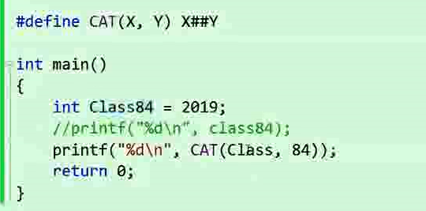
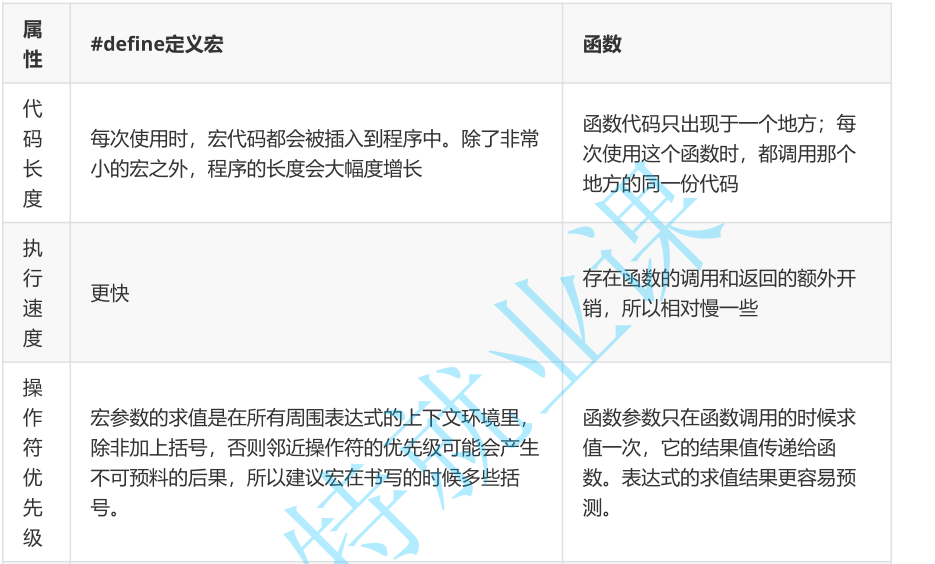
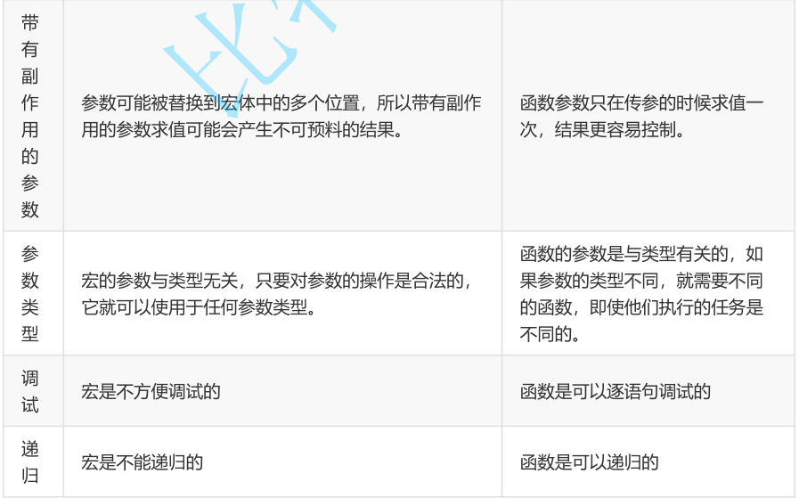

# 19-程序环境与预处理


源文件（源程序）：test.c
经过一系列的过程之后，编程test.exe
这个过程包括：编译和链接

然后exe才能进行运行

# 程序的翻译环境和执行环境

在ANSI C的任何一种实现中，存在两个不同的环境。

第1种是**翻译环境**，在这个环境中源代码被转换为可执行的机器指令，转换为.exe文件，转换为二进制信息。（先生成obj，在生成exe）

第2种是**执行环境**，它用于实际执行代码，也叫运行环境

```C
#include <stdio.h>

int main()
{
	int arr[10] = { 0 };
	int i = 0;
	for (i = 0; i < 10; i++)
	{
		arr[i] = i;
	}
	for (i = 0; i < 10; i++)
	{
		printf("%d ", arr[i]);
	}

	return 0;
}
```

这个简单的程序在控制台运行的时候，就已经经过了编译和链接两个过程，并在相应的路径下面生成了.obj文件和.exe文件

# 详解编译+链接

## 翻译环境



- 组成一个程序的每个源文件通过编译过程（依赖**编译器**）分别转换成目标代码（object code）。
- 每个目标文件由**链接器**（linker）捆绑在一起，形成一个单一而完整的可执行程序。
- 链接器同时也会引入标准C函数库中任何被该程序所用到的函数，而且它可以搜索程序员个人的程序库，将其需要的函数也链接到程序中。

每一个程序文件都会分别生成obj

然后由链接器形成可执行程序（会引入链接库）





## 编译本身也分为几个过程

讲解：Linux环境下讲解，用gcc能看见每一步的过程



### 预编译
预编译进行的是文本操作：
1. 包含头文件，处理#include指令
2. 注释删除（使用空格来替换注释）
3. #define的替换

生成.i文件
### 编译

把C代码翻译成汇编代码（由编译器完成）：
1. 语法分析
2. 词法分析
3. 语义分析
4. 符号汇总：函数名，全局变量

推荐阅读：《程序员的自我修养》

生成.s文件

### 汇编

形成**符号表**

将汇编代码转换成二进制指令


生成.o文件

## 链接

最终：生成可执行程序

### 工作内容
.o文件的格式：elf，分成很多段，每个.o文件都是一样的格式，只是内容不一样

#### 合并段表

#### 符号表的合并和重定位


# 运行环境

1. 程序必须载入内存中。在有操作系统的环境中：一般这个由操作系统完成。在独立的环境中，程序
的载入必须由手工安排，也可能是通过可执行代码置入只读内存来完成。
2. 程序的执行便开始。接着便调用main函数。
3. 开始执行程序代码。这个时候程序将使用一个运行时堆栈（stack），存储函数的局部变量和返回
地址。程序同时也可以使用静态（static）内存，存储于静态内存中的变量在程序的整个执行过程
一直保留他们的值。
4. 终止程序。正常终止main函数；也有可能是意外终止。

推荐：《程序员的自我修养》


# 预处理详解

## 预定义符号

```C
__FILE__    //进行编译的源文件
__LINE__   //文件当前的行号
__DATE__   //文件被编译的日期
__TIME__   //文件被编译的时间
__STDC__   //如果编译器遵循ANSI C，其值为1，否则未定义
__FUNCTION__//打印程序当前所处的函数
```

这些预定义符号都是语言内置的。

```C
int main()
{
	int i = 0;
	int arr[10] = { 0 };
	FILE* pf = fopen("log.txt", "w");
	if (pf == NULL)
	{
		perror("fopen:");
		return 0;
	}
	for (i = 0; i < 10; i++)
	{
		arr[i] = i;
		fprintf(pf,"file:%s line:%d date:%s time:%s i=%d\n", 
			__FILE__, __LINE__, __DATE__, __TIME__, i);
	}
	fclose(pf);
	pf = NULL;
	for (i = 0; i < 10; i++)
	{
		printf("%d ", arr[i]);
	}
    printf("%s\n", __FUNCTION__);
	return 0;
}
```
## 预处理指令

#define
#include
#pragma pack(4)
#pragma
#if
#endif
#ifdef
#line

## #defien
### #define 定义标识符

```C
#define MAX 1000
#define reg register      //为 register这个关键字，创建一个简短的名字
#define do_forever for(;;)   //用更形象的符号来替换一种实现
#define CASE break;case     //在写case语句的时候自动把 break写上。
// 如果定义的 stuff过长，可以分成几行写，除了最后一行外，每行的后面都加一个反斜杠(续行符)。
#define DEBUG_PRINT printf("file:%s\tline:%d\t \
             date:%s\ttime:%s\n" ,\
             __FILE__,__LINE__ ,    \
             __DATE__,__TIME__ ) 
```

### #define 定义宏

允许将参数定义到#define中

例如：

```C
#define add(x,y) ((x)+(y))
```

### #define 替换规则

1. 在调用宏时，首先对参数进行检查，看看是否包含任何由#define定义的符号。如果是，它们首先
被替换。
2. 替换文本随后被插入到程序中原来文本的位置。对于宏，参数名被他们的值替换。
3. 最后，再次对结果文件进行扫描，看看它是否包含任何由#define定义的符号。如果是，就重复上
述处理过程。


1. 宏参数和#define 定义中可以出现其他#define定义的变量。但是对于宏，不能出现递归。
2. 当预处理器搜索#define定义的符号的时候，字符串常量的内容并不被搜索。

### #和##

约定：宏定义都写成大写

如何把参数插入字符串中？？？

```C
char* p = "hello ""bit\n";
printf("hello"," bit\n");
printf("%s", p);
```
可得：字符串有自动连接的特性

#### #号的作用

使用 # ，把一个宏参数变成对应的字符串。

```C
int i = 10;
#define PRINT(FORMAT, VALUE)\
printf("the value of " #VALUE "is "FORMAT "\n", VALUE);
...
PRINT("%d", i+3);//产生了什么效果？
```

输出结果：
```C
the value of i+3 is 13
```

#### ##号

##可以把位于它两边的符号合成一个符号。
它允许宏定义从分离的文本片段创建标识符。

```C
#define ADD_TO_SUM(num, value) \
sum##num += value;
...
ADD_TO_SUM(5, 10);//作用是：给sum5增加10.
```


### 带副作用的宏参数

副作用就是表达式求值的时候出现的永久性效果。

```C
#define MAX(a, b) ( (a) > (b) ? (a) : (b) )
...
x = 5;
y = 8;
z = MAX(x++, y++);
printf("x=%d y=%d z=%d\n", x, y, z);//输出的结果是什么？
```

预处理结果：
```C
z = ( (x++) > (y++) ? (x++) : (y++));
```

输出结果：

```C
x=6 y=10 z=9
```

### 宏和函数

宏的优点：
1. 用于调用函数和从函数返回的代码可能比实际执行这个小型计算工作所需要的时间更多。所以宏比函数在程序的规模和速度方面更胜一筹。
2. 更为重要的是函数的参数必须声明为特定的类型。所以函数只能在类型合适的表达式上使用。反之这个宏怎可以适用于整形、长整型、浮点型等可以用于>来比较的类型。宏是类型无关的。

宏的缺点：
1. 每次使用宏的时候，一份宏定义的代码将插入到程序中。除非宏比较短，否则可能大幅度增加程序的长度。
2. 宏是没法调试的。
3. 宏由于类型无关，也就不够严谨。
4. 宏可能会带来运算符优先级的问题，导致程容易出现错。

函数的优点：带副作用的参数对函数没有影响


宏有时候可以做函数做不到的事情。比如：宏的参数可以出现类型，但是函数做不到：

```C
#define MALLOC(num, type)\
(type *)malloc(num * sizeof(type))
...
//使用
MALLOC(10, int);//类型作为参数
//预处理器替换之后：
(int *)malloc(10 * sizeof(int));
```





#### 命名约定

命名约定
一般来讲函数的宏的使用语法很相似。所以语言本身没法帮我们区分二者。
那我们平时的一个习惯是：
    把宏名全部大写
    函数名不要全部大写

C++, C99 inline-内联函数

## #undef 用于移除宏定义


```C
#undef NAME
//如果现存的一个名字需要被重新定义，那么它的旧名字首先要被移除。
```

## 命令行定义

许多C 的编译器提供了一种能力，允许在命令行中定义符号。用于启动编译过程。
例如：当我们根据同一个源文件要编译出不同的一个程序的不同版本的时候，这个特性有点用处。（假定某个程序中声明了一个某个长度的数组，如果机器内存有限，我们需要一个很小的数组，但是另外一个机器内存大写，我们需要一个数组能够大写。）

程序：
```C
#include <stdio.h>
int main()
{
  int array [ARRAY_SIZE];
  int i = 0;
  for(i = 0; i< ARRAY_SIZE; i ++)
 {
    array[i] = i;
 }
  for(i = 0; i< ARRAY_SIZE; i ++)
 {
    printf("%d " ,array[i]);
 }
  printf("\n" );
  return 0;
}
```

编译指令：

```C
gcc -D ARRAY_SIZE=10 programe.c
```

## 条件编译


在编译一个程序的时候我们如果要将一条语句（一组语句）编译或者放弃是很方便的。因为我们有条件编译指令。

调试性的代码，删除可惜，保留又碍事，所以我们可以选择性的编译。

```C
#include <stdio.h>
#define __DEBUG__
int main()
{
int i = 0;
int arr[10] = {0};
for(i=0; i<10; i++)
{
arr[i] = i;
#ifdef __DEBUG__
printf("%d\n", arr[i]);//为了观察数组是否赋值成功。
#endif //__DEBUG__
}
return 0;
}
```


### 常见条件编译

```C

1.
#if 常量表达式
//...
#endif

//常量表达式由预处理器求值。
如：
#define __DEBUG__ 1
#if __DEBUG__
//..
#endif

2.多个分支的条件编译
#if 常量表达式
//...
#elif 常量表达式
//...
#else
//...
#endif

3.判断是否被定义
#if defined(symbol)
#ifdef symbol
#if !defined(symbol)
#ifndef symbol

4.嵌套指令
#if defined(OS_UNIX)
#ifdef OPTION1
unix_version_option1();
#endif
#ifdef OPTION2
unix_version_option2();
#endif
#elif defined(OS_MSDOS)
#ifdef OPTION2
msdos_version_option2();
#endif
#endif
```


## 文件包含

### 包含方式

#### 本地包含

```C
#include "filename"
```

查找策略：先在源文件所在目录下查找，如果该头文件未找到，编译器就像查找库函数头文件一样在标准位置查找头文件。
如果找不到就提示编译错误。

```C
/usr/include//Linux位置
C:\Program Files (x86)\Microsoft Visual Studio 12.0\VC\include//vs位置
```

#### 库文件包含

```C
#include <filename.h>
``` 

查找头文件直接去标准路径下去查找，如果找不到就提示编译错误。

### 嵌套包含

```C
#ifndef __TEST_H__
#define __TEST_H__
//头文件的内容
#endif  //__TEST_H__
```

或者

```C
#pragma once
```

推荐：
推荐《高质量C/C++编程指南》中附录的考试试卷（很重要）。


# 其它预处理指令

#error
#pragma
#line

参考《C语言深度解剖》


```C
// --run-- 

#include <stdio.h>

int main()
{
    printf("Hello World!!!\r\n");
    return 0;
}
```


