# 04-数组
本章重点

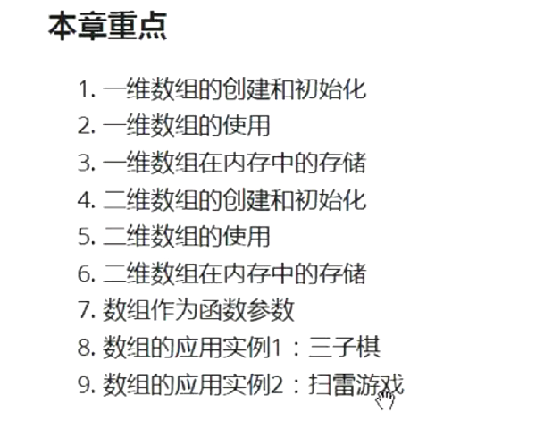

# 一维数组的创建与初始化

数组是指一组相同类型的元素的集合

## 数组的创建方式：

```C
tpyt_t arr_name [const_n]
```

tpyt_t:数组类型
arr_name:数组名字
const_n:是一个常量表达式，用来指定数组的大小，使用变量的时候会报错

## 初始化

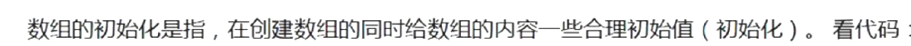

不完全初始化：其他元素默认初始化为0

初始化的方法：

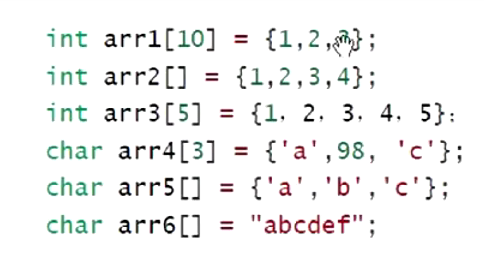

一下两个数组一个大小为4bytes，一个为3bytes

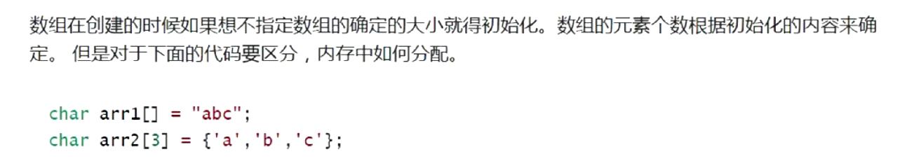


```C
int main()
{
	char arr[] = "abcdefg";
	printf("%lld\n", sizeof(arr));//计算数组的大小，包括'\0'
	printf("%lld\n", strlen(arr));//计算字符串的大小，不包括'\0'
	return 0;
}
```

- strlen和sizeof没有关联
- strlen是求字符串长度的——只能针对字符串——是库函数——需要引用头文件
- sizeof是计算变量，数组，类型的大小的——单位是字节——操作符，不需要引用头文件

```C
int main()
{
	char arr1[] = "abc";
	char arr2[] = {'a','b','c'};
	printf("%lld\n", sizeof(arr1));//4
	printf("%lld\n", sizeof(arr2));//3
	printf("%lld\n", strlen(arr1));//3
	printf("%lld\n", strlen(arr2));//随机数
}
```

# 一维数组的访问

使用数组访问操作符：[]

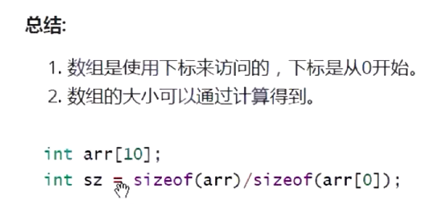

# 一维数组在内存中的存储

一维数组在内存中是连续存放的

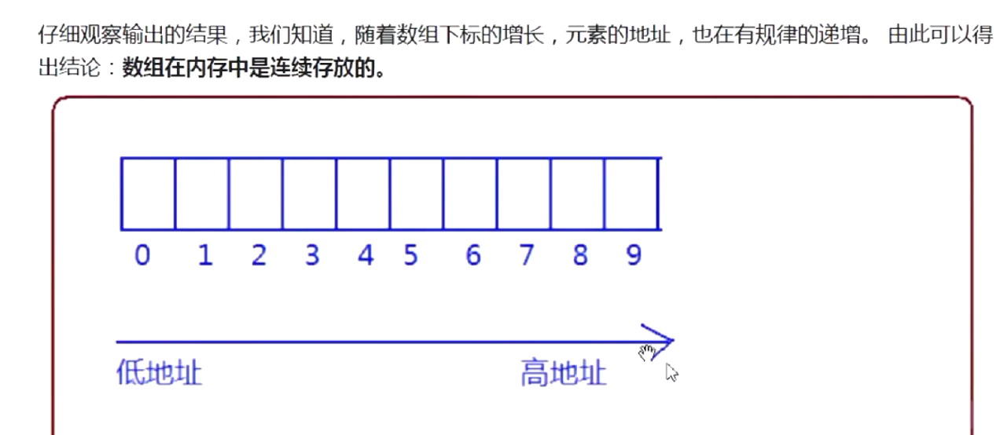


# 二维数组的创建和初始化

## 创建

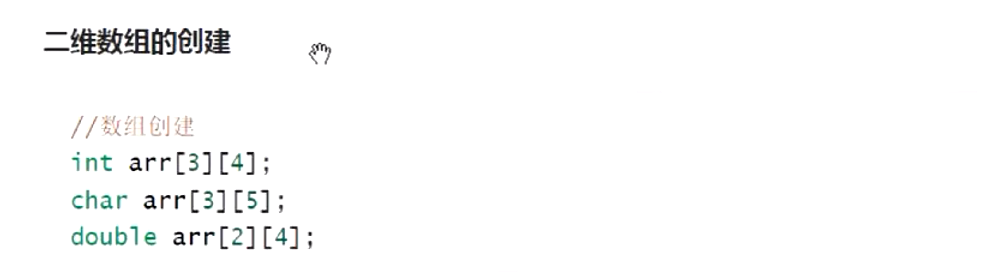

int arr[3][4]；表示一个三行四列的二维数组

二维数组在创建的时候只能省略行，不能省略列

## 初始化

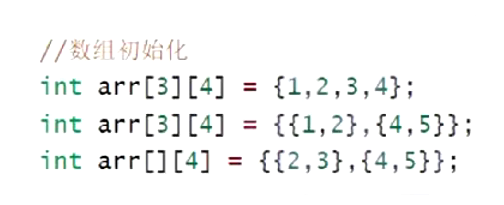

二维数组在创建的时候只能省略行，不能省略列

```C
int main()
{
	int arr1[3][4] = { {1,2,3,4},{1,2,3},1 };
	int arr2[3][4] = { 1,2,3,4,5,6 };
	return 0;
}
```

# 二维数组的使用

也是通过下标来访问，同样的，下标是从0开始的

# 二维数组在内存的存贮

二维数组在内存中也是连续存储的

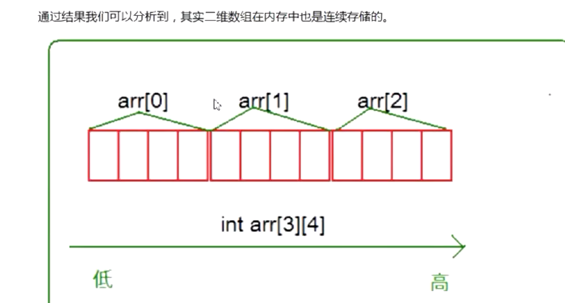


# 数组作为函数参数

加入arr是数组,那么我们对数组arr进行传参的时候，传递的其实是数组首元素的地址，相当于“&arr[0]”，

## 冒泡排序

冒泡排序的思想

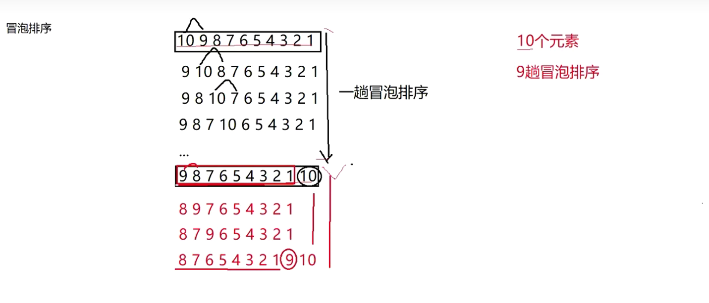

N个元素的数组进行冒泡排序需要有N-1趟冒泡排序

算法复杂度：（N-1)!

冒泡排序的实际算法：

```C
void bubble_sort(int arr[], int sz)
{
	for (int i = 0; i < sz - 1; i++)//冒泡排序的趟数
	{
		int flag = 1;
		for (int j = 0; j < sz - i - 1; j++)//实际比较排序
		{
			int tmp = 0;
			if (arr[j] < arr[j + 1])//大于还是小于决定了这里是升序还是降序排列
			{
				tmp = arr[j];
				arr[j] = arr[j + 1];
				arr[j + 1] = tmp;
				flag = 0;
			}
			if (flag == 1) 
			{
				break;//数组已经是有序的了，提前跳出排序循环
			}
		}
	}
}

int main()
{
	int arr[10] = { 4,5,6,3,2,8,1,9,7,10 };
	int sz = sizeof(arr) / sizeof(int);

	bubble_sort(arr, sz);
	for (int i = 0; i < sz; i++)
	{
		printf("%d ", arr[i]);
	}
	return 0;
}
```
```C
void bubble_sort(int arr[], int sz)
```
以上这个语句，也可以写成是：
```C
void bubble_sort(int\* arr, int sz)
```
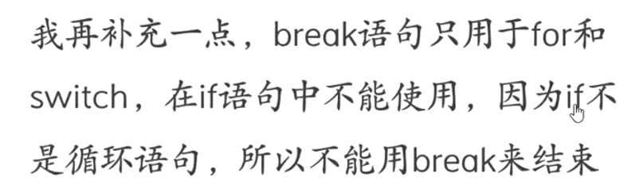

# 数组名是什么？

数组名其实就是数组的首元素的地址（但是有两个例外）
例外：
1. sizeof(数组名):此处数组名表示的是整个数组
2. &数组名：此处取出的是整个数组的地址，与&数组名[n]有所不同。

```C
int main()
{
	int arr[] = { 1,2,3,4,5,6,7 };
	printf("%p\n", arr);
	printf("%p\n", &arr[0]);
  printf("%d\n", *arr);
  printf("%p\n", &arr+1);
	return 0;
}
```

以上代码输出的前两个值是一样的

而第三个解引用，输出的则是arr数组的第一个值

第四个+1则是增加了整个数组的大小


