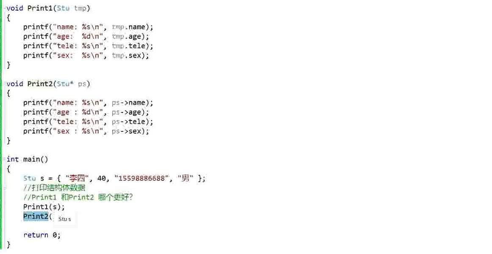
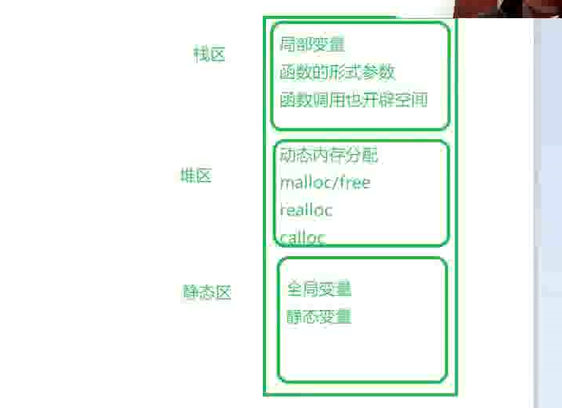

# 08-初始结构体


# 结构体的声明

## 结构的基础知识

结构是一些值的集合，这些值叫做成员变量。结构的每个成员可以是不同类型的变量

## 结构的声明

结构声明的例子

```C
struct tag
{
	member_list;
}variable_list;
```

实例：

```C
struct Stu
{
	//成员变量
	char name[20];
	int age;
	char tele[12];
	char sex[5];
}s1,s2,s3;//这三个是全局的结构体变量


int main()
{
	struct Stu s;//结构体关键字 结构体标签 结构体变量名

	return 0;
		
}
```

利用typedef关键字可以简化结构体的定义过程
```C
typedef struct Stu
{
	//成员变量
	char name[20];
	int age;
	char tele[12];
	char sex[5];
}STU;

int main()
{
	STU s1 = {"panxfeng",12,"20212230","male"};
	s1.age = 12 ;
	printf("%s\n", s1.name);
	return 0;
}
```


## 结构体成员的类型

可以是指针，数组，标量，甚至是其他的结构体

# 结构体变量的定义和初始化

```C
struct Point
{
	int x;
	int y;
}p1;//声明类型的同时定义变量p1

struct Point p2;//定义结构体变量p2

struct Point p3 = { 1,2 };//定义变量的同时进行初始化赋值

```


结构体内字符数组成员变量需要用strcpy才能进行赋值

结构体可以嵌套定义

# 结构体的访问

有三种访问方式：
1. 直接用符号\.来访问
2. 定义一个指向结构体的指针，用指针解引用来访问
3. 利用符号：“->”来访问
例子：

```C
#define _CRT_SECURE_NO_WARNINGS

#include <stdio.h>

struct Book
{
	char name[40];
	float price;
};

int main()
{
	struct Book b1 = { "C语言程序设计",12.99 };
	struct Book* pb = &b1;//结构体指针
	printf("-------------------------\n");
	printf("利用结构体打印和修改信息\n");
	printf("书名：%s\n", b1.name);
	printf("价格：%.2f\n", b1.price);
	printf("八五折后的价格为：%.2f\n", b1.price * 0.85);
 
	printf("-------------------------\n");
	printf("利用指针打印和修改信息\n");
	printf("书名：%s\n", (*pb).name);
	printf("价格：%.2f\n", (*pb).price);
	printf("八五折后的价格为：%.2f\n", (*pb).price * 0.85);
 
	printf("-------------------------\n");
	printf("利用指针->打印和修改信息\n");
	printf("书名：%s\n", pb->name);
	printf("价格：%.2f\n", pb->price);
	printf("八五折后的价格为：%.2f\n", pb->price * 0.85);
	return 0;
}
```

结构体也可以传值与传址，传址需要取地址，函数的传入参数为指针参数，不用额外开辟空间，程序更优 

例子：



以上例子中，print2函数更优


## 压栈

内存区域：




栈区：
先进后出，后进先出

插入一个元素：压栈
删除一个元素：出栈


关键字：函数栈帧的创建和销毁


## 数据结构

线性数据结构：

1，顺序表
2. 链表
3. 栈
4. 队列

树形数据结构
1，二叉树

图：


