# 10-指针详解

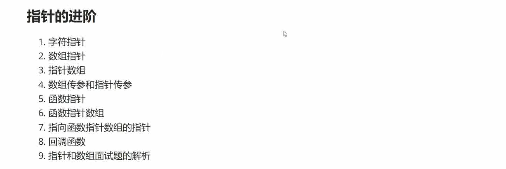

指针：

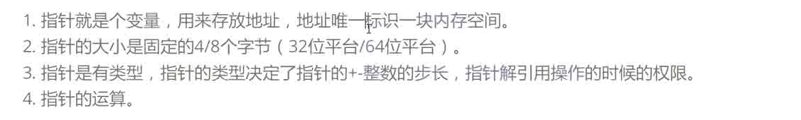

# 字符指针

字符指针的写法：
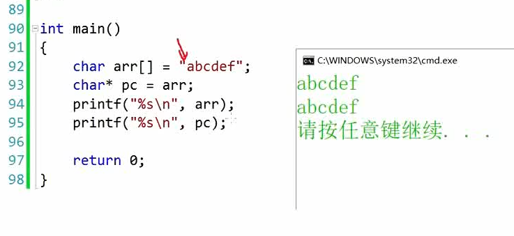

字符指针的另外一种写法：

```C
int main()
{
	char* p = "abcdef";
	//这是一个常量字符串
	//p存储的是字符串的首地址
	printf("%c\n", *p);
	printf("%s\n", p);

	return 0;
}
```

但是以下程序是有问题的：

```C
int main()
{
	char* p = "abcdef";
	*p = 'W';
	//这是一个常量字符串
	//p存储的是字符串的首地址
	printf("%c\n", *p);
	printf("%s\n", p);

	return 0;
}
```


会出现段错误（内存访问错误）

因为"abcdef"是一个常量字符串，常量字符串是不允许修改的。

为了增加代码的鲁棒性，应该加上const修饰符

```C
int main()
{
	const char* p = "abcdef";
	*p = 'W';
	//这是一个常量字符串
	//p存储的是字符串的首地址
	printf("%c\n", *p);
	printf("%s\n", p);

	return 0;
}
```

这一段代码是会报错的。

例题：

```C
int main()
{
	char arr1[] = "abcdef";
	char arr2[] = "abcdef";

	char* p1 = "abcdef";
	char* p2 = "abcdef";

	if (arr1 == arr2)
	{
		printf("1");
	}
	else
		printf("2");

	return 0;
}
```

这一段输出的会是2，因为数组名存储的是数组的首元素地址。

而下一段代码输出的则是1,因为p1,p2都是常量字符串，是不能修改的，因此为了节约内存空间，两个常量字符串如果相等，则只会存储一份，因此两个指针的地址是相等的。

为了提高鲁棒性，应该在前面添加修饰符：const


```C
int main()
{
	char arr1[] = "abcdef";
	char arr2[] = "abcdef";

	char* p1 = "abcdef";
	char* p2 = "abcdef";

	if (p1==p2)
	{
		printf("1");
	}
	else
		printf("2");

	return 0;
}
```


# 数组指针

指针数组是数组，是用来存放指针的
数组指针是指针，是用来指向数组的

## 指针数组

```C
int main()
{
	int arr[10] = { 0 };//整型数组
	char ch[5] = { 0 };//字符数组
	int* parr[10] = { NULL };//是用来存放int指针的数组-指针数组
	char* pch[5] = { NULL };//是用来存放char指针的数组-指针数组
}
```

```C
int main()
{
	int a = 0, b = 0, c = 0, d = 0;
	int* arr [4] = {&a,&b,&c,&d};

	return 0;
}
```
可以调试从查看arr内的内容

## 数组指针

parr里面的每一个元素都是数组指针。

```C
int main()
{
	int arr1[] = { 1,2,3,4,5 };
	int arr2[] = { 2,3,4,5,6 };
	int arr3[] = { 3,4,5,6,7 };
	int* parr[] = { arr1,arr2,arr3 };

	int i = 0;
	for (i = 0; i < 3; i++)
	{
		int j = 0;
		for (j = 0; j < 5; j++)
		{
			printf("%d ", *(parr[i] + j));
		}
		printf("\n");
	}
	return 0;
}
```

下面代码是定义一个数组指针并赋值：
```C
int main()
{
	int* p = NULL;//整型指针，存放的值指向的地址里面存放的是一个整型量
	char* ch = NULL;//字符指针，存放的值指向的地址里面存放的是一个字符量

	//int arr[10] = { 0 };
	//arr:数组的首地址
	//&arr[0]：数组的首地址
	//&arr:数组的地址

	int arr[10] = { 1,2,3,4,5,6,7,8,9,10 };//这是一个存放整型量的数组
	int(*p)[10] = &arr;
	//这是一个数组，数组内存放的时int型指针，指针的值是arr数组的地址
	return 0;
}
```

下面的第二串代码定义了一个指向字符指针的数组指针
一层一层的解析：
指针
数组指针
指向字符指针的数组指针

```C
int main()
{
	char arr1[5] = { 0 };
	char(*pch1)[5] = &arr1;

	char* arr2[5] = { NULL };
	char* (*parr2)[5] = &arr2;

	return 0;
}
```

各参数含义解析图：

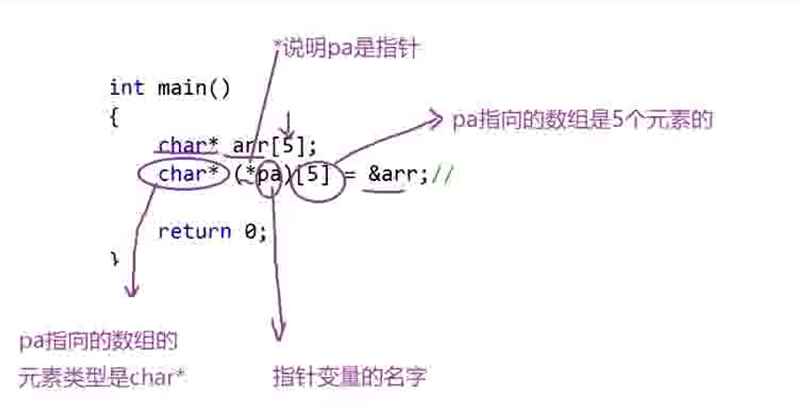

## 数组指针的使用

### 不适用数组指针的时候：
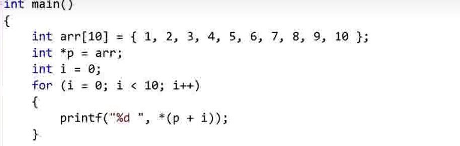


### 使用方法一：
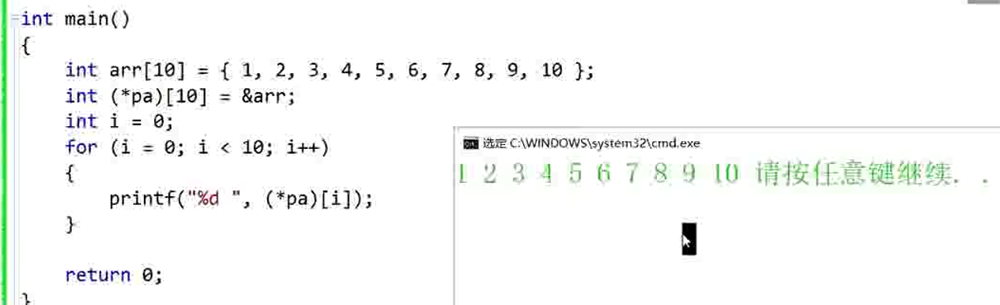

### 使用方法二：

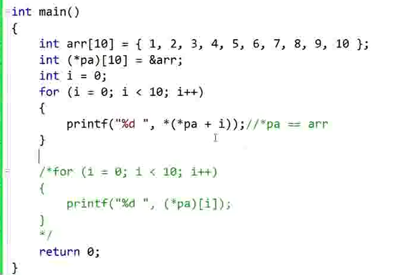

### 数组指针的实际使用场景

数组指针一般在二维及以上数组才有实际的使用价值

数组指针的使用：

要求：打印一个二维数组的每一个值：


而一般的打印方法：

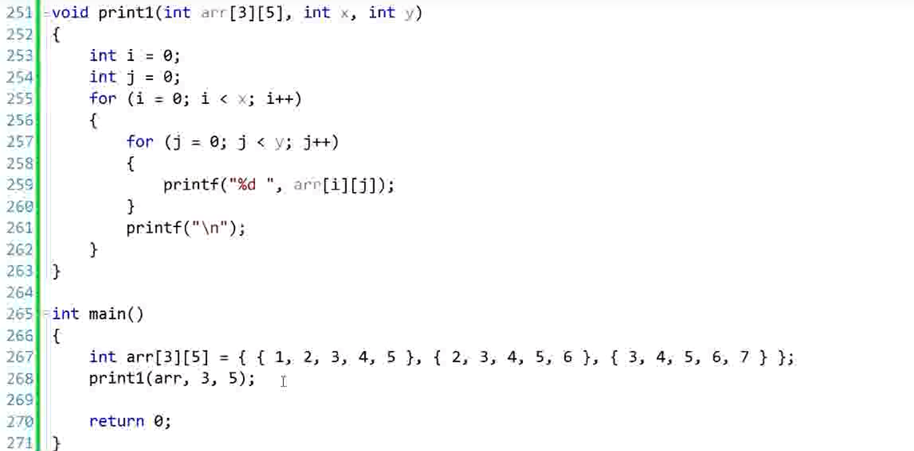

用到数组指针的方法：

数组名就是首元素地址

二维数组：

二维数组的首元素地址是第一行的地址
（先把二维数组想象成一维数组，第一个元素是第一行，第二个元素是第二行，第三个元素是第三行。。。。）


```C
//参数是指针的形式
void printarr(int(*pa)[5], int x,int  y)
{
	int i = 0;
	int j = 0;
	for (i = 0; i < x; i++)
	{
		for (j = 0; j < y; j++)
		{
			printf("%d ", *(*(pa+i)+j));
		}
		printf("\n");
	}
}

int main()
{
	int arr[3][5] = { {1,2,3,4,5}, {2,3,4,5,6}, {3,4,5,6,7} };
	printarr(arr, 3, 5);
    //传入的数组名就是数组首元素的地址，二维数组的首地址是第一行元素的第一个元素的地址，对第一行的地址+1得到的是第二行的第一个元素的地址
	return 0;
}
```

也可以写成如下形式：
```C
void printarr(int(*pa)[5], int x, int  y)
{
	int i = 0;
	int j = 0;
	for (i = 0; i < x; i++)
	{
		for (j = 0; j < y; j++)
		{
			printf("%d ", (*(pa + i))[j]);
            //先对数组每一行的首元素解引用，然后再取下标
		}
		printf("\n");
	}
}
```

## 数组名和指针的等价写法

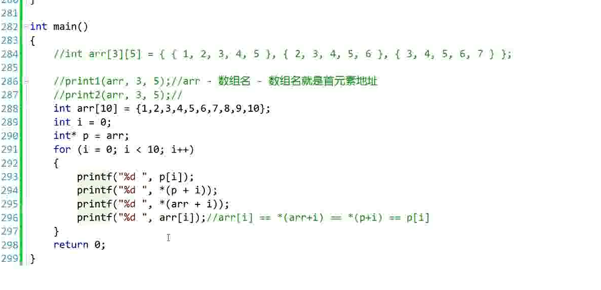

```C
void printarr(int(*pa)[5], int x, int  y)
{
	int i = 0;
	int j = 0;
	for (i = 0; i < x; i++)
	{
		for (j = 0; j < y; j++)
		{
			printf("%d ", *(*(pa + i) + j));
			printf("%d ", (*(pa + i))[j]);
			printf("%d ", pa[i][j]);
		}
		printf("\n");
	}
}
```
## 数组指针的类型

```C
int (* p)[10]
```
这里的**p**是变量名，这个变量的类型是：

```C
int (* )[10]
```


## 数组指针知识测评

```C
int arr[5]//一个有五个整型量的数组
int *parr[10]//这是一个数组，数组有十个元素，每个元素都是一个指针：这是一个有五个指向整型量的指针的数组：指针数组
int (*parr2)[10]//这是一个数组指针，指向的是有10个整型量的数组
int (*parr3[10])[5]//这是一个指针数组，数组的每一个元素都是一个数组指针，指向的是有10个整型量的数组
```

# 指针，指针数组，数组指针

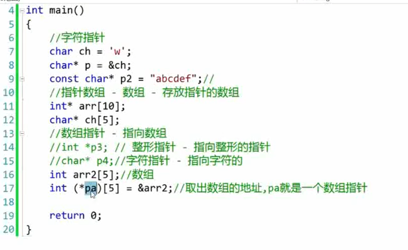

# 数组传参和指针传参


## 一维数组传参

一维数组的参数可以写成数组，也可以写成指针

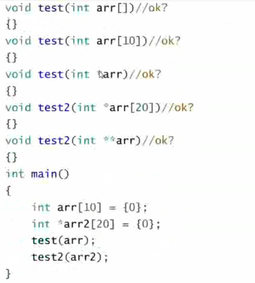

以上传参方式都可以

## 二维数组的传参


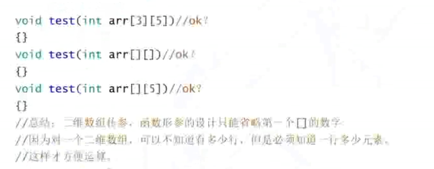

二维数组传参只能省略行，不能省略列


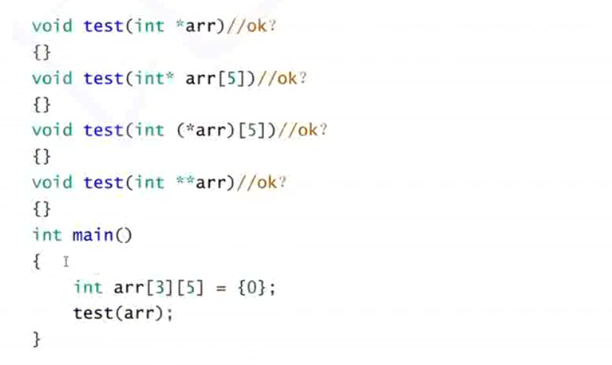

以上只有第三种写法是正确的

## 一级指针传参

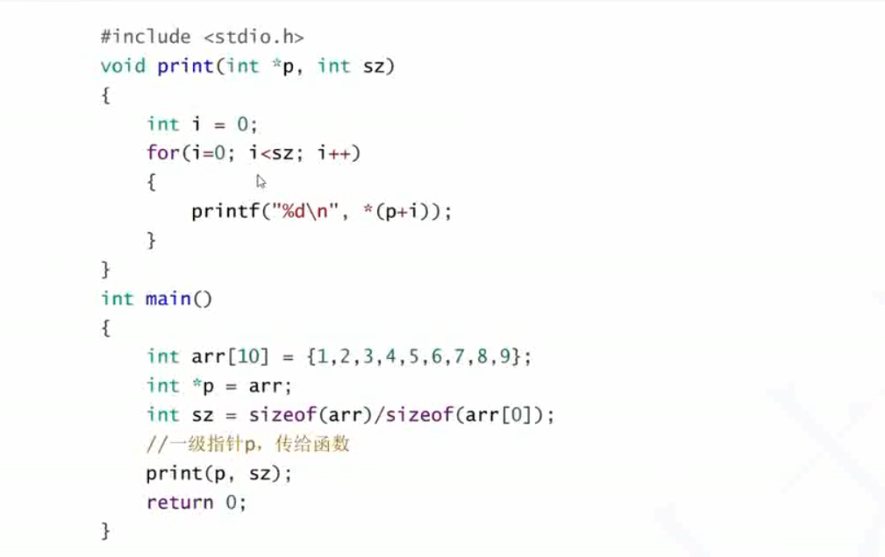

## 二级指针传参

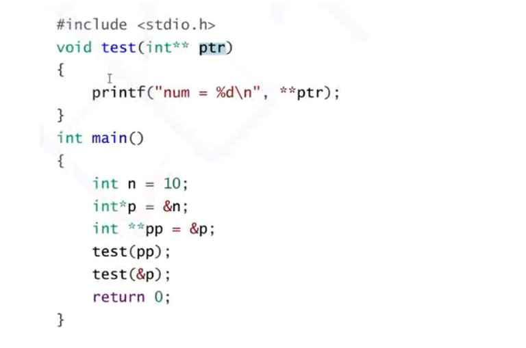

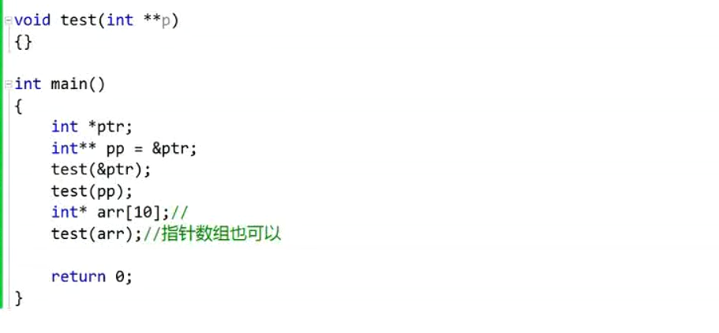

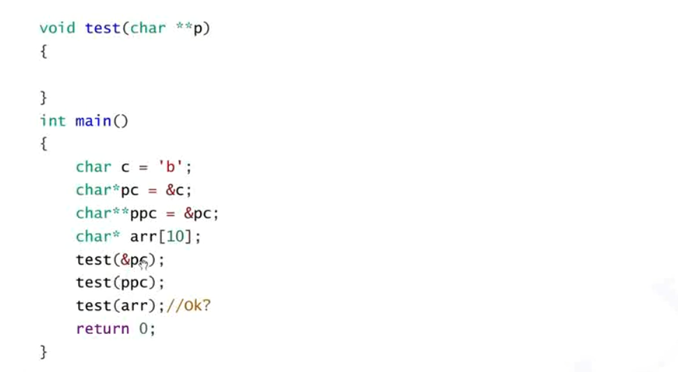


# 函数指针

函数指针也是一个指针，是一个指向函数的指针

## 函数指针的类型

```C
void (*p)(char*)
```
这里的p是变量名，这个函数指针的类型是：
```C
void (* )(char*)
```
**在指针类型的变量时，需要将变量名和\*号放在一起**


## 有返回值的函数调用

```C
int add(int x, int y)
{
	return x + y;
}

char word(char i)
{
	return i + 1;
}

int main()
{
	int (*pa)(int, int) = &add;
	char (*ch)(char) = &word;
	printf("%d\n", (*pa)(2, 3));
	printf("%c\n", (*ch)('a'));
}
```

## 无返回值的函数调用

```C
void print(char* str)
{
	printf("%s", str);
}

int main()
{
	void (*p)(char*) = print;
	(*p)("Hello, world!!!");
}
```


## 函数指针相关的两道有趣的代码

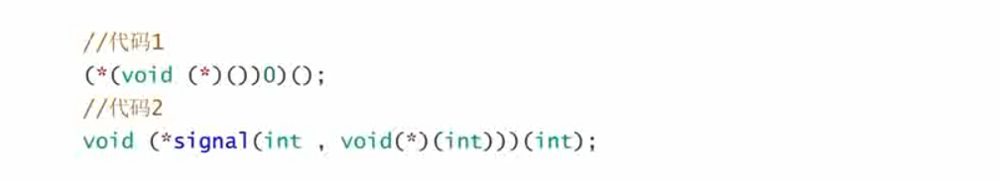

来自：《C陷阱和缺陷》


### 代码1：

```C
(*(void(*)())0)();
```
此代码的含义是：

```C
void (*)()- 函数指针类型
```
这个函数指针类型被括起来了，意思是进行强制类型转换

0被强制类型转换为函数指针类型

然后\*号对这个指针进行解引用， 传入的参数为空

综上，一个代码是一次函数调用

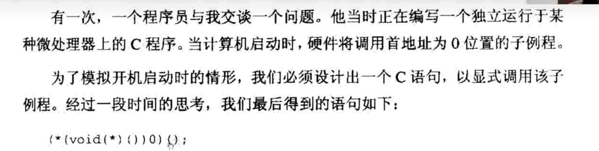


### 代码2：
```C
void (*signal(int,void(*)(int)))(int);
```
**在声明指针类型的变量时，需要将变量名和\*号放在一起**

这是一个函数指针的声明

```C
void (* __函数指针____) (int)
```

这个函数指针是一个变量名，原本的格式应该是：

```C
void (*)(int) 函数指针//这是错误的声明方式
void (* 函数指针)(int)//这是正确的声明方式

//与变量声明形式不同：

int a;
int func(int, int);
```

这个函数指针的名字是
```C
signal
```
需要传入的参数是：
```C
(int,void(*)(int))
```

因此，其形式写成一般函数的声明方式则是：

```C
void (*)(int) signal(int ,void(*)(int))//错误的声明格式,形式和函数声明类似
void (*signal(int ,void(*)(int)))(int) //正确的声明格式
```

将这个代码拆分，进行简化
```C
typedef void (*)(int) pfunc;//这个还是错误的声明方式
pfunc signal(int,pfunc);
```

```C
typedef void (*pfunc)(int);//这才是正确的声明方式；
pfunc signal(int,pfunc);
```

重点：**在声明指针类型的变量时，需要将变量名和\*号放在一起**
 
解释：
signal是一个函数声明
signal函数的参数有2个，第一个是int。第二个是函数指针，该函数指针指向的函数的参数是int,，返回类型是void
signal函数的返回类型也是一个函数指针: 该函数指针指向的函数的参数是int，返回类型是void

## 函数指针的解引用

```C
int add(int a, int b)
{
	return a + b;
}

int main()
{
	int (*p)(int, int) = add;
	//int (*p)(int, int) = &add;
	printf("%d \n", (p)(2, 3));
	printf("%d \n", (*p)(2, 3));
	printf("%d \n", (**p)(2, 3));
	printf("%d \n", (***p)(2, 3));
	return 0;
}
```
输出的值都是5

因此函数指针调用的时候可以不用进行解引用，给函数指针赋值的时候也可以不加取地址符号

# 函数指针数组

存放函数指针的数组

```C
int add(int a, int b)
{
	return a + b;
}

int sub(int a, int b)
{
	return a - b;
}

int mul(int a, int b)
{
	return a * b;
}

int div(int a, int b)
{
	return a / b;
}

int main()
{
	int (*parr[])(int, int) = { add,sub,mul,div };
	for (int i = 0; i < 4; i++)
	{
		printf("%d \n", parr[i](3, 2));//5,5,1,1,6,6,1,1
		printf("%d \n", (*(parr+i))(3,2));
	}
}
```
## 函数指针数组训练

```C
char* my_strcpy(char* dest,const char* src);
//1. 写一个该函数的函数指针
char* (*pf)(char* , const char*)=my_strcpy;
//2. 写一个能存放四个该函数指针的数组
char* (*pfarr[4])(char*, const char*) = { my_strcpy ,my_strcpy ,my_strcpy ,my_strcpy };
```

## 函数指针数组的用途：转移表

### 案例：计算器

```C
int add(int a, int b)
{
	return a + b;
}

int sub(int a, int b)
{
	return a - b;
}

int mul(int a, int b)
{
	return a * b;
}

int div(int a, int b)
{
	return a / b;
}

int xor(int a, int b)
{
	return a ^ b;
}

void menu()
{
	printf("************************************\n");
	printf("****** 1.add       2.sub  **********\n");
	printf("****** 3.mul       4.div  **********\n");
	printf("****** 5.xor       0.exit **********\n");
	printf("************************************\n");
}

int main()
{
	int input = 0;
	int a = 0;
	int b = 0;
	int (*parr[])(int, int) = {0,add,sub,mul,div,xor };
	do
	{
		menu();
		printf("请选择计算器功能：->\n");
		scanf("%d", &input);
		if (input > 0 && input < sizeof(parr))
		{
			printf("请输入两个操作数：->\n");
			scanf("%d%d", &a, &b);
			printf("%d\n", parr[input](a, b));
		}
		else if (0 == input)
		{
			printf("退出\n");
		}
		else
		{
			printf("输入错误，请重新输入：\n");
		}
	} while (input);
}
```


# 指向函数指针数组的指针

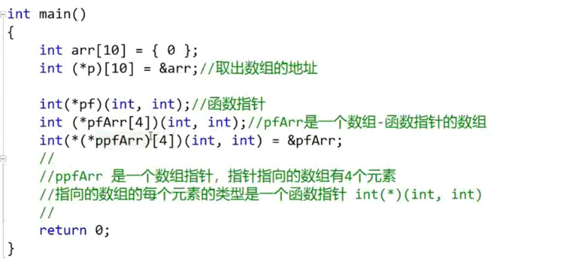


# 回调函数

复习：
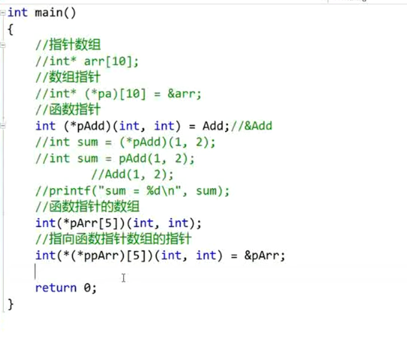


回调函数就是一个通过**函数指针调用**的函数。如果你把函数的指针(地址)作为参数传递给另一个函数，当这个指针被用来调用其所指向的函数时，我们就说这是回调函数。回调函数不是由该函数的实现方直接调用，而是在特定的事件或条件发生时由另外的一方调用的，用于对该事件或条件进行响应。

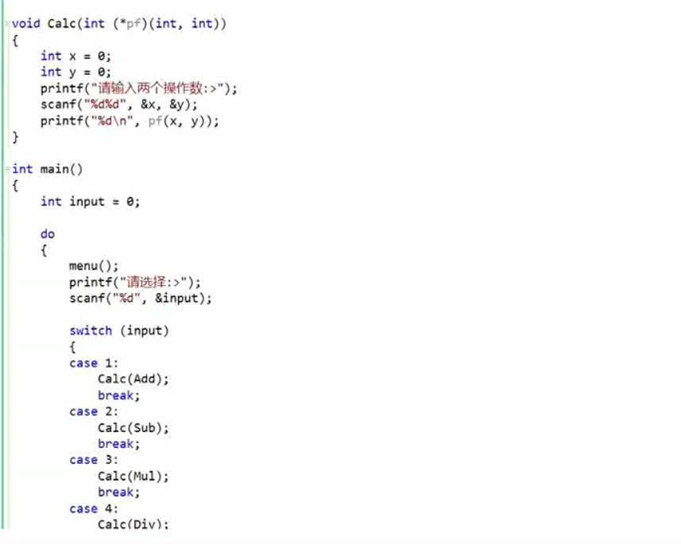

## 冒泡函数

### 手搓冒泡函数

这个冒泡排序函数只能排序整型数组，对于结构体数组，浮点型数组则无能为力

```C
//冒泡函数
void bubble_sort(int arr[], int sz)
{
	int flag = 1;
	for (int i = 0; i < sz - 1; i++)
	{
		int temp = 0;
		for (int j = 0; j < sz - i - 1; j++)
		{
			if (arr[j] > arr[j + 1])
			{
				temp = arr[j];
				arr[j] = arr[j + 1];
				arr[j + 1] = temp;
				flag = 0;
			}
		}
		if (1 == flag)
			break;
	}
}

int main()
{
	int arr[] = { 1,2,5,3,4,6,8,7,9,10 };
	int sz = sizeof(arr) / sizeof(int);
    for (int i = 0; i < sz; i++)
	{
		printf("%d ", arr[i]);
	}
	bubble_sort(arr, sz);
	for (int i = 0; i < sz; i++)
	{
		printf("%d ", arr[i]);
	}
	printf("\n");
	return 0;
}
```

上面这个冒泡函数不够通用

### qsort

qsort-库函数-排序 ：stdlib.h

qsort-思想：快速排序
#### void\* 类型的指针
void\*  类型的指针可以接收任意类型的指针

但是不能对齐进行解引用操作

不能进行加减整数的操作

使用前需要进行强制类型转换

#### qsort格式

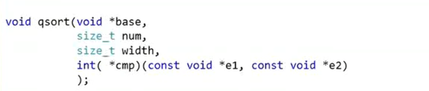

base:起始地址的指针，就是数组首元素，就是数组名

num：需要排序的元素个数

width：每个元素的大小（单位：byte）

cmp：是一个函数指针，指向一个比较函数 函数声明的返回值是int类型，两个参数分别是无类型指针

e1和e2是要比较的两个元素的地址

比较的结果：
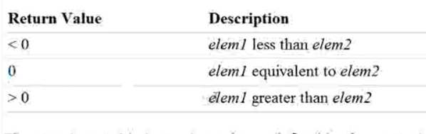


#### 使用qsort排序整数

```C
int cmp_int(const void* e1, const void* e2)
{
	return (*(int*)e1 - *(int*)e2);
}

void test1(void)
{
	int arr[] = { 1,2,5,3,4,6,8,7,9,10 };
	int sz = sizeof(arr) / sizeof(int);
	qsort(arr, sz, sizeof(arr[0]), cmp_int);
	for (int i = 0; i < sz; i++)
	{
		printf("%d ", arr[i]);
	}
	printf("\n");
}
```
#### 使用qsort排序浮点数

```C
int cmp_float(const void* e1, const void* e2)
{
	if (*(float*)e1 == *(float*)e2)
	{
		return 0;
	}
	else if (*(float*)e1 > *(float*)e2)
	{
		return 1;
	}
	else
		return -1;
}

void test2(void)
{
	float arr2[] = { 1.0,2.5,5.0,3.0,6.1 };
	int sz2 = sizeof(arr2) / sizeof(float);
	qsort(arr2, sz2, sizeof(arr2[0]), cmp_float);
	for (int i = 0; i < sz2; i++)
	{
		printf("%.2f ", arr2[i]);
	}
	printf("\n");
}
```

#### 使用qsort排序结构体

##### 按照结构体的整型成员
```C
struct stu
{
	char name[20];
	int age;
};

int cmp_struct_age(const void* e1, const void* e2)
{
	return ((struct stu*)e1)->age - ((struct stu*)e2)->age;
}

void test3()
{
	struct stu s[3] = { {"zhangsan",15},{"lisi",20},{"wangwu",17} };
	int sz3 = sizeof(s) / sizeof(struct stu);
	qsort(s, sz3, sizeof(struct stu), cmp_struct_age);
	for (int i = 0; i < sz3; i++)
	{
		printf("%d ", s[i].age);
	}
	printf("\n");
}
```

##### 按照结构体的字符串成员

```C
struct stu
{
	char name[20];
	int age;
};

int cmp_struct_name(const void* e1, const void* e2)
{
	return strcmp( ((struct stu*)e1)->name, ((struct stu*)e2)->name );
}

void test4(void)
{
	struct stu s[3] = { {"zhangsan",15},{"lisi",20},{"wangwu",17} };
	int sz3 = sizeof(s) / sizeof(struct stu);
	qsort(s, sz3, sizeof(struct stu), cmp_struct_name);
	for (int i = 0; i < sz3; i++)
	{
		printf("%s \n", s[i].name);
	}
	printf("\n");
}
```

### qsort的总结以及类似手动实现

+ 第一个参数：待排序数组的首元素地址
+ 第二个参数：待排序数组的元素个数
+ 第三个参数：待排序数组的每个元素的大小，单位：字节
+ 第四个参数：是函数指针，比较两个元素所需要用到的函数的地址，这个函数需要自己实现，函数指针的两个参数是：待比较的两个元素的地址；

```C
void qsort(void* base, int num, int size,int(*cmp)(const void*e1,const void*e2));
```
base:数组首元素地址
num：元素个数
size：元素大小（单位：字节）
cmp：函数指针，指向用于排序的函数，该函数需要自己实现
e1：待排序的元素的地址
e2：待排序的元素的地址

```C
//交换函数，用于交换两个元素的位置
//需要传入两个元素的地址以及地址所占用的内存大小，单位：字节
//一个字节一个字节的进行交换
void swap(char* p1, char* p2, int width)
{
	int j = 0;
	for (j = 0; j < width; j++)//一个字节一个字节的进行交换
	{
		char temp = *p1;//定义一个缓存变量
		*p1 = *p2;
		*p2 = temp;//进行交换
		p1++;
		p2++;//交换下一个字节
	}
}

//比较函数的实现，程序员知道自己需要比较的是什么类型
//然后手写这个函数
int cmp_int(const void* e1, const void* e2)
{
	return *(int*)e1 - *(int*)e2;
}

//冒泡排序函数的实现
void bubble_sort(void* base, int sz, int width, int(*cmp)(const void* e1, const void* e2))
{
	int i = 0;
	//进行sz-1趟冒泡排序
	for (i = 0; i < sz-1; i++)
	{
		int ii = 0;
		//每一趟冒泡排序需要该元素进行sz-i-1次比较排序
		for (ii = 0; ii < sz - i - 1; ii++)
		{
			//cmp是比较函数，需要自己实现，当cmp的返回值>0时，说明第一个元素比较大。
			if (cmp((char*)base + ii * width, (char*)base + (ii + 1) * width) > 0)
				//如果确定了第一个元素比较大，则交换两个元素的位置
				swap((char*)base + ii * width, (char*)base + (ii + 1) * width, width);
		}
	}
}

int main()
{
	int arr[] = { 9,8,7,6,5,4,3,2,1,0 };//数组定义
	int sz = sizeof(arr) / sizeof(int);//计算数组的大小
	bubble_sort(arr, sz, sizeof(int), cmp_int);//qsort的模仿实现
	for (int index = 0; index < sz; index++)//打印排序之后的数组arr
	{
		printf("%d ", arr[index]);
	}
	printf("\n");
	return 0;
}
```


# 指针和数组面试题解析

## 数组

### 一维数组
```C
int main()
{
	int a[] = { 1,2,3,4 };//x64架构下：
	//对于数组而言，sizeof和&都是对整个数组进行计算，而其它情况下：
	//数组名表示的才是首元素的地址
	printf("%d\n", sizeof(a));//16
	printf("%d\n", sizeof(a+0));//8:a是地址，地址往后移0位，还是地址
	printf("%d\n", sizeof(*a));//4：a是数组首元素地址，解引用得到的是第一个元素
	printf("%d\n", sizeof(a+1));//8：a是数组地址往后移一位，还是地址
	printf("%d\n", sizeof(a[1]));//4
	printf("%d\n", sizeof(&a));//8
	printf("%d\n", sizeof(*&a));//16：对数组取地址再解引用，得到的还是地址
	printf("%d\n", sizeof(&a+1));//8
	printf("%d\n", sizeof(&a[0]));//8
	printf("%d\n", sizeof(&a[0]+1));//8

	return 0;
}
```

### 字符数组

#### 数组1 sizeof

```c
int main()
{
	char arr[] = { 'a','b','c','d','e','f' };
	//x64架构下：
	printf("%d\n", sizeof(arr));//6
	printf("%d\n", sizeof(arr+0));//8:arr是地址，地址往后移0位，还是地址
	printf("%d\n", sizeof(*arr));//1
	printf("%d\n", sizeof(arr[1]));//1
	printf("%d\n", sizeof(&arr));//8
	printf("%d\n", sizeof(&arr+1));//8
	printf("%d\n", sizeof(&arr[0]+1));//8

	return 0;
}
```

#### 数组2 strlen

```C
int main()
{
	char arr[] = { 'a','b','c','d','e','f' };
	printf("%d\n", strlen(arr));//大于6的随机值
	printf("%d\n", strlen(arr+0));//大于6的随机值
	//printf("%d\n", strlen(*arr));//会访问97的地址，非法访问，错误代码
	//printf("%d\n", strlen(arr[1]));//会访问98的地址，非法访问，错误代码
	printf("%d\n", strlen(&arr));//大于6的随机值
	printf("%d\n", strlen(&arr+1));//随机值，比上一个随机值小6
	printf("%d\n", strlen(&arr[0]+1));//大于5的随机值，比上一个随机值大5

	return 0;
}
```

#### 数组3 sizeof 与 strlen
```C
int main()
{
	char arr[] = "abcdef";
    //字符串会自动在最后添加一个'\0'
	printf("%d\n", sizeof(arr));//7
	printf("%d\n", sizeof(arr+0));//8:arr是地址，地址往后移0位，还是地址
	printf("%d\n", sizeof(*arr));//1
	printf("%d\n", sizeof(arr[1]));//1
	printf("%d\n", sizeof(&arr));//8
	printf("%d\n", sizeof(&arr+1));//8
	printf("%d\n", sizeof(&arr[0]+1));//8

	printf("%d\n", strlen(arr));//6
	printf("%d\n", strlen(arr+0));//6
	//printf("%d\n", strlen(*arr));//会访问97的地址，非法访问，错误代码
	//printf("%d\n", strlen(arr[1]));//会访问98的地址，非法访问，错误代码
	printf("%d\n", strlen(&arr));//6 会报错 char(*p)[7]=&arr,与strlen的传入参数 “const char*”间接级别不同
	printf("%d\n", strlen(&arr+1));//随机值
	printf("%d\n", strlen(&arr[0]+1));//5

	return 0;
}
```

#### 数组4 指针指向的常量字符串

```C
int main()
{
	char *p = "abcdef";
	printf("%d\n", sizeof(p));//8
	printf("%d\n", sizeof(p + 1));//8:arr是地址，地址往后移1位，还是地址，计算的是b的地址
	printf("%d\n", sizeof(*p));//1:p指向的是a所在的地址
	printf("%d\n", sizeof(p[1]));//1
	printf("%d\n", sizeof(&p));//8
	printf("%d\n", sizeof(&p + 1));//8 指向的内容不确定，是字符串后面的一位
	printf("%d\n", sizeof(&p[0] + 1));//8

	printf("%d\n", strlen(p));//6
	printf("%d\n", strlen(p + 1));//5 
	//printf("%d\n", strlen(*p));//会访问97的地址，非法访问，错误代码
	//printf("%d\n", strlen(p[0]));//会访问98的地址，非法访问，错误代码
	printf("%d\n", strlen(&p));//6 会报错 会报错 char **p=&arr,与strlen的传入参数 “const char”间接级别不同
	printf("%d\n", strlen(&p + 1));//随机值
	printf("%d\n", strlen(&p[0] + 1));//5

	return 0;
}
```

### 二维数组


