# 11-字符串函数

# 字符串相关函数：

# 求字符串长度：

- strlen

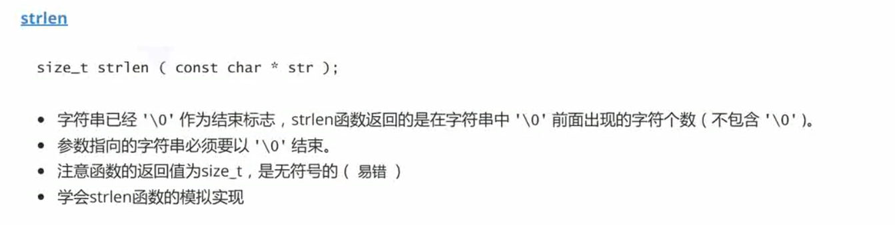

## strlen的基本用法

```C
int main()
{
	char arr1[] = { 'a','b','c' ,'\0' };
	char arr2[] = { 'a','b','c'};

	printf("%d\n", strlen("abc"));
	printf("%d\n", strlen(arr1));
	printf("%d\n", strlen(arr2));//直到找到'\0'才停止

	return 0;
}
```

重点：返回值size_t是一个无符号数
```C
if (strlen("abc") - strlen("abcdef") > 0)
{
	printf("abc\n");
}
else
{
	printf("abcdef\n");
}
```


## strlen的三种写法
### 计数器的方法

```C
int my_strlen(const char* str)//size_t
{
	int count = 0;
	assert(str != NULL);

	while ('\0' != *str)//while(*str)
	{
		count++;
		str++;
	}
	return count;
}
```

### 递归
又叫做：不创建临时变量求字符串长度

```C
int my_strlen(const char* str)
{
	if (*str != '\0')
		return 1 + my_strlen(str + 1);
	else
		return 0;
}
```


### 指针-指针


# 长度不受限制的字符串函数：

长度不受限制的函数在使用的过程中可能会出现超出数组索引，导致野指针的出现，使得这个函数在使用的过程中不安全

- strcpy
- strcat
- strcmp

## strcpy

strcpy的目标字符串和源字符串内存空间不能有重叠，重叠的话会无限循环

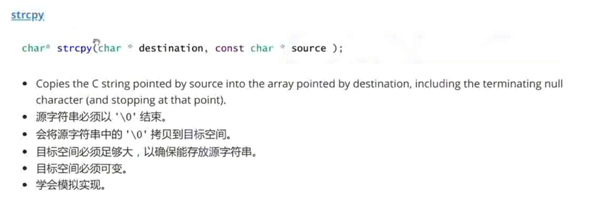

```C
char* my_strcpy(char* dest, const char* src)
{
	char* ret = dest;
	assert(dest != NULL);//断言
	assert(src != NULL);//断言
	//字符串拷贝
	while (*dest++ = *src++)
	{
		;
	}
	
	return ret;
}
```

## strcat

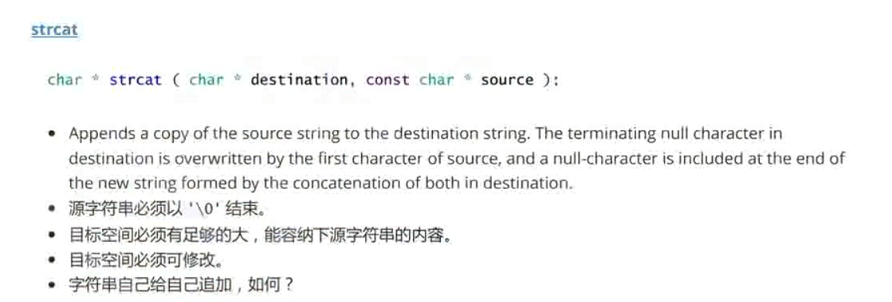

不能自己给自己追加

使用strcat时要防止程序空间不足

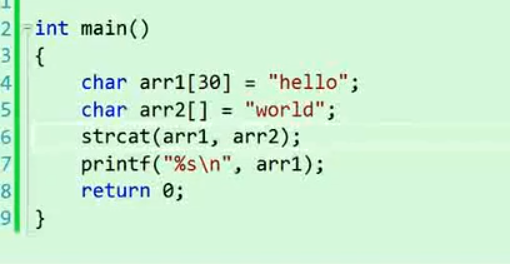

自己实现：

```C
char* my_strcat(char* dest, const char* src)
{
	assert(dest && src);
	char* ret = dest;
	//1.寻找dest的结尾：
	while (*dest!='\0')
	{
		dest++;
	}
	//2.追加
	while (*dest++ = *src++)
	{
		;
	}
	return ret;
}

int main()
{
	char arr1[30] = "hello \0xxxxxxx";
	char arr2[] = "world";

	my_strcat(arr1, arr2);

	printf("%s\n", arr1);

	return 0;
}
```

## strcmp

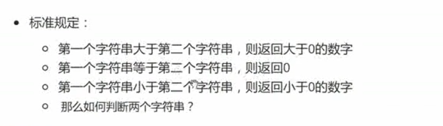
（不同的编译器返回的值不同）

strcmp比较的是字符串中的字符对应的ASCII码值

依次进行比较，直到第一次分出胜负时输出字符串的大小关系

```C

int main()
{
	char arr1[] = "abc";
	char arr2[] = "acb";
	int ret = strcmp(arr1, arr2);
	printf("%d\n", ret);
	return 0;
}

```

以上程序输出的时-1，arr2更大


模拟实现：
visual studio实现：
```C
my_strcmp(const char* str1, const char* str2)
{
	assert(str1 && str2);
	//比较
	while (*str1 == *str2)
	{
		if (*str1 == '\0') return 0;
		str1++;
		str2++;
	}
	if (*str1 > *str2) return 1;
	else return -1;
}

int main()
{
	char* p1 = "abc";
	char* p2 = "abc";
	int ret = my_strcmp(p1, p2);
	printf("%d\n",ret);
	return 0;
}
```
gcc实现：
```C
my_strcmp(const char* str1, const char* str2)
{
	assert(str1 && str2);
	//比较
	while (*str1 == *str2)
	{
		str1++;
		str2++;
	}
	return (*str1 - *str2);
}
```

参考代码：

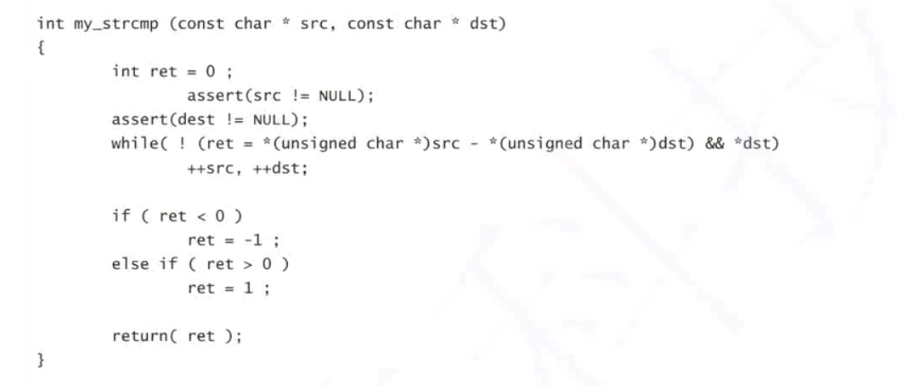


# 长度受限制的字符串函数介绍

拷贝的过程中有个数限制，是的函数在使用的过程中相对安全

## strncpy

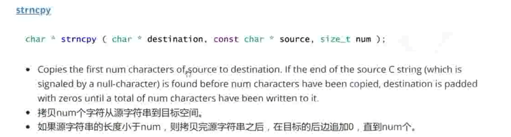


```C
int main()
{
	char arr1[10] = "abcdefg";
	char arr2[] = "hello world!!!";

	strncpy(arr1, arr2, 4);
	
	return 0;
}
```

只拷贝指定的字符数量，不会额外拷贝'\0'

当指定的数量大于源字符串的数量的时候，会自动添加'\0'补位

### strncpy的模拟实现：

```C
char* my_strncpy(char* dest, const char* src,int count)
{
	char* ret = dest;
	assert(dest && src);
	while (count--)
	{
		if (*src != '\0')
		{
			*dest++ = *src++;//拷贝
		}
		else *dest++ = '\0';//填充
	}
	return ret;	
}

int main()
{
	char arr1[10] = "abcdefg";
	char arr2[] = "he";

	my_strncpy(arr1, arr2, 4);

	printf("%s\n", arr1);
	
	return 0;
}
```

库函数代码：
```C
char * __cdecl strncpy (
        char * dest,
        const char * source,
        size_t count
        )
{
        char *start = dest;

        while (count && (*dest++ = *source++) != '\0')    /* copy string */
                count--;

        if (count)                              /* pad out with zeroes */
                while (--count)
                        *dest++ = '\0';

        return(start);
}
```

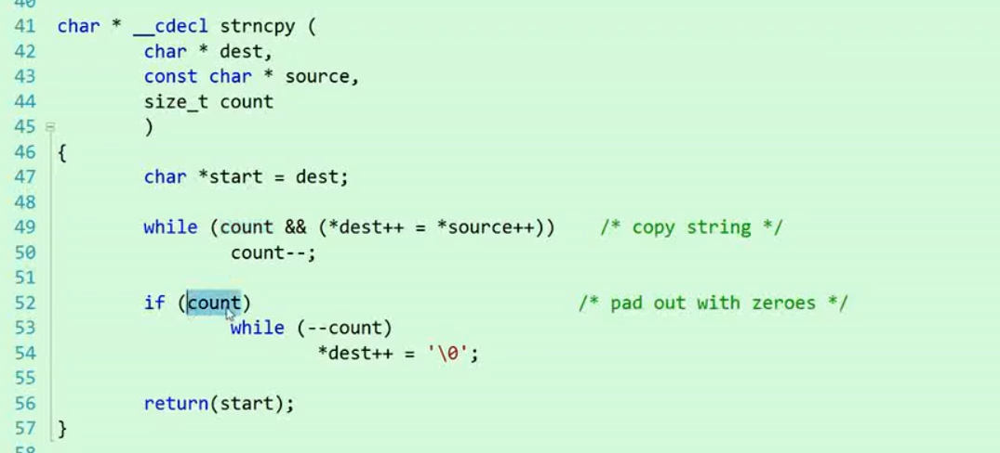


## strncat

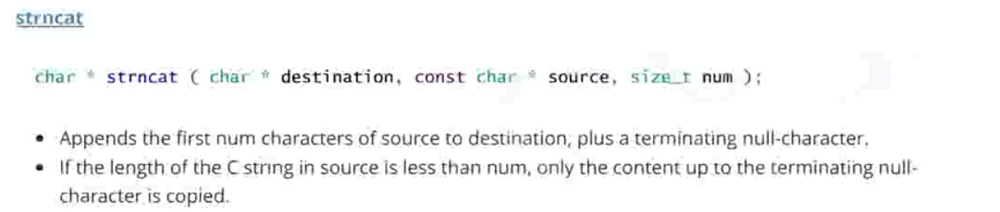

追加完成之后会主动添加'\0'

追加超出的数量的也只会补一个'\0'

### 模拟实现
```C
char* my_strncat(char* dest, const char* src,int count)
{
	char* ret = dest;
	assert(dest && src);
	while (*dest)
	{
		dest++;
	}
	while (count-- && *src)
	{
		*dest++ = *src++;
	}
	*dest = '\0';
	return ret;
}

int main()
{
	char arr1[30] = "abcdefg\0xxxxxxxxxxxxxxxxx";
	char arr2[] = "hello world!!!";

	my_strncat(arr1, arr2, 6);
	printf("%s\n", arr1);

	return 0;
}
```


库函数实现
```C
char * __cdecl strncat (
        char * front,
        const char * back,
        size_t count
        )
{
        char *start = front;

        while (*front++)
                ;
        front--;

        while (count--)
                if ((*front++ = *back++) == 0)
                        return(start);

        *front = '\0';
        return(start);
}
```

## strncmp

与strcmp的区别：

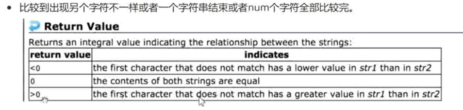

模拟实现
```c
//int srtncmp(const char* str1,const char* str2,int count)
//模拟实现：

int my_strncmp(const char* str1, const char* str2, int count)
{
	assert(str1 && str2);
	while (count-- && (*str1) && (*str2))
	{
		if (*str1 == *str2)
		{
			str1++;
			str2++;
		}
		
	}
	return (*str1 - *str2);
}


int main()
{
	//strncmp-字符串比较
	const char* p1 = "abcdefg";
	const char* p2 = "aqwer";

	//int ret = strcmp(p1, p2);
	int ret = my_strncmp(p1, p2,3);
	printf("%d\n", ret);

	return 0;
}
```

库函数实现：

```C

//比较复杂

```


# 字符串查找：

- strstr
- strtok

## strstr 查找字符串

### 使用：

```C
int main()
{
	const char* p1 = "abcdefg";
	const char* p2 = "cd";

	char* ret = strstr(p1, p2);

	if (ret == NULL) printf("未找到该字符串\n");
	else printf("%s\n", ret);

	return 0;
}
```

模拟实现：
```C
char* my_strstr(const char* str1, const char* str2)
{
	char* s1 = (char *)str1;
	char* s2 = (char *)str2;
	char* cur = (char *)str1;//轮询查找

	if (!*str1)
		return s1;//要查找的字符串为空，则返回被查找的字符串

	while (*cur)
	{
		s1 = cur;
		s2 = (char*)str2;
		while (*s1 && *s2 && (*s1 == *s2))//对应字符相同，且不为空
		{
			s1++;
			s2++;
		}
		if (!*s2)
			return cur;//已经完成了查找
		if (!*s1)
			return NULL;//s1已经到头了，提前结束
		cur++;
	}
	return NULL;

}


int main()
{
	const char* p1 = "abcdefg";
	const char* p2 = "cdf";

	char* ret = my_strstr(p1, p2);

	if (ret == NULL) printf("未找到该字符串\n");
	else printf("%s\n", ret);

	return 0;
}
```


库函数实现：

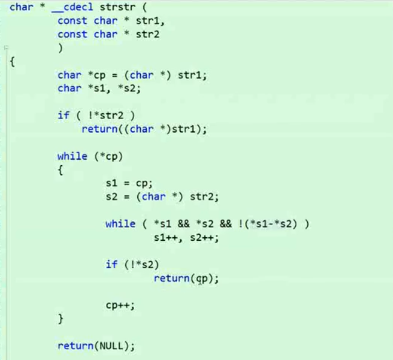


KMP算法实现的效率更高一点


## strtok

```C
char* strtok(char* str, const char* sep);
```


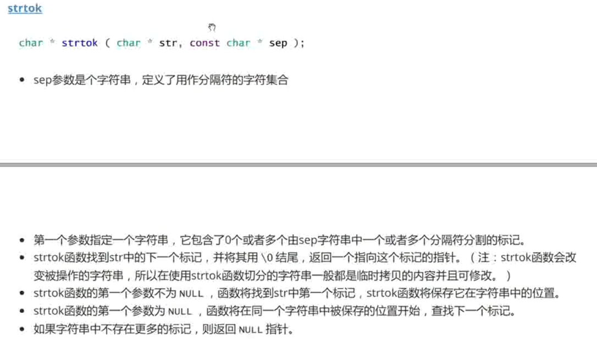

### strtok的作用：

分割字符串：

例如：将192.168.123.1分割成192，168，123，1
或者将123@qq.com分割成：123 qq com

### strtok的用法

1. strtok会改变源数据，所以一般是对拷贝的里临时量进行操作
2. 依次分割打印出内容，直到结束为止；

```C
int main()
{
	char arr1[] = "qazwsx123@qq.com.cn";
	char* p = "@..";

	char buf[1024] = { 0 };

	strcpy(buf, arr1);

	//切割buf中的数据
	char* ret=strtok(buf, p);

	printf("%s\n", ret);

	ret = strtok(NULL, p);

	printf("%s\n", ret);

	ret = strtok(NULL, p);

	printf("%s\n", ret);

	return 0;
}
```

更简洁的写法：
```C
int main()
{
	char arr1[] = "qazwsx123@qq.com.cn";
	char* p = "@..";

	char buf[20] = { 0 };

	strcpy(buf, arr1);

	//切割buf中的数据
	for (char* ret = strtok(buf, p); ret != NULL; ret = strtok(NULL, p))
	{
		printf("%s\n", ret);
	}
	return 0;
}
```
# 错误信息报告：

- strerror

作用是把错误码对应的错误信息翻译出来，需要用到一个全局的错误码变量：
errno
使用errno需要包含头文件：errno.h
错误码信息：


```C
0	No error
1	Operation not permitted
2	No such file or directory
3	No such process
4	Interrupted function call
5	Input/output error
6	No such device or address
7	Arg list too long
8	Exec format error
9	Bad file descriptor
10	No child processes
11	Resource temporarily unavailable
12	Not enough space
13	Permission denied
14	Bad address
15	Unknown error
16	Resource device
17	File exists
18	Improper link
19	No such device
20	Not a directory
21	Is a directory
22	Invalid argument
23	Too many open files in system
24	Too many open files
25	Inappropriate I/O control operation
26	Unknown error
27	File too large
28	No space left on device
29	Invalid seek
30	Read-only file system
31	Too many links
32	Broken pipe
33	Domain error
34	Result too large
35	Unknown error
36	Resource deadlock avoided
37	Unknown error
38	Filename too long
39	No locks available
40	Function not implemented
41	Directory not empty
42	Illegal byte sequence
43  ......
```
## 使用示例
```C
int main()
{
	FILE* pf = fopen("test.txt", "r");
	if (pf == NULL)
	{
		printf("%s\n", strerror(errno));
	}
	else
	{
		printf("open file success!!!\n");
	}
	return 0;	
}
```


# 字符操作

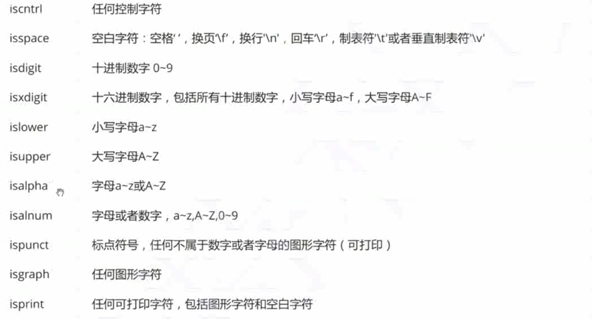

字符转换：

```C
int tolower ( int c );
int toupper ( int c );
```

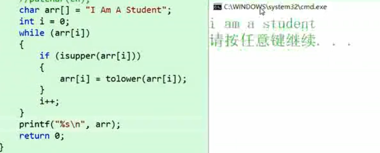


```C
/* isupper example */
#include <stdio.h>
#include <ctype.h>
int main ()
{
 int i=0;
 char str[]="Test String.\n";
 char c;
 while (str[i])
{
  c=str[i];
  if (isupper(c))
    c=tolower(c);
  putchar (c);
  i++;
}
 return 0;
}
```


