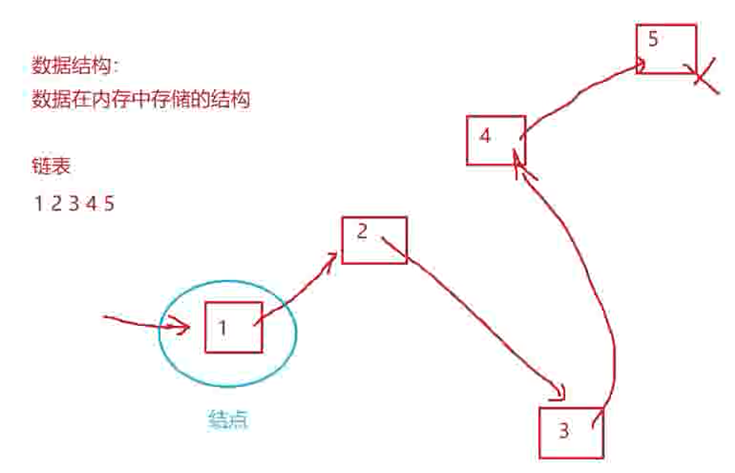
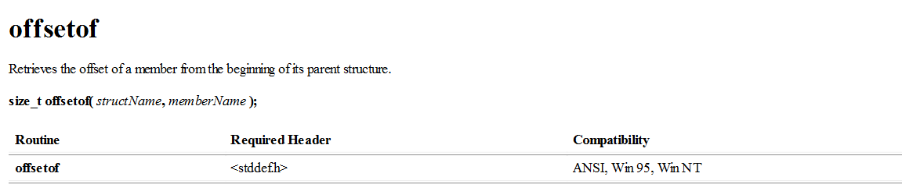

# 13-自定义数据类型-结构体

内置类型：
char short int long float double（包括有符号类型，无符号类型）

复杂类型：
结构体 枚举，联合体（又叫做自定义数据类型）

# 结构体

## 结构体的声明

### 结构体
结构是一些值的集合，这些值称为成员变量。结构的每个成员可以是不同类型的变量。
（数组是一些相同类型的值的集合）

### 结构的声明

```C
struct tag
{
member-list;
}variable-list;
```

声明实例：
```C
//声明一个结构体类型
//声明一个学生类型，通过以学生类型来创建学生变量
//描述学生：属性-姓名+电话+性别+年龄

struct stu1
{
	char name[20];
	char tel[12];
	char sex[10];
	int age;
};//这里只声明了类型，并没有创建变量

struct stu2
{
	char name[20];
	char tel[12];
	char sex[10];
	int age;
}s1,s2;//这里不但声明了类型，还创建了s1,s2两个变量

//利用typedef关键字可以简化结构体的定义过程

typedef struct stu3//也可省略stu3
{
	//成员变量
	char name[20];
	int age;
	char tele[12];
	char sex[6];
}STU;//通过typedef将struct Stu3重命名为STU


int main()
{
	//利用typedef关键字重命名的STU来创建变量名
	STU s3 = { "example",18,"12345678910","female" };
	return 0;
}
```

另外还能声明匿名结构类型：

### 结构体匿名声明
```C
//匿名结构体：
struct
{
	int a;
	char c;
}sa;

struct
{
	int a;
	char c;
}*psa;
```

此时直接创建了一个结构体变量sa和一个结构体指针变量psa，虽然两个结构体的内容长得一样，但是编译器一般会将其认为是两个不同的类型，以下代码在大多数编译器下都会报错：

```C
  psa=&sa;
```

## 结构体的自引用

（数据结构-链表）

数据结构：数据在内存中的结构



因此一个链表的结点可以分为两个部分：数据域，指针域
每一个节点都存储着下一个链表节点的地址

写成代码形式就是：
```C
struct node
{
    //数据域，用于存储数据，可以是int，char，或者其他类型的数据
    int a;
    //指针域，用于存储下一个链表节点的地址
    struct node* next;
};
```

### 通过typedef进行的简化声明与创建

```C
//typedef复习
//声明一个叫做Node类型的结构体变量
typedef struct Node 
{
	int a;
	struct Node* next;
}Node;//将struct Node通过typedef简化为Node，方便后续使用

int main()
{
	struct Node n1;//完整的声明创建n1结构体变量
	Node n2;//通过typedef进行的简化声明创建n2结构体变量

	return 0;
}
```

这种情况下不能使用匿名结构体，会导致编译器找不到结构体的初始状态，报错

## 结构体的初始化

结构体可以嵌套初始化

```C

//结构体的嵌套初始化

struct time
{
	int year;
	int month;
	int date;
};

typedef struct chatlog
{
	struct time t;//嵌入一个结构体变量
	char sentence1[20];
	char sentence2[20];
	char sentence3[20];
}chatlog;

int main()
{
	chatlog log = { {2023,02,02},"hello","world","!!!" };
	printf("%d %d %d : %s %s %s\n", log.t.year, log.t.month, log.t.date, 
		log.sentence1, log.sentence2, log.sentence3);
	return 0;
}
//此处打印的是通过结构体解引用进行的，还能通过指针打印
```

# 结构体内存对齐

判断以下两个结构体所占空间的大小：

```C
struct s1
{
	char c1;
	int a;
	char c2;
};

struct s2
{
	char c1;
	char c2;
	int a;
};

int main()
{
	struct s1 s1 = { 0 };
	struct s1 s2 = { 0 };
	printf("%d\n", sizeof(s1));//(1+3)+4+(1+3)=12
	printf("%d\n", sizeof(s2));//1+(1+2)+4=8
	return 0;
}
```

理论上，两个结构体所占的空间，应该都是6字节，然而程序输出的结果却是12，8

这是因为，结构体存在对齐规则

## 结构体对齐规则

1. 结构体的第一个成员变量的位置在与结构体变量偏移量为0的地址处。
2. 其他成员变量要对齐到某个数字（对齐数）的整数倍的地址处。
3. 结构体总大小为最大对齐数（每个成员变量都有一个对齐数）的整数倍。
4. 如果嵌套了结构体的情况，嵌套的结构体对齐到自己的最大对齐数的整数倍处，结构体的整体大小就是所有最大对齐数（含嵌套结构体的对齐数）的整数倍。

对齐数 = 编译器默认的一个对齐数与该成员大小的较小值。

VS中的默认对齐数为：8
gcc是没有默认对齐数的，直接用成员的大小作为对齐数。
(默认对齐数可以修改)

### 结构体对齐计算

```C
struct s3
{
	double d;
	char c;
	int i;
};
```
计算s3的大小：8+(1+3)+4=16

```C
struct s4
{
	char c;
	struct s3 s3;
	double d;
};
```
计算s4的大小:(1+7)+16+8=32

如果嵌套了结构体的情况，嵌套的结构体对齐到自己的最大对齐数的整数倍处，结构体的整体大小就是所有最大对齐数（含嵌套结构体的对齐数）的整数倍。

## 结构体内存对齐的原因

1. 平台原因(移植原因)：
不是所有的硬件平台都能访问任意地址上的任意数据的；某些硬件平台只能在某些地址处取某些特
定类型的数据，否则抛出硬件异常

2. 性能原因：
数据结构(尤其是栈)应该尽可能地在自然边界上对齐。
原因在于，为了访问未对齐的内存，处理器需要作两次内存访问；而对齐的内存访问仅需要一次访
问。

结构体的内存对齐是拿空间来换取时间的做法。

所以在设计结构体的时候，**应该让占用空间小的成员尽量集中在一起**。

## 默认对齐数的设置

```C
#pragma pack(4)//设置默认对齐数为4
#pragma pack()//取消设置的默认对齐数
```

```C
struct s1
{
	char c;
	double d;
};

#pragma pack(4)
struct s2
{
	char c;
	double d;
};
#pragma pack()

int main()
{
	struct s1 s1 = { 0 };
	struct s2 s2 = { 0 };
	printf("%d\n", sizeof(s1));
	printf("%d\n", sizeof(s2));
	return 0;
}
```

一般将默认对齐数设置成2的次方数

## offsetof-宏



```C
struct s
{
	char c;
	int a;
	double d;
};

int main()
{
	printf("%d\n", offsetof(struct s, c));
	printf("%d\n", offsetof(struct s, a));
	printf("%d\n", offsetof(struct s, d));
	return 0;
}
```
offsetof不是函数，是宏，返回值是结构体变量成员的偏移量


## 结构体传参

结构体传参需要传地址，不然传进去的只是一个创建的临时拷贝
（传址和传值的区别）

所以如果需要改变原结构体的时候，需要传地址
如果只是需要用到结构体中的值，而不需要改变，则可以传值,

实例：

```C
struct s
{
	char c;
	int a;
	double d;
};

//用传址进行初始化
void Init(struct s* ps)
{
	ps->c = 'w';
	ps->a = 1;
	ps->d = 3.14159;
}

//用传值进行打印，缺点是会额外占用空间
void Print1(struct s tem)
{
	printf("%c ", tem.c);
	printf("%d ", tem.a);
	printf("%.2f", tem.d);
	printf("\n");
}

//用传址进行打印，并利用const进行修饰，避免内部值被修改
void Print2( const struct s* ps)
{
	printf("%c ", ps->c);
	printf("%d ", ps->a);
	printf("%.2f ", ps->d);
	printf("\n");
}

int main()
{
	struct s s1 = { 0 };
	Init(&s1);
	Print1(s1);
	Print2(&s1);
	return 0;
}
```


