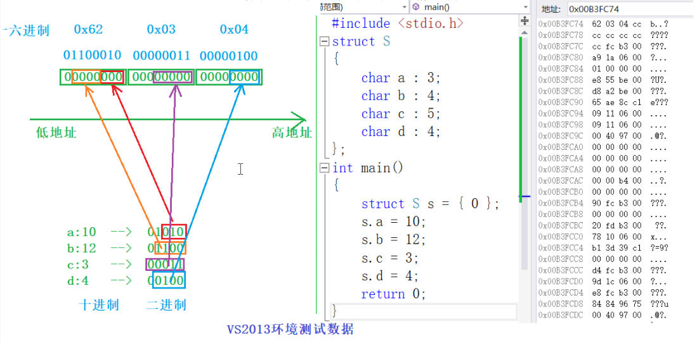
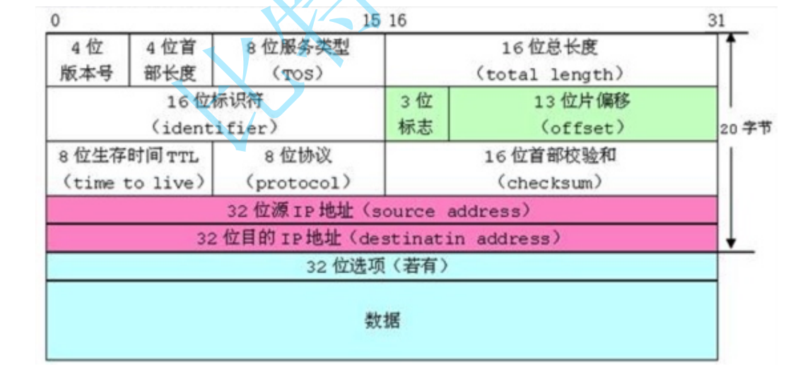

# 14-位段，枚举，共用体

结构体有实现位段的能力

# 位段

## 什么是位段

位段；是一种数据类型，该数据类型的数字表示该变量在内存中占据几个比特位的长度

可以说，位段是结构体的一种类型

位段的声明和结构是类似的，有两个不同：
```C
1.位段的成员必须是 
  int、unsigned int 或signed int 
   (其实，只要是int就行）
  （或者是int 家族的整型变量：char)
2.位段的成员名后边有一个冒号和一个数字。
```
实例： 

```C
struct A
{
	int _a : 2;
	int _b : 5;
	int _c : 10;
	int _d : 30;
};


int main()
{
	printf("%d\n", sizeof(struct A));
	return 0;
}
```

以上程序输出的结果是：8

原因是：

# 位段的内存分配


1. 位段的成员可以是 int unsigned int signed int 或者是 char （属于整形家族）类型

2. 位段的空间上是按照需要以4个字节（ int ）或者1个字节（ char ）的方式来开辟的。

3. 位段涉及很多不确定因素，位段是不跨平台的，注重可移植的程序应该避免使用位段。

```C
struct S
{
char a:3;
char b:4;
char c:5;
char d:4;
};

struct S s = {0};
s.a = 10;
s.b = 12;
s.c = 3;
s.d = 4;
```
此时，在内存中查看其分布情况：




所以，在小端机器上，位段一次性开辟的四个字节（32位），每个字节的地址是递增的，在位段内部，低位放在低地址，高位放在高地址

## 位段的跨平台问题

1. int 位段被当成有符号数还是无符号数是不确定的。
2. 位段中最大位的数目不能确定。（16位机器最大16，32位机器最大32，写成27，在16位机
器会出问题。
3. 位段中的成员在内存中从左向右分配，还是从右向左分配标准尚未定义。
4. 当一个结构包含两个位段，第二个位段成员比较大，无法容纳于第一个位段剩余的位时，是
舍弃剩余的位还是利用，这是不确定的。

## 位段的应用



通讯协议的包头包尾等，用于减小数据包的大小


# 枚举 

顾名思义，枚举就是：一一列举

实例：
性别可以一一列举：
颜色可以一一列举；
```
//枚举类型
enum Sex
{
	//枚举变量
	MALE,
	FEMALE,
	SECRET
};

enum Color
{
	RED=2,
	GREEN,
	BLUE=8
};

int main()
{
	enum Sex s = MALE;
	enum Color c = GREEN;
	printf("%d %d \n", s, c);
	printf("%d %d %d \n", MALE,FEMALE,SECRET);
	printf("%d %d %d \n", RED,GREEN,BLUE);

	return 0;
}
```

枚举的值其实是整数。从0开始，按1递增，可以被赋值为其它的值，未赋值的也是按1递增的

括号中的内容是枚举类型的可能取值，也叫 枚举常量 。


## 枚举的优点

1. 增加代码的可读性和可维护性
2. 和#define定义的标识符比较枚举有类型检查，更加严谨。
3. 防止了命名污染（封装）
4. 便于调试
5. 使用方便，一次可以定义多个常量


## 枚举的使用

只能拿枚举常量给枚举变量赋值，才不会出现类型的差异。

```C
enum Color//颜色
{
RED=1,
GREEN=2,
BLUE=4
};
enum Color clr = GREEN;//只能拿枚举常量给枚举变量赋值，才不会出现类型的差异。
clr = 5;        //ok??
```
直接用int给枚举类型赋值会报错，是不行的（只是编译器可能检查不出来）

## 为什么要有枚举

为了改善#define的定义方式
是否可以用assert来进行参数检查


## enum的大小计算

enum中的常量基本上都是int类型，每个枚举常量的大小都是4字节；
enum类型的变量被创建并且被赋值之后，大小就是4字节
而enum类型的大小，也就是单个枚举常量的大小
```C
enum Sex
{
	MALE,
	FEMALE,
	SECRET
};

int main()
{
	enum Sex s = MALE;
	printf("%d\n", sizeof(enum Sex));
	printf("%d\n", sizeof(s));
	return 0;
}
```
输出结果都是4


# 联合体（共用体）

## 什么是联合体

联合也是一种特殊的自定义类型
这种类型定义的变量也包含一系列的成员，特征是这些成员公用同一块空间（所以联合也叫共用体）。

```C
//联合类型的声明
union Un
{
	char c;
	int i;
};

int main()
{
	//联合变量的定义
	union Un u;
	//计算连个变量的大小
	printf("%d\n", sizeof(u));

	//打印联合体在内存中的地址
	printf("%p\n", &u);
	printf("%p\n", &(u.c));
	printf("%p\n", &(u.i));//三个地址都一样
	return 0;
}
```

## 联合的特点

### 联合体成员的空间
联合的成员是共用同一块内存空间的，这样一个联合变量的大小，至少是最大成员的大小（因为联合至少得有能力保存最大的那个成员）。

因此，在同一时刻，只能使用联合体中的一个成员，不能同时使用

### 联合体 大小端 空间

大端（存储）模式：是指数据的低位存储在内存的高地址中，而数据的高位存储在内存的低地址中；
小端（存储）模式：是指数据的低位存储在内存的低地址中，而数据的高位存储在内存的高地址中；

大小端判断：
```C
int main()
{
	int a = 0x01;
	int* p = &a;
	
	//强制类型转换
	//只读取一个字节
	if ('\0' == *((char*)p))
	{
		printf("大端存储\n");
	}
	else if ('\1' == *((char*)p))
	{
		printf("小端存储\n");
	}
	else
		printf("err\n");
	return 0;
}
```
当然，更好的方法是，直接将其封装为一个函数
```C
//无输入参数
//返回1：系统是小端存储
//返回0：系统是大端存储
int check_sys()
{
	int sys = 1;
	return *((char*)&sys);
}

int main()
{
	printf("%d\n", check_sys());
}
```


### 百度笔试题：大小端判断

利用联合体的解决方案：

```C
int check_sys()
{
	union SYS
	{
		char c;
		int i;
	}sys;
	sys.i = 1;
	return sys.c;
}

int main()
{
	printf("%d\n", check_sys());
	return 0;
}
```

以上类型中也可以省略掉SYS，创建一个匿名联合体

## 联合体大小的计算

1. 联合的大小至少是最大成员的大小。
2. 当最大成员大小不是最大对齐数的整数倍的时候，就要对齐到最大对齐数的整数倍。

```C
union un
{
	int a;
	//自身大小：4
	//默认对齐数：8
	//最终对齐数：4
	char arr[5];
	//数组的对齐数计算：
	//使用数组元素的大小来计算
	//数组元素的大小：1
	//默认对齐数：8
	//最终对齐数：1
};

int main()
{
	union un u;
	printf("%d\n", sizeof(u));
	return 0;
}
```
这个联合体的成员的最大所占空间为5

当最大成员大小不是最大对齐数的整数倍的时候，就要对齐到最大对齐数的整数倍

因此，这个联合体的大小是8


