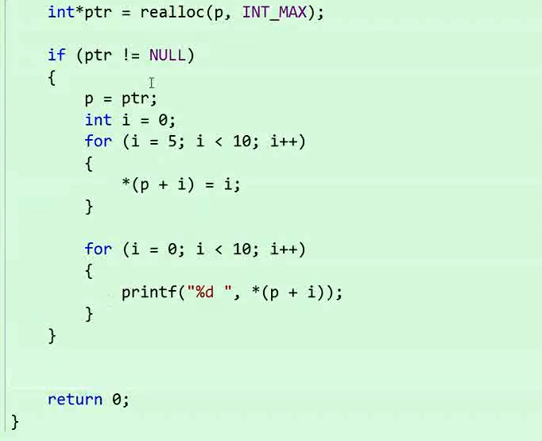
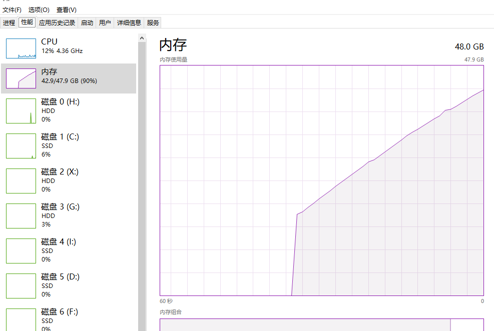
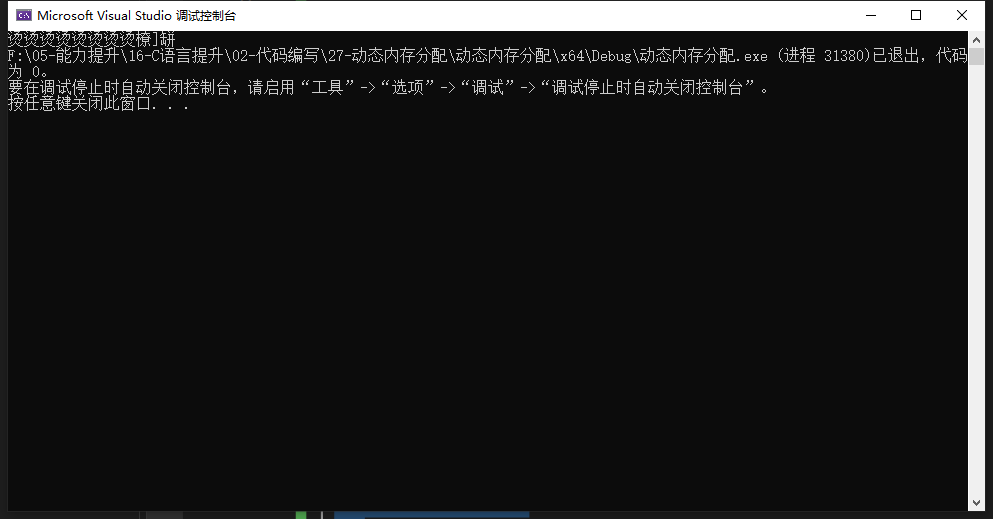
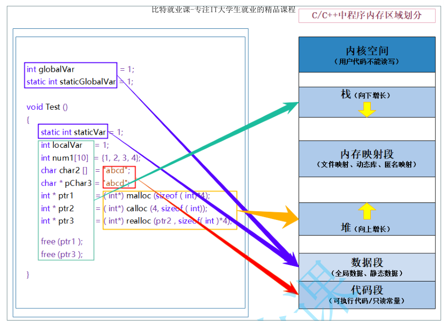

# 16-动态内存分配

# 内存分区

内存的区域
1. 栈区
2. 堆区
3. 静态区

栈区：局部变量，函数的形参

堆区：动态内存分配（malloc，free，calloc，realloc）

静态区：全局变量，静态变量，static修饰的变量

## 内存的使用方式

1. 创建一个变量
int a=10;//局部变量，栈区
int g_a=10;//全局变量，静态区

2. 创建一个数组
 也分位局部变量和全局变量，分别存储在栈区和静态区

# 变长数组

C99的C语言标准中，引入了边长数组的标准

```C
//变长数组
int main()
{
	int n = 0;
	scanf("%d", &n);
	int arr[n] = { 0 };

}
```
目前在Visual Studio中暂时还不支持C99

# 动态内存的作用

目前我们在栈区和静态区开辟空间的方式有两个特点：
1. 空间开辟大小是固定的。
2. 数组在申明的时候，必须指定数组的长度，它所需要的内存在编译时分配。

3. 另外对于空间的需求，不仅仅是上述的情况。有时候我们需要的空间大小在程序运行的时候才能知道，
那数组的编译时开辟空间的方式就不能满足了。

例如：

```C
struct Student
{
	char arr[20];
	int age;
};

int main()
{
	struct Student stu[50];
	//创建了一个能存储50个学生信息的数组
	return 0;
}
```

这样一来就创建一个能容纳50个学生信息的数组是不明智的，后续这个数组可能只需要存储几个学生信息，又有可能是好几百个这样的信息；被限定为50个是不明智的

# 动态内存分配函数

## malloc与free

### malloc

头文件

```C
#include <stdlib.h>
```

```C
void* malloc (size_t size);
```

输入的参数是开辟的内存的字节的大小
返回的值是开辟的起始指针
开辟失败的时候返回的是**空指针**

这个函数向内存申请一块连续可用的空间，并返回指向这块空间的指针。
1. 如果开辟成功，则返回一个指向开辟好空间的指针。如果开辟失败，则返回一个NULL指针，因此malloc的返回值一定要做检查。
2. 返回值的类型是 void* ，所以malloc函数并不知道开辟空间的类型，具体在使用的时候使用者自己来决定。
3. 如果参数 size 为0，malloc的行为是标准是未定义的，取决于编译器。

### free
```C
void free (void* ptr);
```
free函数用来释放动态开辟的内存。
如果参数 ptr 指向的空间不是动态开辟的，那free函数的行为是未定义的。
如果参数 ptr 是NULL指针，则函数什么事都不做。

实际上，即使不主动回收，当程序结束的时候，动态开辟的内存也会被释放，但是在程序结束之前可能还会有其他的任务需要完成，甚至于这个程序的服务会一直运行下去

所以，最好还是要有主动回收内存的这个操作

问题：
free只会释放空间，不会重置指针，需要手动将指针置空；


## 实例
```C
#include <stdio.h>
#include <string.h>
#include <errno.h>
#include <stdlib.h>

int main()
{
	//开辟一个能存储十个整型变量的空间
	int* p = (int*)  malloc(10 * sizeof(int));
	if (NULL == p)
	{
		printf("%s\n", strerror(errno));
	}
	else
	{
		//正常开辟，可以开始使用空间
		int i = 0;
		for (i = 0; i < 10; i++)
		{
			*(p + i) = i;
			printf("%d\n", *(p + i));
		}
	}
	//当动态申请的空间不再使用了，则要释放空间
	//将空间还给操作系统
	free(p);
  p = NULL;

	return 0;
}
```

## calloc
calloc 函数也用来动态内存分配。原型如下：

```C
void* calloc (size_t num, size_t size);
```
- 函数的功能是为 num 个大小为 size 的元素开辟一块空间，并且把空间的每个字节初始化为0。
- 与函数 malloc 的区别只在于 calloc 会在返回地址之前把申请的空间的每个字节初始化为全0。

也是在堆上开辟


使用示例：
```C
int main()
{
	//开辟8个int类型的空间
	int* p = (int*)calloc(8, sizeof(int));
	if (p == NULL)
	{
		printf("%s\n",strerror(errno));
	}
	else
	{
		int i = 0;
		for (i = 0; i < 8; i++)
		{
			*(p+i) = i;
		}
		for (i = 0; i < 8; i++)
		{
			printf("%d ", *(p + i));
		}				
	}
	//释放动态开辟的空间
	free(p);
	//重置指针
	p = NULL;

	return 0;
}
```


## realloc
- realloc函数的出现让动态内存管理更加灵活。
- 有时会我们发现过去申请的空间太小了，有时候我们又会觉得申请的空间过大了，那为了合理的时候内存，我们一定会对内存的大小做灵活的调整。那 realloc 函数就可以做到对动态开辟内存大小的调整。

```C
void* realloc (void* ptr, size_t size);
```
- ptr 是要调整的内存地址
- size 调整之后新大小
- 返回值为调整之后的内存起始位置。
- 这个函数调整原内存空间大小的基础上，还会将原来内存中的数据移动到 新 的空间
- realloc在调整内存空间的是存在两种情况：
- - 情况1：原有空间之后有足够大的空间:直接扩容，返回原来的地址
- - 情况2：原有空间之后没有足够大的空间：在堆上另外找空间，扩容，并把原来的数据转移过去，并返回新的地址

### realloc与malloc
```C
int* p=(int*)realloc(NULL,40);//等价于malloc
```


### realloc函数使用的注意事项


只有追加成功，才能用后面的代码



realloc会自动释放原来的内存

```C
int main()
{
	int num = 8;
	int num2 = 2 * num;
	int num3 = 3 * num*sizeof(int);
	int* p = calloc(num, sizeof(int));

	if (NULL == p)
	{
		printf("%s\n", strerror(errno));
	}
	else
	{
		int i = 0;
		for (i = 0; i < num; i++)
		{
			*(p + i) = i;
		}
		for (i = 0; i < num; i++)
		{
			printf("%d ", *(p + i));
		}
		printf("\n");
	}

	//realloc 拓展空间
	int* p2 = (int*)realloc(p, num3);
	//free(p);
	//p = NULL;
	if (NULL != p2)
	{
		p = p2;
		int i = 0;
		for (i = 0; i < num2; i++)
		{
			*(p + i) = i;
		}
		for (i = 0; i < num3; i++)
		{
			printf("%d ", *(p + i));
		}
		printf("\n");
		free(p2);
		p = NULL;
		p2 = NULL;
	}
	return 0;	
}
```


## 使用注意事项：
```C
void* malloc (size_t size);
void* calloc (size_t num, size_t size);
void* realloc (void* ptr, size_t size);
```

只有calloc是类型的大小，而malloc和realloc都是字节大小，注意使用内存的时候不能内存溢出了；


# 常见的动态内存错误

## 对NULL指针的解引用操作

```C
int main()
{
	int* p = (int*)malloc(INT_MAX);
	p = NULL;
	*p = 20;//如果p的值是NULL，就会有问题
	free(p);
	return 0;
}
```

使用前要进行返回值判断

利用strerror（errno）来判断空间是否足够

## 对动态开辟空间的越界访问

```C
int main()
{
	int i = 0;
	int* p = (int*)malloc(10 * sizeof(int));
	if (NULL == p)
	{
		exit(EXIT_FAILURE);
	}
	for (i = 0; i <= 10; i++)
	{
		*(p + i) = i;//当i是10的时候越界访问
	}
	free(p);//这里会报错
	p = NULL;
	return 0;
}
```
越界访问了，此时释放的时候会报错

## 对非动态开辟内存使用free释放

```C
int main()
{
	int a = 10;
	int* p = &a;
	free(p);//ok?
}
```

也会报错，无权限访问


## 使用free释放一块动态开辟内存的一部分

```C
int main()
{
	int* p = (int*)malloc(100);
	p++;
	free(p);//p不再指向动态内存的起始位置
}
```
也会报错

## 对同一块动态内存多次释放

```C
int main()
{
	int* p = (int*)malloc(100);
	free(p);
	free(p);//重复释放
	return 0;
}
```

为了防止多次释放，应该手动将指针置为NULL；
```C
int main()
{
	int* p = (int*)malloc(100);
	free(p);
    p=NULL;
	free(p);//重复释放
	return 0;
}
```


## 内存泄漏-动态开辟内存忘记释放

```C
#include <Windows.h>
int main()
{
	while (1)
	{
		malloc(1);
		//Sleep(1);
	}
}
```

只开辟，不使用

```C
void test()
{
	int* p = (int*)malloc(100);
	if (NULL != p)
	{
		*p = 20;
	}
}
int main()
{
	test();
	while (1);
}
```

这里在函数里面开辟，函数用过之后，甚至找不到这块开辟的内存，但是其仍然没有被释放；


**忘记释放不再使用的动态开辟的空间会造成内存泄漏**

动态开辟的空间一定要释放，并且正确释放。

否则会造成以下后果：程序占用空间极大，内存会大量被吃





# 经典笔试题

## 题目1

```C
void GetMemory(char* p)
{
	p = (char*)malloc(100);
}
void Test(void)
{
	char* str = NULL;
	GetMemory(str);
	strcpy(str, "hello world");
	printf(str);
}
int main()
{
	Test();
	return 0;
}
```

代码中存在的问题：

1. GetMemory函数在使用的时候，是传值，而不是传址，因此*p并不会改变str的值，str还是NULL，因此运行的时候会崩溃（访问了非法内存）
2. 内存泄漏（*p）没有被释放

### 正确写法1：

```C
void GetMemory(char** p)
{
	*p = (char*)malloc(100);
	
}
void Test(void)
{
	char* str = NULL;
	GetMemory(&str);

	if (str != NULL)
	{
		strcpy(str, "hello world");
		printf(str);
		free(str);
		str = NULL;
	}
	else
	{
		printf("%s\n", strerror(errno));
	}
}
int main()
{
	Test();
	return 0;
}
```

### 正确写法2：
```C
char* GetMemory(char* p)
{
	return p = (char*)malloc(100);
}
void Test(void)
{
	char* str = NULL;
	str=GetMemory(str);
	strcpy(str, "hello world");
	printf(str);
	free(str);
	str = NULL;
}
int main()
{
	Test();
	return 0;
}
```


## 题目2：返回栈空间地址的问题

栈空间的地址不要随便返回，栈区的变量在函数结束的时候就被销毁了

```C
char* GetMemory(void)
{
	char p[] = "hello world";
	return p;
}
void Test(void)
{
	char* str = NULL;
	str = GetMemory();
	printf(str);
}
int main()
{
	Test();
	return 0;
}

```

输出结果：



问题：
1. 返回了字符数组的地址，但是字符数组在函数GetMemory执行结束之后被销毁了，所以程序会非法访问内存。

类似写法：
```C
int* test()
{
	int a = 10;
	return &a;
}

int main()
{
	int* p = test();
	*p = 20;//非法访问内存
	printf("%d\n", *p);
	return 0;
}
```

这里的p存放的地址内的内容可能会被改变；

可以通过static来修饰变量，使变量放在静态区，不会被随意销毁；


### 正确写法1

```C
int* test()
{
	static int a = 10;//a不会被销毁
	return &a;
}

int main()
{
	int* p = test();
	*p = 20;//非法访问内存
	printf("%d\n", *p);
	return 0;
}
```

### 栈区变量与堆区变量：malloc

堆区的空间没有被释放的时候，都会一直存在

```C
int* test()
{
	int* ptr = (int*)malloc(100);
	return ptr;//ptr会被销毁，但malloc开辟的空间还在
}

int main()
{
	int* p = test();
	*p = 20;
	printf("%d\n", *p);
	return 0;
}
```

## 题目3：内存泄漏

```C
void GetMemory(char** p, int num)
{
	*p = (char*)malloc(num);
}
void Test(void)
{
	char* str = NULL;
	GetMemory(&str, 100);
	strcpy(str, "hello");
	printf(str);
}
int main()
{
	Test();
	return 0;
}
```

问题：
1. 使用了malloc，但是没有释放；

### 正确写法：
```C
free(ptr);
prt=NULL;
```

## 题目4：提前释放
```C
void Test(void)
{
	char* str = (char*)malloc(100);
	strcpy(str, "hello");
	free(str);
	if (str != NULL)
	{
		strcpy(str, "world");
		printf(str);
	}
}

int  main()
{
	Test();
	return 0;
}
```

内存的非法访问,并且没有进行有效性判断，free释放并不会吧str置为NULL；

### 正确写法

延后释放，并且释放之后要及时将指针置为NULL，避免野指针的出现


# C/C++的内存开辟

## 内存的分区及存储的数据



1. 栈区（stack）：在执行函数时，函数内局部变量的存储单元都可以在栈上创建，函数执行结束时这些存储单元自动被释放。栈内存分配运算内置于处理器的指令集中，效率很高，但是
分配的内存容量有限。 栈区主要存放运行函数而分配的局部变量、函数参数、返回数据、返回地址等。
2. 堆区（heap）：一般由程序员分配释放， 若程序员不释放，程序结束时可能由OS回收 。分配方式类似于链表。
3. 数据段（静态区）（static）存放全局变量、静态数据。程序结束后由系统释放。
4. 代码段：存放函数体（类成员函数和全局函数）的二进制代码


实际上普通的局部变量是在栈区分配空间的，栈区的特点是在上面创建的变量出了作用域就销毁。

但是被static修饰的变量存放在数据段（静态区），数据段的特点是在上面创建的变量，直到程序
结束才销毁

所以生命周期变长。


# 柔性数组

C99 中，结构中的最后一个元素允许是未知大小的数组，这就叫做『柔性数组』成员。

## 柔性数组的创建

```C
struct s
{
	int a;
	int arr[];//未知大小的柔性数组
};

struct ss
{
	int a;
	int arr[0];//未知大小的柔性数组
};

int main()
{
	struct s s1;
	struct ss s2;
	return 0;
}
```

## 柔性数组的特点

- 结构中的柔性数组成员前面必须至少一个其他成员。
- sizeof 返回的这种结构大小不包括柔性数组的内存。
- 包含柔性数组成员的结构用malloc ()函数进行内存的动态分配，并且分配的内存应该大于结构的大小，以适应柔性数组的预期大小。

```C
typedef struct st_type
{
	int i;
	int a[0];//柔性数组成员
}type_a;
printf("%d\n", sizeof(type_a));//输出的是4
```


## 柔性数组的使用

### 柔性数组

```C
typedef struct flexarr
{
	int a;
	int arr[];
}farr;

int main()
{
	int n = 5;
	//动态开辟一个空间，空间的大小通过所需要的大小进行计算
	//大小：4+n*4=24
	farr* p = (farr*)malloc(sizeof(int) + n * sizeof(int));
	//有效性检测
	if (NULL == p)
	{
		printf("%s\n", strerror(errno));
	}
	p->a = n;
	//对内容赋值并输出
	for (int i = 0; i < n; i++)
	{
		p->arr[i] = i;
	}
	for (int i = 0; i < n; i++)
	{
		printf("%d ", p->arr[i]);
	}
	printf("\n");

	n = 10;
	//改变所开辟的空间的大小
	farr* ptr = realloc(p, sizeof(int) + n * sizeof(int));
	if (NULL != ptr)//有效性判断
	{
		p = ptr;
	}
	for (int i = 0; i < n; i++)
	{
		p->arr[i] = i;
	}
	for (int i = 0; i < n; i++)
	{
		printf("%d ", p->arr[i]);
	}
	printf("\n");

	//释放动态内存
	free(p);
	p = NULL;
	ptr = NULL;

	return 0;
}
```

### 柔性数组的替代

```C
typedef struct flexarr
{
	int a;
	int* arr;//这个指针指向一个动态开辟的数组
}parr;

int main()
{
	//动态开辟一个结构体
	parr* ptr = (parr*)malloc(sizeof(parr));
	ptr->a = 5;
	//动态开辟这个结构体中的数组
	ptr->arr = (int*)malloc(5 * sizeof(int));
	for (int i = 0; i < 5; i++)
	{
		ptr->arr[i] = i;
	}
	for (int i = 0; i < 5; i++)
	{
		printf("%d\n", ptr->arr[i]);
	}

	//调整大小
	int* p = (int*)realloc(ptr->arr,10 * sizeof(int));
	if (NULL != p)
	{
		ptr->arr = p;
	}
	for (int i = 0; i < 10; i++)
	{
		ptr->arr[i] = i;
	}
	for (int i = 5; i < 10; i++)
	{
		printf("%d\n", ptr->arr[i]);
	}


	free(ptr->arr);
	ptr->arr = NULL;
	free(ptr);
	ptr = NULL;
	p = NULL;
	return 0;
}
```

### 上述两种方法的优劣

#### 柔性数组
- 第一个好处是：方便内存释放
如果我们的代码是在一个给别人用的函数中，你在里面做了二次内存分配，并把整个结构体返回给用户。用户调用free可以释放结构体，但是用户并不知道这个结构体内的成员也需要free，所以你不能指望用户来发现这个事。所以，如果我们把结构体的内存以及其成员要的内存一次性分配好了，并返回给用户一个结构体指针，用户做一次free就可以把所有的内存也给释放掉。

- 第二个好处是：这样有利于访问速度.
连续的内存有益于提高访问速度，也有益于减少内存碎片。（

#### 柔性数组的替代

malloc与free是成对出现的，释放顺序错了还会出错

还会产生很多内存碎片


