# 18-文件操作

本章重点：


# 什么是文件？

磁盘上的文件是文件。

但是在程序设计中，我们一般谈的文件有两种：程序文件、数据文件（从文件功能的角度来分类的）。

## 程序文件

包括源程序文件（后缀为.c）,目标文件（windows环境后缀为.obj）,可执行程序（windows环境后缀为.exe）。

## 数据文件

文件的内容不一定是程序，而是程序运行时读写的数据，比如程序运行需要从中读取数据的文件，或者输出内容的文件。

本章讨论的是数据文件。

在以前各章所处理数据的输入输出都是以终端为对象的，即从终端的键盘输入数据，运行结果显示到显示器上。

其实有时候我们会把信息输出到磁盘上，当需要的时候再从磁盘上把数据读取到内存中使用，这里处理的就是磁盘上文件

# 文件名

一个文件要有一个唯一的文件标识，以便用户识别和引用。

文件名包含3部分：文件路径+文件名主干+文件后缀

例如： c:\code\test.txt

为了方便起见，文件标识常被称为文件名。


# 文件类型

根据数据的组织形式，数据文件被叫做**文本文件**或者**二进制文件**

## 二进制文件

数据在内存中以二进制形式存储，如果不加转换的输出到外存，就是**二进制文件**

## 文本文件

如果要求在外存上以ASCII码的形式存储，则需要在存储前进行转换，以ASCII字符形式存储的文件就是文本文件（能直接看懂）

## 数据的存储

字符一律以ASCII码的形式存储，数值类型数据既可以用ASCII形式存储，也可以使用二进制进行存储

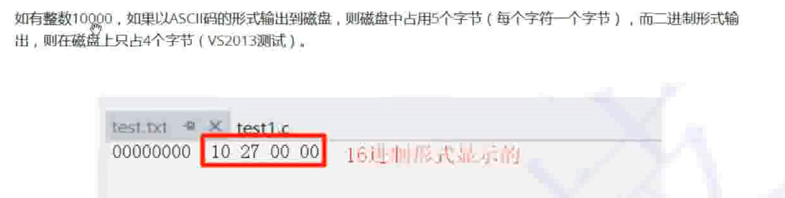

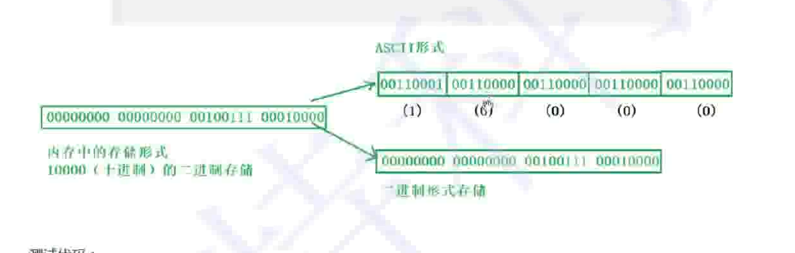


## 示例

```C
#include <stdio.h>

int main()
{
	int a = 10000;
	FILE* pf = fopen("test.txt", "wb");//w：写   b：以二进制的形式来写
	fwrite(&a, 4, 1, pf);//以二进制的形式写入文件中
	//表示数据来自a，
	//写的数据的类型是4个字节的;
	//写一个这种类型的数据;
	//写到pf指针所指的地方
	fclose(pf);
	pf = NULL;
	return 0;
}
```

此时用文本编辑器打开,看见的是乱码

而用vs的二进制编辑器打开，看见的才是10000的16进制代码


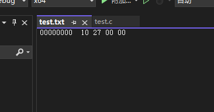

# 文件缓冲区

ANSIC标准采用**缓冲文件系统**来处理是护具文件，指的是系统自动在内存中为程序开辟一个**文件缓冲区**


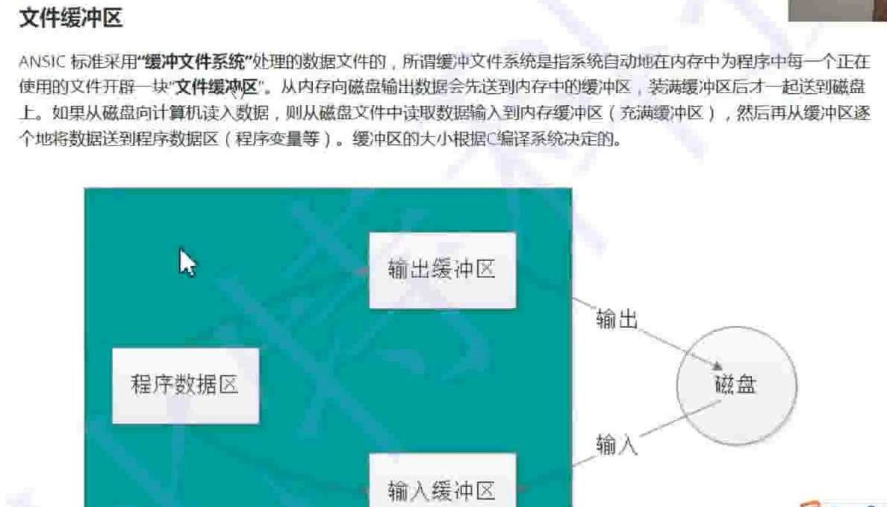

缓冲区又分为输入缓冲区和输出缓冲区

缓冲区的大小根据C编译系统所决定。

# 文件指针

每个被使用的文件都在内存中开辟了一个相应的文件信息区，用来存放文件的相关信息（如文件的名字，文件状态及文件当前的位置等）。这些信息是保存在一个结构体变量中的。该结构体类型是有系统声明的，取名FILE.

## VS中的文件指针 

```C
struct _iobuf {
	char* _ptr;
	int  _cnt;
	char* _base;
	int  _flag;
	int  _file;
	int  _charbuf;
	int  _bufsiz;
	char* _tmpfname;
};
typedef struct _iobuf FILE;
```

不同的C编译器的FILE类型包含的内容不完全相同，但是大同小异。

每当打开一个文件的时候，系统会根据文件的情况自动创建一个FILE结构的变量，并填充其中的信息，使用者不必关心细节。

一般都是通过一个FILE的指针来维护这个FILE结构的变量，这样使用起来更加方便。

创建一个FILE*的指针变量:

```c
FILE* pf;
```

# 文件的打开和关闭

文件在读写之前应该先打开文件，在使用结束之后应该关闭文件；

在编写程序的时候，在打开文件的同时，都会返回一个FILE*的指针变量指向该文件，也相当于建立了指针和文件的关系。

## fopen

```C
//打开文件
FILE * fopen ( const char * filename, const char * mode );
```

```C
int main()
{
	//打开文件test.txt
	// 相对路径
	// . 表示当前路径
	// .. 表示上一级路径
	// ../.. 表示上上级路径
	//fopen("../test1.txt", "r");
	

	//绝对路径
	//fopen("F:\\05-能力提升\\16-C语言提升\\02-代码编写\\29-文件操作\\29-文件操作\\test.txt", "r");

	FILE* pf = fopen("test.txt", "r");

	if (pf == NULL)
	{
		//打开失败
		printf("%s\n", strerror(errno));
		return 0;
	}
	else
	{
		printf("打开成功\n");
	}
	//打开成功
	//读文件
	//关闭文件
	fclose(pf);
	pf = NULL;;

	return 0;
}
```

### 打开模式

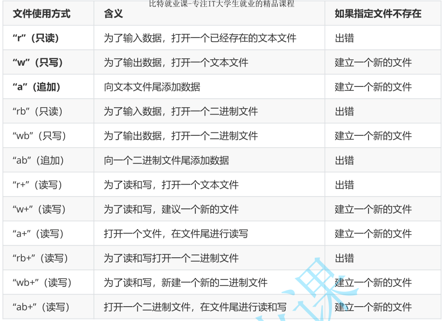

### 打开文件时发生的事情

文件指针内部的信息建立与文件的联系

打开失败则返回NULL

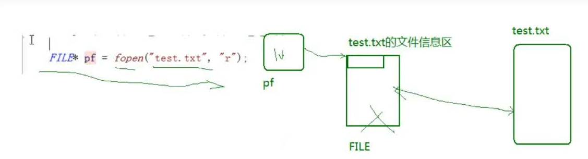


## fclose

```C
//关闭文件
int fclose ( FILE * stream );
```


# 文件的顺序读写

## 读写的函数

1. fgetc fputc ：   操作完之后会自动移到下一位
2. fgets fputs
3. fscanf fprintf
4. fread fwrite


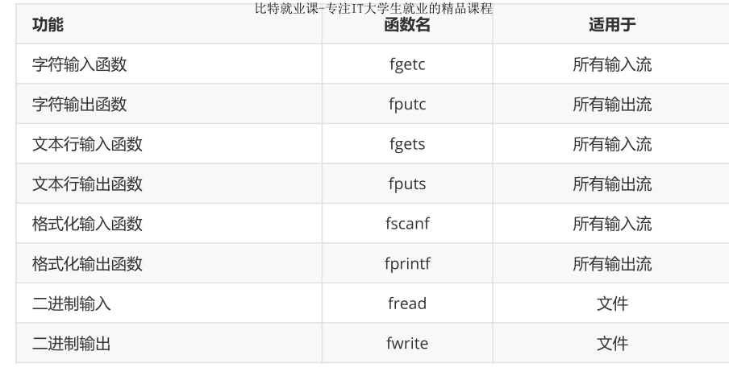


## fputc写入文件
```C
int main()
{
	//打开文件
	FILE* pfwrite = fopen("TEST1.txt", "w");
	if (pfwrite == NULL)
	{
		printf("%s\n", strerror(errno));
		return 0;
	}
	//写文件
	fputc('x', pfwrite);
	fputc('y', pfwrite);
	fputc('z', pfwrite);
	//关闭文件
	fclose(pfwrite);
	pfwrite = NULL;
	return 0;
}
```

## fgetc读取文件

使用格式
```C
fgetc(FILE* PF)
```


```C
int main()
{
	//打开文件
	FILE* pfread = fopen("TEST1.txt", "r");
	if (pfread == NULL)
	{
		printf("%s\n", strerror(errno));
		return 0;
	}
	//读文件
	printf("%c ", fgetc(pfread));
	printf("%c ", fgetc(pfread));
	printf("%c ", fgetc(pfread));
	//关闭文件
	fclose(pfread);
	pfread = NULL;
	return 0;
}
```

## 标准输入输出流

从键盘输入 输出到屏幕

键盘和屏幕都是外部设备

键盘：标准输入设备
屏幕：标准输出设备

这两个都是程序默认打开的两个流设备

三个默认打开的流：

stdin   FLIE*
stdout  FLIE*
stderr  FLIE*


标准输入输出流不用打开
文件流需要打开和关闭

```C
int main()
{
	//标准输入流
	int ch = fgetc(stdin);
	//标准输出流
	fputc(ch, stdout);

	return 0;
}
```

## fgets文本行输入

适用于所有输入流

函数使用格式

```C
char *fgets( char *string, int n, FILE *stream );
```

string：Storage location for data 读出来的数据的存放位置
n: 最大读取数量
stream：从哪里读？
返回值：读取的字符串的起始位置，读取失败则返回空指针；


读取完成之后，函数依旧会自动往后移

```C
int main()
{
	char buf[1024] = { 0 };
	//打开文件
	FILE* pf = fopen("test.txt", "r");
	if (pf == NULL)
	{
		printf("%s\n", strerror(errno));

		return 0;
	}
	//读取文件
	fgets(buf,1024,pf);
	printf("%s",buf);//文件本身有一个换行
	fgets(buf, 1024, pf);
	printf("%s",buf);//

	//关闭文件
	fclose(pf);
	pf = NULL;
    return 0;
}
```

## puts标准字符串输出

将流文件输出到标准输出流中（屏幕上）

```C
int main()
{
	char buf[1024] = { 0 };
	//打开文件
	FILE* pf = fopen("test.txt", "r");
	if (pf == NULL)
	{
		printf("%s\n", strerror(errno));

		return 0;
	}
	//读取文件
	fgets(buf, 1024, pf);
	puts(buf);//将流文件输出到标准输入输出流中 puts会自动增加换行
	fgets(buf, 1024, pf);
	puts(buf);//将流文件输出到标准输入输出流中 puts会自动增加换行

	//关闭文件
	fclose(pf);
	pf = NULL;
	return 0;
}
```

## gets标准输入

```C
int main()
{
	char buf[1024] = { 0 };
	gets(buf);
	puts(buf);

	return 0;
}
```


## fputs文本行输出

Write a string to a stream.

```C
int fputs( const char *string, FILE *stream );
```

Return Value:
Each of these functions returns a nonnegative value if it is successful. On an error, fputs returns EOF, and fputws returns WEOF.

string:Output string

stream:Pointer to FILE structure


### 使用示例
```C
int main()
{
	char buf[1024] = { 0 };
	//打开文件
	FILE* pf = fopen("test.txt", "w");
	if (pf == NULL)
	{
		printf("%s\n", strerror(errno));

		return 0;
	}
	//写文件
	fputs("Hello\n", pf);
	fputs("Word!!", pf);

	//关闭文件
	fclose(pf);
	pf = NULL;
}
```

### 标准输入输出

```C
int main()
{
	char buf[1024] = { 0 };

	fgets(buf, 1024, stdin);
	fputs(buf, stdout);

	return 0;
}
```


## fprintf 格式化输出

### fprintf与printf

fprintf:
```C
int fprintf( FILE *stream, const char *format [, argument ]...);
```

printf:
```C
int printf( const char *format [, argument]... );
```

两者的区别：前者可以从多种流输出，后者针对标准流

### fprintf的使用

```c
int main()
{
	s s1 = { 3,3.14f,"hello" };
	//打开文件
	FILE* pf = fopen("test.txt", "w");
	if (pf == NULL)
	{
		return 0;
	}
	//写文件
	fprintf(pf, "%d %.2f %-20s", s1.n, s1.f, s1.arr);//格式化输出文件
	printf("%d %.2f %-20s", s1.n, s1.f, s1.arr);//fprintf与printf的区别其实并不大
	//关闭文件
	fclose(pf);
	pf = NULL;
	return 0;
}
```
## fsacanf格式化输入

### fscanf与scanf


```C
int fscanf( FILE *stream, const char *format [, argument ]... );

int scanf( const char *format [,argument]... );
```

同样，二者区别不大

### fscanf的使用

```C
typedef struct s
{
	int n;
	float f;
	char arr[20];
}s;

int main()
{
	s s = { 0 };
	//打开文件
	FILE* pf = fopen("test.txt", "r");
	if (pf == NULL)
	{
		return 0;
	}
	//读取文件
	fscanf(pf,"%d %f %s",&(s.n),&(s.f),s.arr);
	//scanf("%d %f %s", &(s.n), &(s.f), s.arr);
	printf("%d %.2f %-20s", s.n, s.f, s.arr);
	//关闭文件
	fclose(pf);
	pf = NULL;
	return 0;
}
```

##fscanf与fprintf的标准输入输出

```C
typedef struct s
{
	int n;
	float f;
	char arr[20];
}s;

int main()
{
	s s1 = { 0 };
	fscanf(stdin, "%d %f %s", &(s1.n), &(s1.f), s1.arr);
	fprintf(stdout, "%d %.2f %s", s1.n, s1.f, s1.arr);
	return 0;
}
```

## 函数对比

### scanf与printf

是针对标准输入流/标准输出流的格式化输入/输出语句

### fscanf与fprintf
是针对所有输入流/标准输出流的格式化输入/输出语句

### sscanf与sprintf
sscanf:从字符串中读取格式化的数据
sprintf:将格式化的数据输出为字符串


#### sscanf

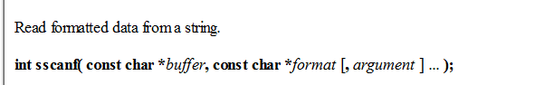


把buf中数据读取到tmp

```C
typedef struct S
{
	int n;
	float f;
	char arr[20];
}ss;

int main()
{
	ss s = { 100,3.14f,"abcdef" };
	ss tmp = { 0 };
	char buf[1024] = { 0 };

	sprintf(buf,"%d %.2f %s", s.n, s.f, s.arr);
	printf("%s\n", buf);
	sscanf(buf,"%d %f %s", &(tmp.n), &(tmp.f), tmp.arr);
	printf("%d %.2f %s", tmp.n, tmp.f, tmp.arr);
	return 0;
}
```

#### sprintf

将格式化的数据转化为字符串，并存入char* buffer中

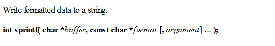

打印出来的数据其实是一个字符串

# fread和fwrite

以二进制的形式进行信息的读写

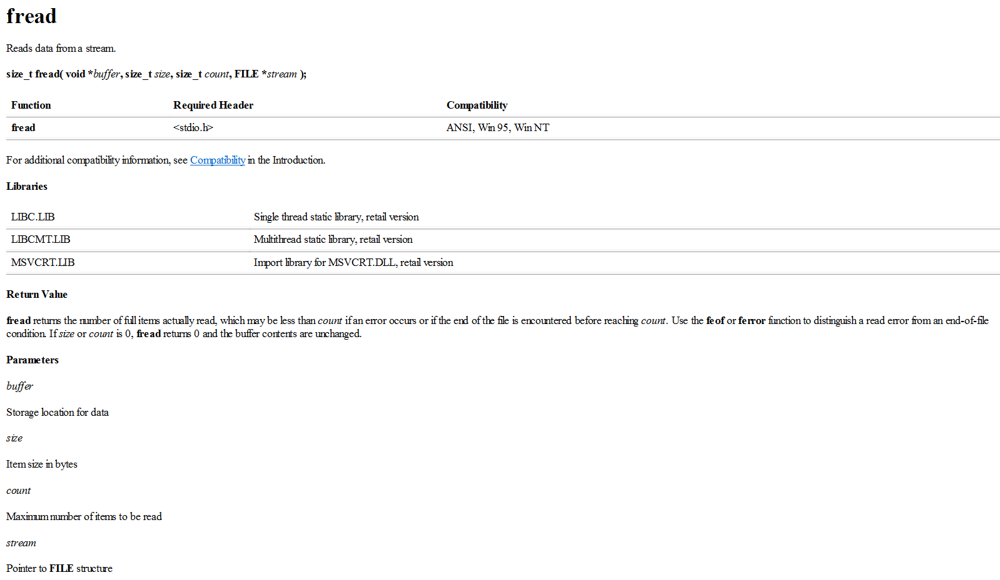


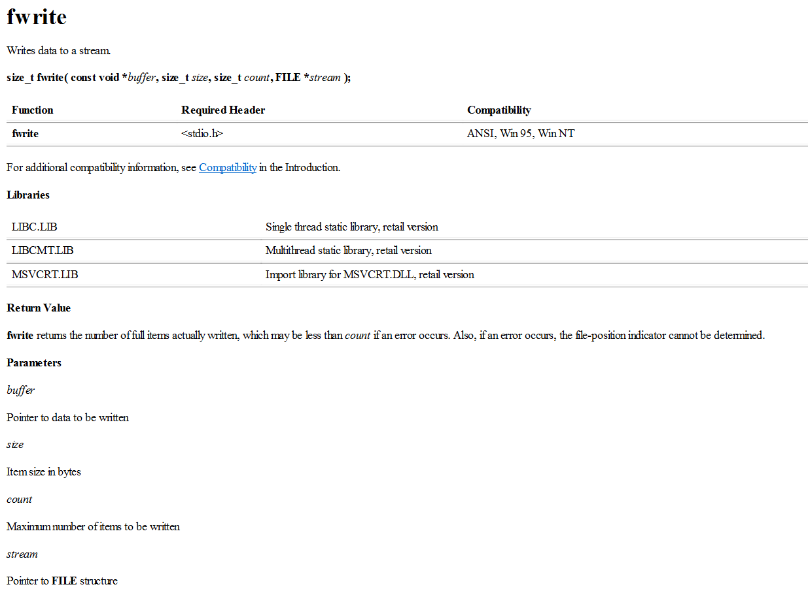

## fread

```C
typedef struct S
{
	char namr[20];
	int age;
	double score;
}S;

int main()
{
	S tmp = { 0 };

	//打开文件
	FILE* pf = fopen("test.txt", "rb");
	if (pf == NULL)
	{
		return 0;
	}
	//二进制形式写文件
	fread(&tmp, sizeof(S), 1, pf);

	//关闭文件
	fclose(pf);
	pf = NULL;
	return 0;
}
```


## fwrite

```C
typedef struct S
{
	char namr[20];
	int age;
	double score;
}S;

int main()
{
	S s = { "xyz",18,100.0 };

	//打开文件
	FILE* pf = fopen("test.txt", "wb");
	if (pf == NULL)
	{
		return 0;
	}
	//二进制形式写文件
	fwrite(&s, sizeof(S), 1, pf);
	
	//关闭文件
	fclose(pf);
	pf = NULL;
	return 0;
}
```


# 文件的随机读写


# 文件结束的判定


