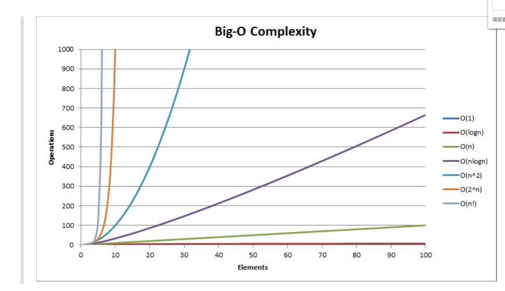
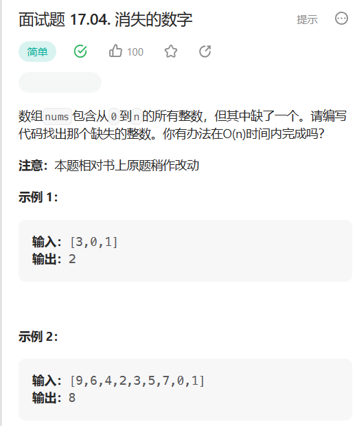
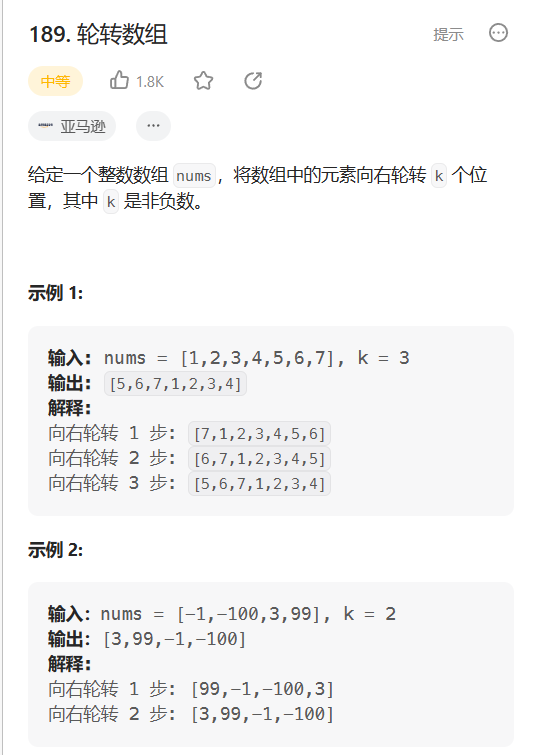

---

# 注释：文件开头使用YAML语法配置文章信息，之后是正常的Markdown语法
# Note: The beginning of the file uses YAML syntax to configure the blog meta data, followed by the normal Markdown syntax.

# 此处如果不配置标题，则提取Markdown中的一级标题，或使用文件名
# Title will be extracted from heading 1 of markdown or using file name if not configured here.
title: 01-时间复杂度和空间复杂度

# 此处如果不配置摘要，则从正文提取开头若干文字
# Abstract will be extracted from the begining of markdown content if not configured here.
abstract: 本节将主要了解数据结构与算法中的算法效率，时间复杂度，空间复杂度等概念
# URL is used for permalink and article editing, and it is recommended to be configured.
url: DataStructureandAlgorithm-01

# 文章发布时间，使用的时区和系统设置一致，不设置则使用当前时间
# Article post time, time zone is the same as the system settings. Current time will be used if not configured here.
date: 2023-07-10 20:00:01

# 文章分类
category:
- 数据结构与算法

# 文章标签
tags:
- C
- 数据结构与算法

---

# 01-时间复杂度和空间复杂度

# 本节目标

+ 算法效率
+ 时间复杂度
+ 空间复杂度

复杂度：是用来分析写的程序运行时所消耗的时间和空间的

# 算法效率

算法效率分析分为两种：第一种是**时间效率**，第二种是**空间效率**。时间效率被称为时间复杂度，而空间效率被称作空间复杂度。 时间复杂度主要衡量的是一个算法的运行速度，而空间复杂度主要衡量一个算法所需要的额外空间，在计算机发展的早期，计算机的存储容量很小。所以对空间复杂度很是在乎。但是经过计算机行业的迅速发展，计算机的存储容量已经达到了很高的程度。所以我们如今已经不需要再特别关注一个算法的空间复杂度。

# 时间复杂度

**算法中的基本操作的执行次数，为算法的时间复杂度。**

时间复杂度的定义：在计算机科学中，算法的时间复杂度是一个函数，它定量描述了该算法的运行时间。一个算法执行所耗费的时间，从理论上说，是不能算出来的，只有你把你的程序放在机器上跑起来，才能知道。但是我们需要每个算法都上机测试吗？是可以都上机测试，但是这很麻烦，所以才有了时间复杂度这个分析方式。一个算法所花费的时间与其中语句的执行次数成正比例。

## 时间复杂度的表示法

*大O计数法：是用于描述函数渐进行为的数学符号。

推导方法：
1、用常数1取代运行时间中的所有加法常数。
2、在修改后的运行次数函数中，只保留最高阶项。
3、如果最高阶项存在且不是1，则去除与这个项目相乘的常数。得到的结果就是大O阶。

## O(n)的准确性

有些算法的时间复杂度存在最好、平均和最坏情况：
最坏情况：任意输入规模的最大运行次数(上界)
平均情况：任意输入规模的期望运行次数
最好情况：任意输入规模的最小运行次数(下界)

在实际中一般情况关注的是算法的最坏运行情况，所以数组中搜索数据时间复杂度为O(N)。

## 常见的时间复杂度

# 空间复杂度

空间复杂度是对一个算法在运行过程中**临时占用存储空间大小的量度** 。空间复杂度不是程序占用了多少bytes的空间，因为这个也没太大意义，所以空间复杂度算的是变量的个数。空间复杂度计算规则基本跟实践复杂度类似，也使用**大O渐进表示法**。

主要是计算变量的个数。

# 有复杂度限制的算法题

## 1 消失的数

### 思路1 排序
O(N*logN)

### 思路2 相加再减

O(N)

### 异或
异或： 相同为0，相异为1 （按位处理）

数组中的所有数依次跟0-n的数异或，最后的值就是缺的数了。

## 2 旋转数组

### 思路一

逐步右移

### 思路二

以空间换时间

一次性换k个

### 逆置

后k个逆置，再前n-k个逆置，再整体逆置

29/02-数据结构网课/FILES/01-时间复杂度和空间复杂度.md/img-20230329103045.png)

# 空间复杂度

空间复杂度是对一个算法在运行过程中**临时占用存储空间大小的量度** 。空间复杂度不是程序占用了多少bytes的空间，因为这个也没太大意义，所以空间复杂度算的是变量的个数。空间复杂度计算规则基本跟实践复杂度类似，也使用**大O渐进表示法**。

主要是计算变量的个数。

# 有复杂度限制的算法题

## 1 消失的数

### 思路1 排序
O(N*logN)

### 思路2 相加再减

O(N)

### 异或
异或： 相同为0，相异为1 （按位处理）

数组中的所有数依次跟0-n的数异或，最后的值就是缺的数了。

## 2 旋转数组

### 思路一

逐步右移

### 思路二

以空间换时间

一次性换k个

### 逆置

后k个逆置，再前n-k个逆置，再整体逆置

