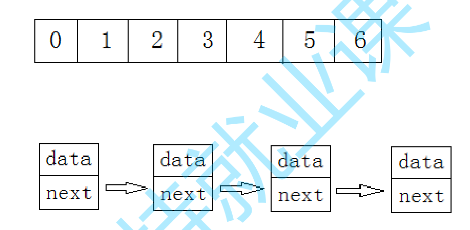

---

# 注释：文件开头使用YAML语法配置文章信息，之后是正常的Markdown语法
# Note: The beginning of the file uses YAML syntax to configure the blog meta data, followed by the normal Markdown syntax.

# 此处如果不配置标题，则提取Markdown中的一级标题，或使用文件名
# Title will be extracted from heading 1 of markdown or using file name if not configured here.
title: 02-线性表之顺序表

# 此处如果不配置摘要，则从正文提取开头若干文字
# Abstract will be extracted from the begining of markdown content if not configured here.
abstract: 本节将主要了解数据结构与算法中的顺序表：包括数组与链表，栈，队列，字符串等相关概念。
# URL用于固定链接、编辑文章功能，建议所有文章都配置
# URL is used for permalink and article editing, and it is recommended to be configured.
url: DataStructureandAlgorithm-02

# 文章发布时间，使用的时区和系统设置一致，不设置则使用当前时间
# Article post time, time zone is the same as the system settings. Current time will be used if not configured here.
date: 2023-07-10 20:00:02

# 文章分类
category:
- 数据结构与算法

# 文章标签
tags:
- C
- 数据结构与算法

---

# 02-线性表之顺序表

# 线性表
线性表（linear list）是n个具有相同特性的数据元素的有限序列。 线性表是一种在实际中广泛使用的数据结构，常见的线性表：顺序表、链表、栈、队列、字符串...

线性表在逻辑上是线性结构，也就说是连续的一条直线。但是在物理结构上并不一定是连续的，线性表在物理上存储时，通常以数组和链式结构的形式存储。

数组：空间连续
链表：空间不连续

# 顺序表实现

## 概念及结构

顺序表是用一段物理地址连续的存储单元依次存储数据元素的线性结构，一般情况下采用数组存储。在数组上完成数据的增删查改。

顺序表一般可以分为：

1. 静态顺序表：使用定长数组存储。
2. 动态顺序表：使用动态开辟的数组存储(malloc);

# leetcode

## 27. 移除元素
https://leetcode.cn/problems/remove-element/

解题思路：快慢指针

## 88. 合并两个有序数组
https://leetcode.cn/problems/merge-sorted-array/submissions/420078948/

解题思路；逆向双指针

