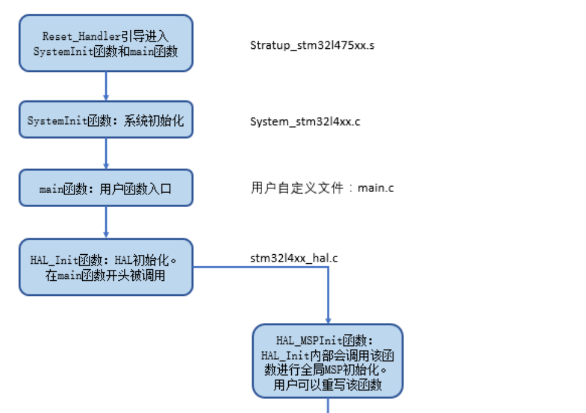
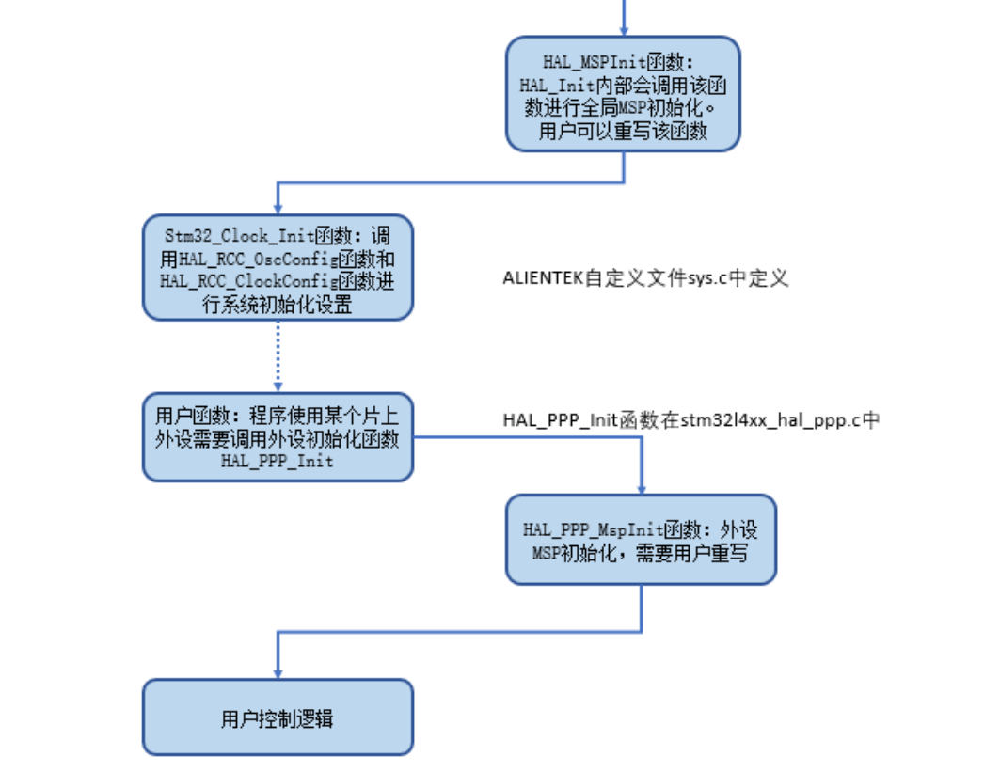
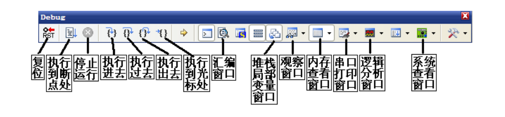
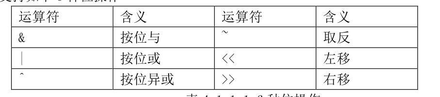
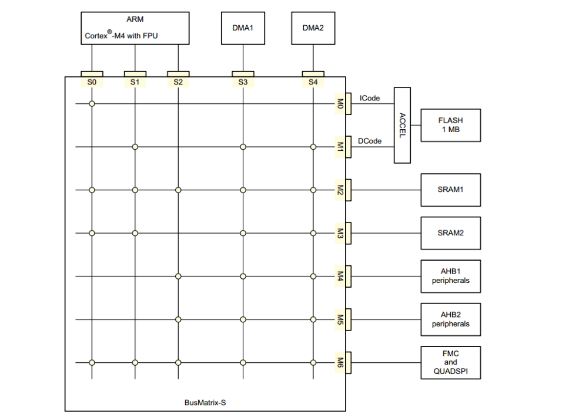
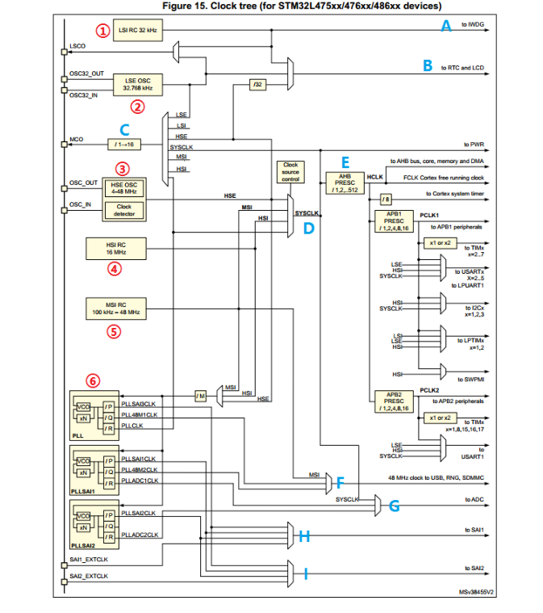
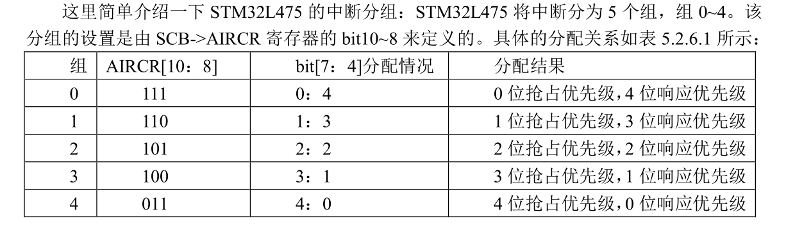
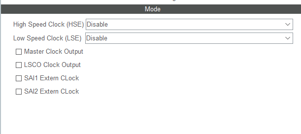

# 00-MDK5入门
# __weak 修饰符讲解

weak 顾名思义是“弱”的意思，所以如果函数名称前面加上__weak 修饰符，我们一般称
这个函数为“弱函数”。加上了__weak 修饰符的函数，用户可以在用户文件中重新定义一个同名函数，最终编译器编译的时候，会选择用户定义的函数，如果用户没有重新定义这个函数，那么编译器就会执行__weak 声明的函数，并且编译器不会报错。

用 户 函 数 usart_init→ HAL_UART_Init→HAL_UART_MspInit。
就是先初始化与MCU无关的东西，再通过逻辑判断去初始化和单片机有关的引脚等

# 程序执行流程图






# Debug 工具条




# STM32L4基础知识入门

## MDK下C语言复习

### 位操作



### define宏定义

```C
#define 标识符 字符串
#define HSI_VALUE ((uint32_t)16000000)
```

### ifdef和if defined条件编译

```C
#ifdef 标识符
程序段 1
#else
程序段 2
#endif
```

```C
#ifdef
程序段 1
#endif
```

```C
#if defined XXX1
程序段 1
#elif defined XXX2
程序段 2
…
#elif defined XXXn
程序段 n
…
#endif
```

### extern 变量声明

C 语言中 extern 可以置于变量或者函数前，以表示变量或者函数的定义在别的文件中，提示编译器遇到此变量和函数时在其他模块中寻找其定义。

```C
extern u16 USART_RX_STA;
```

### typedef类型别名

```C
typedef struct
{
    __IO uint32_t MODER;
    __IO uint32_t OTYPER;
    …
} GPIO_TypeDef;
```

### 结构体

```C
Struct 结构体名
{
    成员列表;

}变量名列表；
```

结构体指针成员变量引用方法是通过“->”符号实现


## STM32L4总线架构简介



### 总线

主系统由 32 位多层 AHB 总线矩阵构成，总线矩阵可实现以下部分互连:

#### 五条主控总线

- Cortex-M4 内核 I 总线，D 总线和 S 总线
- DMA1 存储器总线
- DMA2 存储器总线

① I 总线(S0)：此总线用于将 Cortex-M4 内核的指令总线连接到总线矩阵。内核通过此总线获取指令。此总线访问的对象是包括代码的存储器。
② D 总线(S1)：此总线用于将 Cortex-M4 数据总线连接到总线矩阵。内核通过此总线进行立即数加载和调试访问。
③ S 总线(S2)： 此总线用于将 Cortex-M4 内核的系统总线连接到总线矩阵。此总线用于访问位于外设或 SRAM 中的数据。
④ DMA 存储器总线（S3,S4）： 此总线用于将 DMA 存储器总线主接口连接到总线矩阵。DMA 通过此总线来执行存储器数据的传入和传出，以及 AHB 外设或执行存储器之间的数据传输。

#### 八条被控总线

- 内部 FLASH ICode 总线
- 内部 FLASH DCode 总线
- 内部 SRAM1
- 内部 SRAM2
- AHB1 外设
- AHB2 外设
- FMC 和 QSPI


## STM32L4时钟系统

### STM32L4时钟树概述



在 STM32L475 中，有 6 个重要的时钟源，为 HSI、HSE、LSI、LSE、MSI、PLL。其中PLL 实际是分为三个时钟源，分别为主 PLL 和、PLLISAI1 和 PLLSAI2。从时钟频率来分可以分为高速时钟源和低速时钟源， 从时钟频率来分可以分为高速时钟源和低速时钟源，在这 6个中 HSI，HSE，MSI 以及 PLL 是高速时钟，LSI 和 LSE 是低速时钟。从来源可分为外部时钟源和内部时钟源，外部时钟源就是从外部通过接晶振的方式获取时钟源，其中HSE 和 LSE 是外部时钟源，其他的是内部时钟源。

① LSI 是低速内部时钟，RC 振荡器，频率为 32kHz 左右。供独立看门狗、RTC 和 LCD使用。

② LSE 是低速外部时钟，接频率为 32.768kHz 的石英晶体。这个主要是 RTC 的时钟源。

③ HSE 是高速外部时钟，可接石英/陶瓷谐振器，或者接外部时钟源，频率范围为4MHz-48MHz。我们的开发板接的是 8MHz 的晶振。HSE 也可以直接做为系统时钟或者 PLL 输入。

④ HSI 是高速内部时钟，RC 振荡器，频率为 16MHz。可以直接作为系统时钟或者用作PLL 输入。

⑤ MSI 时钟信号由内部 RC 振荡器产生。其频率范围可通过时钟控制寄存器(RCC_CR)中的 MSIRANGE[3:0]位进行调整。

⑥ PLL 为锁相环倍频输出。STM32L4 有三个 PLL：

1) 主PLL(PLL)可由HSE、HIS或者MSI提供时钟信号，并具有三个不同的输出时钟。
第一个输出 PLLR，用于生成高速的系统时钟（SYSTEM，最高 80MHz）
第二个输出 PLLQ，可为 USB、RNG 和 SDMMC 提供时钟源
第三个输出 PLLP，可用于 SAI1 和 SAI2 时钟
2) PLLSAI1 用于生成精确时钟，同样具有三个不同的输出时钟。
第一个输出 PLLSAI1P，可用于 SAI1 和 SAI2 时钟
第二个输出 PLLSAI1Q，可为 USB、RNG 和 SDMMC 提供时钟源。
第三个输出 PLLSAI1R，可为 ADC 提供时钟
3) PLLSAI2 用于生成精确时钟，具有两个不同的输出时钟。
第一个输出 PLLSAI2P，可用于 SAI1 和 SAI2 时钟
第二个输出 PLLSAI2R，可为 ADC 提供时钟


#### 九个重要时钟

1. 看门狗时钟源只能是低速的 LSI 时钟
2.  RTC 与 LCD 时钟源可以选择 LSI、LSE 以及 HSE 分频后的时钟，HSE 分频系数为 2~31。
3. MCO 是向芯片 PA8 引脚输出时钟。它有七个时钟来源分别为：LSE、LSI、HSE、SYSCLK、MSI、HSI 和 PLL 时钟。
4. SYSCLK 系统时钟来源有四个方面：HSI，HSE、MSI 和 PLL。本文档涉及到的程序例程中时钟源来自 HSE。
5.  PWR 时钟、AHB 时钟、APB1 时钟和 APB2 时钟。这些时钟都是来源于SYSCLK系统时钟。其中AHB、APB1和APB2时钟都是经过SYSCLK时钟分频得来，并且这三个时钟最大频率为 80MHz。
6.  48MHz 时钟，主要用于 USB、RNG、SDMMC 时钟。这里的时钟源来自三个方面：MSI、PLLQ 和 PLLSAI1Q。
7.  ADC 的时钟，这里的时钟源来自三个方面：SYSCLK、PLLSAI1R 和 PLLSAI2R。
8.  SAI1 的时钟，这里的时钟源来自四个方面：PLLP、PLLSAI1P、PLLSAI2P 和SAI1_EXTCLK。
9.  SAI2 的时钟，这里的时钟源来自四个方面：PLLP、PLLSAI2P、PLLSAI2P 和SAI2_EXTCLK。

**时钟输出中，有很多是带使能控制的，例如 AHB 总线时钟、内核时钟、各种APB1 外设、 APB2 外设等等。当需要使用某模块时，记得一定要先使能对应的时钟。**


### STM32L4时钟系统配置

使用 HAL 库配置 STM32L4 时钟系统的一般步骤：
1) 使能 PWR 时钟：调用函数__HAL_RCC_PWR_CLK_ENABLE()
2) 配置时钟源相关参数：调用函数 HAL_RCC_OscConfig()。
3) 配置系统时钟源以及 SYSCLK、AHB,APB1 和 APB2 的分频系数：调用函数HAL_RCC_ClockConfig()。
4) 设置调压器输出电压级别：调用函数 HAL_PWREx_ControlVoltageScaling ()

+ 对于步骤 1 之所以要使能 PWR 时钟，是因为后面的步骤设置调压器输出电压级别是电源控制相关配置，所以必须开启 PWR 时钟。


+ 对 于 步 骤 2 ， 使 用 HAL 库 来 配 置 时 钟 源 相 关 参 数 ， 我 们 调 用 的 函 数 为HAL_RCC_OscConfig(),该函数在 HAL 库关键头文件 stm32l4xx_hal_rcc.h 中声明，在文件stm32l4xx_hal_rcc.c 中定义。
```C
HAL_StatusTypeDef HAL_RCC_OscConfig(RCC_OscInitTypeDef *RCC_OscInitStruct)
```
该函数只有一个入口参数，就是结构体 RCC_OscInitTypeDef 类型指针。接下来我们看看结构体 RCC_OscInitTypeDef 的定义：
```C
typedef struct
{
uint32_t OscillatorType; //需要选择配置的振荡器类型
uint32_t HSEState; //HSE 状态
uint32_t LSEState; //LSE 状态
uint32_t HSIState; //HIS 状态
uint32_t HSICalibrationValue; //HIS 校准值
uint32_t LSIState; //LSI 状态
uint32_t MSIState //MSI 的状态
uint32_t MSICalibrationValue; //MSI 校准值
uint32_t MSIClockRange; //MSI 时钟范围
uint32_t HSI48State; //HSI48 状态
RCC_PLLInitTypeDef PLL; //PLL 配置
}RCC_OscInitTypeDef;
```
对于这个结构体，前面几个参数主要是用来选择配置的振荡器类型。比如我们要开启 HSE，那么我们会设置 OscillatorType 的值为 RCC_OSCILLATORTYPE_HSE，然后设置 HSEState 的值为 RCC_HSE_ON 开启 HSE。对于其他时钟源 HSI,LSI 和 LSE，配置方法类似。这个结构体还有一个很重要的成员变量是 PLL，它是结构体 RCC_PLLInitTypeDef 类型。它的作用是配置 PLL
相关参数，我们来看看它的定义：
```C
typedef struct
{
uint32_t PLLState; //PLL 状态
uint32_t PLLSource; //PLL 时钟源
uint32_t PLLM; //PLL 分频系数 M
uint32_t PLLN; //PLL 倍频系数 N
uint32_t PLLP; //PLL 分频系数 P
uint32_t PLLQ; //PLL 分频系数 Q
uint32_t PLLR; //PLL 分频系数 R
}RCC_PLLInitTypeDef;
```
从 RCC_PLLInitTypeDef;结构体的定义很容易看出该结构体主要用来设置 PLL 时钟源以及相关分频倍频参数。


+ 步骤 3 中提到的 HAL_RCC_ClockConfig()函数，声明如下：
```C
HAL_StatusTypeDef HAL_RCC_ClockConfig(RCC_ClkInitTypeDef *RCC_ClkInitStruct,uint32_t FLatency);
```

入口参数：
RCC_ClkInitTypeDe
FLatency 

SystemClock_Config的配置内容
```C
*选中 PLL 作为系统时钟源并且配置 SYSCLK、PCLK1、PCLK2*/
RCC_ClkInitStruct.ClockType=RCC_CLOCKTYPE_HCLK |
RCC_CLOCKTYPE_SYSCLK |
RCC_CLOCKTYPE_PCLK1 |
RCC_CLOCKTYPE_PCLK2;
RCC_ClkInitStruct.SYSCLKSource = RCC_SYSCLKSOURCE_PLLCLK;
RCC_ClkInitStruct.AHBCLKDivider = RCC_SYSCLK_DIV1;
RCC_ClkInitStruct.APB1CLKDivider = RCC_HCLK_DIV1;
RCC_ClkInitStruct.APB2CLKDivider = RCC_HCLK_DIV1;
ret = HAL_RCC_ClockConfig(&RCC_ClkInitStruct, FLASH_LATENCY_4);
```

第一个参数 ClockType 配置说明我们要配置的是 SYSCLK，HCLK、PCLK2、PCLK1 四个时钟。
第二个参数 SYSCLKSource 配置选择系统时钟源为 PLL。
第三个参数 AHBCLKDivider 配置 AHB 分频系数为 1。
第四个参数 APB1CLKDivider 配置 APB1 分频系数为 1。
第五个参数 APB2CLKDivider 配置 APB2 分频系数为 1。

PLL 时钟为 PLLCLK=HSE*N/（M*R）=8MHz*20/(1*2)=80MHz，同时我们选择系统时钟源为 PLL，所以系统时钟 SYSCLK=80MHz。AHB 分频系数为 1，故其频率为 HCLK=SYSCLK/1=80MHz。APB1 分频系数为 1，故其频率为PCLK1=HCLK/1=80MHz。APB2 分频系数为 1，故其频率为 PCLK2=HCLK/1=80MHz

### 关键时钟频率

```C
SYSCLK(系统时钟) =80MHz
PLL 主时钟 =80MHz
AHB 总线时钟（HCLK=SYSCLK/1） =80MHz
APB1 总线时钟（PCLK1=HCLK/1） =80MHz
APB2 总线时钟（PCLK2=HCLK/1） =80MHz
```

### STM32L4时钟使能和配置

如果在使用外设之前没有使能外设时钟，这个外设是不可能正常运行的。

## IO引脚复用器和映射

一个 GPIO如果可以复用为内置外设的功能引脚，那么当这个 GPIO 作为内置外设使用的时候，就叫做复用

STM32L4 系列微控制器 IO 引脚通过一个复用器连接到内置外设或模块。该复用器一次只允许一个外设的复用功能（AF）连接到对应的 IO 口。这样可以确保共用同一个 IO 引脚的外设之间不会发生冲突。
每个 IO 引脚都有一个复用器，该复用器采用 16 路复用功能输入（AF0 到 AF15），可通过GPIOx_AFRL(针对引脚 0-7)和 GPIOx_AFRH（针对引脚 8-15）寄存器对这些输入进行配置：

1）完成复位后，所有 IO 都会连接到系统的复用功能 0（AF0）。
2）外设的复用功能映射到 AF1 到 AF13。
3）Cortex-M4 EVENTOUT 映射到 AF15。


在微控制器完成复位后，所有 IO 口都会连接到系统复用功能 0（AF0）。这里大家需要注意，对于系统复用功能 AF0，我们将 IO 口连接到 AF0 之后，还要根据所用功能进行配置

1) JTAG/SWD:在器件复位之后，会将这些功能引脚指定为专用引脚。也就是说，这些引脚在复位后默认就是 JTAG/SWD 功能。如果我们要作为 GPIO 来使用，就需要对对应的 IO 口复用器进行配置。
2) RTC_REFIN:此引脚在系统复位之后要使用的话要配置为浮空输入模式。
3) MCO：这些引脚在系统复位之后要使用的话要配置为复用功能模式。

**， 除了 C ADC 和 C DAC 要将 O IO 配置为模拟通道之外其他外设功能一律要配置为复用功能模式，**


对于 GPIO 初始化结构体成员变量 Alternate 的取值范围，在 HAL 库中的文件stm32l4xx_hal_gpio_ex.h 里面有详细定义，取值范围如下：

```c
#define GPIO_AF0_RTC_50Hz ((uint8_t)0x00)
#define GPIO_AF0_MCO ((uint8_t)0x00)
#define GPIO_AF0_SWJ ((uint8_t)0x00)
#define GPIO_AF0_TRACE ((uint8_t)0x00)
/***********此处省略其他代码******************/
#define GPIO_AF15_EVENTOUT ((uint8_t)0x0F)
```

## STM32 NVIC中断优先级管理

CM4 内核支持 256 个中断，其中包含了 16 个内核中断和 240 个外部中断，并且具有 256级的可编程中断设置。

STM32L475xx 的 100 个中断里面，包括 10 个内核中断和 90 个可屏蔽中断，具有 16 级可编程的中断优先级

NVIC相关寄存器结构体：
```C
typedef struct
{
__IOM uint32_t ISER[8U]; //Interrupt Set Enable Register
uint32_t RESERVED0[24U];
__IOM uint32_t ICER[8U]; //Interrupt Clear Enable Register
uint32_t RSERVED1[24U];
__IOM uint32_t ISPR[8U]; //Interrupt Set Pending Register
uint32_t RESERVED2[24U];
__IOM uint32_t ICPR[8U]; //Interrupt Clear Pending Register
uint32_t RESERVED3[24U];
__IOM uint32_t IABR[8U]; //Interrupt Active bit Register
uint32_t RESERVED4[56U];
__IOM uint8_t IP[240U]; //Interrupt Priority Register (8Bit wide)
uint32_t RESERVED5[644U];
__OM uint32_t STIR; //Software Trigger Interrupt Register
} NVIC_Type;
```

重点寄存器介绍：

ISER[8]：ISER 全称是：Interrupt Set Enable Registers，这是一个中断使能寄存器组。上面说了 CM4 内核支持 256 个中断，这里用 8 个 32 位寄存器来控制，每个位控制一个中断。但是STM32L475 的可屏蔽中断最多只有 90 个，所以对我们来说，有用的就是四个（ISER[0~3]]），总共可以表示 128 个中断。而 STM32L475 只用了其中的 90 个。ISER[0]的 bit0~31 分别对应中断 0~31；ISER[1]的 bit0~32 对应中断 32~63；其他以此类推，这样总共 90 个中断就可以分别对应上了。你要使能某个中断，必须设置相应的 ISER 位为 1，使该中断被使能(这里仅仅是使能，还要配合中断分组、屏蔽、IO 口映射等设置才算是一个完整的中断设置)。具体每一位对应哪个中断，请参考 STM32l475xx.h 里面的第 82 行处。

ICER[8]：全称是：Interrupt Clear Enable Registers，是一个中断除能寄存器组。该寄存器组与 ISER 的作用恰好相反，是用来清除某个中断的使能的。其对应位的功能，也和 ICER 一样。这里要专门设置一个 ICER 来清除中断位，而不是向 ISER 写 0 来清除，是因为 NVIC 的这些寄存器都是写 1 有效的，写 0 是无效的。

ISPR[8]：全称是：Interrupt Set Pending Registers，是一个中断挂起控制寄存器组。每个位对应的中断和 ISER 是一样的。通过置 1，可以将正在进行的中断挂起，而执行同级或更高级别的中断。写 0 是无效的。

ICPR[8]：全称是：Interrupt Clear Pending Registers，是一个中断解挂控制寄存器组。其作用与 ISPR 相反，对应位也和 ISER 是一样的。通过设置 1，可以将挂起的中断接挂。写 0 无效。

IABR[8]：全称是：Interrupt Active Bit Registers，是一个中断激活标志位寄存器组。对应位所代表的中断和 ISER 一样，如果为 1，则表示该位所对应的中断正在被执行。这是一个只读寄存器，通过它可以知道当前在执行的中断是哪一个。在中断执行完了由硬件自动清零。


IP[240]：全称是：Interrupt Priority Registers，是一个中断优先级控制的寄存器组。这个寄存器组相当重要！STM32L475 的中断分组与这个寄存器组密切相关。IP 寄存器组由 240 个 8bit的寄存器组成，每个可屏蔽中断占用 8bit，这样总共可以表示 240 个可屏蔽中断。而 STM32L475只用到了其中的 90 个。IP[90]~IP[0]分别对应中断 90~0。而每个可屏蔽中断占用的 8bit 并没有全部使用，而是 只用了高 4 位。这 4 位，又分为抢占优先级和子优先级。抢占优先级在前，子
优先级在后。而这两个优先级各占几个位又要根据 SCB->AIRCR 中的中断分组设置来决定。

### 中断优先级分组




### 抢占优先级与响应优先级

第一，如果两个中断的抢占优先级和响应优先级都是一样的话，则看
哪个中断先发生就先执行；第二，高优先级的抢占优先级是可以打断正在进行的低抢占优先级中断的。而抢占优先级相同的中断，高优先级的响应优先级不可以打断低响应优先级的中断。

### NVIC中断相关管理函数

NVIC 中断管理相关函数主要在 HAL 库关键文件 stm32l4xx_hal_cortex.c 中定义

#### 中断优先级分组函数 HAL_NVIC_SetPriorityGrouping

```C
void HAL_NVIC_SetPriorityGrouping(uint32_t PriorityGroup);
```
这个函数的作用是对中断的优先级进行分组，这个函数在系统中只需要被调用一次，一旦分组确定就最好不要更改，否则容易造成程序分组混乱。

具体内容：

```C
void HAL_NVIC_SetPriorityGrouping(uint32_t PriorityGroup)
{
/* Check the parameters */
    assert_param(IS_NVIC_PRIORITY_GROUP(PriorityGroup));
/* Set the PRIGROUP[10:8] bits according to the PriorityGroup parameter value */
    NVIC_SetPriorityGrouping(PriorityGroup);
}
```

调用的：NVIC_SetPriorityGrouping(PriorityGroup)
```C
__STATIC_INLINE void NVIC_SetPriorityGrouping(uint32_t PriorityGroup)
{
uint32_t reg_value;
uint32_t PriorityGroupTmp = (PriorityGroup & (uint32_t)0x07UL);
reg_value= SCB->AIRCR; /* read old register configuration */
reg_value&=~((uint32_t)(SCB_AIRCR_VECTKEY_Msk |SCB_AIRCR_PRIGROUP_Msk));
reg_value = (reg_value|((uint32_t)0x5FAUL << SCB_AIRCR_VECTKEY_Pos) |
(PriorityGroupTmp << 8U) );
SCB->AIRCR = reg_value;
}
```

函数 assert_param 是断言函数，它的作用主要是对入口参数的有效性进行判断。

比如我
们设置整个系统的中断优先级分组值为 2，那么方法是：
```C
HAL_NVIC_SetPriorityGrouping (NVIC_PriorityGroup_2);
```

HAL库中的调用：

在主函数中调用 HAL_Init 函数之后，在 HAL_Init 函数内部会通过调用我们前面讲解的 HAL_NVIC_SetPriorityGrouping 函数来进行系统中断优先级分组设置。所以，我们要进行中断优先级分组设置，只需要修改 HAL_Init 函数内部的这行代码即可。

```C
HAL_NVIC_SetPriorityGrouping(NVIC_PRIORITYGROUP_4);
```

### 中断的抢占优先级与响应优先级确定

官方 HAL 库文件 stm32l4xx_hal_cortex.c 中定义了三个单个中断优先级设置函数

```C
void HAL_NVIC_SetPriority(IRQn_Type IRQn,
    uint32_t PreemptPriority,
    uint32_t SubPriority);
void HAL_NVIC_EnableIRQ(IRQn_Type IRQn);
void HAL_NVIC_DisableIRQ(IRQn_Type IRQn);
```

第一个函数 HAL_NVIC_SetPriority 是用来设置单个优先级的抢占优先级和响应优先级的值。
第二个函数 HAL_NVIC_EnableIRQ 是用来使能某个中断通道。
第三个函数 HAL_NVIC_DisableIRQ 是用来清除某个中断使能的，也就是中断失能。

### 中断优先级设置步骤

1. 设置中断分组：确定抢占优先级和响应优先级，设置函数为： HAL_NVIC_PriorityGroupConfig，修改 HAL_Init 内部对中断优先级分组设置即可。
2. 设置单个中断的中断优先级别和使能相应中断通道，使用到的函数函数主要为函数HAL_NVIC_SetPriority 和函数 HAL_NVIC_EnableIRQ。

## HAL库中寄存器地址名称映射分析

```C
GPIOA 的寄存器的地址=GPIOA 基地址+寄存器相对 GPIOA 基地址的偏移值
```

## MDK中使用HAL库快速组织代码技巧

略

## STM32CubeMX入门

配置过程：

1）工程初步建立和保存
2）RCC 设置
3）时钟系统（时钟树）配置
4） GPIO 功能引脚配置
5）生成工程源码
6）编辑 用户代码

### RCC设置



High Speed Clock（HSE）用来配置 HSE，
第二个选项 Low Speed Clock（LSE）用来配置 LSE，
选项 Master Clock Output 用来选择是否使能 MCO 引脚时钟输出，
选项 LSCO Clock Output 用来选择是否使能将低速时钟输出到外部 LSCO，
选项 SAI1 Extern Clock 用来配置是否使能外部 SAI1 时钟，
最后一个选项SAI2 Extern Clock 用来配置是否使能外部 SAI2 时钟。

Crystal/Ceramic Resonator（使用晶振/陶瓷振荡器）
Bypass Clock Source 的意思是旁路时钟源，也就是不使用使用晶振/陶瓷振荡器，直接通过外部提供一个可靠的 4-26MHz 时钟作为 HSE


