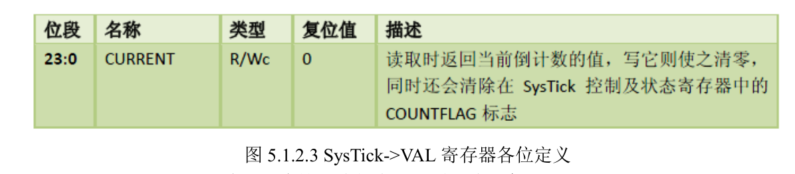

# 01-正点原子System文件夹


# delay文件夹

delay 文件夹内包含了 delay.c 和 delay.h 两个文件，这两个文件用来实现系统的延时功能，其中包含 7 个函数：

```C
void delay_osschedlock(void);
void delay_osschedunlock(void);
void delay_ostimedly(u32 ticks);
void SysTick_Handler(void);
void delay_init(u8 SYSCLK);
void delay_ms(u16 nms);
void delay_us(u32 nus);
```

前面四个是支持操作系统的时候需要用到
后面三个无论是否支持操作系统都需要用到

## 操作系统支持宏定义及相关函数

当需要 delay_ms 和 delay_us 支持操作系统（OS）的时候，我们需要用到 3 个宏定义和 4个函数

```C
//本例程仅作 UCOSII 和 UCOSIII 的支持,其他 OS,请自行参考着移植
//支持 UCOSII
#ifdef OS_CRITICAL_METHOD
//OS_CRITICAL_METHOD 定义了,说明要支持 UCOSII
#define delay_osrunning OSRunning //OS 是否运行标记,0,不运行;1,在运行
#define delay_ostickspersec OS_TICKS_PER_SEC //OS 时钟节拍,即每秒调度次数
#define delay_osintnesting OSIntNesting //中断嵌套级别,即中断嵌套次数
#endif
//支持 UCOSIII
#ifdef CPU_CFG_CRITICAL_METHOD
//CPU_CFG_CRITICAL_METHOD 定义了,说明要支持 UCOSIII
#define delay_osrunning OSRunning //OS 是否运行标记,0,不运行;1,在运行
#define delay_ostickspersec OSCfg_TickRate_Hz //OS 时钟节拍,即每秒调度次数
#define delay_osintnesting OSIntNestingCtr //中断嵌套级别,即中断嵌套次数
#endif
//us 级延时时,关闭任务调度(防止打断 us 级延迟)
void delay_osschedlock(void)
{
#ifdef CPU_CFG_CRITICAL_METHOD //使用 UCOSIII
OS_ERR err;
OSSchedLock(&err); //UCOSIII 的方式,禁止调度，防止打断 us 延时
#else //否则 UCOSII
OSSchedLock(); //UCOSII 的方式,禁止调度，防止打断 us 延时
#endif
}
//us 级延时时,恢复任务调度
void delay_osschedunlock(void)
{
#ifdef CPU_CFG_CRITICAL_METHOD //使用 UCOSIII
OS_ERR err;
OSSchedUnlock(&err); //UCOSIII 的方式,恢复调度
#else //否则 UCOSII
OSSchedUnlock(); //UCOSII 的方式,恢复调度
#endif
}
//调用 OS 自带的延时函数延时
//ticks:延时的节拍数
void delay_ostimedly(u32 ticks)
{
#ifdef CPU_CFG_CRITICAL_METHOD //使用 UCOSIII 时
OS_ERR err;
OSTimeDly(ticks,OS_OPT_TIME_PERIODIC,&err);//UCOSIII 延时采用周期模式
#else
OSTimeDly(ticks); //UCOSII 延时
#endif
}
//systick 中断服务函数,使用 ucos 时用到
void SysTick_Handler(void)
{
if(delay_osrunning==1) //OS 开始跑了,才执行正常的调度处理
{
OSIntEnter(); //进入中断
OSTimeTick(); //调用 ucos 的时钟服务程序
OSIntExit(); //触发任务切换软中断
}
}
```

**支持os需要用到的三个宏定义**
```C
#define delay_osrunning OSRunning //OS 是否运行标记,0,不运行;1,在运行
#define delay_ostickspersec OS_TICKS_PER_SEC //OS 时钟节拍,即每秒调度次数
#define delay_osintnesting OSIntNesting //中断嵌套级别,即中断嵌套次数
```

## delay_init函数

函数用来初始化 2 个重要参数：fac_us 以及 fac_ms；同时把 SysTick 的时钟源选择为外部时钟，如果需要支持操作系统（OS），只需要在 sys.h 里面，设置 SYSTEM_SUPPORT_OS 宏的值为 1 即可

```C
/初始化延迟函数
//当使用 ucos 的时候,此函数会初始化 ucos 的时钟节拍
//SYSTICK 的时钟固定为 SYSCLK 时钟
//SYSCLK:系统时钟频率
void delay_init(u8 SYSCLK)
{
#if SYSTEM_SUPPORT_OS //如果需要支持 OS.
u32 reload;
#endif
//SysTick 频率为 HCLK
HAL_SYSTICK_CLKSourceConfig(SYSTICK_CLKSOURCE_HCLK);
fac_us=SYSCLK; //不论是否使用 OS,fac_us 都需要使用
#if SYSTEM_SUPPORT_OS //如果需要支持 OS.
reload=SYSCLK; //每秒钟的计数次数 单位为 K
reload*=1000000/delay_ostickspersec; //根据 delay_ostickspersec 设定溢出时间
//reload 为 24 位寄存器,最大值:16777216,在 400M 下,约合 41.9ms 左右
fac_ms=1000/delay_ostickspersec; //代表 OS 可以延时的最少单位
SysTick->CTRL|=SysTick_CTRL_TICKINT_Msk;//开启 SYSTICK 中断
SysTick->LOAD=reload; //每 1/OS_TICKS_PER_SEC 秒中断一次
SysTick->CTRL|=SysTick_CTRL_ENABLE_Msk; //开启 SYSTICK
#endif
}
```




HAL_SYSTICK_CLKSourceConfig(SYSTICK_CLKSOURCE_HCLK);这句代码把 SysTick的时钟选择为内核时钟，这里需要注意的是：SysTick 的时钟源自 HCLK，假设我们外部晶振为8M，然后倍频到 80MHZ，那么 SysTick 的时钟即为 80Mhz，也就是 SysTick 的计数器 VAL 每减 1，就代表时间过了 1/80us。所以 fac_us=SYSCLK;这句话就是计算在 SYSCLK 时钟频率下延时 1us 需要多少个 SysTick 时钟周期。

在不使用 OS 的时候：fac_us，为 us 延时的基数，也就是延时 1us，Systick 定时器需要走过的时钟周期数。 当使用 OS 的时候，fac_us，还是 us 延时的基数，不过这个值不会被写到SysTick->LOAD 寄存器来实现延时，而是通过时钟摘取的办法实现的（前面已经介绍了）。而fac_ms 则代表 ucos 自带的延时函数所能实现的最小延时时间（如 delay_ostickspersec=200，那么 fac_ms 就是 5ms）。

## delay_us函数

该函数用来延时指定的 us，其参数 nus 为要延时的微秒数。

不使用os时：
```C
//延时 nus
//nus 为要延时的 us 数.
//nus:0~204522252(最大值即 2^32/fac_us@fac_us=21)
void delay_us(u32 nus)
{
u32 ticks;
u32 told,tnow,tcnt=0;
u32 reload=SysTick->LOAD; //LOAD 的值
ticks=nus*fac_us; //需要的节拍数
told=SysTick->VAL; //刚进入时的计数器值
while(1)
{
tnow=SysTick->VAL;
if(tnow!=told)
{
if(tnow<told)tcnt+=told-tnow;//这里注意 SYSTICK 是递减的计数器就可以.
else tcnt+=reload-tnow+told;
told=tnow;
if(tcnt>=ticks)break; //时间超过/等于要延迟的时间,则退出.
}
};
}
```

这里就正是利用了我们前面提到的时钟摘取法，ticks 是延时 nus 需要等待的 SysTick 计数次数（也就是延时时间），told 用于记录最近一次的 SysTick->VAL 值，然后 tnow 则是当前的SysTick->VAL 值，通过他们的对比累加，实现 SysTick 计数次数的统计，统计值存放在 tcnt 里面，然后通过对比 tcnt 和 ticks，来判断延时是否到达，从而达到不修改 SysTick 实现 nus 的延时。对于使用 OS 的时候，delay_us 的实现函数和不使用 OS 的时候方法类似，都是使用的时钟
摘取法，只不过使用 delay_osschedlock 和 delay_osschedunlock 两个函数，用于调度上锁和解锁，这是为了防止 OS 在 delay_us 的时候打断延时，可能导致的延时不准，所以我们利用这两个函数来实现免打断，从而保证延时精度。


## delay_ms函数

### 不使用os
```C
//延时 nms
//nms:要延时的 ms 数
void delay_ms(u16 nms)
{
u32 i;
for(i=0;i< nms;i++) delay_us(1000);
}
```

### 使用os

```C
//延时 nms
//nms:要延时的 ms 数
//nms:0~65535
void delay_ms(u16 nms)
{
if(delay_osrunning&&delay_osintnesting==0)//如果 OS 已经在跑了,且不是在中断里面
{
if(nms>=fac_ms) //延时的时间大于 OS 的最少时间周期
{
delay_ostimedly(nms/fac_ms); //OS 延时
}
nms%=fac_ms; //OS 已经无法提供这么小的延时了,采用普通方式延时
}
delay_us((u32)(nms*1000)); //普通方式延时
}
```

### HAL_Delay函数

只能实现简单的毫秒级别延时，没有实现 us 级别延时

HAL 库实现延时功能非常简单，首先定义了一个 32 位全局变量 uwTick，在 Systick 中断服务函数 SysTick_Handler 中通过调用 HAL_IncTick 实现 uwTick 值不断增加，也就是每隔 1ms增加 uwTickFreq，而 uwTickFreq 默认是 1。而 HAL_Delay 函数在进入函数之后先记录当前uwTick 的值，然后不断在循环中读取 uwTick 当前值，进行减运算，得出的就是延时的毫秒数，整个逻辑非常简单也非常清晰

HAL 库的延时函数有一个局限性，在中断服务函数中使用 HAL_Delay 会引起混乱(虽然一般禁止在中断中使用延时函数)，因为它是通过中断方式实现，而 Systick 的中断优先级是最低的，所以在中断中运行 HAL_Delay 会导致延时出现严重误差。所以一般情况下，推荐大家使用 ALIENTEK 提供的延时函数库。


# sys文件夹

sys 文件夹内包含了 sys.c 和 sys.h 两个文件。在 sys.h 里面除了函数申明外主要是定义了一些常用数据类型短关键字。sys.c 里面定义时钟系统配置函数 SystemClock_Config 对于函数Stm32_Clock_Init

# usart文件夹

## printf函数支持

```c
//加入以下代码,支持 printf 函数,而不需要选择 use MicroLIB
#if 1
#pragma import(__use_no_semihosting)
//标准库需要的支持函数
struct __FILE
{
int handle;
};
FILE __stdout;
//定义_sys_exit()以避免使用半主机模式
_sys_exit(int x)
{
x = x;
}
//重定义 fputc 函数
int fputc(int ch, FILE *f)
{
while((USART1->ISR & 0X40) == 0); //循环发送,直到发送完毕
USART1->TDR = (u8) ch;
return ch;
}
#endif
```


