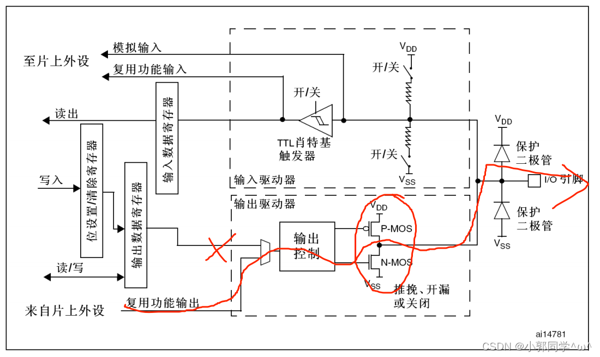

# 02-GPIO与跑马灯

# IO口简介
GPIO（General Purpose Input Output）通用输入输出口，是接在APB2总线上的外设

每个GOIO结构内包括一个寄存器和一个驱动器，内核通过APB2总线对寄存器进行读写，寄存器每个，寄存器每一位对应一个引脚 ，每个寄存器有16个引脚，GPIO外设分为GPIOA,GPIOB……GPIOX等等，驱动器用来增强信号

可配置为8种输入输出模式 引脚电平：0V~3.3V，部分引脚可容忍5V

输出模式下可控制端口输出高低电平，用以驱动LED、控制蜂鸣器、模拟通信协议输出时序等

输入模式下可读取端口的高低电平或电压，用于读取按键输入、外接模块电平信号输入、ADC电压采集、模拟通信协议接收数据等

## GPIO基本结构

观察最右边俩个保护二极管，当输入电压高于3.3V时上方的二极管会导通，输入电压产生的电流会流向VDD，从而保护电路，同理，当输入电压低于0V，输入电压产生的电流会流向下方二极管，从而保护电路.

虚线框为GPIO的驱动部分，虚线框左边为分别为位设置清除寄存器，输出数据寄存器，输入数据寄存器，虚线框右边也就是某个IO口从俩个虚线框中间分开，上方为输入结构，下方为输出结构

## STM32L4的IO模式：

### GPIO的输入模式

1. 输入浮空
2. 输入上拉
3. 输入下拉
4. 模拟输入

#### 输入浮空
浮空输入模式下，上拉电阻与下拉电阻开关均开启，不确定IO口为高电平还是低电平，由外部情况决定

#### 输入上拉

如图，上拉电阻关闭，引脚悬空时，默认IO口为高电平，当IO口输入低电平时，输入端为低电平。

#### 输入下拉

下拉电阻关闭，引脚悬空时，默认IO口为低电平，当IO口输入高电平时，输入端为高电平。

#### 模拟输入

GPIO无效，IO口模拟信号直接模拟输入至片上外设，例如内部ADC 

### GPIO的输出模式

注意：在输出模式下输入模式也是开启的

#### 开漏输出

P-MOS无效，输出引脚电平，高电平为高阻态，低电平接VSS ，无驱动能力

#### 推挽输出

P-MOS管和N-MOS管均开启，输出引脚电平，高电平接VDD，低电平接VSS，有驱动能力

#### 开漏复用输出

与开漏输出一样，只是由片上外设控制，高电平为高阻态，低电平接VSS 

#### 推挽复用输出

推挽输出一样，只是由片上外设控制，高电平接VDD，低电平接VSS 

# IO口操作步骤

1 ） 使能 IO 口时钟，调用函数为__HAL_RCC_GPIOX_CLK_ENABLE( 其中 X=A~K) 。
2 ） 初始化 IO 参数。调用函数 HAL_GPIO_Init();
3 ） 操作 IO 输入输出。

