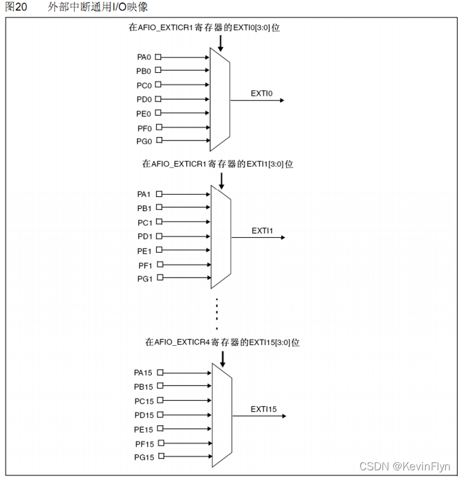
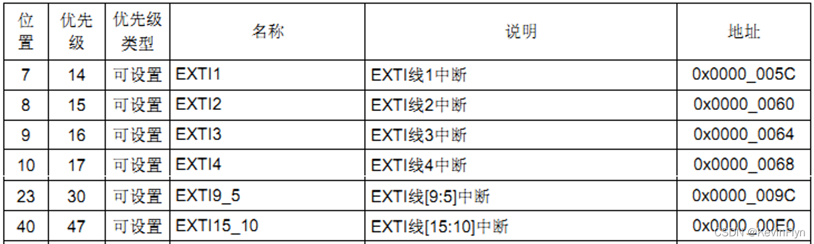

# 04-中断 EXTI
EXTI是extended interrupts and events controller的缩写

# 中断介绍
## 中断线

每个GPIO的引脚都被连接到一个中断线上面，如下图



对于每个中断线，我们可以设置相应的触发方式（上升沿触发，下降沿触发，边沿触发）以及使能。

# 中断向量与服务函数

是不是16个中断线就可以分配16个中断服务函数呢？

IO口外部中断在中断向量表中只分配了7个中断向量，也就是只能使用7个中断服务函数



从表中可以看出，外部中断线5~9分配一个中断向量，共用一个服务函数 外部中断线10~15分配一个中断向量，共用一个中断服务函数。
下面是中断服务函数列表：

```C

EXTI0_IRQHandler          

EXTI1_IRQHandler

EXTI2_IRQHandler          

EXTI3_IRQHandler          

EXTI4_IRQHandler          

EXTI9_5_IRQHandler        

EXTI15_10_IRQHandler      

```

# 常用标准库库函数

## 设置映射关系
```C
void GPIO_EXTILineConfig(uint8_t GPIO_PortSource, uint8_t GPIO_PinSource);

   //设置IO口与中断线的映射关系
   ①void GPIO_EXTILineConfig(uint8_t GPIO_PortSource, uint8_t GPIO_PinSource);

   //设置IO口与中断线的映射关系

GPIO_EXTILineConfig(GPIO_PortSourceGPIOE,GPIO_PinSource2);

```

## 初始化中断线
```C
void EXTI_Init(EXTI_InitTypeDef* EXTI_InitStruct);

 //初始化中断线：触发方式等
```

其结构体变量成员如下：
```C
typedef struct
{
  uint32_t EXTI_Line;   //指定要配置的中断线           
  EXTIMode_TypeDef EXTI_Mode;   //模式：事件 OR中断
  EXTITrigger_TypeDef EXTI_Trigger;//触发方式：上升沿/下降沿/双沿触发
  FunctionalState EXTI_LineCmd;  //使能 OR失能
}EXTI_InitTypeDef;
 
//实例：
// EXTI_InitStructure.EXTI_Line=EXTI_Line2;	 
// EXTI_InitStructure.EXTI_Mode = EXTI_Mode_Interrupt;	
// EXTI_InitStructure.EXTI_Trigger = EXTI_Trigger_Falling;
// EXTI_InitStructure.EXTI_LineCmd = ENABLE;
// EXTI_Init(&EXTI_InitStructure);
```


## 判断中断线状态，是否发生中断

```C
ITStatus EXTI_GetITStatus(uint32_t EXTI_Line);

//判断中断线中断状态，是否发生
```

## 清除中断标志位

```C
void EXTI_ClearITPendingBit(uint32_t EXTI_Line);

//清除中断线上的中断标志位
```


# 标准库中断配置步骤

①初始化IO口为输入：GPIO_Init();

②开启IO口复用时钟：RCC_APB2PeriphClockCmd(RCC_APB2Periph_AFIO,ENABLE);

③设置IO口与中断线的映射关系：void GPIO_EXTILineConfig();

④初始化线上中断，设置触发条件等：EXTI_Init();

⑤配置中断分组（NVIC），并使能中断：NVIC_Init();

⑥编写中断服务函数：EXTIx_IRQHandler();

⑦清除中断标志位：EXTI_ClearITPendingBit();

实例：
```C
//exti.c源文件
#include "exti.h"
#include "led.h"
#include "key.h"
#include "delay.h"
 
//外部中断0服务程序
void EXTIX_Init(void)
{
	EXTI_InitTypeDef EXTI_InitStruct;
	NVIC_InitTypeDef NVIC_InitStruct;
	
  KEY_Init();
	RCC_APB2PeriphClockCmd(RCC_APB2Periph_AFIO,ENABLE);
	
	GPIO_EXTILineConfig(GPIO_PortSourceGPIOE,GPIO_PinSource4);
	
	EXTI_InitStruct.EXTI_Line=EXTI_Line4;
	EXTI_InitStruct.EXTI_LineCmd=ENABLE;
	EXTI_InitStruct.EXTI_Mode=EXTI_Mode_Interrupt;
	EXTI_InitStruct.EXTI_Trigger=EXTI_Trigger_Falling;
	
	EXTI_Init(&EXTI_InitStruct);
	
	NVIC_InitStruct.NVIC_IRQChannel=EXTI4_IRQn;
	NVIC_InitStruct.NVIC_IRQChannelCmd =ENABLE;
	NVIC_InitStruct.NVIC_IRQChannelPreemptionPriority =2;
	NVIC_InitStruct.NVIC_IRQChannelSubPriority =2;
	
	NVIC_Init(&NVIC_InitStruct);
}
void EXTI4_IRQHandler(void)
{
	delay_ms(10);
	if(KEY0){
		LED0=!LED0;
		LED1=!LED1;
	}
	EXTI_ClearFlag(EXTI_Line4);
}
```

```C
//exti.h头文件
 
#ifndef __EXTI_H
#define __EXIT_H	 
#include "sys.h"
 
void EXTIX_Init(void);//外部中断初始化		 					    
#endif
 
```

```C
//main.c源文件
 
#include "led.h"
#include "delay.h"
#include "key.h"
#include "sys.h"
#include "usart.h"
#include "exti.h"
 
 int main(void)
 {		
  int i=0;
	delay_init();	    	 //延时函数初始化	  
	NVIC_PriorityGroupConfig(NVIC_PriorityGroup_2); //设置NVIC中断分组2:2位抢占优先级，2位响应优先级
	uart_init(115200);	 //串口初始化为115200
 	LED_Init();		  		//初始化与LED连接的硬件接口
	KEY_Init();         	//初始化与按键连接的硬件接口
	EXTIX_Init();		 	//外部中断初始化
	LED0=0;					//点亮LED0
	while(1)
	{	    
		printf("%d\r\n",i);	
		delay_ms(5000);	
    i++;		
	}
 }
 
 
```


# HAL库

与标准库类似，只不过多了一个中断回调函数

# 注意事项
配置的时候务必留意是上升沿触发还是下降沿触发


