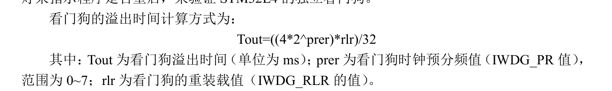

# 05-独立看门狗

# IWDG介绍

## 作用
介绍：看门狗其实就是一个定时器，给他设置一个定时值，它会逐渐递减，递减到0后就会进行芯片复位，在看门狗定时器还没到达0时重新给他赋值的这个操作就叫喂狗。其实不管是单片机这样，大多数带看门狗的芯片实现都是这样的。

作用：防止程序发生死循环，或者程序跑飞


## L475看门狗介绍
STM32L475 的独立看门狗由内部专门的 32Khz 低速时钟（LSI）驱动，即使主时钟发生故障，它也仍然有效。这里需要注意独立看门狗的时钟是一个内部 RC 时钟，所以并不是准确的32Khz，而是在 29.5~34Khz 之间的一个可变化的时钟，只是我们在估算的时候，以 32Khz 的频率来计算，看门狗对时间的要求不是很精确，所以，时钟有些偏差，都是可以接受的。


# 配置IWDG
1 ）取消寄存器写保护，设置看门狗预分频系数和重装载值
2 ）重载计数值喂狗（向 IWDG_KR 写入 0XAAAA ）
3) 启动看门狗(向 向 IWDG_KR 写入 0XCCCC)

## 设置预分频系数和重装载值




# 使用看门狗

生成的IWDG初始化函数MX_IWDG_Init已经将看门狗启动了，如果不想这么早启动看门狗，可以将MX_IWDG_Init往后放。

喂狗函数：HAL_IWDG_Refresh(&hiwdg);

```C
MX_IWDG_Init();

HAL_IWDG_Refresh(&hiwdg);
```


