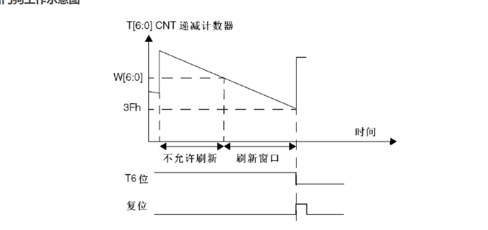
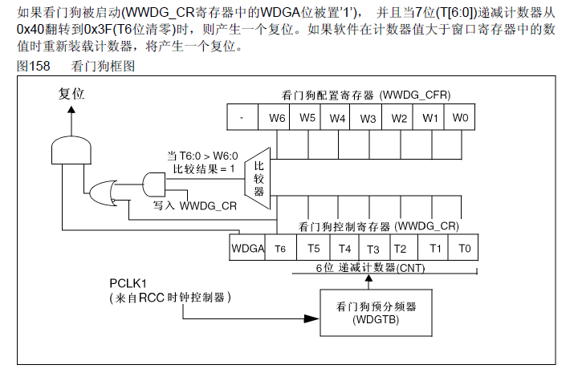
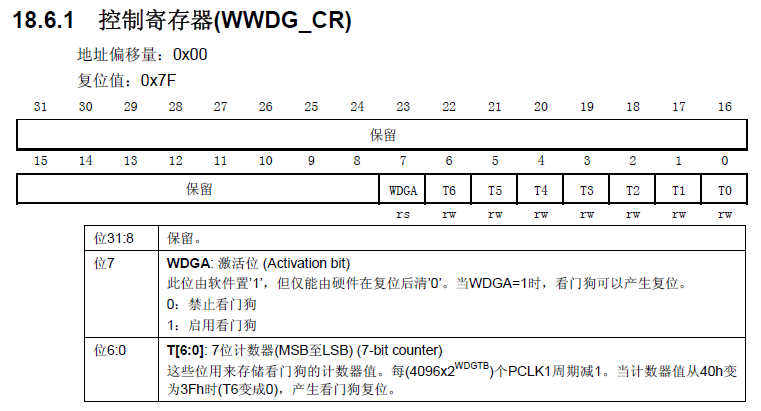
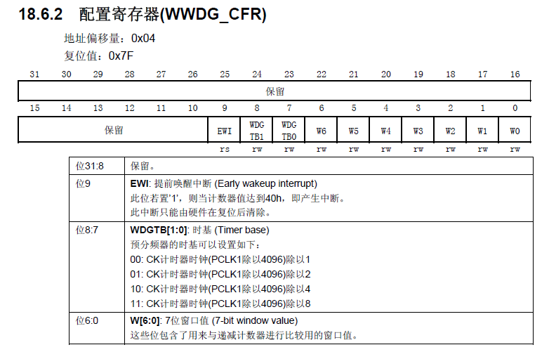
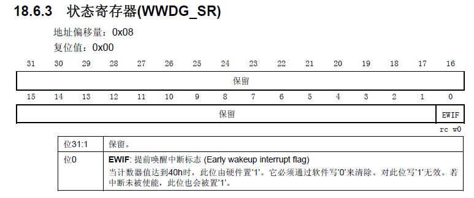

# 06-窗口看门狗

独立看门狗产生的是复位信号

窗口看门狗产生的是中断信号

# 窗口看门狗简介

窗口看门狗之所以称为窗口，就是因为其喂狗时间是一个有上下限的范围内（窗口），可以通过设定相关寄存器，设定其上限时间（但是下限是固定的0x3F）。也就是说：喂狗的时间不能过早，也不能过晚

而对比与独立看门狗，独立看门狗限制喂狗时间在0-x内，x由相关RLR寄存器决定。

窗口看门狗的必要性：

对于一般的看门狗，程序可以在它产生复位前的任意时刻刷新看门狗，但这有一个隐患，有可能程序跑乱了又跑回到正常的地方，或跑乱的程序正好执行了刷新看门狗操作，这样的情况下一般的看门狗就检测不出来了；
如果使用窗口看门狗，程序员可以根据程序正常执行的时间设置刷新看门狗的一个时间窗口，保证不会提前刷新看门狗也不会滞后刷新看门狗，这样可以检测出程序没有按照正常的路径运行非正常地跳过了某些程序段的情况。


## 窗口看门口工作示意



在窗口看门狗的递减计数器递减至窗口配置寄存器配置的上窗口（W[6:0]）之前，是不能刷新递减计数器的数值（喂狗操作）的；同样，在递减计数器递减到下窗口（0x3F）之后，也是不能刷新递减计数器的数值（喂狗操作）的，否则这两种状况都会产生复位信号的。也就是说，喂狗操作只能发生在上、下窗口之间。



从这个框图中可以看到：

当T6:0（当前的递减计数器）大于上窗口时，比较器结果是1；如果此时写入WWDG_CR（喂狗），直接通过与门，或门也直接通过，产生复位信号；

当T6为0的时候，也就是产生复位信号（此时递减计数器小于0x3F），取反再过或门，产生复位信号。

## 主要特性

● 可编程的自由运行递减计数器

● 条件复位
─ 当递减计数器的值小于0x40，(若看门狗被启动)则产生复位。
─ 当递减计数器在窗口外被重新装载，(若看门狗被启动)则产生复位。

● 如果启动了看门狗并且允许中断，当递减计数器等于0x40时产生早期唤醒中断(EWI)，它可以被用于重装载计数器以避免WWDG复位。


# 窗口看门狗相关寄存器

## 控制寄存器（MMDG_CR）
作用：控制寄存器主要用于启动看门狗、存储当前递减计数器的值。


## 配置寄存器（MMDG_CFR）
作用：配置寄存器主要用于使能提前唤醒中断、设置预分频系数、设置上窗口值。



## 状态寄存器（WWDG_SR）
作用：状态寄存器用来记录当前是否有提前唤醒的标志。该寄存器仅有位0有效，其他都是保留位。当计数器达到40h时，此位由硬件置1。它必须通过软件写0来清除。对此位写1无效。即使中断未被使能，在计数器的值达到0x40的时候，此位也会置1。


# 窗口看门狗使用步骤（标准库）
使能看门狗时钟。调用函数：RCC_APB1PeriphClockCmd()；
设置分频系数。调用函数：WWDG_SetPrescaler()；
设置上窗口值。调用函数：WWDG_SetWindowValue()；
开启提前唤醒中断并分组。调用函数：WWDG_EnableIT()、NVIC_Init()；
使能看门狗。调用函数：WWDG_Enable()；
喂狗（通常在中断服务中调用）。调用函数：WWDG_SetCounter()；
编写中断服务函数。调用函数：WWDG_IRQHandler()。

# 窗口看门狗使用步骤（HAL库）

## 看门狗初始化
```C
HAL_WWDG_Init(WWDG_HandleTypeDef *hwwdg)
```

## 喂狗
```C
HAL_WWDG_Refresh(WWDG_HandleTypeDef *hwwdg)
```

## 中断处理函数
功能：  判断中断是否正常，并进入中断回调函数
```C
HAL_WWDG_IRQHandler(WWDG_HandleTypeDef *hwwdg)
```

## EWI中断回调函数
在HAL库中，每进行完一个中断，并不会立刻退出，而是会进入到中断回调函数中，

看门狗中断运行完成之后，便会进入看门狗的中断回调函数
```C
 __weak HAL_WWDG_EarlyWakeupCallback(hwwdg);
```

# 中断回调函数使用：

```C
void HAL_WWDG_EarlyWakeupCallback(WWDG_HandleTypeDef *hwwdg)
{
  /* Prevent unused argument(s) compilation warning */
  UNUSED(hwwdg);
  HAL_GPIO_TogglePin(GPIOE, GPIO_PIN_15);  //LED翻转  --闪烁表示喂狗成功
  HAL_WWDG_Refresh(hwwdg);      //喂狗
}
```


