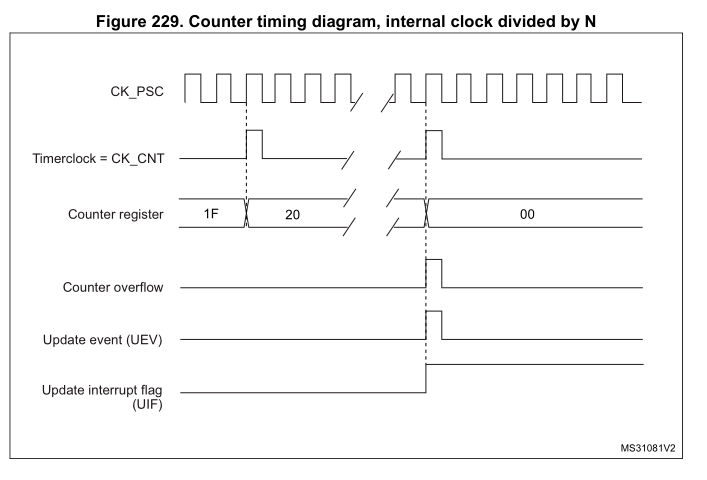

# 07-定时器

# 高级定时器

STM32L475 的定时器功能十分强大，有 TIM1 和 TIM8 等高级定时器，有 TIM2~TIM5、TIM15~TIM17 通用定时器，也有 TIM6 和 TIM7 基本定时器、还有 LPTIM1 低功耗定时器，总共达 12 个定时器之多。在本章中，我们将使用 TIM3 的定时器中断来控制 LED_B（蓝灯）的翻转，在主函数用 LED_R（红灯）的翻转来提示程序正在运行。

## 高级定时器简介（TIM1和TIM8)
高级控制定时器（TIM1 和 TIM8）包含一个 16 位自动重载计数器，该计数器由可编程预分频器驱动。

此类定时器可用于各种用途，包括测量输入信号的脉冲宽度（输入捕获），或者生成输出波形（输出比较、PWM 和带死区插入的互补 PWM）。

使用定时器预分频器和 RCC 时钟控制器预分频器，可将脉冲宽度和波形周期从几微秒调制
到几毫秒。

高级控制定时器（TIM1 和 TIM8）和通用 (TIMx) 定时器彼此完全独立，不共享任何资源。

## TIM1和TIM8的主要特性


### 特性描述

IM1和TIM8的主要特性
+ 16 位递增、递减、递增/递减自动重载计数器
+ 16 位可编程预分频器，用于对计数器时钟频率进行分频（即运行时修改），分频系数介于 1 到 65536 之间。
+ 多达六个独立通道
+ + 输入捕获（除了通道5，通道6）
+ + 输出比较
+ + PWM生成（边沿和中心对齐模式）
+ + 单脉冲模式输出
+ 带可编程死区的互补输出
+ 使用外部信号控制定时器且可实现多个定时器互连的同步电路。
+ 重复计数器，用于仅在给定数目的计数器周期后更新定时器寄存器。
+ 2断路输入，使定时器的输出信号处于用户可选择的安全配置。
+ 发生如下事件时生成中断/DMA 请求：
+ + 更新：计数器上溢/下溢、计数器初始化（通过软件或内部/外部触发）
+ + 触发事件（计数器启动、停止、初始化或通过内部/外部触发计数）
+ + 输入捕获
+ + 输出比较
+ 支持定位，使用增量（正交）编码器或者霍尔电路
+ 外部时钟触发输入或逐周期电流管理。

### 高级控制定时器框图


## TIM1和TIM8功能说明

### 时基单元

可编程高级控制定时器的主要模块是一个 16 位计数器及其相关的自动重载寄存器。计数器可递增计数、递减计数或交替进行递增和递减计数。计数器的时钟可通过预分频器进行分频。

计数器、自动重载寄存器和预分频器寄存器可通过软件进行读写。即使在计数器运行时也可执行读写操作。

时基单元包括：
+ Counter register (TIMx_CNT)
+ Prescaler register (TIMx_PSC)
+ Auto-reload register (TIMx_ARR)
+ Repetition counter register (TIMx_RCR)

自动重载寄存器是预装载的。对自动重载寄存器执行写入或读取操作时会访问预装载寄存器。预装载寄存器的内容既可以直接传送到影子寄存器，也可以在每次发生更新事件(UEV)时传送到影子寄存器，这取决于 TIMx_CR1 寄存器中的自动重载预装载使能位 (ARPE)。当计数器达到上溢值（或者在递减计数时达到下溢值）并且 TIMx_CR1 寄存器中的 UDIS 位为0 时，将发送更新事件。该更新事件也可由软件产生。下文将针对各配置的更新事件的产生进行详细介绍。

计数器由预分频器输出 CK_CNT 提供时钟，仅当 TIMx_CR1 寄存器中的计数器启动位 (CEN)置 1 时，才会启动计数器（有关计数器使能的更多详细信息，另请参见从模式控制器的相关说明）

注意，计数器将在 TIMx_CR1 寄存器的 CEN 位置 1 时刻的一个时钟周期后开始计数。


#### 预分频器说明
预分频器可对计数器时钟频率进行分频，分频系数介于 1 和 65536 之间。该预分频器基于TIMx_PSC 寄存器中的 16 位寄存器所控制的 16 位计数器。由于该控制寄存器具有缓冲功能，因此可对预分频器进行实时更改。而新的预分频比将在下一更新事件发生时被采用。


#### 预分频器实时变化是计数器的行为
预分频从1变为2：


预分频从1变为4：


### 计数器模式

#### 递增计数模式
在递增计数模式下，计数器从 0 计数到自动重载值（TIMx_ARR 寄存器的内容），然后重新从 0 开始计数并生成计数器上溢事件。

如果使用重复计数器，则当递增计数的重复次数达到重复计数器寄存器中编程的次数加一次(TIMx_RCR+1) 后，将生成更新事件 (UEV)。否则，将在每次计数器上溢时产生更新事件。

将 TIMx_EGR 寄存器的 UG 位置 1（通过软件或使用从模式控制器）时，也将产生更新事件。

通过软件将 TIMx_CR1 寄存器中的 UDIS 位置 1 可禁止 UEV 事件。这可避免向预装载寄存器写入新值时更新影子寄存器。在 UDIS 位写入 0 之前不会产生任何更新事件。不过，计数器和预分频器计数器都会重新从 0 开始计数（而预分频比保持不变）。此外，如果TIMx_CR1 寄存器中的 URS 位（更新请求选择）已置 1，则将 UG 位置 1 会生成更新事件UEV，但不会将 UIF 标志置 1（因此，不会发送任何中断或 DMA 请求）。这样一来，如果在发生捕获事件时将计数器清零，将不会同时产生更新中断和捕获中断。

发生更新事件时，将更新所有寄存器且将更新标志（TIMx_SR 寄存器中的 UIF 位）置 1（取决于 URS 位）：
+ 重复计数器中将重新装载 TIMx_RCR 寄存器的内容
+ 自动重载影子寄存器将以预装载值 (TIMx_ARR) 进行更新
+ 预分频器的缓冲区中将重新装载预装载值（TIMx_PSC 寄存器的内容）

以下各图以一些示例说明当 TIMx_ARR=0x36 时不同时钟频率下计数器的行为：





#### 递减技术模式
在递减计数模式下，计数器从自动重载值（TIMx_ARR 寄存器的内容）开始递减计数到 0，然后重新从自动重载值开始计数并生成计数器下溢事件。

如果使用重复计数器，则当递减计数的重复次数达到重复计数器寄存器中编程的次数加一次(TIMx_RCR+1) 后，将生成更新事件 (UEV)。否则，将在每次计数器下溢时产生更新事件。

将 TIMx_EGR 寄存器的 UG 位置 1（通过软件或使用从模式控制器）时，也将产生更新事件。

通过软件将 TIMx_CR1 寄存器中的 UDIS 位置 1 可禁止 UEV 更新事件。这可避免向预装载寄存器写入新值时更新影子寄存器。在 UDIS 位写入 0 之前不会产生任何更新事件。不过，计数器会重新从当前自动重载值开始计数，而预分频器计数器则重新从 0 开始计数（但预分频比保持不变）。

此外，如果 TIMx_CR1 寄存器中的 URS 位（更新请求选择）已置 1，则将 UG 位置 1 会生成更新事件 UEV，但不会将 UIF 标志置 1（因此，不会发送任何中断或 DMA 请求）。这样一来，如果在发生捕获事件时将计数器清零，将不会同时产生更新中断和捕获中断。

发生更新事件时，将更新所有寄存器且将更新标志（TIMx_SR 寄存器中的 UIF 位）置 1（取决于 URS 位）：

+ 重复计数器中将重新装载 TIMx_RCR 寄存器的内容
+ 预分频器的缓冲区中将重新装载预装载值（TIMx_PSC 寄存器的内容）
+ 自动重载活动寄存器将以预装载值（TIMx_ARR 寄存器的内容）进行更新。注意，自动重载寄存器会在计数器重载之前得到更新，因此，下一个计数周期就是我们所希望的新的周期长度

#### 中心对齐模式（递增/递减计数）

....

详见参考手册
对比着F407的中文手册和L475的英文手册一起看


# 通用定时器

## 通用定时器简介
STM32L475 的通用 TIMx (TIM2~TIM5 和 TIM15~TIM17)定时器功能包括：
1. 16 位(TIM3,TIM4)/32 位(TIM2,TIM5)向上、向下、向上/向下自动装载计数器，注意：TIM15~TIM17 只支持向上（递增）计数方式。
2. 16 位可编程(可以实时修改)预分频器，计数器时钟频率的分频系数为 1～65535 之间的任意数值。
3. 4 个独立通道（TIMx_CH1~4，其中 TIM15 最多 2 个通道，TIM16 和 TIM17 最多 1 个通道），这些通道可以用来作为：
    + 输入捕获
    + 输出比较
    + PWM 生成(边缘或中间对齐模式) ，注意：TIM12~TIM17 不支持中间对齐模式
    + 单脉冲模式输出
4. 可使用外部信号控制定时器和定时器互连的同步电路。
5. 如下事件发生时产生中断/DMA：
    + 更新：计数器向上溢出/向下溢出，计数器初始化(通过软件或者内部/外部触发)
    + 触发事件(计数器启动、停止、初始化或者由内部/外部触发计数)
    + 输入捕获
    + 输出比较

## 定时器配置步骤

1. TIM3 时钟使能。
2. 初始化定时器参数 数, 设置 自动重装值 ， 分频系数 ，计数方式
3. 使能定时器更新中断，使能定时器
4. TIM3 中断优先级设置
5. 编写中断服务函数。

## 溢出时间计算
TIM3 定时器的溢出时间计算公式如下：

$$Tout= ((arr+1)*(psc+1))/Tclk$$

其中：

Tclk：TIM3 的输入时钟频率（单位为 Mhz），这里为 APB1 时钟 80MHz

Tout：TIM3 溢出时间（单位为 us）。

## HAL配置

### 基本函数

1. 在stm32f4xx_it.c中，cubeMX自动生成的中断处理函数：
```C
void TIM1_UP_TIM10_IRQHandler(void) 
{ 
/* USER CODE BEGIN TIM1_UP_TIM10_IRQn 0 */ 
/* USER CODE END TIM1_UP_TIM10_IRQn 0 */ 
HAL_TIM_IRQHandler(&htim1); 
/* USER CODE BEGIN TIM1_UP_TIM10_IRQn 1 */
 /* USER CODE END TIM1_UP_TIM10_IRQn 1 */
 }

```
该函数调用了HAL库提供的HAL_TIM_IRQHandler这一函数

2. HAL_TIM_IRQHandler介绍:

```C
void HAL_TIM_IRQHandler(TIM_HandleTypeDef *htim)
```
作用：HAL对涉及中断的寄存器进行处理

在HAL_TIM_IRQHandler对各个涉及中断的寄存器进行了处理之后，会自动调用中断回调函数HAL_TIM_PeriodElapsedCallback，该函数使用__weak修饰符修饰，即用户可以在别处重新声明该函数，调用时将优先进入用户声明的函数。

3. HAL_TIM_PeriodElapsedCallback
```C
void HAL_TIM_PeriodElapsedCallback(TIM_HandleTypeDef *htim) 
{ 
  if(htim == &htim1) 
    { 
      ledtoggle(); 
    } 
}
```
一般我们需要在中断回调函数中判断中断来源并执行相应的用户操作。HAL库在完成定时器的中断服务函数后会自动调用定时器回调函数。
通过配置TIM1的分频值和重载值，使得TIM的中断以500ms的周期被触发。因此中断回调函数也是以500ms为周期被调用。


### 定时器定时与定时中断

如果不开启中断，仅让定时器以定时功能工作，为了使定时器开始工作，需要调用HAL库提供的函数。

```C
HAL_StatusTypeDef HAL_TIM_Base_Start(TIM_HandleTypeDef *htim)
```

| 函数名 | HAL_TIM_Base_Start |
| -- | -- |
| 函数作用 | 使对应的定时器只开始工作 |
| 返回值 | HAL_StatusTypeDef，HAL库定义的几种状态，如果成功使定时器开始工作，则返回HAL_OK |
| 参数 | *htim 定时器的句柄指针，如定时器1就输入&htim1，定时器2就输入&htim2 |


如果需要使用定时中断，则需要调用函数：

```C
HAL_StatusTypeDef HAL_TIM_Base_Start_IT(TIM_HandleTypeDef *htim)
```

| 函数名 | HAL_TIM_Base_Start_IT |
| -- | -- |
| 函数作用 | 使对应的定时器开始工作，并使能其定时中断 |
| 返回值 | HAL_StatusTypeDef，HAL库定义的几种状态，如果成功使定时器开始工作，则返回HAL_OK |
| 参数 | *htim 定时器的句柄指针，如定时器1就输入&htim1，定时器2就输入&htim2 |

以上两个函数如果要使用则都需要在主循环while(1)之前调用。

例：

```C
HAL_TIM_Base_Start_IT(&htim1);
```


