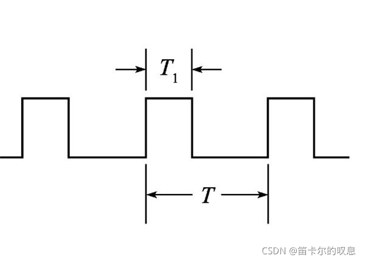
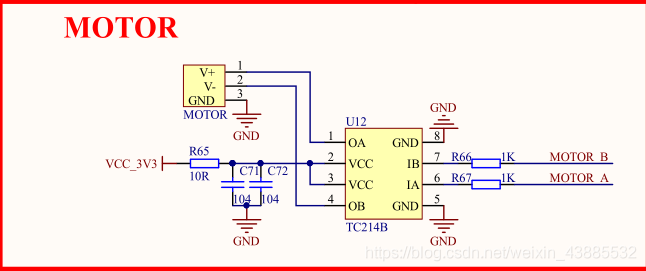

# 08-PWM

# PWM输出简介

脉冲宽度调制(PWM)，是英文“Pulse Width Modulation”的缩写，简称脉宽调制，是利用微处理器的数字输出来对模拟电路进行控制的一种非常有效的技术。简单一点，就是对脉冲宽
度的控制


## 占空比
PWM信号保持高电平的时间百分比称为占空比。如果信号始终为高电平，则它处于100％占空比，如果它始终处于低电平，则占空比为0％。如图所示，T1为占空比，T为一个PWM周期。


## 频率
PWM信号的频率决定PWM完成一个周期的速度。STM32的MDK编译器可以选择5MHZ,10MHZ,20MHZ和50MHZ

## 产生方式
通过STM32控制板，有两种方式能产生PWM
1. 第一是利用普通IO口输出PWM
2. 第二种是利用定时器的PWM的IO口或复用IO口。


# PWM配置步骤

1. 开启 TIM2 和 和 GPIO 时钟，配置 PA0 和 和 PA1 选择复用功能 AF1（TIM2）输出。
2. 初始化 TIM2, 设置 TIM2 的 的 ARR 和 PSC 等参数。
3. 设置TIM2_CH1 和 和 TIM2_CH2 的 的 PWM 模式 ，输出比较极性，比较值等参数。
4. 使能TIM2， ，能 使能 TIM2 的 的 CH1 和 和 CH2 输出。
5. 修改TIM2_CCR1 和 和 TIM2_CCR2 来控制占空比。


# STM32的PWM输出介绍

## 输出原理
以向上计数为例：


+ 在PWM输出模式下，除了CNT（计数器当前值）、ARR（自动重装载值）之外，还多了一个值CCRx（捕获/比较寄存器值）
+ 当CNT小于CCRx时，TIMx_CHx通道输出低电平；
+ 当CNT小于CCRx时，TIMx_CHx通道输出低电平；

## 输出周期

+ 定时器从0开始向上计数
+ 当0-t1段,定时器计数器TIMx_CNT值小于CCRx值,输出低电平
+ t1-t2段,定时器计数器TIMx_CNT值大于CCRx值,输出高电平
+ 当TIMx_CNT值达到ARR时,定时器溢出,重新向上计数...循环此过程
+ 至此一个PWM周期完成

总结：

每个定时器有四个通道,每一个通道都有一个捕获比较寄存器, 

将寄存器值和计数器值比较,通过比较结果输出高低电平,便可以实现脉冲宽度调制模式（PWM信号）

TIMx_ARR寄存器确定PWM频率，

TIMx_CCRx寄存器确定占空比


## 详解

若配置脉冲计数器TIMx_CNT为向上计数，而重载寄存器TIMx_ARR配置为N，即TIMx_CNT的当前计数值数值X在TIMxCLK时钟源的驱动下不断累加，当TIMx_CNT的数值X大于N时，会重置TIMx_CNT数值为0重新计数。
而在TIMxCNT计数的同时，TIMxCNT的计数值X会与比较寄存器TIMx_CCR预先存储了的数值A进行比较，当脉冲计数器TIMx_CNT的数值X小于比较寄存器TIMx_CCR的值A时，输出高电平（或低电平），相反地，当脉冲计数器的数值X大于或等于比较寄存器的值A时，输出低电平（或高电平）。
如此循环，得到的输出脉冲周期就为重载寄存器TIMx_ARR存储的数值(N+1)乘以触发脉冲的时钟周期，其脉冲宽度则为比较寄存器TIMx_CCR的值A乘以触发脉冲的时钟周期，即输出PWM的占空比为A/(N+1)。


# STM32的PWM工作模式与寄存器设置

## PWM的工作模式

### PWM模式1
向上计数模式：计数器从0技术加到自动重装载值（TIMx_ARR)，然后重新从0开始计数，并且产生一个计数器溢出事件

### PWM模式2
向下技术模式：计数器从自动重装载值(TIMx_ARR)减到0，然后重新从重装载值(TIMx_ARR)开始递减，并且产生一个计数器溢出事件


## PWM的输出模式

### PWM模式1
在向上计数时，一旦TIMx_CNT<TIMx_CCR1时通道1为有效电平，否则为无效电平；在向下计数时，一旦TIMx_CNT>TIMx_CCR1时通道1为无效电平(OC1REF=0)，否则为有效电平(OC1REF=1)。

### PWM模式2

在向上计数时，一旦TIMx_CNT<TIMx_CCR1时通道1为无效电平，否则为有效电平；在向下计数时，一旦TIMx_CNT>TIMx_CCR1时通道1为有效电平，否则为无效电平。

在两种模式下TIMx_CNT(计数器当前值)与TIMx_CCR1(捕获/比较值)   只是决定是有效电平还是无效电平   

有效电平可以是高电平也可以是低电平，这需要结合CCER寄存器的CC1P位的值来确定。


TIMx_CCER寄存器的CCCP位,设置输入/捕获通道1输出极性  

0: 高电平为有效电平     
1: 低电平为有效电平

若为向上计数，且CCER寄存器的CC1P位为0，则当TIMx_CNT < TIMx_CCR1时，输出高电平

同样向上计数，且CCER寄存器的CC1P位为1，则当TIMx_CNT < TIMx_CCR1时，输出低电平


## PWM的工作过程


### CCR1寄存器：
捕获/比较值寄存器：设置比较值；

计数器值TIMx_CNT与通道1捕获比较寄存器CCR1进行比较,通过比较结果输出有效电平和无效电平    

OC1REF=0 无效电平    
OC1REF=1 无效电平

### TIMx_CCMR1寄存器：
OC1M[2:0]位：用于设置PWM模式

110:PWM模式1
111:PWM模式2


### CCER寄存器：
CC1P位：输入/捕获1输出极性。

0:高电平为有效电平     
1:低电平为有效电平

### CCER寄存器：
CC1E位：输入/捕获1输出使能

0：关闭使能
1：打开使能

# CUBEMX配置过程
1. 设置RCC


2. 设置定时器


1.选择TIM3 
2.设置定时器时钟源为内部时钟源
设置定时器CH1为PWM模式
3.对应管脚自动设置为复用模式
4.可自行选择是否开启定时器中断

Channel1~4  就是设置定时器通道的功能     (输入捕获、输出比较、PWM输出、单脉冲模式)


Mode   选择PWM模式1
Pulse(占空比值)  先给0
Fast Mode   PWM脉冲快速模式    ：  和我们配置无关，不使能
PWM 极性：   设置为低电平


## PWM频率：

Fpwm =Tclk / ((arr+1)*(psc+1))(单位：Hz)

arr 是计数器值
psc 是预分频值


## 占空比：

duty circle = TIM3->CCR1 / arr(单位：%)
TIM3->CCR1  用户设定值


3. 时钟源设置


4. 项目设置

。。。


# 例程详解-LED

## 定义变量

```C
  /* USER CODE BEGIN 1 */
    uint16_t pwmVal=0;   //PWM占空比  
    uint8_t dir=1;    
  /* USER CODE END 1 */
```

## 使能定时器的pwm输出

```C
  /* USER CODE BEGIN 2 */
  HAL_TIM_PWM_Start(&htim3,TIM_CHANNEL_1);
  /* USER CODE END 2 */
```

## while中添加代码

```C
  while (1)
  {
  /* USER CODE END WHILE */
 
  /* USER CODE BEGIN 3 */
 
	  while (pwmVal< 500)
	  {
		  pwmVal++;
		  __HAL_TIM_SetCompare(&htim3, TIM_CHANNEL_1, pwmVal);    //修改比较值，修改占空比
//		  TIM3->CCR1 = pwmVal;    与上方相同
		  HAL_Delay(1);
	  }
	  while (pwmVal)
	  {
		  pwmVal--;
		  __HAL_TIM_SetCompare(&htim3, TIM_CHANNEL_1, pwmVal);    //修改比较值，修改占空比
//		  TIM3->CCR1 = pwmVal;     与上方相同
		  HAL_Delay(1);
	  }
	  HAL_Delay(200);
 
  /* USER CODE END 3 */
 }
```
或者直接修改CCRx寄存器的值

```C
htim3.Instance->CCR1 = 300;
```

htim3.Instance->CCR1 = 300;


# 例程详解-MOTOR

潘多拉开发板中通过TC214B电机驱动芯片驱动板载直流电机，因此需要先了解TC214B芯片的主要功能及其使用方法。

## TC214B芯片


通过以上资料可以了解到，MCU控制TC214B从而进行直流电机转动方向，方向控制（即前进/后退）主要是通过控制MCU输出两路PWM在同一时刻的高低电平决定，速度控制主要是通过PWM输出脉冲的占空比决定。

## 原理图



STM32控制电机的引脚为MOTOR_A（PA0）、MOTOR_B（PA1），通过TIM2_CH1和TIM2_CH2产生两路PWM信号控制TC214B，从而实现直流电机的转动控制。


根据TC214B芯片手册的“八、输入/输出波形”可知，当INA为高，INB为低时电机前进，当INA为低，INB为高时电机后退。因此电机控制逻辑可以按照如下实现：

电机前进：设置INA输入PWM脉冲，INB一直保持低电平（当INA输入脉冲处于高电平时，电机前进。当INA输入脉冲处于低电平时，电机处于待命状态）

电机后退：设置INA一直保持低电平，INB输入PWM脉冲（当INB输入脉冲处于高电平时，电机后退。当INB输入脉冲处于低电平时，电机处于待命状态）


## 实际代码

1. 开启双通道PWM波

```C
  /* USER CODE BEGIN 2 */
  HAL_TIM_PWM_Start(&htim2,TIM_CHANNEL_1);
  HAL_TIM_PWM_Start(&htim2,TIM_CHANNEL_2);

  /* USER CODE END 2 */
```

2. 定义变量

```C
/* USER CODE BEGIN PV */
int16_t pwmvalue=200;	//pwm波的占空比，最低200 最高1000
int16_t dir=1;		//1. 正转 0. 反转
int16_t speed=1; 	//1. 加速 0. 减速
int16_t time=0;

/* USER CODE END PV */
```

3. 业务代码
```C
  /* Infinite loop */
  /* USER CODE BEGIN WHILE */
  while (1)
  {
	  if(speed) pwmvalue += 5;
	  else pwmvalue -= 5;
	  
	  if(pwmvalue>=1000) speed=0;
	  if(pwmvalue<=100) 
	  {
		  speed=1;
		  
		  dir=dir^0x01;		  
	  }
	  
	  if(dir)
	  {
		  htim2.Instance->CCR1=pwmvalue;
		  htim2.Instance->CCR2=0;
	  }
	  else
	  {
		  htim2.Instance->CCR1=0;
		  htim2.Instance->CCR2=pwmvalue;
	  }
	  
	  time++;
	  
	  if(time>20)
	  {
		  time=0;
		  HAL_GPIO_TogglePin(GPIOE, GPIO_PIN_8);
	  }
	  
	  HAL_Delay(50);
	  
    /* USER CODE END WHILE */

    /* USER CODE BEGIN 3 */
  }
  /* USER CODE END 3 */
```


