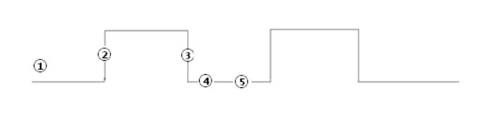
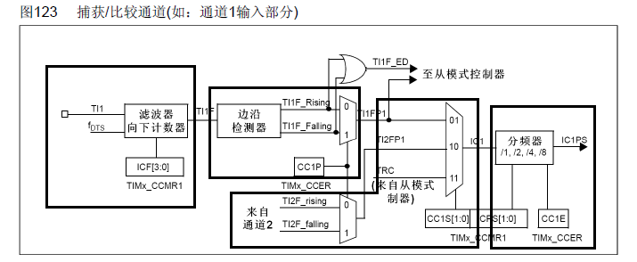
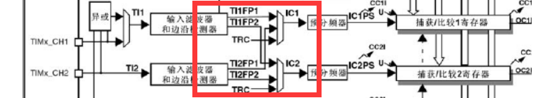
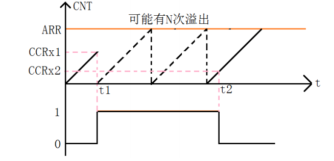
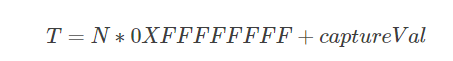
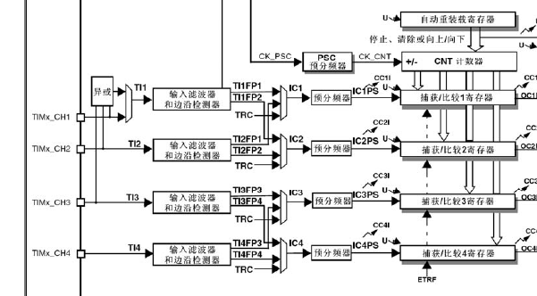

# 09-输入捕获

# 输入捕获介绍

输入捕获模式可以用来测量脉冲宽度或者测量频率。STM32的定时器，除了TIM6、TIM7，其他的定时器都有输入捕获的功能。

# 输入捕获的工作原理



①先设置输入捕获为上升沿检测，

②记录发生上升沿时TIMx_CNT(计数器)的值

③配置捕获信号为下降沿捕获，当下降沿到来的时候发生捕获

④记录此时的TIMx_CN(计数器)T的值

⑤前后两次TIMx_CNT(计数器)的值之差就是高电平的脉宽。同时根据TIM的计数频率，我们就能知道高电平脉宽的准确时间。


总结：**当你设置的捕获开始的时候，cpu会将计数寄存器的值复制到捕获比较寄存器中并开始计数，当再次捕捉到电平变化时，这是计数寄存器中的值减去刚才复制的值就是这段电平的持续时间，你可以设置上升沿捕获、下降沿捕获、或者上升沿下降沿都捕获，**


# 输入捕获的工作流程




## 设置输入捕获滤波器

STM32在很多功能中都提供了滤波器，滤波器的功能简单来说就是多次检测视为一次有效，达到滤波效果，

数字滤波器由一个事件计数器组成，假设我们是检测高电平，滤波N次，那么记录到N个事件后计数器会产生一个输出的跳变。也就是说连续N次采样检测，如果都是高电平，则说明这是一个有效的电平信号，这样便可以过滤掉那些因为某些而干扰产生的一些信号        

**输入捕获滤波器**IC1F[3:0]，这个用于设置采样频率和数字滤波器长度。其中：fCK_INT是定时器的输入频率，fDTS是根据TIMx_CR1的CKD[1:0]的设置来确定的。


## 设置输入捕获极性

设置具体为哪种捕获事件

可以设置上升沿捕获、下降沿捕获、或者上升沿下降沿都捕获


## 设置输入捕获映射关系

STM32为了更好的优化使用，TIMx_CH1通道1捕捉到的信号可以传输到IC1，也可以连接到IC2，TIMx_CH2捕捉到的信号也可以连接到IC1，也可以连接到IC2



## 设置输入捕获分频器

设置每N个事件触发一次捕获，可以设置为1/2/4/8次检测到电平变化才触发捕获


## 溢出时间计算



t1时刻检测到高电平，发生中断，在中断里将计数值置0，开始记溢出次数N，

其中每计数0xFFFF次溢出一次，直到t2时刻跳变回低电平，

获取最后一次溢出时到t2时刻的计数值TIM5CH1_CAPTURE_VAL

则  高电平时间 = 溢出次数*65535+TIM5CH1_CAPTURE_VAL     us ；根据定时器初始化时的频率即可计算出溢出总次数所占用的时间，即为高电平时间。

如果计数器值为 32 bit   那么最大为0xFFFFFFFF   






# 注意事项

1. 是否开启中断
2. 输入捕获的通道是否正确
3. 不要在中断里面使用HAL_Delay
4. 是否在主函数里面开启了相应的时钟和中断。
5. 当用于捕获计算pwm波的脉冲宽度的时候，记得及时调整捕获的边沿的极性。


重要函数：

```C
HAL_TIM_PWM_Start(); //函数用于使能定时器某一通道的PWM输出。

HAL_TIM_IC_Start_IT(); //函数用于使能定时器某一通道的输入捕获功能，并使能相应的中断

HAL_TIM_IC_Start_IT(); //函数用于使能定时器某一通道的输入捕获功能，并使能相应的中断

__HAL_TIM_SET_CAPTUREPOLARITY(); //不是函数，而是底层操作的一个宏定义


HAL_TIM_ReadCapturedValue(&htim5,TIM_CHANNEL_1);//获取当前捕获比较寄存器的值

__HAL_TIM_GET_COMPARE(); //是一个宏定义,等价于上一个函数

```


