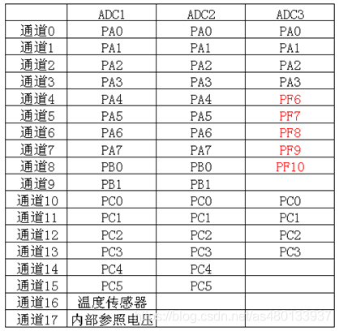
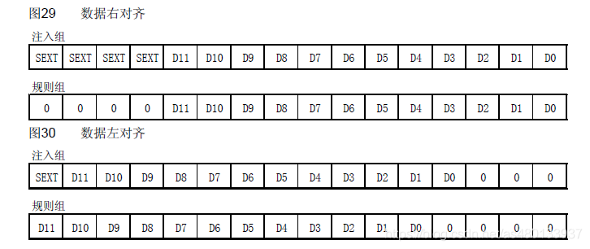
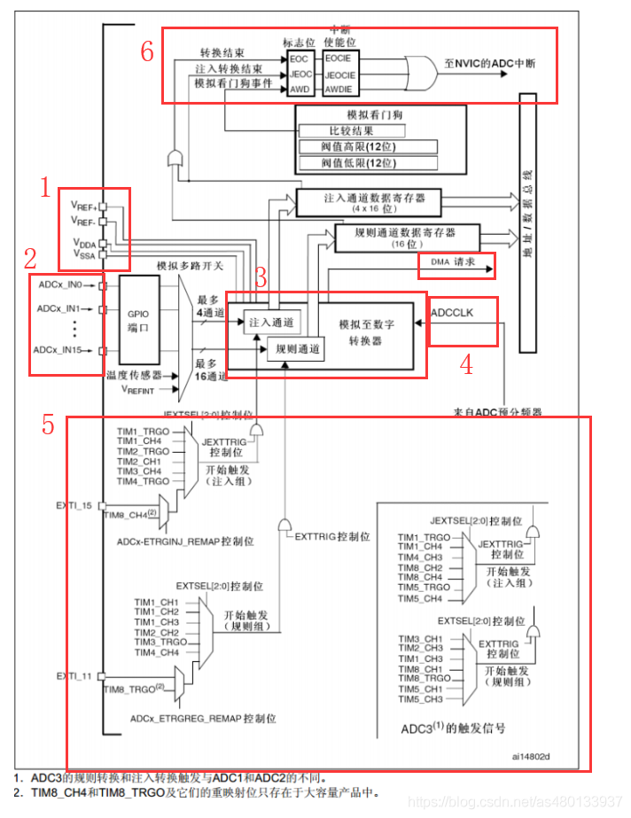
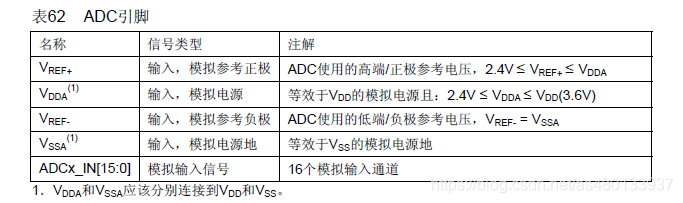
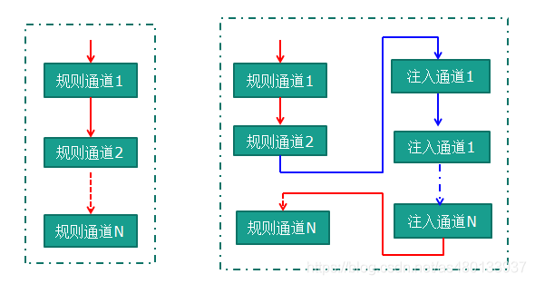
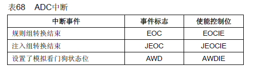

# 10-ADC


# 什么是ADC

Analog-to-Digital Converter的缩写。指模/数转换器或者模拟/数字转换器。是指将连续变量的模拟信号转换为离散的数字信号的器件。

典型的模拟数字转换器将模拟信号转换为表示一定比例电压值的数字信号。

简单地说就是将模拟电压值，转换成对应的肉眼可读数值。

12位ADC是一种逐次逼近型模拟数字转换器。它有，3个ADC控制器，多达18个通道，可测量16个外部和2个内部信号源。各通道的A/D转换可以单次、连续、扫描或间断模式执行。ADC的结果可以左对齐或右对齐方式存储在16位数据寄存器中


# 12位模拟数字转换器

就是ADC的数字存储是12位的 也就是说转换器通过采集转换所得到的最大值是4095。

二进制的12位可表示0-4095个数， 对应着所测电压的实际值，转换的电压范围是0v-3.3v的话，转换器就会把0v-3.3v平均分成4096份。设转换器所得到的值为x，所求电压值为y

$$y = \frac{x}{4096} * 3.3V$$

同理，还有8位精度和10位精度的ADC

# 3个ADC控制器

就是说STM32一共有3个ADC ADC1,ADC2,ADC3


不同的芯片的ADC通道不同，外部通道和内部信号源 具体是哪一个IO 口可以从手册查询到

STM32F10x系列芯片ADC通道和引脚对应关系 ：



16个外部通道：芯片上有16个引脚是可以接到模拟电压上进行电压值检测的

2个内部信号源 ： 一个是内部温度传感器，一个是内部参考电压

一共支持23个引脚支持ADC，包括21个外部和2个内部信号源


# ADC的转换模式

## 1. 单次转换模式

ADC只执行一次转换

## 2. 连续转换模式

转换结束之后马上开始新的转换


## 3. 扫描模式

ADC扫描被规则通道和注入通道选中的所有通道，在每个组的每个通道上执行单次转换，在每个转换结束时，这一组的下一个通道被自动转换。如果设置了CONT位（开启了连续 转换模式），转换不会在选择组的最后一个通道上停止，而是再次从选择组的第一个通道继续转换。


## 4. 间断模式

触发一次，转换一个通道，在触发，在转换。在所选转换通道循环，由触发信号启动新一轮的转换，直到转换完成为止。


扫描模式简单的说是一次对所有所选中的通道进行转换，比如开了ch0，ch1，ch4，ch5。  ch0转换完以后就会自动转换通道1,4,5直到转换完这个过程不能被打断。如果开启了连续转换模式，则会在转换完ch5之后开始新一轮的转换。

这就引入了间断模式，可以说是对扫描模式的一种补充。它可以把0,1,4,5这四个通道进行分组。可以分成0,1一组，4,5一组。也可以每个通道单独配置为一组。这样每一组转换之前都需要先触发一次。


# ADC单通道

只进行一次ADC转换：配置为“单次转换模式”，扫描模式关闭。ADC通道转换一次后，就停止转换。等待再次使能后才会重新转换

进行连续ADC转换：配置为“连续转换模式”，扫描模式关闭。ADC通道转换一次后，接着进行下一次转换，不断连续。

# ADC多通道

只进行一次ADC转换：配置为“单次转换模式”，扫描模式使能。ADC的多个通道，按照配置的顺序依次转换一次后，就停止转换。等待再次使能后才会重新转换

进行连续ADC转换：配置为“连续转换模式”，扫描模式使能。ADC的多个通道，按照配置的顺序依次转换一次后，接着进行下一次转换，不断连续。

也就是：多通道必须使能扫描模式


# 左对齐 或 右对齐



因为ADC得到的数据是12位精度的，但是数据存储在 16 位数据寄存器中，所以ADC的存储结果可以分为左对齐或右对齐方式（12位）

# ADC的工作框图




# 电压输入范围



ADC一般用于采集小电压，其输入值不能超过VDDA，即ADC输入范围：VREF- ≤ VIN ≤ VREF+。具体的定义见上图。
一般把VSSA和VREF- 接地， VREF+ 和 VDDA接3V3，那么ADC的输入范围是0~3.3V。

# ADC输入通道

从ADCx_INT0-ADCx_INT15 对应三个ADC的16个外部通道，进行模拟信号转换 此外，还有两个内部通道：温度检测或者内部电压检测
选择对应通道之后，便会选择对应GPIO引脚，相关的引脚定义和描述可在开发板的数据手册里找

# 注入通道 规则通道


我们看到，在选择了ADC的相关通道引脚之后，在模拟至数字转换器中有两个通道，注入通道，规则通道，
规则通道至多16个，注入通道至多4个

## 规则通道

规则通道相当于你正常运行的程序，看它的名字就可以知道，很规矩，就是正常执行程序
（相当于顺序执行）

## 注入通道 

注入通道可以打断规则通道，听它的名字就知道不安分，如果在规则通道转换过程中，有注入通道进行转换，那么就要先转换完注入通道，等注入通道转换完成后，再回到规则通道的转换流程
（相当于中断执行）



# ADC时钟

图中的ADC预分频器的ADCCLK是ADC模块的时钟来源。通常，由时钟控制器提供的ADCCLK时钟和PCLK2（APB2时钟）同步。RCC控制器为ADC时钟提供一个专用的可编程预分频器。 分频因子由RCC_CFGR的ADCPRE[1:0]配置，可配置2/4/6/8分频

STM32的ADC最大的转换速率为1MHz,也就是说最快转换时间为1us，为了保证ADC转换结果的准确性，ADC的时钟最好不超过14M

$$T = 采样时间 + 12.5个周期$$

其中1个周期为$1/ADCCLK$

例如，当 ADCCLK=14Mhz 的时候，并设置 1.5 个周期的采样时间，则得到： Tcovn=1.5+12.5=14 个周期=1us。

# 外部触发转换

ADC 转换可以由ADC 控制寄存器2: ADC_CR2 的ADON 这个位来控制，写1 的时候开始转换，写0 的时候停止转换。

当然，除了ADC_CR2寄存器的ADON位控制转换的开始与停止，还可以支持外部事件触发转换（比如定时器捕捉、EXTI线）

包括内部定时器触发和外部IO触发。具体的触发源由ADC_CR2的EXTSEL[2:0]位（规则通道触发源 ）和 JEXTSEL[2:0]位（注入通道触发源）控制。

同时ADC3的触发源与ADC1/2的触发源有所不同，上图已经给出，

# 中断

中断触发条件有三个，规则通道转换结束，注入通道转换结束，或者模拟看门狗状态位被设置时都能产生中断，



## 转换结束中断

转换结束中断就是正常的ADC完成一次转换，进入中断，这个很好理解


## 模拟看门狗中断

当被ADC转换的模拟电压值低于低阈值或高于高阈值时，便会产生中断。阈值的高低值由ADC_LTR和ADC_HTR配置模拟看门狗，听他的名字就知道，在ADC的应用中是为了防止读取到的电压值超量程或者低于量程

## DMA

同时ADC还支持DMA触发，规则和注入通道转换结束后会产生DMA请求，用于将转换好的数据传输到内存。

注意，只有ADC1和ADC3可以产生DMA请求

因为涉及到DMA传输，所以这里我们不再详细介绍，之后几节会更新DMA,一般我们在使用ADC 的时候都会开启DMA 传输。


# ADC的主要特征

STM32F10x ADC特点
12位逐次逼近型的模拟数字转换器。
最多带3个ADC控制器
最多支持18个通道，可最多测量16个外部和2个内部信号源。
支持单次和连续转换模式
转换结束，注入转换结束，和发生模拟看门狗事件时产生中断。
通道0到通道n的自动扫描模式 自动校准
采样间隔可以按通道编程
规则通道和注入通道均有外部触发选项
转换结果支持左对齐或右对齐方式存储在16位数据寄存器
ADC转换时间：最大转换速率 1us。（最大转换速度为1MHz，在ADCCLK=14M，采样周期为1.5个ADC时钟下得到。）
ADC供电要求：2.4V-3.6V
ADC输入范围：VREF- ≤ VIN ≤ VREF+


STM32F4x ADC特点

● 可配置 12 位、10 位、8 位或 6 位分辨率
● 在转换结束、注入转换结束以及发生模拟看门狗或溢出事件时产生中断
● 单次和连续转换模式
● 用于自动将通道 0 转换为通道“n”的扫描模式
● 数据对齐以保持内置数据一致性
● 可独立设置各通道采样时间
● 外部触发器选项，可为规则转换和注入转换配置极性
● 不连续采样模式
● 双重/三重模式（具有 2 个或更多 ADC 的器件提供）
● 双重/三重 ADC 模式下可配置的 DMA 数据存储
● 双重/三重交替模式下可配置的转换间延迟
● ADC 转换类型（参见数据手册）
● ADC 电源要求：全速运行时为 2.4 V 到 3.6 V，慢速运行时为 1.8 V
● ADC 输入范围：V REF—  V IN  V REF+
● 规则通道转换期间可产生 DMA 请求

STM32L4x ADC特点

• High-performance features

– Up to 3 ADCs, out of which two of them can operate in dual mode:
ADC1 is connected to 16 external channels + 3 internal channels
ADC2 is connected to 16 external channels + 2 internal channels
ADC3 is connected to 12 external channels + 4 internal channels
– 12, 10, 8 or 6-bit configurable resolution
– ADC conversion time is independent from the AHB bus clock frequency
– Faster conversion time by lowering resolution
– Manage single-ended or differential inputs
– AHB slave bus interface to allow fast data handling
– Self-calibration
– Channel-wise programmable sampling time
– Up to four injected channels (analog inputs assignment to regular or injected channels is fully configurable)
– Hardware assistant to prepare the context of the injected channels to allow fast context switching
– Data alignment with in-built data coherency
– Data can be managed by DMA for regular channel conversions
– Data can be routed to DFSDM for post processing
– 4 dedicated data registers for the injected channels
• Oversampler
– 16-bit data register
– Oversampling ratio adjustable from 2 to 256
– Programmable data shift up to 8-bit
• Low-power features
– Speed adaptive low-power mode to reduce ADC consumption when operating at low frequency
– Allows slow bus frequency application while keeping optimum ADC performance
– Provides automatic control to avoid ADC overrun in low AHB bus clock frequency application (auto-delayed mode)
• Number of external analog input channels per ADC
– Up to 5 fast channels from GPIO pads
– Up to 11 slow channels from GPIO pads
• In addition, there are several internal dedicated channels
– The internal reference voltage (V REFINT ), connected to ADC1
– The internal temperature sensor (V TS ), connected to ADC1 and ADC3
– The V BAT monitoring channel (V BAT /3), connected to ADC1 and ADC3
– DAC1 internal channels, connected to ADC2 and ADC3
• Start-of-conversion can be initiated:
– By software for both regular and injected conversions
– By hardware triggers with configurable polarity (internal timers events or GPIO input events) for both regular and injected conversions
• Conversion modes
– Each ADC can convert a single channel or can scan a sequence of channels
– Single mode converts selected inputs once per trigger
– Continuous mode converts selected inputs continuously
– Discontinuous mode
• Dual ADC mode for ADC1 and 2
• Interrupt generation at ADC read y, the end of sampling, the end of conversion (regular or injected), end of sequence conversion (regular or injected), analog watchdog 1, 2 or 3 or overrun events
• 3 analog watchdogs per ADC
• ADC input range: V REF– ≤ V IN ≤ V REF+

# cubeMX操作

1. 选择单片机
2. 设置debug接口

3. 设置时钟

4. 使能异步串口(与上位机通讯)

5. 设置ADC引脚（查看手册与原理图，找到adc的引出引脚：PC2 ADC123_IN3)


6. 配置时钟（外频8MHz，最高频率80MHz）

7. ADC配置
配置讲解：
- ADCs_Common_Settings： ADC模式设置
- - Mode：ADC_Mode_Independent（独立模式），独立模式模式下，双ADC不能同步，每个ADC接口独立工作。所以如果不需要ADC同步或者只是用了一个ADC的时候，应该设成独立模式，多个ADC同时使用时会有其他模式，如双重ADC同步模式，两个ADC同时采集一个或多个通道，可以提高采样率
- ADC_Settings
- - Clock Prescaler: 时钟预分频，STM32L475 的 ADC 最大的转换速率为 5.33Mhz，也就是转换时间为 0.188us（12 位分辨率时）， 所以需要将其分为5MHz。
- - Resolution： 分辨率，选择是12位精度还是10位精度还是更低
- - Data Alignment: 数据对其方式（左对齐还是右对齐）
- - Scan Conversion Mode( 扫描模式 )：DISABLE， 如果只是用了一个通道的话，DISABLE就可以了(也只能DISABLE)，如果使用了多个通道的话，会自动设置为ENABLE。 就是是否开启扫描模式 
- - Continuous Conversion Mode(连续转换模式) ：ENABLE， 设置为ENABLE，即连续转换。如果设置为DISABLE，则是单次转换。两者的区别在于连续转换直到所有的数据转换完成后才停止转换，而单次转换则只转换一次数据就停止，要再次触发转换才可以进行转换
- - Discontinuous Conversion Mode(间断模式)：DISABLE， 因为我们只用到了1个ADC,所以这个直接不使能即可
- 规则通道设置
- - Enable Regular Conversions (启用常规转换模式)：ENABLE， 使能 否则无发进行下方配置
- - Number OF Conversion(转换通道数)：1 用到几个通道就设置为几 多个通道自动使能扫描模式
- - Extenal Trigger Conversion Source (外部触发转换源)：Regular Conversion launched by software 规则的软件触发 调用函数触发即可，Timer X Capture Compare X event 外部引脚触发,Timer X Trigger Out event 定时器通道输出触发 需要设置相应的定时器设置
- Rank：转换顺序，多个通道时会有多个Rank，可以设定每个通道的转换顺序
- - sampling time： 采样时间： TCONV = 采样时间+ 12.5个周期
- 注入通道设置
- - 与规则转换通道区别不大
- WahchDog
- - Enable Analog WatchDog Mode(使能模拟看门狗中断)，这个上方有讲解，本质也测量值就是超出测量范围或者低于最低范围，启动看门狗

总配置情况：
+ ADC基本配置

+ 使能ADC中断

+ GPIO设置为模拟模式


8. 保存工程，生成代码


设置完存储名称和路径以后，点击右上角的生成代码。


# 代码：

1. 在main.c中添加变量：
```C
  /* USER CODE BEGIN 0 */
	uint16_t ADC_Value;
  /* USER CODE END 0 */
```

2. 在初始化函数部分添加adc初始化函数

```C
HAL_ADCEx_Calibration_Start(&hadc1);    //AD校准
```

3. 在while（）中添加ADC测量部分
```C
 HAL_ADC_Start(&hadc1);     //启动ADC转换
 HAL_ADC_PollForConversion(&hadc1, 50);   //等待转换完成，50为最大等待时间，单位为ms
 
 
 if(HAL_IS_BIT_SET(HAL_ADC_GetState(&hadc1), HAL_ADC_STATE_REG_EOC))
 {
  ADC_Value = HAL_ADC_GetValue(&hadc1);   //获取AD值

  printf("ADC1 Reading : %d \r\n",ADC_Value);
  printf("PA3 True Voltage value : %.4f \r\n",ADC_Value*3.3f/4096);
}
 HAL_ADC_Stp(&hadc1);     //关闭ADC转换
HAL_Delay(1000);
```


# 注意事项

ADC没有上拉下拉，因此悬空的时候采集到的数据是不准确的，慎用

ADC完成采集之后要及时关闭。


