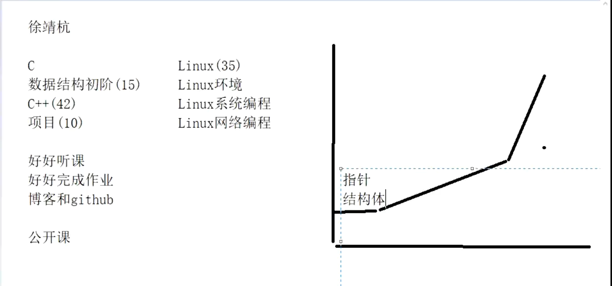

# 00-数据结构前言

比特学习内容：

# 什么是数据结构

数据结构(Data Structure)是计算机存储、组织数据的方式，指相互之间存在一种或多种特定关系的数据元素的集合。

# 什么是算法

算法(Algorithm):就是定义良好的计算过程，他取一个或一组的值为输入，并产生出一个或一组值作为输出。简单来说算法就是一系列的计算步骤，用来将输入数据转化成输出结果。

# 数据结构和算法的重要性

详见课件

