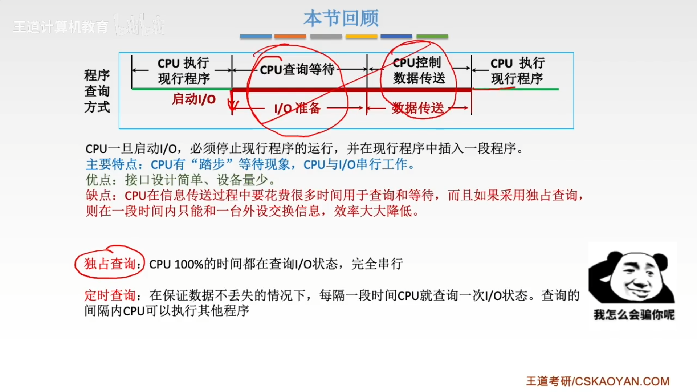
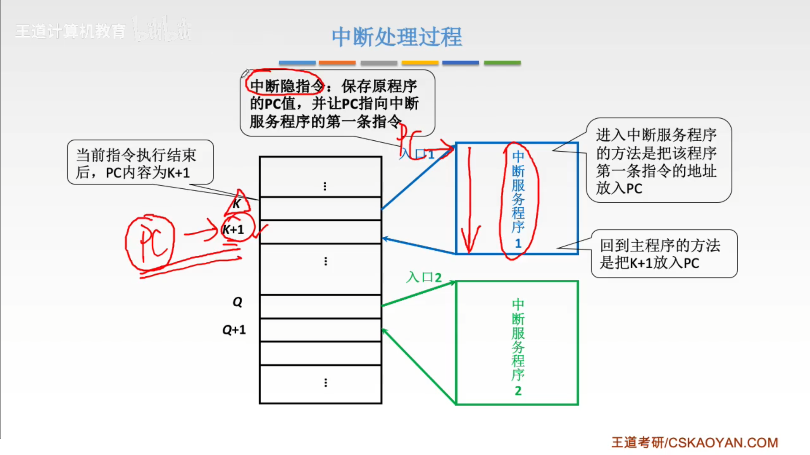

# 第七章-输入输出系统

# 输入输出系统和I/O控制方式

## 常见的IO设备

## 主机如何与io设备进行交互

## IO控制方式简介

## DMA控制方式

## 通道控制方式

## io系统的基本组成

1. io硬件
2. io软件

# 本节回顾

# 外部设备

## 输入设备

## 输出设备
显示器

### 阴极射线管显示器（CRT）

### 打印机

## 本章小结

# IO接口

## IO接口的作用

## IO接口的工作原理

## 接口与端口

## 统一编制vs独立编址

## IO接口的类型

## 知识回顾

# IO方式-程序查询

## IO方式简介

## 程序查询方式

程序查询方式流程图

## 程序查询方式-例题

## 本节回顾

# 中断的作用和原理

## 中断的基本概念
 

## 中断请求的分类

## 中断请求标记
 

## 中断判优-实现

### 优先级设置
 

## 中断处理过程

### 中断隐指令

### 中断处理过程-硬件向量法

### 中断处理过程-中断服务程序

# 多重中断 

## 单重中断与多重中断

## 中断屏蔽技术

## 中断系统小结

## 扩展

# IO方式-程序中断方式

## 本节回顾

# IO方式-DMA方式

## DMA控制器

## DMA传送过程

## DMA方式的特点

## DMA传送方式

## DMA方式与中断方式

## 本节回顾

