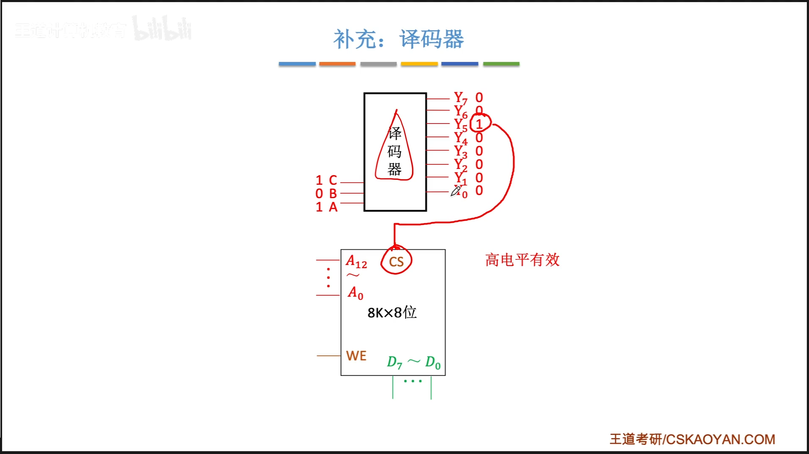

# 第三章-存储系统

# 存储系统基本概念

## 存储器的层次结构

高速缓存和主存储器可以直接被CPU访问

## 各层存储器的速度和价格

## 存储器的分类——存储介质

## 存储器的分类——存取方式

## 存储器的分类——信息的可更改性

## 存储器的分类——信息的可保存性

## 存储器的性能指标

## 知识回顾

# 主存储器的基本组成

## 基本的半导体元件及原理

## 寻址

##  本节回顾

# SRAM 和DRAM

## 栅极电容 VS 双稳态触发器

## SRAM vs DRAM

## DRAM的刷新

## DRAM的地址线服用计数

## 本节回顾

# 只读存储器 ROM

## 各种ROM

## 计算机内的重要ROM

## 本节回顾

# 双口RAM和多模块存储器

## 存取周期

## 提升速度的方式

## 双端口RAM

## 多体并行存储器

## 本节回顾

# 主存储器与CPU的连接

## 单块儿存储芯片与CPU的连接

## 存储器芯片的输入输出信号

## 增加主存的存储字长

### 位扩展

### 字扩展

#### 线选法

#### 非门选择（1-2译码器）

可以看作是一个1-2译码器

#### 译码器片选法

### 字位扩展法

##  本节回顾

## 补充：译码器

# 外部存储器

既可以作为输入设备，也可以作为输出设备

## 磁盘阵列

## 本节回顾

# 固态硬盘SSD

## 知识导览

## 固态硬盘的结构

## 理想状态下，固态硬盘的寿命

# cache

## 存储系统存在的问题

## cache的工作原理

cache被集成在cpu内部，用sram实现，速度快，成本高

## 局部性原理

## 性能分析

## 有待解决的问题

## 知识回顾

# cache和主存的映射方式

## 全相联映射

## 直接映射

## 组相联映射

## 知识回顾

# cache替换算法

## 知识导览

## 随机算法（RAND）

## 先进先出算法（FIFO）

## 近期最少使用（LRU）

如果被访问的主存块儿数量>cache行的数量，则也有可能会发生”抖动“

比如 1，2，3，4， 5，1，2，3，4，5，

## 最不经常使用算法（LFU）

如果有计数器相同，可以按照fifosuanfa进行替换

## 知识回顾

# cache写策略

## 本节总览

## 写命中

### 写回法

### 全写法

## 写不命中

### 写分配法

### 非写分配法

## 多级Cache
 

## 知识回顾

# 页式存储器

## 虚地址VS实地址

## 页表

## 地址变换过程

## 地址变换过程（增加TLB 快表）

## 知识回顾

# 虚拟存储器

## 虚拟存储系统

## 页式虚拟存储器

## 存储器的层次化结构

## 段式虚拟存储器

按照功能模块拆分

## 段页式虚拟存储器

