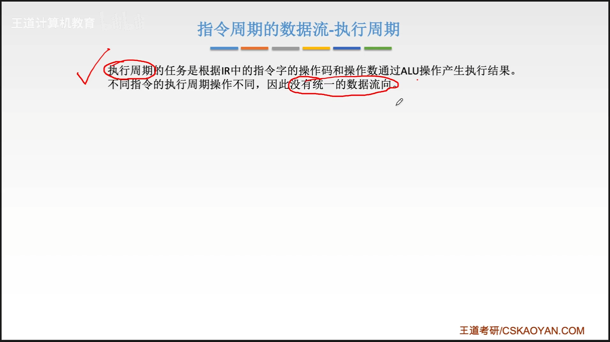
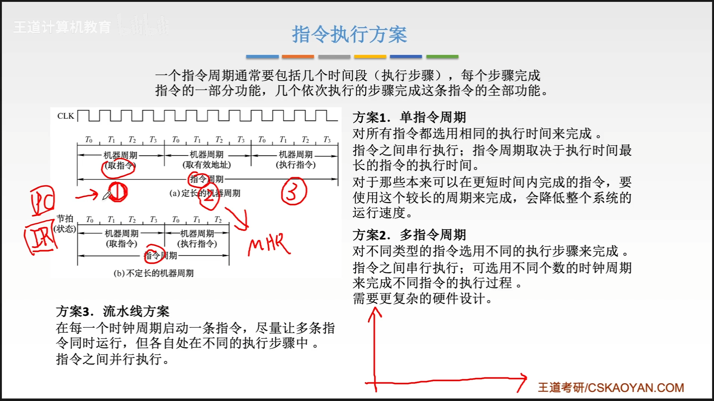
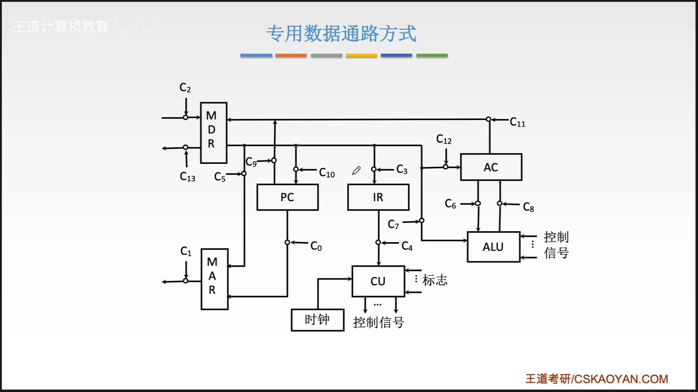
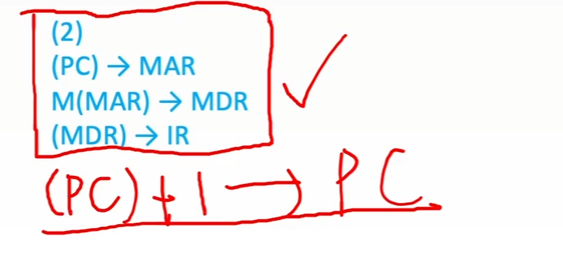
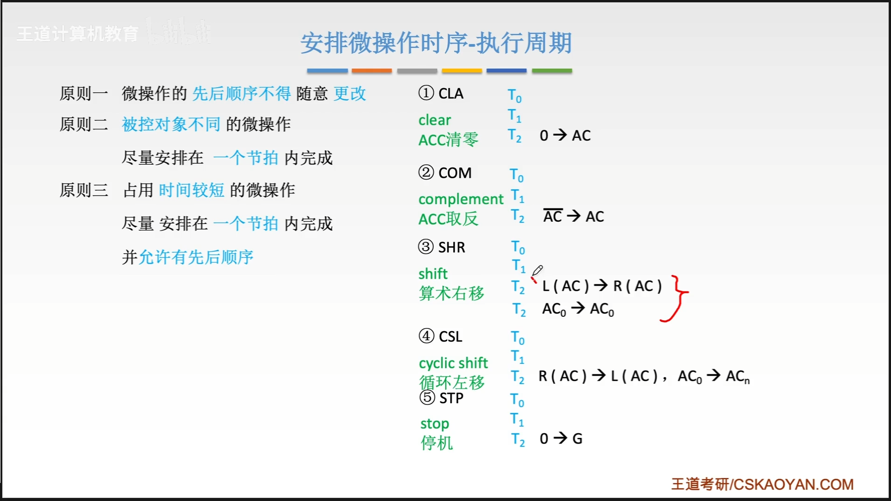
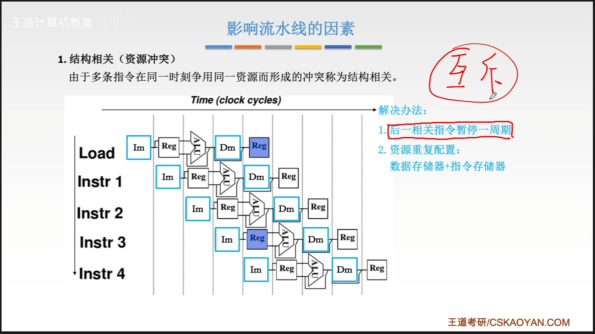
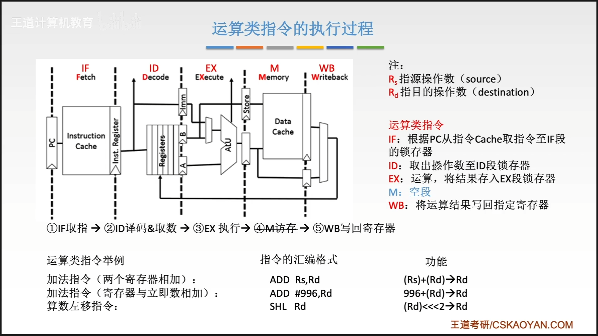
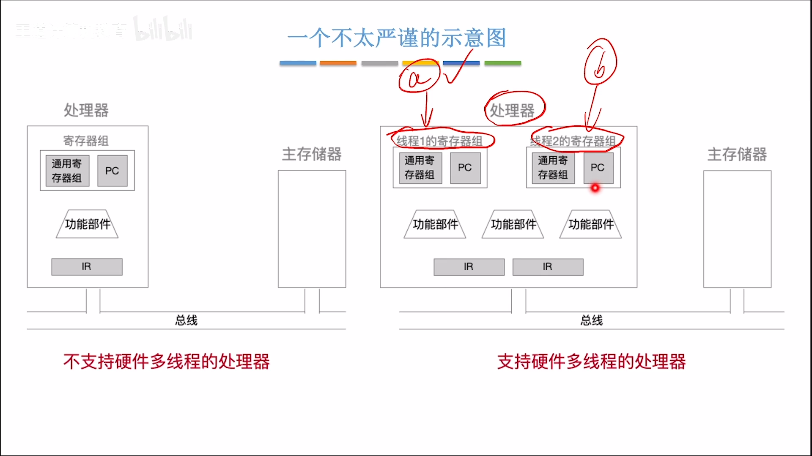

# 第五章-中央处理器

# 本章总览

# CPU的功能和基本结构

## cpu的功能

1. 指令控制
2. 操作控制
3. 时间控制
4. 数据加工
5. 中断处理

## 运算器和控制器的功能

## 运算器的基本结构

## 控制器的基本结构

## cpu的基本结构

## 本节回顾

# 指令执行过程

## 指令周期i

指令周期常常用若干机器周期来表示，机器周期又叫做cpu周期

一个机器周期又包含若干个时钟周期（也称为节拍，T周期或者cpu时钟周期，它是cpu操作的最基本的单位）

## 指令周期流程

## 指令周期的数据流-取指周期

## 指令周期的数据流-间址周期

## 指周期的数据流-执行周期

## 指令周期的数据流-中断周期

## 指令执行方案

##  本节回顾

# 数据通路的功能-单总线结构

## 数据通路

## cpu内部单总线方式

1. 寄存器之间的数据传送
2. 主存与cpu之间的数据传送
3. 执行算数或逻辑运算

## cpu内部单总线方式-例题

## 本节回顾

# 数据通路-专用数据通路

## 取值周期

## 例题

## 本节回顾

# 硬布线控制器

## 内容回顾

## 硬布线控制器

## 硬布线控制器的设计

## 1.分析每个阶段的位操作序列

## 2.选择cpu的控制方式

## 3.安排微操作时序

### 取指周期

### 间址周期

### 执行周期

### 中断周期
暂无

## 4.电路设计
### 组合逻辑设计

### 画出电路图

## 总结

# 微程序控制器的基本原理

## 设计思路

## 基本结构

## 工作原理

## 微程序控制器总结

# 微指令的设计

## 微指令的格式

+ 水平型微指令
+ 垂直型微指令
+ 混合型微指令

## 微指令的编码方式

## 例题

## 微指令的地址形成方式

## 例题 断定方式

## 知识回顾

# 微程序控制单元的设计

微程序控制器的速度比硬布线控制器更慢

## 微程序设计分类

## 硬布线与微程序的比较

## 微程序控制器回顾

# 指令流水线及性能指标

## 问题引入

## 指令流水线的定义

## 流水线的表示方法

1. 指令执行过程图
2. 时空图 

## 流水线的性能指标

### 吞吐率

### 加速比

### 效率

## 本节回顾

## 指令流水线影响因素分类

## 机器周期的设置

五段式指令流水线（mips）

## 影响因素

1. 结构相关（资源冲突）（互斥）
2. 数据相关（数据冲突）（同步）
3. 控制相关（控制冲突）

### 结构相关

### 数据相关
1. 硬件阻塞stall
2. 软件插入nop
3. 数据旁路
4. 编译优化

### 控制相关

## 影响因素总结

## 流水线的分类

## 流水线多发技术

### 超标量技术

### 超流水技术

### 超长指令字

## 本节回顾

# 五段式指令流水线

## 运算类指令的执行过程

## load指令的执行过程

## store指令的执行过程

## 条件转移指令的执行过程

## 无条件转移指令的执行过程

## 例题

# 多处理器的基本概念

## sisd

## simd

## misd

## mimd

## 向量处理器的基本概念

## 共享内存多处理器和多核处理器

# 硬件多线程

## 知识总览

## 三种硬件多线程

