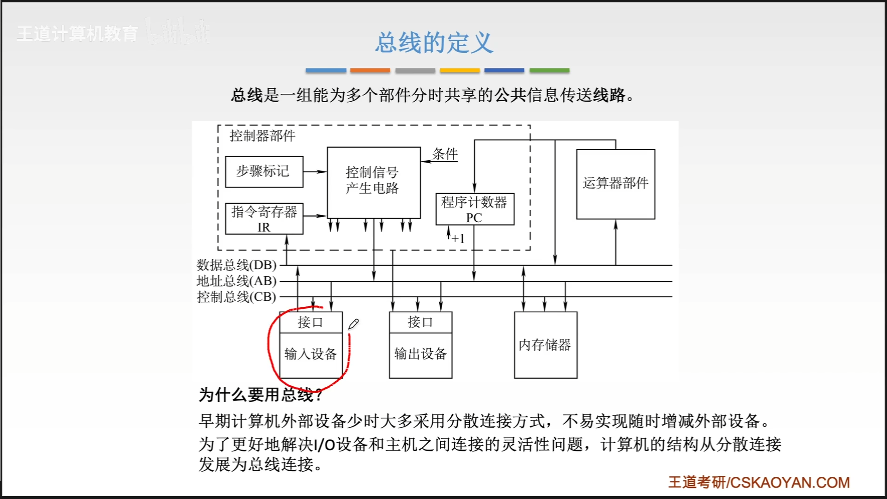
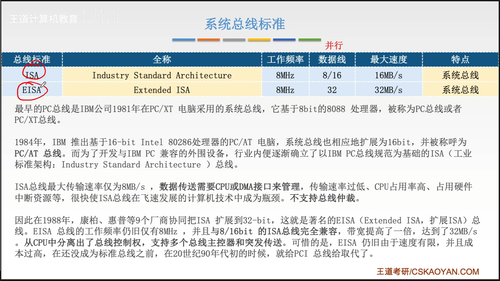

# 第六章-总线

# 总线概述

## 本章总览

## 总线的定义

分时 共享

## 总线的特性

## 总线的分类

### 按数据传输格式分类

#### 串行总线与并行总线

### 按总线功能分类

#### 片内总线

#### 系统总线

数据通路表示的是数据流经的路径
数据总线是承载的媒介

1. 数据总线
2. 地址总线
3. 控制总线

##### 系统总线的架构

1. 单总线架构

这里的系统总线包含了数据，地址，控制总线

除了以上缺点以外，还有一点，cpu和主存的速度很快，而其它设备的速度却很慢，会造成资源浪费

2. 双总线架构

3. 三总线结构

三个总线只能有一个总线在工作，所以效率比较低

4. 四总线结构

#### 通信总线

### 按时序控制方式

#### 同步总线

#### 异步总线

## 本节回顾

# 总线的性能指标

## 总线的传输周期（总线周期）

## 总线的时钟周期

## 总线的工作频率

## 总线的时钟频率

## 总线宽度

## 总线带宽

## 总线复用

## 信号线数

## 总结

# 总线仲裁
如何解决多个设备争用总线的问题

## 集中仲裁

### 链式查询方式

### 计数器查询方式

### 独立请求方式

## 分布仲裁方式

## 本节回顾

# 总线的操作和定时

## 总线传输的四个阶段

## 同步定时方式

## 异步定时方式

## 半同步通信

wait信号是由从设备发出的

## 分离式通信

## 本节回顾

# 总线标准

## 总线标准的基本概念

+ 系统总线
+ 局部总线
+ 设备总线，通讯总线

其它系统总线标准
FBS
QPI

局部总线标准：
VESA

PCI总线

AGP

PCI-E

设备总线

RS-232C

SCSI

PCMCIA

USB

IDE ATA

SATA

总线标准的发展

串行总线取代并行总线的原因

