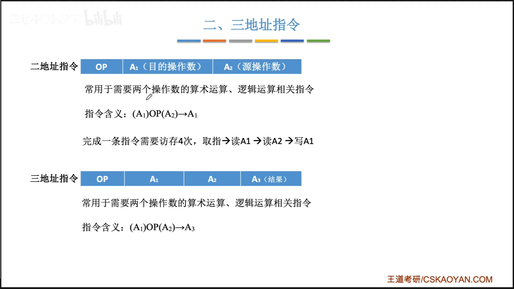
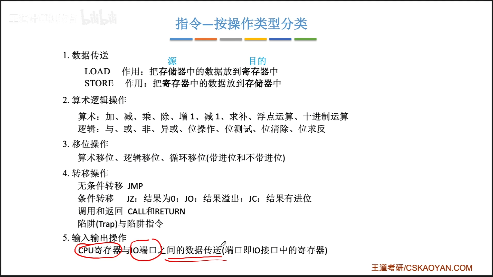
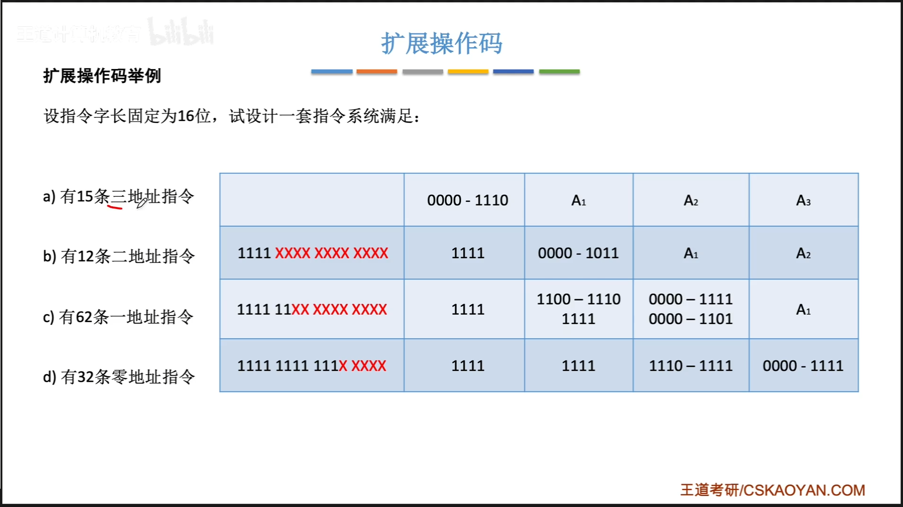
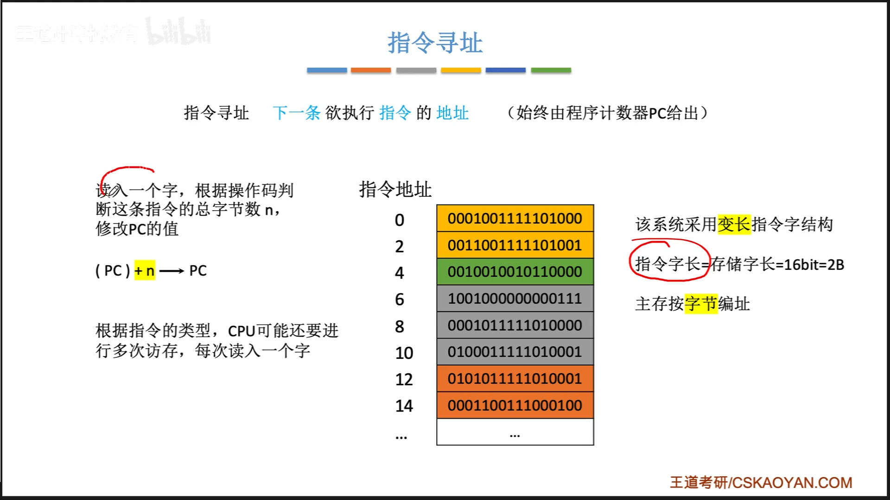
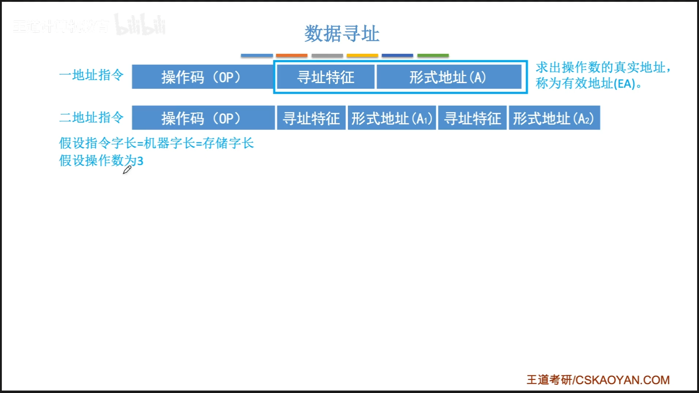
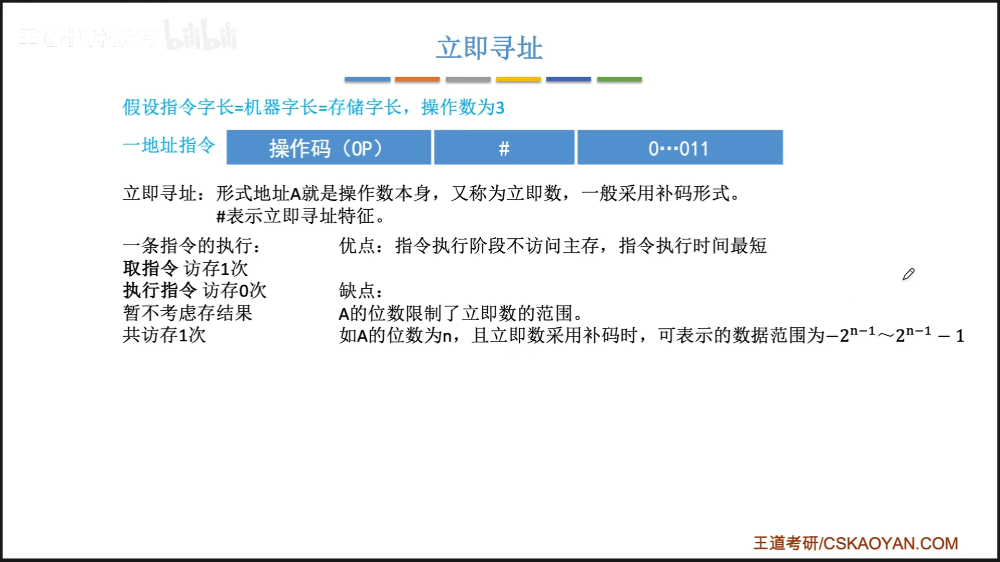
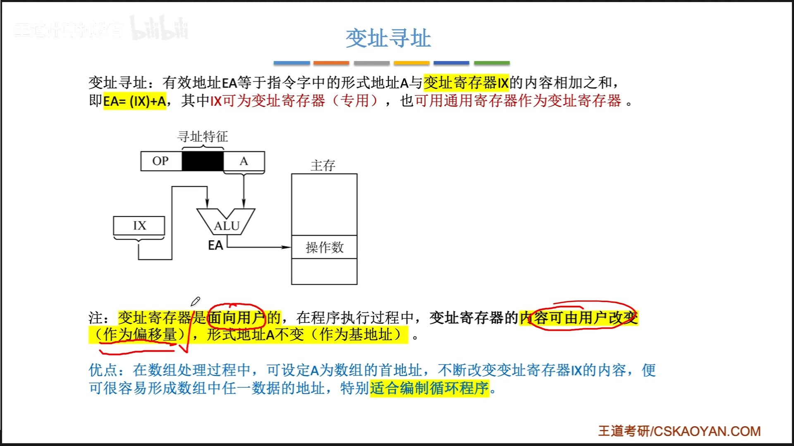
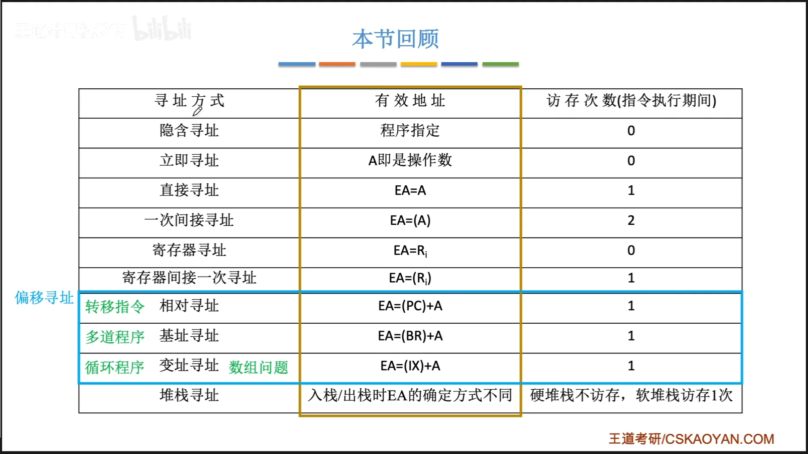
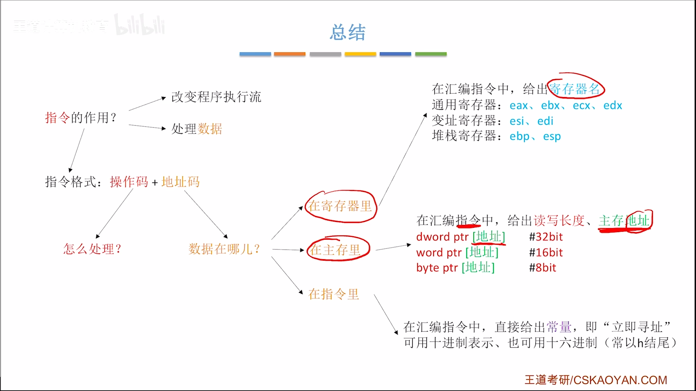

# 第四章-指令系统

# 指令格式

## 指令的定义

式知识计算机执行某种操作的指令，式计算机运行的最小功能单位

##指令格式

## 零地址指令

## 一地址指令

## 二，三地址指令

## 四地址指令

## 指令-按照指令长度分类

## 指令-按操作码长度分类

## 指令-按操作类型分类

## 本节回顾

# 扩展操作码

## 本节总览

## 扩展操作吗

## 指令操作码

# 指令寻址

## 知识总览

## 指令寻址

## 本节回顾

# 数据寻址

## 指令寻址 vs 数据寻址

## 知识总览

## 直接寻址

## 间接寻址

## 寄存器寻址

## 寄存器间接寻址

## 隐含寻址

## 立即寻址

## 本节回顾

# 数据寻址2

## 偏移寻址

### 基址寻址

### 基址寻址的作用

### 变址寻址

### 变址寻址的作用

### 基址寻址 & 变址寻址的复合寻址

### 相对寻址

## 本节回顾

## 硬件如何实现数的比较

# 数据寻址3

## 本节总览

## 堆栈寻址

## 本节回顾

# 高级语言与机器代码之间的对应

## 本节总览

## 高级语言-汇编语言-机器语言

## x86汇编语言指令基础

指令的作用
1. 改变程序执行流
2. 处理数据

指令格式：操作码 +  地址码

## 以mov指令为例

## x86架构cpu有那些寄存器

## 更多例子

## 总结

# 常用X86指令

## 常见的算数运算指令

x86中不允许两个操作数都来自与主存

## 常见的逻辑运算指令

## 其它指令

# AT&T vs INTEL格式

前者用于linux的常用格式

后者是windows的常用格式

# 选择语句的机器级表示

## 程序中的选择语句（分支结构）

## 无条件转移指令-jmp

## 条件转移指令 -jxxx

## 示例

写汇编语言代码的时候，一般会使用函数的名字作为”标号“使用

## 扩展：cmp指令的底层逻辑

# 循环语句的机器级表示

## 使用条件转移指令实现循环

## 用LOOP指令实现循环

理论上，能用loop指令实现的功能一定能用条件转移指令实现

补充：
loopx指令 ：loopnz，loopz

# 函数调用的机器级表示 call ret

## x86汇编语言的函数调用

## call 与 ret

## 总结

# 函数调用的机器级表示-如何访问栈帧的数据

## 函数调用栈在内粗中的位置

## 标记栈帧范围：ebp esp

## 访问栈帧数据 push pop

## 访问栈帧数据 mov

## 总结

# 函数调用的机器级表示-如何切换栈帧

## 总结

# 函数调用的机器级表示-栈帧的内容与参数，返回值传递

## 栈帧可能包含的内容

## 汇编代码实战

## 扩展

## 总结

# 指令系统 CISC RISC

CISC：复杂指令集系统（x86架构）
RISC：精简指令集系统（arm架构）

