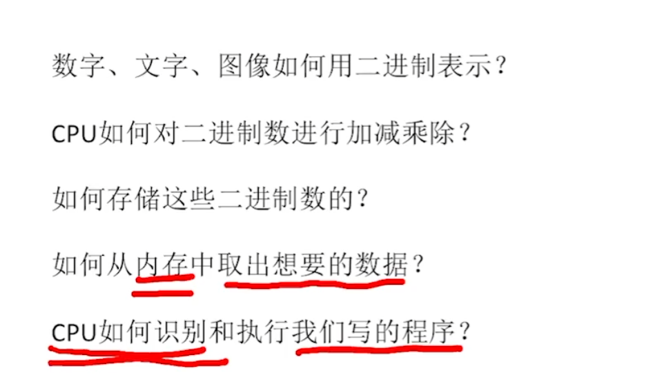
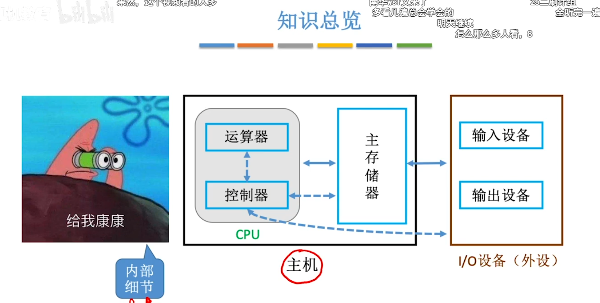
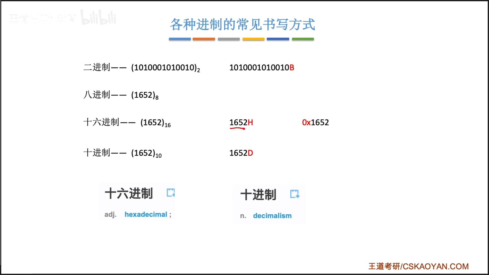
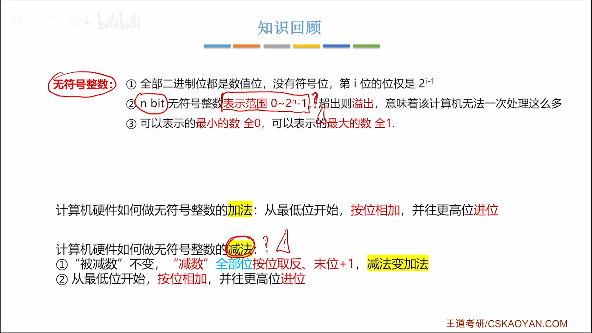
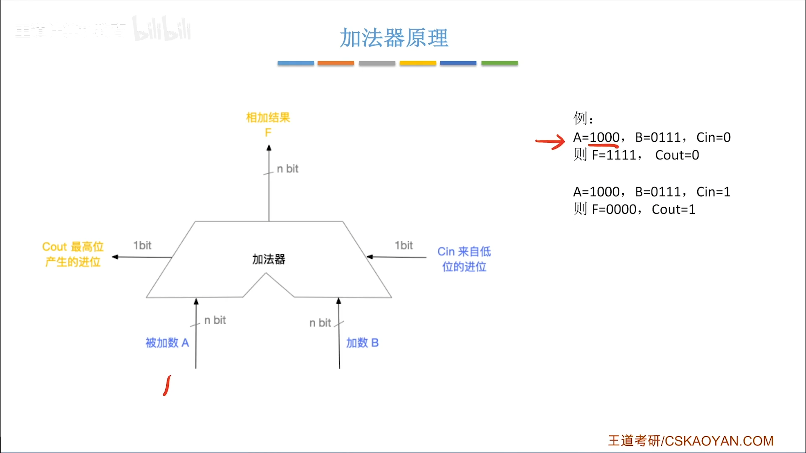
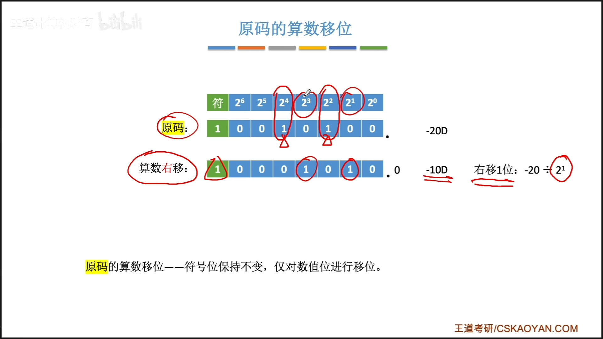
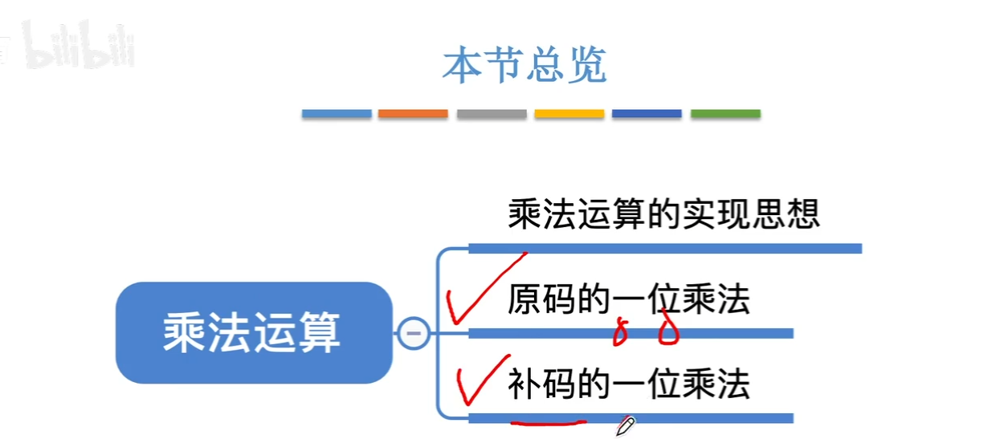
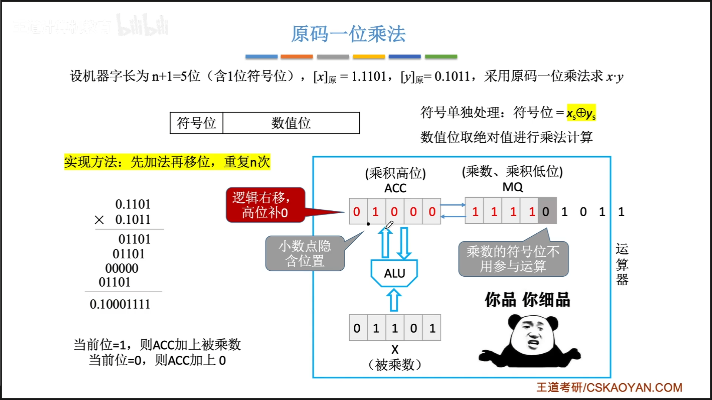
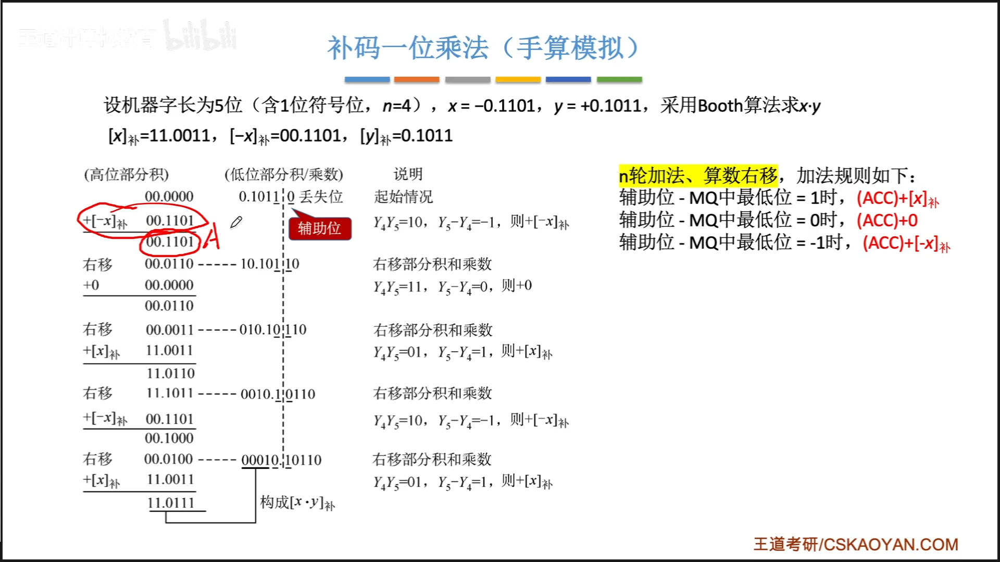
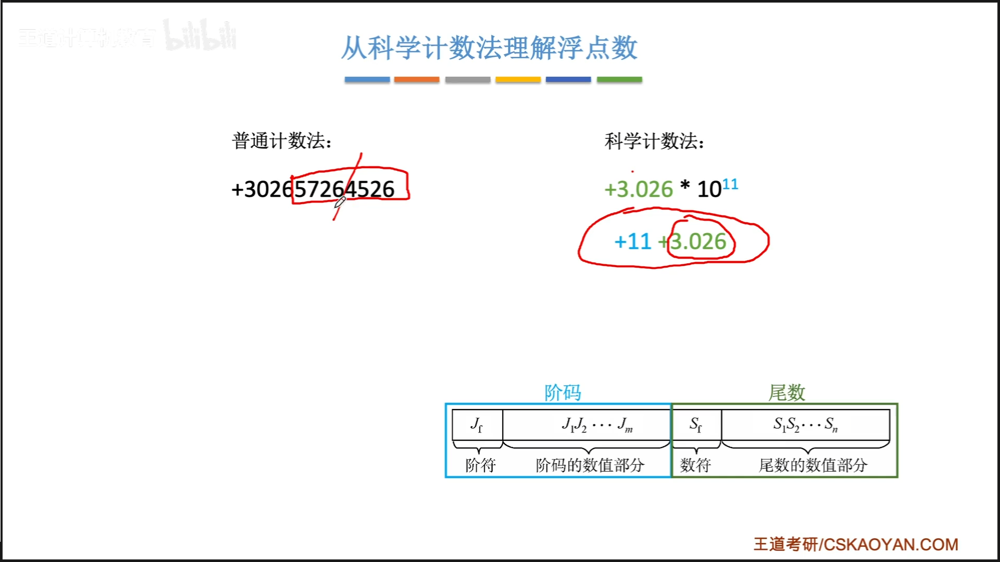

# 计算机组成原理
# 计算机组成原理

硬件 + 软件

硬件：CPU + 主板 + 内存 + 硬盘 
计算机硬件卫衣能识别的数据： 二进制0/1

软件：




# 第一章 计算机系统概述

## 什么是计算机系统
计算机系统 = 硬件 + 软件
硬件：计算机的实体
软件：由具有各类特殊功能的程序组成： = 系统软件 + 应用软件
系统软件：操作系统，数据库，标准程序库， 网路软件， 语言处理程序， 服务程序
应用软件：按任务需要编制而成的各种程序

## 硬件的发展
ENIAC：1946年
逻辑元件：电子管 1，8W个


电子管-》晶体管-》中小规模集成电路-》大规模，超大规模集成电路

BUG：小虫子（纸带上的）


机器字长： 计算机一次证书运算所能处理的二进制位数


摩尔定律： 


## 软件的发展

机器语言-》汇编语言-》高级语言（fortran， pascal， c++）

## 目前的发展趋势：
两极化：
1. 更微型化，网络化， 高性能，多用途
2. 巨型化，高速化，并行化

## 知识点回顾


# 计算机硬件的基本组成
1. 早期冯诺依曼架构
2. 现代计算机架构


## 早期冯诺依曼机
**”存储程序“**


第一台冯诺依曼机：EDVAC

具体架构；


在计算机系统中：**软件和硬件在逻辑上是等效的**


冯诺依曼架构计算机的特点：
1. 计算机由五大部件组成：输入设备，输出设备，存储器，运算器，控制器
2. 指令和数据以同等地位存储与存储器，可以按照地址寻访；
3. 指令和数据用二进制表示
4. 指令由操作码和地址码组成
5. 存储程序
6. 以运算器为中心：输入输出设备与存储器之间的数据通过运算器完成

## 现代计算机的结构


以存储器为中心
CPU = 运算器 + 控制器


## 知识回顾与重要考点


# 各个硬件的工作原理




## 主存储器

主存储器 + 存储体 + MAR + MDR
MAR：memory address register 存储地址寄存器
MDR：memroy data register 存储数据寄存器


存储单元：每个存储单元存放一串二进制代码
存储字（word）：存储单元中二进制代码的组合
存储字长：存储单元中二进制代码的位数
存储元；存储二进制数据的电子元件，每个存储元可以存储1bit数据

## 运算器


运算器：用于实现算数运算（加减乘除，逻辑运算）

ACC：累加器
MQ：乘商寄存器
X：通用操作数寄存器
ALU：算数逻辑单元

## 控制器


CU：控制单元
IR：指令寄存器
PC：程序计数器


## 计算机的工作过程；
```C
int a = 2, b = 3, c = 1, y = 0;
void main()
{
    y = a * b + c;
}
```


计算机工作过程：
必经步骤：取指令，分析


## 知识点回顾


# 计算机系统的层次结构

微程序机器 M0 （微指令系统） -》传统机器 M1 （用机器语言的机器） -》 虚拟机器 M2 （汇编语言机器） -》 虚拟机器 M3 （高级语言机器）

如果再加上操作系统；


## 三种级别的语言

高级语言；
汇编语言；
机器语言；

编译程序；一次性全部编译成机器语言程序
解释程序：每执行一句都需要翻译一次

## 知识回顾


计算机体系结构 vs 计算机组成原理


# 计算机性能指标

## 存储器的性能指标

1. 总容量
2. 读取速度


## CPU的性能指标

CPU主频：CPU内数字脉冲信号的震荡的频率

CPU主频 = 1 / （CPU时钟周期）


CPI: 每一条指令需要的时钟周期
（不同的指令，CPI不同，甚至是相同的指令，CPI也可能有变化）


IPS： 每秒执行多少条指令

FLOPS：每秒执行多少次浮点运算


## 系统整体的性能指标

数据通路带宽
吞吐量
响应时间


基准程序：用于测量计算机处理速度的一种实用程序

## 知识回顾


# 第二章 数据的表示和运算

# 进位计数制


## 十进制计数法


## 推广：R进制计数法


二进制， 八进制，十进制，十六进制


## 任意进制——》十进制

数码 * 位全

## 二进制-》八进制，十六进制
八进制：三位一组
十六进制：四位一组

## 进制的表示方法




## 十进制-》任意进制


除基取余法


乘积取整法

## 真值和机器数
真值：符合人类习惯的数字
机器数：数字实际存到机器里面的形式，正负号都需要被数字化


## 知识回顾


# BCD码


三种：
1. 8421码
2. 余3码
3. 2421码

BCD：binary——coded——decimal

## 8421码


不在映射表里面的，需要加上6进行修正

## 余3码
余3码是无权码，每一个位的数字权重不是固定的，而8421码和2421码是有权码


## 2421码

权重分别为 2 4 2 1 ，5以后的数字第一位必须是1

## 知识回顾


# 无符号整数的表示和运算

## 无符号整数的表示


按照各数值位的位权进行表示

如果数值过大，会溢出，导致数据丢失


无符号整数的加法：
从低位开始，按位相加，并向更高位进位

无符号整数的减法：
被减数不变，减数全部按位取反，末位+1，将减法变成加法
按照加法的方式进行相加；

## 知识回顾



# 带符号整数的表示和运算

## 带符号整数的表示

### 原码表示法

最高位表示符号：0正1负
剩下的数值位表示真值的绝对值


真值0有两种表示方式

原码的缺点：符号位不能参与运算
可以用补码来参与运算

## 原码-反码-补码的转换

正数的三码统一

负数：符号位不变，数值位按位取反，得到反码，末位+1，得到补码


原码和补码的快速转换：


补码的减法运算

补码 - 补码 可以转换为 补码 + （- 补码）


## 知识回顾


# 原码 反码 补码 特性对比


 # 带符号整数的移码表示
 

# 定点小数的表示


## 定点整数与定点小数

### 表示范围


### 位数扩展


# 奇偶校验码

## 校验原理

增加一个校验位来判断数据是否合法

## 奇偶校验


# 算数逻辑单元 电路基本原理及加法器设计


## 算数逻辑单元


### 基本逻辑运算


## 一位全加器


### 串行加法器


### 并行加法器


## 本节总览


# 并行进位加法器


# 补码加减运算器

## 加法器原理



## 补码加减运算方法


# 定点数的加减运算


##  原码的加减运算


## 溢出判断

### 方法一


### 方法二


### 方法三


## 符号扩展


## 本节回顾


# 标志位生成


# 移位运算

## 算术移位

### 原码的算数移位

右移


左移


### 反码的算数移位


### 补码的算数移位


### 算数移位总结


### 算数移位应用举例


## 逻辑移位


## 循环移位


## 知识点回顾


# 定点数的原码乘法实现



运算思想：运算移位


ACC的值： 先置0





# 补码的一位乘法





## 本节回顾


# 定点数的除法实现


## 恢复余数法


## 加减交替法


# 补码的除法运算


## 除法运算总结回顾


# C语言中的定点数类型转换

C语言中的定点整数都是用”补码“存储的


# 数据的存储和排列问题

## 大端小端模式


大端方式；低地址存放高字节
小端模式：低地址存放低字节

大端更适合人类阅读
小端更适合机器处理


## 边界对齐


# 浮点数的表示


## 定点数的局限性


##  从科学计数法理解浮点数




## 浮点数的表示


## 浮点数尾数的规格化


## 规格化浮点数的特点


## 知识点回顾


# 浮点数标准 IEEE 754 

I triple E

## 移码


## IEEE 754


# 浮点数的运算

## 浮点数的加减运算


## 浮点数的加减运算


## 舍入规则


## 强制类型转换


## 本节回顾


