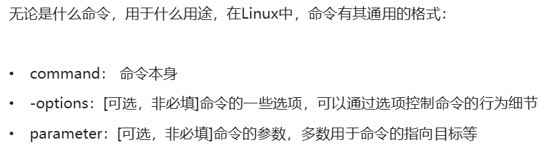

# 01-Linux基础命令

# Linux目录结构

- `/`，根目录是最顶级的目录了
- Linux只有一个顶级目录：`/`
- 路径描述的层次关系同样适用`/`来表示
- /home/itheima/a.txt，表示根目录下的home文件夹内有itheima文件夹，内有a.txt

## HOME目录

每一个用户在Linux系统中都有自己的专属工作目录，称之为HOME目录。

- 普通用户的HOME目录，默认在：`/home/用户名`

- root用户的HOME目录，在：`/root`

FinalShell登陆终端后，默认的工作目录就是用户的HOME目录

# Linux命令基础格式

# ls命令

功能：列出文件夹信息

语法：`ls [-l -h -a] [参数]`

- 参数：被查看的文件夹，不提供参数，表示查看当前工作目录
- -l，以列表形式查看
- -h，配合-l，以更加人性化的方式显示文件大小
- -a，显示隐藏文件

## 隐藏文件、文件夹

在Linux中以`.`开头的，均是隐藏的。

默认不显示出来，需要`-a`选项才可查看到。

# pwd命令

功能：展示当前工作目录

语法：`pwd`

# cd命令

功能：切换工作目录

语法：`cd [目标目录]`

参数：目标目录，要切换去的地方，不提供默认切换到`当前登录用户HOME目录`

# 相对路径、绝对路径

- 相对路径，==非==`/`开头的称之为相对路径

  相对路径表示以`当前目录`作为起点，去描述路径，如`test/a.txt`，表示当前工作目录内的test文件夹内的a.txt文件

- 绝对路径，==以==`/`开头的称之为绝对路径

  绝对路径从`根`开始描述路径

# 特殊路径符

- `.`，表示当前，比如./a.txt，表示当前文件夹内的`a.txt`文件
- `..`，表示上级目录，比如`../`表示上级目录，`../../`表示上级的上级目录
- `~`，表示用户的HOME目录，比如`cd ~`，即可切回用户HOME目录

## mkdir命令

功能：创建文件夹

语法：`mkdir [-p] 参数`

- 参数：被创建文件夹的路径
- 选项：-p，可选，表示创建前置路径

# touch命令

功能：创建文件

语法：`touch 参数`

- 参数：被创建的文件路径

# cat命令

功能：查看文件内容

语法：`cat 参数`

- 参数：被查看的文件路径

# more命令

功能：查看文件，可以支持翻页查看

语法：`more 参数`

- 参数：被查看的文件路径
- 在查看过程中：
  - `空格`键翻页
  - `q`退出查看

# cp命令

功能：复制文件、文件夹

语法：`cp [-r] 参数1 参数2`

- 参数1，被复制的
- 参数2，要复制去的地方
- 选项：-r，可选，复制文件夹使用

示例：

- cp a.txt b.txt，复制当前目录下a.txt为b.txt
- cp a.txt test/，复制当前目录a.txt到test文件夹内
- cp -r test test2，复制文件夹test到当前文件夹内为test2存在

# mv命令

功能：移动文件、文件夹

语法：`mv 参数1 参数2`

- 参数1：被移动的
- 参数2：要移动去的地方，参数2如果不存在，则会进行改名

# rm命令

功能：删除文件、文件夹

语法：`rm [-r -f] 参数...参数`

- 参数：支持多个，每一个表示被删除的，空格进行分隔
- 选项：-r，删除文件夹使用
- 选项：-f，强制删除，不会给出确认提示，一般root用户会用到

> rm命令很危险，一定要注意，特别是切换到root用户的时候。

进入root管理员权限的方式；
su - root 
密码：与普通用户默认一样，完成之后输入exit退出

rm -rf / 以及 rm -rf /*效果等同与在windows下执行C盘格式化

# which命令

功能：查看命令的程序本体文件路径

语法：`which 参数`

- 参数：被查看的命令

# find命令

功能：搜索文件

语法1按文件名搜索：`find 路径 -name 参数`

- 路径，搜索的起始路径
- 参数，搜索的关键字，支持通配符*， 比如：`*`test表示搜索任意以test结尾的文件
