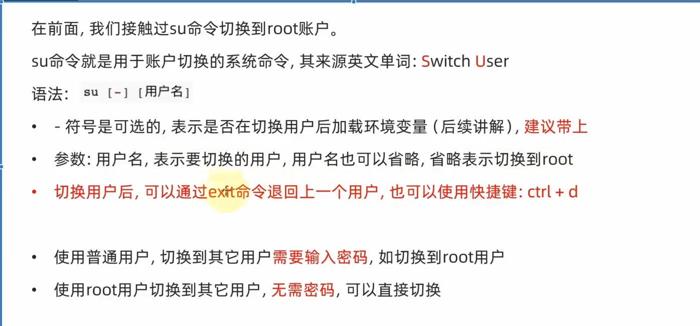
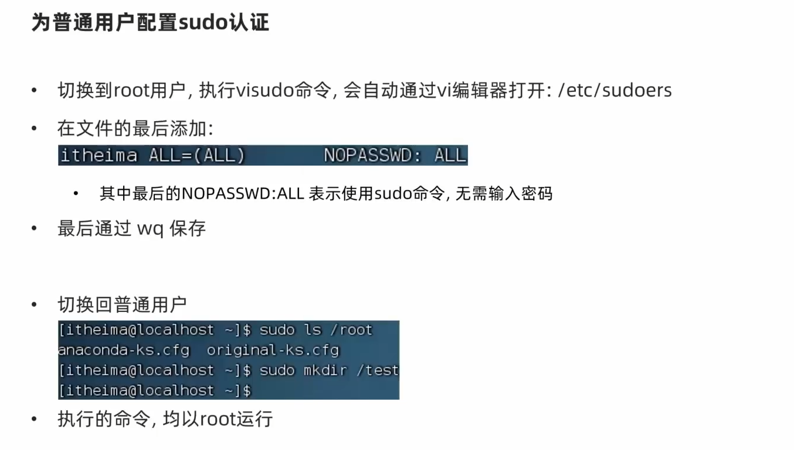
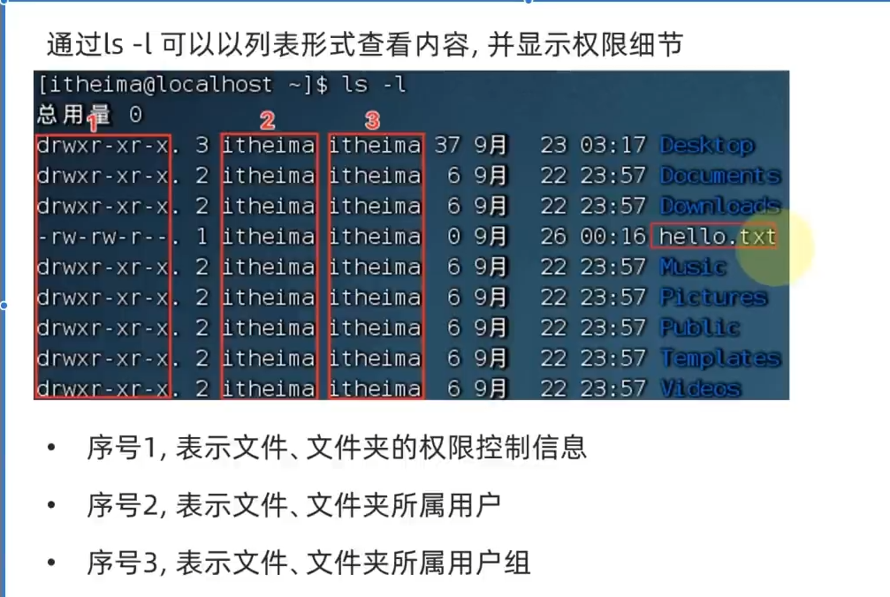
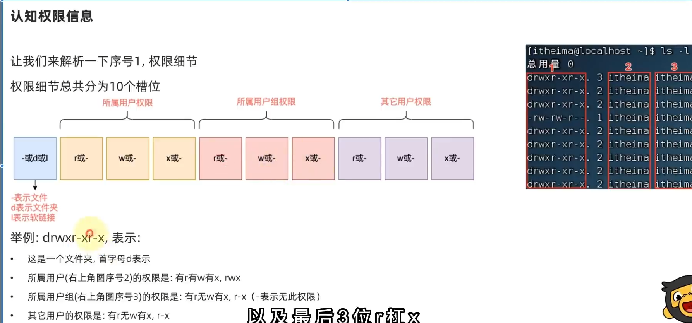
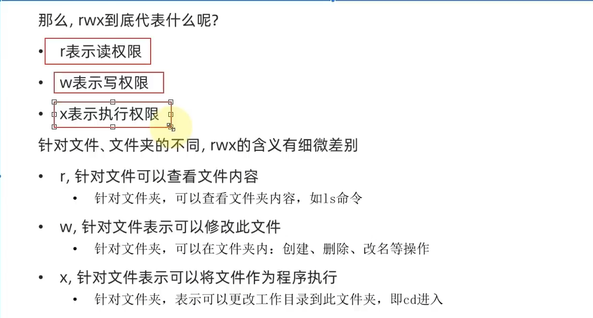

# 02-Linux用户和权限

# root用户：su和exit

root用户：超级管理员

普通用户无法在根目录创建文件夹

普通用户的权限只有在home目录中不受限，除了home目录之后，还会受到限制



```
su [-] [用户名]
```

su 用于Linux的账户切换 switch user

- 表示是否在切换用户后加载环境变量
参数为用户名
切换用户后，可以通过exit来退回上一个用户，也可使用快捷键 ctrl+d

使用普通用户切换到其它用户需要密码
使用root用户切换到其它用户不需要密码


## sudo

不建议长期使用root用户
使用sudo为普通命令授权

需要为普通用户配置sudo属性




# 用户，用户组管理

Linux系统中可以配置多个用户和用户组
用户可以加入多个用户组中

Linux中关于全新啊的管控级别由两个：分别是：
针对用户的权限控制
针对用户组的权限控制


## 用户组管理
需要使用root权限

### 创建用户组
```
groupadd 用户组名
```


### 删除用户组

```
groupdel 用户组名·
```


## 用户管理


## getent passwd
查看当前系统中有哪些用户

一共有七份信息：
用户名：密码：用户id：组ID：描述信息：HOME目录：执行终端

## getent group
查看当前系统的用户组
一共三份信息：
组名称，组认证，组ID


# 查看权限控制信息

## 认知权限信息





## rwx



## chmod修改权限信息

修改文件、文件夹权限


语法：`chmod [-R] 权限 参数`

- 权限，要设置的权限，比如755，表示：`rwxr-xr-x`

  

- 参数，被修改的文件、文件夹

- 选项-R，设置文件夹和其内部全部内容一样生效


## chown命令
普通用户无法使用该命令，需要

修改文件、文件夹所属用户、组

语法：`chown [-R] [用户][:][用户组] 文件或文件夹`


# ctrl + C 强制停止
# ctrl + D 强制退出
# history 历史执行命令
可以和grep以及管道符号留恋和使用
#ctrl + r 搜索最近的命令

# 光标移动命令

## ctrl + a 跳到开头
## ctrl + e 跳到结尾
## ctrl + 键盘左键 向左跳一个单词
## ctrl + 键盘右键 向右跳一个单词

# clear 或者 ctrl + l 清屏


