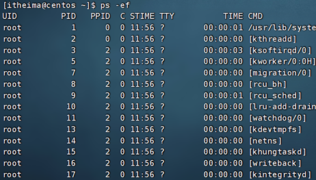

# 03-Linux软件安装

## 软件安装

- CentOS系统使用：
  - yum [install remove search] [-y] 软件名称
    - install 安装
    - remove 卸载
    - search 搜索
    - -y，自动确认
- Ubuntu系统使用
  - apt [install remove search] [-y] 软件名称
    - install 安装
    - remove 卸载
    - search 搜索
    - -y，自动确认

> yum 和 apt 均需要root权限


## systemctl

功能：控制系统服务的启动关闭等

语法：`systemctl start | stop | restart | disable | enable | status 服务名`

- start，启动
- stop，停止
- status，查看状态
- disable，关闭开机自启
- enable，开启开机自启
- restart，重启


ntp：时间同步软件

# ln创建软链接

功能：创建文件、文件夹软链接（快捷方式）

语法：`ln -s 参数1 参数2`

- 参数1：被链接的
- 参数2：要链接去的地方（快捷方式的名称和存放位置）


# 日期 时间


## 日期

语法：`date [-d] [+格式化字符串]`

- -d 按照给定的字符串显示日期，一般用于日期计算

- 格式化字符串：通过特定的字符串标记，来控制显示的日期格式
  - %Y   年%y   年份后两位数字 (00..99)
  - %m   月份 (01..12)
  - %d   日 (01..31)
  - %H   小时 (00..23)
  - %M   分钟 (00..59)
  - %S   秒 (00..60)
  - %s   自 1970-01-01 00:00:00 UTC 到现在的秒数


示例：

- 按照2022-01-01的格式显示日期

  

- 按照2022-01-01 10:00:00的格式显示日期

  

- -d选项日期计算

  

  - 支持的时间标记为：

    

```
date -d "+1  day"
```
用于计算时间加减

## Linux时区

时区

修改时区为中国时区

```
sudo rm -rf /etc/localtime
sudo ln -s /usr/share/zoneinfo/Asia/Shanghai /etc/localtime
```


## 时间同步 ntp

功能：同步时间

安装：`yum install -y ntp`

启动管理：`systemctl start | stop | restart | status | disable | enable ntpd`
可以设置开机自启动，需要root权限

手动校准时间(需要root）：`ntpdate -u ntp.aliyun.com`


# IP地址与主机名字

## ip地址

格式：a.b.c.d

- abcd为0~255的数字


特殊IP：

- 127.0.0.1，表示本机
- 0.0.0.0
  - 可以表示本机
  - 也可以表示任意IP（看使用场景）
  - 在端口绑定中用来确定绑定关系
  - 在一些IP地址限制中，表示所有IP，用于设置放行规则时，设置0.0.0.0可以对所有IP进行放行。

查看ip：`ifconfig`

如果无法使用ifcononfig命令，则需要安装一个软件：
```
yum -y install net-tools
```

## 主机名

功能：Linux系统的名称

查看：`hostname`

设置：`hostnamectl set-hostname 主机名`


## 虚拟机配置固定IP

DHCP：动态获取IP地址，即每次重启设备都会重新获取一次

步骤1. 在VMware Workstation中配置IP地址和网段
步骤2. 在Linux中手动修改IP配置文件；

1. VMware Workstation中，右键编辑：


2. 在虚拟机终端中，进行一下编辑：
```
vim /etc/sysconfig/network-scripts/ifcfg-ens33
```


然后重启网卡
```
systemctl restart network
```


# 域名解析

Linux的私人地址本：
Linux： 
```
/etc/hosts
```


Windows
路径；
```
C:\Windows\System32\drivers\etc\hosts
```


# 网络传输

## 网络请求和下载

``` 
ping [-c num] IPADDR`
```
参数c：请求次数


## wget命令


## curl命令


# 网络传输

## 端口


### 查看开放端口

```
nmap + IP地址
```

如果没有该工具，可以先安装
```
sudu yum -y install nmap
```


### 查看端口占用

```
netstat -anp|grep 22
```
查看占用22端口的程序


# 进程管理

## 查看进程 ps -ef

程序运行在操作系统中，是被操作系统所管理的。

为管理运行的程序，每一个程序在运行的时候，便被操作系统注册为系统中的一个：进程

并会为每一个进程都分配一个独有的：进程ID（进程号）


可以通过ps命令查看Linux系统中的进程信息

语法：

选项：\-e，显示出全部的进程

选项：\-f，以完全格式化的形式展示信息（展示全部信息）

一般来说，固定用法就是： ps -ef 列出全部进程的全部信息




从左到右分别是：

•UID：进程所属的用户ID

•PID：进程的进程号ID

•PPID：进程的父ID（启动此进程的其它进程）

•C：此进程的CPU占用率（百分比）

•STIME：进程的启动时间

•TTY：启动此进程的终端序号，如显示?，表示非终端启动

•TIME：进程占用CPU的时间

•CMD：进程对应的名称或启动路径或启动命令


可以通过grep查看指定的进程

## 关闭进程

在Linux中，可以通过kill命令关闭进程。

语法：
```
kill -9 进程id
```


选项：\-9，表示强制关闭进程。不使用此选项会向进程发送信号要求其关闭，但是否关闭看进程自身的处理机制。


# 主机状态

掌握主机状态相关信息

## top 查看系统使用情况

```
top
```

•可以通过top命令查看CPU、内存使用情况，类似Windows的任务管理器

 默认每5秒刷新一次，语法：直接输入top即可，按q或ctrl + c退出


## 磁盘使用情况 df

•使用df命令，可以查看硬盘的使用情况

语法：df \[-h\]

选项：\-h，以更加人性化的单位显示
.


## 系统CPU和内存信息

•可以使用iostat查看CPU、磁盘的相关信息

语法：iostat \[-x\] \[num1\] \[num2\]

•选项：\-x，显示更多信息

•num1：数字，刷新间隔，num2：数字，刷新几次


tps：该设备每秒的传输次数（Indicate the number of transfers per second that were issued to the device.）。"一次传输"意思是"一次I/O请求"。多个逻辑请求可能会被合并为"一次I/O请求"。"一次传输"请求的大小是未知的。


## 网络状态监控 sar

```
sar -n DEV num1 num2

```

•可以使用sar命令查看网络的相关统计（sar命令非常复杂，这里仅简单用于统计网络）

语法：sar -n DEV num1 num2

选项：\-n，查看网络，DEV表示查看网络接口

num1：刷新间隔（不填就查看一次结束），num2：查看次数（不填无限次数）


# 环境变量

## 环境变量的作用

环境变量是操作系统（Windows、Linux、Mac）在运行的时候，记录的一些关键性信息，用以辅助系统运行。

在Linux系统中执行：env命令即可查看当前系统中记录的环境变量

环境变量是一种KeyValue型结构，即名称和值，如下图：


在前面提出的问题中，我们说无论当前工作目录是什么，都能执行/usr/bin/cd这个程序，这个就是借助环境变量中：PATH这个项目的值来做到的。


PATH记录了系统执行任何命令的搜索路径，如上图记录了（路径之间以:隔开）：

•/usr/local/bin

•/usr/bin

•/usr/local/sbin

•/usr/sbin

•/home/itheima/.local/bin

•/home/itheima/bin

当执行任何命令，都会按照顺序，从上述路径中搜索要执行的程序的本体

比如执行cd命令，就从第二个目录/usr/bin中搜索到了cd命令，并执行


## $符号


## 自行配置环境变量


# 上传 & 下载


## 通过Finalshell上传与下载

通过鼠标拖拽可以在Finalshell软件完成上传和下载工作


## rz，sz命令完成上传与下载

可以通过rz、sz命令进行文件传输。

rz、sz命令需要安装，可以通过：yum -y install lrzsz，即可安装。

•rz命令，进行上传，语法：直接输入rz即可

•sz命令进行下载，语法：sz 要下载的文件


# 压缩 & 解压

## 压缩格式

市面上有非常多的压缩格式

•zip格式：Linux、Windows、MacOS，常用

•7zip：Windows系统常用

•rar：Windows系统常用

•tar：Linux、MacOS常用

•gzip：Linux、MacOS常用

在Windows系统中常用的软件如：winrar、bandizip等软件，都支持各类常见的压缩格式，这里不多做讨论。

我们现在要学习，如何在Linux系统中操作：tar、gzip、zip这三种压缩格式

完成文件的压缩、解压操作。


## tar压缩

Linux和Mac系统常用有2种压缩格式，后缀名分别是：

•.tar，称之为tarball，归档文件，即简单的将文件组装到一个.tar的文件内，并没有太多文件体积的减少，仅仅是简单的封装

•.gz，也常见为.tar.gz，gzip格式压缩文件，即使用gzip压缩算法将文件压缩到一个文件内，可以极大的减少压缩后的体积

针对这两种格式，使用tar命令均可以进行压缩和解压缩的操作

语法：

•\-c，创建压缩文件，用于压缩模式

•\-v，显示压缩、解压过程，用于查看进度

•\-x，解压模式

•\-f，要创建的文件，或要解压的文件，\-f选项必须在所有选项中位置处于最后一个

•\-z，gzip模式，不使用\-z就是普通的tarball格式

•\-C，选择解压的目的地，用于解压模式


tar的常用组合为：

•tar -cvf test.tar 1.txt 2.txt 3.txt

将1.txt 2.txt 3.txt 压缩到test.tar文件内

•tar -zcvf test.tar.gz 1.txt 2.txt 3.txt

将1.txt 2.txt 3.txt 压缩到test.tar.gz文件内，使用gzip模式

注意：

•\-z选项如果使用的话，一般处于选项位第一个

\-f选项，必须在选项位最后一个

## tar解压

常用的tar解压组合有

•tar -xvf test.tar

解压test.tar，将文件解压至当前目录

•tar -xvf test.tar -C /home/itheima

解压test.tar，将文件解压至指定目录（/home/itheima）

•tar -zxvf test.tar.gz -C /home/itheima

以Gzip模式解压test.tar.gz，将文件解压至指定目录（/home/itheima）

注意：

•\-f选项，必须在选项组合体的最后一位

•\-z选项，建议在开头位置

•\-C选项单独使用，和解压所需的其它参数分开


## zip压缩命令

可以使用zip命令，压缩文件为zip压缩包

语法：

•\-r，被压缩的包含文件夹的时候，需要使用\-r选项，和rm、cp等命令的\-r效果一致

示例：

•zip test.zip a.txt b.txt c.txt

将a.txt b.txt c.txt 压缩到test.zip文件内

•zip -r test.zip test itheima a.txt

将test、itheima两个文件夹和a.txt文件，压缩到test.zip文件内


## uzip解压命令

使用unzip命令，可以方便的解压zip压缩包

语法：

•\-d，指定要解压去的位置，同tar的\-C选项

•参数，被解压的zip压缩包文件

•

示例：

•unzip test.zip，将test.zip解压到当前目录

•unzip test.zip -d /home/itheima，将test.zip解压到指定文件夹内（/home/itheima）


